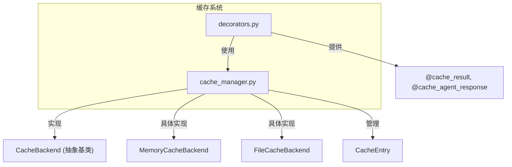
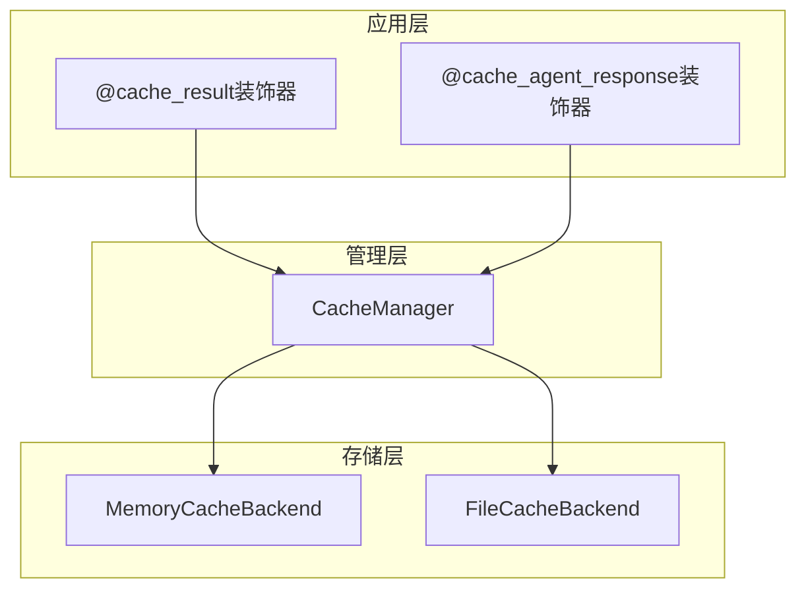
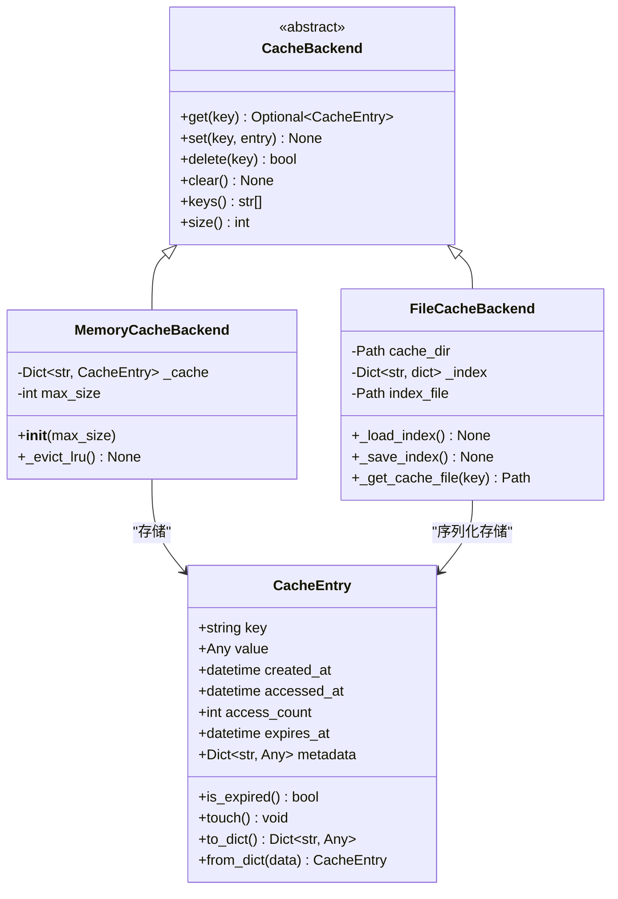
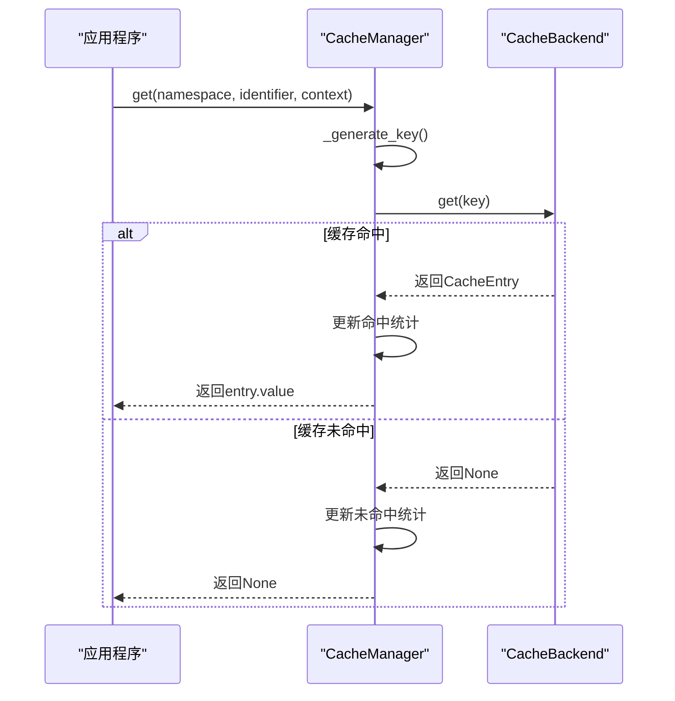
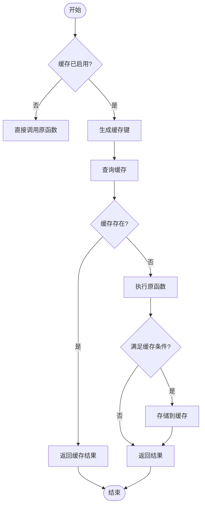
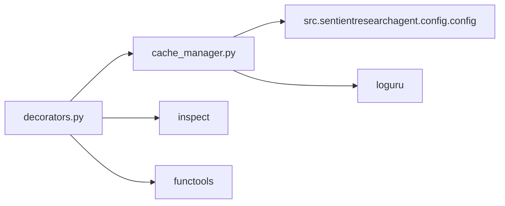

# 缓存系统

<cite>
**本文档中引用的文件**
- [cache_manager.py](file://src\sentientresearchagent\core\cache\cache_manager.py)
- [decorators.py](file://src\sentientresearchagent\core\cache\decorators.py)
- [config.py](file://src\sentientresearchagent\config\config.py)
</cite>

## 目录
1. [简介](#简介)
2. [项目结构](#项目结构)
3. [核心组件](#核心组件)
4. [架构概述](#架构概述)
5. [详细组件分析](#详细组件分析)
6. [依赖分析](#依赖分析)
7. [性能考量](#性能考量)
8. [故障排除指南](#故障排除指南)
9. [结论](#结论)

## 简介
本缓存系统为Sentient Research Agent框架提供了一个灵活且高效的缓存层，旨在通过避免重复的LLM调用和存储中间结果来显著提升系统性能。该系统支持内存和磁盘两种后端，并实现了多级缓存策略。`@cached`装饰器能够透明地为高成本操作（如LLM调用和工具执行）添加缓存支持。系统具备完善的过期时间管理、一致性维护机制以及命中率监控功能。

## 项目结构
缓存系统的代码主要位于`src/sentientresearchagent/core/cache/`目录下，包含两个核心模块：`cache_manager.py`负责底层缓存逻辑的实现，而`decorators.py`则提供了高层的装饰器接口。

**Diagram sources**
- [cache_manager.py](file://src\sentientresearchagent\core\cache\cache_manager.py#L1-L50)
- [decorators.py](file://src\sentientresearchagent\core\cache\decorators.py#L1-L50)

**Section sources**
- [cache_manager.py](file://src\sentientresearchagent\core\cache\cache_manager.py#L1-L523)
- [decorators.py](file://src\sentientresearchagent\core\cache\decorators.py#L1-L247)

## 核心组件
缓存系统的核心由`CacheManager`、`CacheBackend`及其子类（`MemoryCacheBackend`和`FileCacheBackend`）构成。`CacheEntry`数据类用于封装缓存项及其元数据。`decorators.py`中的装饰器函数为开发者提供了简便的缓存集成方式。

**Section sources**
- [cache_manager.py](file://src\sentientresearchagent\core\cache\cache_manager.py#L305-L523)
- [decorators.py](file://src\sentientresearchagent\core\cache\decorators.py#L1-L247)

## 架构概述
该缓存系统采用分层架构设计，上层是易于使用的装饰器API，下层是可插拔的缓存后端。`CacheManager`作为中心协调者，根据配置决定使用哪种后端，并统一处理所有缓存操作。

**Diagram sources**
- [cache_manager.py](file://src\sentientresearchagent\core\cache\cache_manager.py#L305-L523)
- [decorators.py](file://src\sentientresearchagent\core\cache\decorators.py#L12-L173)

## 详细组件分析

### 缓存条目与后端分析
`CacheEntry`类是缓存系统的基本单元，它不仅存储值，还包含创建时间、访问时间、访问次数、过期时间和自定义元数据等丰富的元信息。这使得系统可以实现LRU淘汰策略和精确的过期控制。

#### 类图

**Diagram sources**
- [cache_manager.py](file://src\sentientresearchagent\core\cache\cache_manager.py#L23-L71)
- [cache_manager.py](file://src\sentientresearchagent\core\cache\cache_manager.py#L106-L167)
- [cache_manager.py](file://src\sentientresearchagent\core\cache\cache_manager.py#L169-L303)

**Section sources**
- [cache_manager.py](file://src\sentientresearchagent\core\cache\cache_manager.py#L23-L303)

### 缓存管理器分析
`CacheManager`是整个缓存系统的入口点。它在初始化时根据`CacheConfig`配置创建相应的后端实例，并提供`get`、`set`、`delete`等方法。它还内置了统计功能，可以追踪命中率、请求数等关键指标。

#### 序列图

**Diagram sources**
- [cache_manager.py](file://src\sentientresearchagent\core\cache\cache_manager.py#L356-L387)
- [cache_manager.py](file://src\sentientresearchagent\core\cache\cache_manager.py#L333-L354)

**Section sources**
- [cache_manager.py](file://src\sentientresearchagent\core\cache\cache_manager.py#L305-L480)

### 装饰器分析
`@cache_result`装饰器是将缓存功能集成到现有代码中的主要方式。它可以自动处理异步和同步函数，并允许高度定制化的键生成和缓存条件。

#### 流程图

**Diagram sources**
- [decorators.py](file://src\sentientresearchagent\core\cache\decorators.py#L12-L129)

**Section sources**
- [decorators.py](file://src\sentientresearchagent\core\cache\decorators.py#L12-L213)

## 依赖分析
缓存系统依赖于项目的配置模块(`config.py`)来获取运行时配置，并依赖`loguru`进行日志记录。其内部组件之间耦合度低，`CacheManager`通过抽象的`CacheBackend`接口与具体的存储实现解耦，便于未来扩展新的后端（如Redis）。

**Diagram sources**
- [cache_manager.py](file://src\sentientresearchagent\core\cache\cache_manager.py#L1-L20)
- [decorators.py](file://src\sentientresearchagent\core\cache\decorators.py#L1-L20)

**Section sources**
- [cache_manager.py](file://src\sentientresearchagent\core\cache\cache_manager.py#L1-L523)
- [decorators.py](file://src\sentientresearchagent\core\cache\decorators.py#L1-L247)
- [config.py](file://src\sentientresearchagent\config\config.py#L45-L77)

## 性能考量
该缓存系统对性能有显著的正面影响：
- **减少延迟**：对于重复的LLM调用或工具执行，可以直接从缓存中获取结果，将耗时从秒级降至毫秒级。
- **降低成本**：避免了不必要的API调用，特别是在调试迭代过程中，能大幅节约计算资源。
- **内存优化**：内存缓存使用LRU策略，确保有限的内存空间被最频繁访问的数据占据。
- **磁盘持久化**：磁盘缓存基于文件哈希存储，即使服务重启，之前的结果依然可用。

然而，不当的缓存配置（如过长的TTL或过大的缓存容量）可能导致内存占用过高或返回陈旧数据。

## 故障排除指南
当遇到缓存相关问题时，可以参考以下步骤进行诊断：

1.  **检查缓存是否启用**：确认`CacheConfig.enabled`为`True`。
2.  **验证缓存命中率**：调用`get_stats()`方法，如果`hit_rate_percent`很低，说明缓存未被有效利用，可能需要检查缓存键的生成逻辑。
3.  **手动清除特定命名空间**：使用`invalidate_cache_namespace("namespace_name")`清除可能已损坏或过时的缓存。
4.  **检查磁盘空间和权限**：如果使用文件缓存，确保`cache_dir`路径存在且程序有读写权限。
5.  **查看日志**：关注`logger.error`输出，查找"Cache get error", "Cache set error"等错误信息，它们通常指明了具体的问题（如序列化失败、文件I/O错误）。

**Section sources**
- [cache_manager.py](file://src\sentientresearchagent\core\cache\cache_manager.py#L482-L504)
- [decorators.py](file://src\sentientresearchagent\core\cache\decorators.py#L242-L247)

## 结论
本缓存系统为Sentient Research Agent提供了一个强大、灵活且易于集成的性能优化工具。通过深入理解其多级缓存策略、键生成逻辑和装饰器的使用方法，开发者可以有效地利用该系统来加速应用响应、降低运营成本。同时，其内置的监控和管理接口也为系统的稳定运行提供了保障。