# 错误处理机制

<cite>
**本文档引用的文件**
- [error_handler.py](file://src\sentientresearchagent\core\error_handler.py)
- [exceptions.py](file://src\sentientresearchagent\exceptions.py)
- [app.py](file://src\sentientresearchagent\server\app.py)
- [main.py](file://src\sentientresearchagent\server\main.py)
</cite>

## 目录
1. [简介](#简介)
2. [错误处理架构概览](#错误处理架构概览)
3. [核心组件分析](#核心组件分析)
4. [异常继承体系](#异常继承体系)
5. [异常日志记录与响应构造](#异常日志记录与响应构造)
6. [自定义异常扩展指南](#自定义异常扩展指南)
7. [典型错误场景分析](#典型错误场景分析)
8. [结论](#结论)

## 简介
本文档全面记录了Sentient Research Agent框架的错误处理机制。该系统采用分层设计，通过`exceptions.py`中的自定义异常类和`error_handler.py`中的全局异常处理器，实现了从基础错误到具体业务异常的统一管理。系统在FastAPI应用中注册了全局异常处理，确保所有组件产生的错误都能被一致地捕获、记录和响应。异常信息包含详细的上下文数据，便于调试，并能向前端返回友好的错误消息。

## 错误处理架构概览


**Diagram sources**
- [error_handler.py](file://src\sentientresearchagent\core\error_handler.py#L21-L112)
- [exceptions.py](file://src\sentientresearchagent\exceptions.py#L10-L39)

**Section sources**
- [error_handler.py](file://src\sentientresearchagent\core\error_handler.py#L1-L329)
- [exceptions.py](file://src\sentientresearchagent\exceptions.py#L1-L469)

## 核心组件分析

### 全局异常处理器 (ErrorHandler)
`ErrorHandler` 类是整个框架的中央错误处理枢纽。它负责捕获、统计、记录并重新抛出异常。该处理器维护一个全局单例实例，可通过 `get_error_handler()` 函数访问。

**关键功能：**
- **错误处理 (`handle_error`)**: 接收原始异常，将其转换为框架标准的 `SentientError` 或其子类，更新错误统计，并根据配置决定是否重新抛出。
- **详细日志记录 (`_log_error`)**: 在启用详细日志模式时，会记录错误上下文和完整的堆栈跟踪。
- **错误统计**: 跟踪总错误数、按类型和组件分类的错误数量，便于监控和分析。


**Diagram sources**
- [error_handler.py](file://src\sentientresearchagent\core\error_handler.py#L21-L112)
- [error_handler.py](file://src\sentientresearchagent\core\error_handler.py#L236-L302)

**Section sources**
- [error_handler.py](file://src\sentientresearchagent\core\error_handler.py#L21-L112)

### 异常装饰器
框架提供了两个主要的装饰器来简化错误处理：
- **`handle_task_errors`**: 用于任务处理函数，自动捕获异常并调用全局处理器。
- **`handle_agent_errors`**: 用于代理执行函数，提供类似的错误包装功能。

这些装饰器能够智能地处理同步和异步函数，确保错误处理逻辑的一致性。

**Section sources**
- [error_handler.py](file://src\sentientresearchagent\core\error_handler.py#L128-L234)

## 异常继承体系

```mermaid
classDiagram
class SentientError {
+message : str
+error_code : str
+context : Dict[str, Any]
+cause : Exception
+to_dict() Dict[str, Any]
}
class ConfigurationError {
}
class InvalidConfigurationError {
}
class MissingConfigurationError {
}
class AgentError {
}
class AgentNotFoundError {
}
class AgentExecutionError {
}
class AgentTimeoutError {
}
class AgentRateLimitError {
}
class TaskError {
}
class TaskExecutionError {
}
class TaskTimeoutError {
}
class InvalidTaskStateError {
}
class TaskDependencyError {
}
class GraphError {
}
class GraphCycleError {
}
class GraphIntegrityError {
}
class NodeNotFoundError {
}
class PlanningError {
}
class InvalidPlanError {
}
class PlanExecutionError {
}
class HITLError {
}
class HITLTimeoutError {
}
class HITLAbortError {
}
class ResourceError {
}
class InsufficientResourcesError {
}
SentientError <|-- ConfigurationError
SentientError <|-- AgentError
SentientError <|-- TaskError
SentientError <|-- GraphError
SentientError <|-- PlanningError
SentientError <|-- HITLError
SentientError <|-- ResourceError
ConfigurationError <|-- InvalidConfigurationError
ConfigurationError <|-- MissingConfigurationError
AgentError <|-- AgentNotFoundError
AgentError <|-- AgentExecutionError
AgentError <|-- AgentTimeoutError
AgentError <|-- AgentRateLimitError
TaskError <|-- TaskExecutionError
TaskError <|-- TaskTimeoutError
TaskError <|-- InvalidTaskStateError
TaskError <|-- TaskDependencyError
GraphError <|-- GraphCycleError
GraphError <|-- GraphIntegrityError
GraphError <|-- NodeNotFoundError
PlanningError <|-- InvalidPlanError
PlanningError <|-- PlanExecutionError
HITLError <|-- HITLTimeoutError
HITLError <|-- HITLAbortError
ResourceError <|-- InsufficientResourcesError
```



**Diagram sources**
- [exceptions.py](file://src\sentientresearchagent\exceptions.py#L10-L39)
- [exceptions.py](file://src\sentientresearchagent\exceptions.py#L43-L45)
- [exceptions.py](file://src\sentientresearchagent\exceptions.py#L66-L68)
- [exceptions.py](file://src\sentientresearchagent\exceptions.py#L133-L144)
- [exceptions.py](file://src\sentientresearchagent\exceptions.py#L219-L221)
- [exceptions.py](file://src\sentientresearchagent\exceptions.py#L261-L263)
- [exceptions.py](file://src\sentientresearchagent\exceptions.py#L306-L308)
- [exceptions.py](file://src\sentientresearchagent\exceptions.py#L342-L344)

**Section sources**
- [exceptions.py](file://src\sentientresearchagent\exceptions.py#L10-L469)

## 异常日志记录与响应构造

### 日志记录格式
当发生错误时，`ErrorHandler` 会生成结构化的日志输出：
1.  **基本错误日志**: 使用 `logger.error` 记录 `[组件名] 错误消息`。
2.  **详细上下文**: 如果启用了详细日志，则使用 `logger.debug` 记录错误上下文字典。
3.  **原始异常和堆栈跟踪**: 记录原始异常对象及其完整的堆栈跟踪，这对于诊断根本原因至关重要。

### HTTP状态码映射规则
虽然具体的HTTP状态码映射逻辑未在提供的代码片段中直接体现（通常在FastAPI的异常处理器中实现），但可以推断其设计原则：
- 大多数业务异常（如 `AgentExecutionError`, `TaskExecutionError`）可能会映射到 `500 Internal Server Error` 或 `400 Bad Request`。
- 配置相关的错误（如 `MissingConfigurationError`）可能映射到 `400 Bad Request`。
- 资源不足或超时错误（如 `InsufficientResourcesError`, `TaskTimeoutError`）可能映射到 `503 Service Unavailable` 或 `408 Request Timeout`。

### 前端友好的错误响应构造
`SentientError` 类的 `to_dict()` 方法将异常转换为一个字典，这个字典可以直接序列化为JSON并发送给前端。该字典包含以下字段：
- `error_type`: 异常的具体类型。
- `error_code`: 机器可读的错误代码。
- `message`: 人类可读的错误消息。
- `context`: 包含 `task_id`, `agent_name` 等附加信息的上下文字典。
- `cause`: 原始异常的字符串表示。

这种结构化的响应使前端能够解析并以用户友好的方式展示错误信息。

**Section sources**
- [error_handler.py](file://src\sentientresearchagent\core\error_handler.py#L80-L100)
- [exceptions.py](file://src\sentientresearchagent\exceptions.py#L31-L39)

## 自定义异常扩展指南

要向系统添加新的错误类型，请遵循以下步骤：

1.  **定义新异常类**: 在 `exceptions.py` 文件中，创建一个新的类，继承自最合适的基类（通常是 `SentientError` 或其子类如 `TaskError`）。
    ```python
    class CustomBusinessError(SentientError):
        """描述此错误用途的文档字符串"""
        
        def __init__(self, custom_param: str, message: str = None):
            if not message:
                message = f"自定义业务错误: {custom_param}"
            super().__init__(
                message=message,
                context={"custom_param": custom_param}
            )
    ```

2.  **集成到 `handle_exception` 函数**: 修改 `handle_exception` 函数，使其能够识别特定的Python内置异常并将其转换为你新定义的 `CustomBusinessError`。
    ```python
    # 在 handle_exception 函数中添加
    if isinstance(exception, SpecificBuiltInException):
        return CustomBusinessError(
            custom_param=context.get("some_key", "default"),
            cause=exception
        )
    ```

3.  **在业务逻辑中抛出**: 在你的业务代码中，当检测到相应条件时，直接抛出你定义的新异常。
    ```python
    raise CustomBusinessError(custom_param="value")
    ```

4.  **确保前后端传递**: 由于所有自定义异常都继承自 `SentientError` 并重写了 `to_dict()` 方法，它们会被 `ErrorHandler` 自动处理，并通过 `to_dict()` 的结果以JSON格式传递给前端。

**Section sources**
- [exceptions.py](file://src\sentientresearchagent\exceptions.py#L10-L39)
- [exceptions.py](file://src\sentientresearchagent\exceptions.py#L363-L435)

## 典型错误场景分析

### 场景一：配置缺失 (MissingConfigurationError)
- **触发条件**: 尝试访问 `config.yaml` 中不存在的必需配置项。
- **堆栈跟踪特征**: 错误源头通常在配置加载或初始化阶段。堆栈跟踪会显示 `MissingConfigurationError` 被抛出，并带有 `missing_key` 和 `section` 上下文。
- **解决方案**: 检查 `sentient.yaml` 配置文件，确保所有必需的键都已正确定义。

### 场景二：权限不足/速率限制 (AgentRateLimitError)
- **触发条件**: 代理调用外部API（如OpenAI）时超过速率限制。
- **堆栈跟踪特征**: 原始异常可能是来自HTTP库的 `429 Too Many Requests` 错误。`handle_exception` 函数会捕获此错误，并将其包装成 `AgentRateLimitError`，其中包含 `retry_after_seconds` 上下文。
- **解决方案**: 实现指数退避重试策略（可利用 `ErrorRecovery.retry_with_backoff`），或检查API密钥的配额。

### 场景三：任务执行失败 (TaskExecutionError)
- **触发条件**: 任务在执行过程中因各种原因（如无效输入、内部逻辑错误）而失败。
- **堆栈跟踪特征**: 这是一个通用的包装异常。堆栈跟踪的根源在于具体的任务执行代码，`TaskExecutionError` 的 `context` 字段会包含 `original_error_type`，而 `cause` 字段则指向原始异常，从而揭示真正的失败原因。
- **解决方案**: 检查 `context` 和 `cause` 字段以定位问题。如果是预期的业务逻辑错误，应考虑创建更具体的异常类型。

**Section sources**
- [exceptions.py](file://src\sentientresearchagent\exceptions.py#L50-L58)
- [exceptions.py](file://src\sentientresearchagent\exceptions.py#L95-L101)
- [exceptions.py](file://src\sentientresearchagent\exceptions.py#L150-L165)
- [exceptions.py](file://src\sentientresearchagent\exceptions.py#L363-L435)

## 结论
Sentient Research Agent框架的错误处理机制设计精良，具有高度的可维护性和可扩展性。通过建立清晰的异常继承体系和集中的错误处理器，系统能够有效地捕获、分类和响应各类错误。详细的日志记录和结构化的错误响应为开发和运维提供了强大的支持。开发者可以轻松地通过继承现有异常类来定义新的错误类型，并确保这些错误能够无缝地融入现有的处理流程中，从而保证了整个系统的健壮性和用户体验。