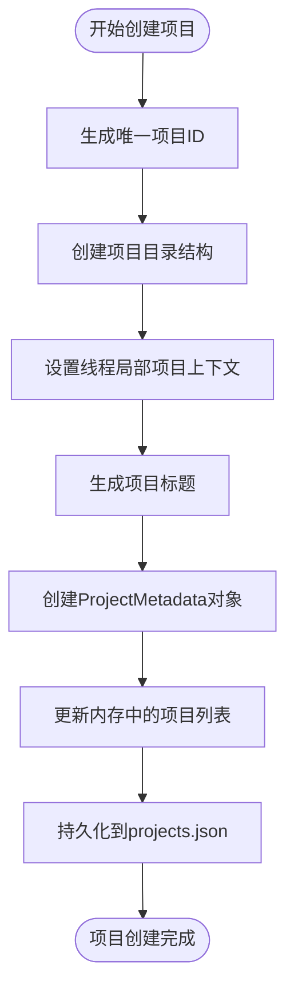
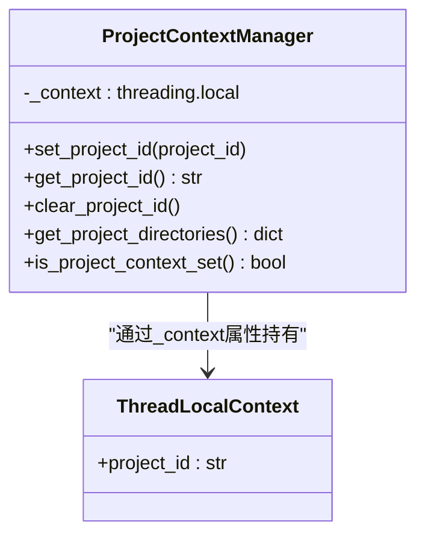
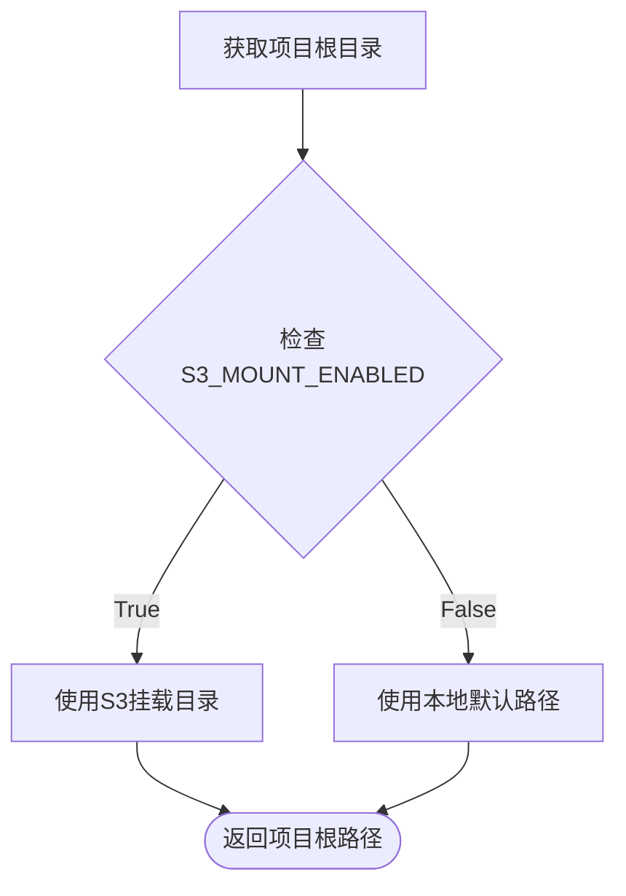
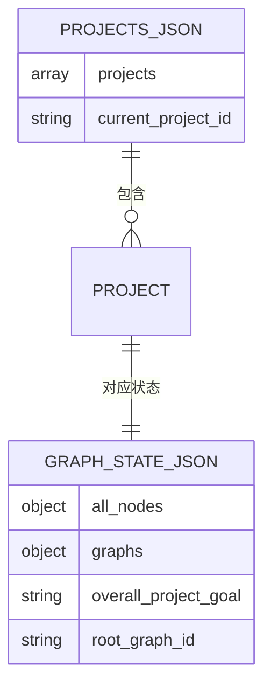
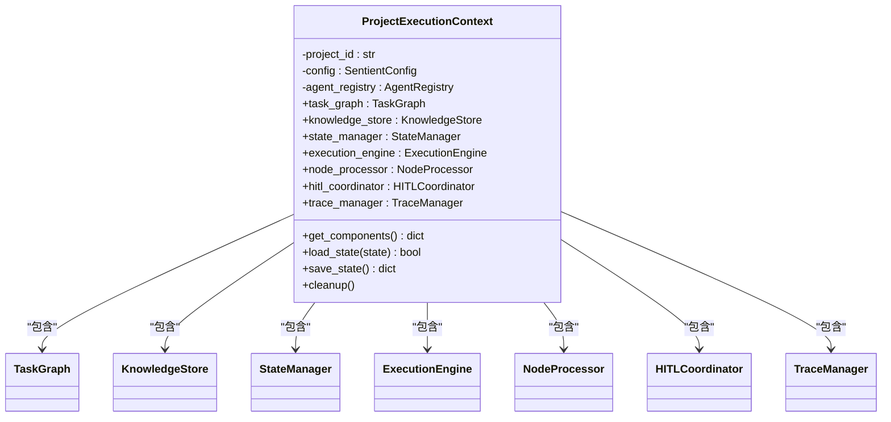

# 项目管理

<cite>
**本文档中引用的文件**
- [project_manager.py](file://src/sentientresearchagent/core/project_manager.py)
- [project_context.py](file://src/sentientresearchagent/core/project_context.py)
- [project_structure.py](file://src/sentientresearchagent/core/project_structure.py)
</cite>

## 目录
1. [简介](#简介)
2. [核心组件分析](#核心组件分析)
3. [项目生命周期管理](#项目生命周期管理)
4. [项目上下文与状态隔离](#项目上下文与状态隔离)
5. [项目目录结构生成](#项目目录结构生成)
6. [项目元数据持久化机制](#项目元数据持久化机制)
7. [并发访问控制策略](#并发访问控制策略)
8. [执行上下文与组件集成](#执行上下文与组件集成)
9. [常见初始化失败场景及排查方法](#常见初始化失败场景及排查方法)
10. [结论](#结论)

## 简介
本技术文档详细阐述了`sentientresearchagent`系统中项目管理模块的设计与实现。该模块负责项目的全生命周期管理，包括创建、加载、保存和销毁等操作。通过`project_manager.py`、`project_context.py`和`project_structure.py`三个核心文件协同工作，实现了项目状态的隔离、标准化目录结构的自动生成以及跨组件的无缝集成。文档将深入解析各组件的工作原理，并提供实际使用示例和故障排查指南。

## 核心组件分析

### ProjectMetadata 类
定义了项目元数据的数据结构，包含项目ID、标题、描述、创建时间、更新时间、状态、目标、最大步骤数等字段。提供了`to_dict`和`from_dict`方法用于在对象与字典之间进行序列化和反序列化转换，支持ISO格式的时间戳处理。

**Section sources**
- [project_manager.py](file://src/sentientresearchagent/core/project_manager.py#L18-L44)

### ProjectManager 类
作为项目管理的核心控制器，负责管理多个项目的元数据。它维护一个内存中的项目字典，并通过线程锁确保并发安全。支持项目创建、查询、更新、删除、切换当前项目等操作，并将项目列表持久化到磁盘上的`projects.json`文件中。

**Section sources**
- [project_manager.py](file://src/sentientresearchagent/core/project_manager.py#L46-L206)

### ProjectContextManager 类
基于线程局部存储（threading.local）实现的项目上下文管理器，解决了多项目并发运行时的上下文污染问题。每个线程拥有独立的项目ID上下文，确保执行环境的隔离性。

**Section sources**
- [project_context.py](file://src/sentientresearchagent/core/project_context.py#L12-L92)

### ProjectStructure 类
集中式项目结构管理器，统一负责项目目录结构的创建和路径计算。根据配置决定使用S3挂载目录还是本地默认路径作为项目根目录，并生成标准化的子目录结构。

**Section sources**
- [project_structure.py](file://src/sentientresearchagent/core/project_structure.py#L12-L90)

## 项目生命周期管理

### 项目创建流程
当调用`create_project`方法时，系统执行以下步骤：
1. 生成唯一的UUID作为项目ID
2. 调用`ProjectStructure.create_project_structure(project_id)`创建完整的目录结构
3. 设置当前线程的项目上下文为新项目ID
4. 基于用户输入的目标生成智能标题
5. 创建`ProjectMetadata`实例并存入内存缓存
6. 更新当前项目指针并将所有项目元数据持久化到`projects.json`

**Diagram sources**
- [project_manager.py](file://src/sentientresearchagent/core/project_manager.py#L91-L126)
- [project_structure.py](file://src/sentientresearchagent/core/project_structure.py#L63-L80)

### 项目加载与销毁
`load_projects`方法在`ProjectManager`初始化时从`projects.json`读取已有项目元数据，恢复内存状态。`delete_project`方法则会从内存中移除项目记录，删除对应的项目目录，并更新持久化文件。

**Section sources**
- [project_manager.py](file://src/sentientresearchagent/core/project_manager.py#L58-L89)
- [project_manager.py](file://src/sentientresearchagent/core/project_manager.py#L148-L179)

## 项目上下文与状态隔离

### 线程局部上下文机制
`ProjectContextManager`利用Python的`threading.local()`特性为每个线程维护独立的项目上下文。这避免了传统全局变量或环境变量方式在高并发场景下的竞态条件问题。

**Diagram sources**
- [project_context.py](file://src/sentientresearchagent/core/project_context.py#L12-L92)

### 上下文辅助函数
模块提供了简洁的全局函数接口，如`set_project_context()`、`get_project_context()`等，方便其他组件快速获取当前项目上下文信息，无需直接操作底层管理器实例。

**Section sources**
- [project_context.py](file://src/sentientresearchagent/core/project_context.py#L97-L113)

## 项目目录结构生成

### 标准化目录布局
系统为每个项目自动生成统一的目录结构，包含以下关键子目录：
- `toolkits/`: 存放工具包相关文件
- `results/`: 存放结果数据
  - `plots/`: 图表输出
  - `artifacts/`: 中间产物
  - `reports/`: 报告文件

### 路径计算逻辑
`ProjectStructure.get_project_root()`方法根据环境变量判断是否启用S3挂载模式。若启用，则使用S3挂载目录；否则回退到本地默认路径。所有子目录路径均基于此根目录派生。

**Diagram sources**
- [project_structure.py](file://src/sentientresearchagent/core/project_structure.py#L15-L39)

**Section sources**
- [project_structure.py](file://src/sentientresearchagent/core/project_structure.py#L41-L60)

## 项目元数据持久化机制
项目元数据通过JSON文件进行持久化存储。`ProjectManager`在每次修改后都会调用`_save_projects()`方法将内存中的项目列表写入`projects.json`文件。同时，每个项目的任务图状态单独保存在其项目目录下的`graph_state.json`文件中，便于独立加载和恢复。

**Section sources**
- [project_manager.py](file://src/sentientresearchagent/core/project_manager.py#L58-L89)
- [project_manager.py](file://src/sentientresearchagent/core/project_manager.py#L208-L237)

## 并发访问控制策略
系统采用细粒度的线程锁机制来保证数据一致性。`ProjectManager`内部的`_lock`属性是一个`threading.Lock`实例，在所有可能修改共享状态的方法（如`create_project`、`update_project`、`delete_project`）上使用`with self._lock:`语句块进行同步，防止并发修改导致的数据损坏。

**Section sources**
- [project_manager.py](file://src/sentientresearchagent/core/project_manager.py#L54-L56)
- [project_manager.py](file://src/sentientresearchagent/core/project_manager.py#L91-L126)

## 执行上下文与组件集成

### ProjectExecutionContext 类
该类封装了特定项目所需的所有执行组件，包括任务图、知识库、状态管理器、执行引擎等。它的存在确保了不同项目之间的完全隔离，允许系统无缝切换和并发执行多个项目。

**Diagram sources**
- [project_manager.py](file://src/sentientresearchagent/core/project_manager.py#L239-L493)

### 状态加载与保存
`load_state`和`save_state`方法实现了项目执行状态的序列化与反序列化。加载时会重建任务节点、转换枚举类型、恢复时间戳，并重构图结构；保存时则通过`TaskGraph`的可视化字典接口获取可序列化的状态表示。

**Section sources**
- [project_manager.py](file://src/sentientresearchagent/core/project_manager.py#L353-L406)
- [project_manager.py](file://src/sentientresearchagent/core/project_manager.py#L408-L425)

## 常见初始化失败场景及排查方法

### 目录创建失败
**现象**：项目创建过程中抛出权限错误或IO异常。
**原因**：目标路径无写入权限，磁盘空间不足，或S3挂载未正确配置。
**排查**：
1. 检查`S3_MOUNT_ENABLED`和`S3_MOUNT_DIR`环境变量设置
2. 验证目标目录的读写权限
3. 确认磁盘可用空间

### 上下文丢失
**现象**：执行过程中无法获取当前项目ID。
**原因**：线程切换导致上下文未正确传递。
**解决**：确保在异步或线程池操作中显式传递和设置项目上下文。

### 状态反序列化错误
**现象**：加载项目状态时节点数据不完整或类型错误。
**原因**：旧版本状态数据与新代码不兼容。
**解决**：检查`_deserialize_node_enums`和`_deserialize_node_timestamps`方法的兼容性处理逻辑。

**Section sources**
- [project_manager.py](file://src/sentientresearchagent/core/project_manager.py#L353-L406)
- [project_context.py](file://src/sentientresearchagent/core/project_context.py#L12-L92)

## 结论
项目管理模块通过精心设计的分层架构实现了高效、安全的项目全生命周期管理。`ProjectManager`提供高层API，`ProjectContextManager`保障并发安全，`ProjectStructure`统一路径管理，三者协同工作形成了稳健的基础支撑。`ProjectExecutionContext`进一步强化了项目间的隔离性，为复杂的研究代理系统提供了可靠的运行环境。该设计既满足了功能需求，又具备良好的扩展性和维护性。