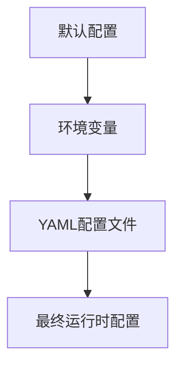
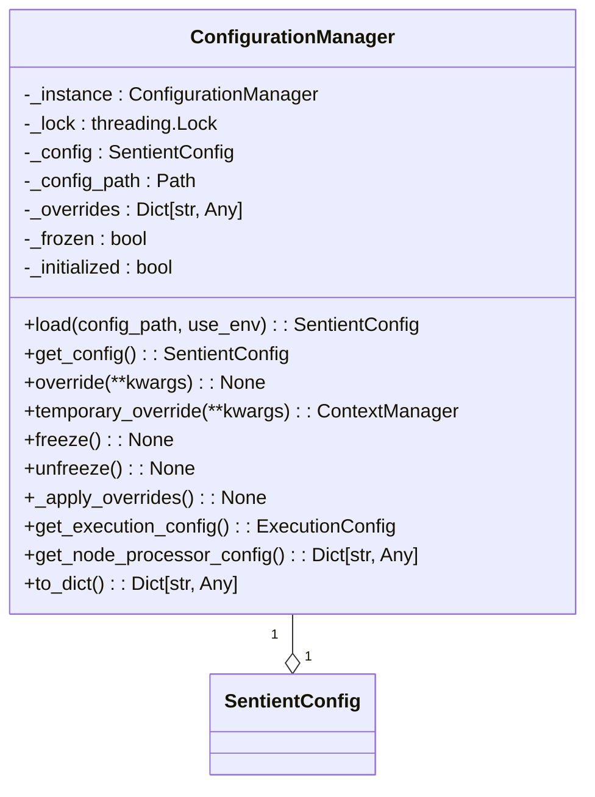
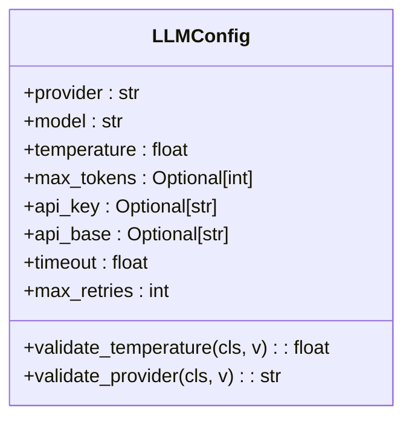
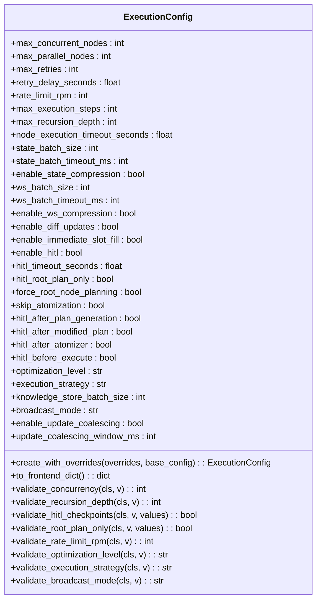
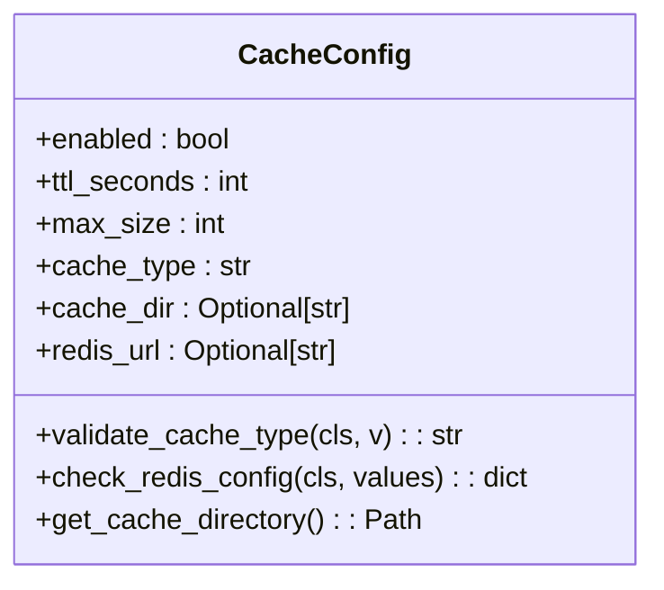
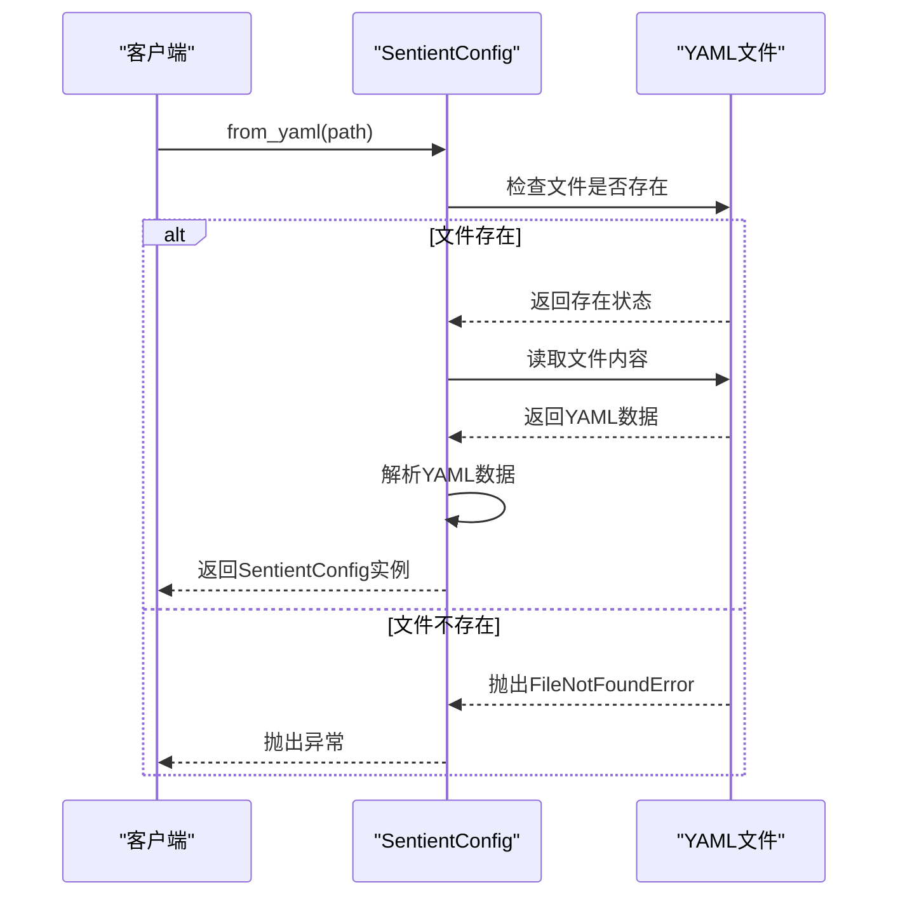
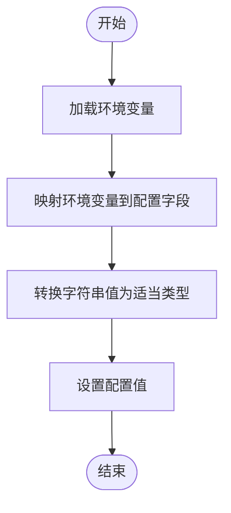
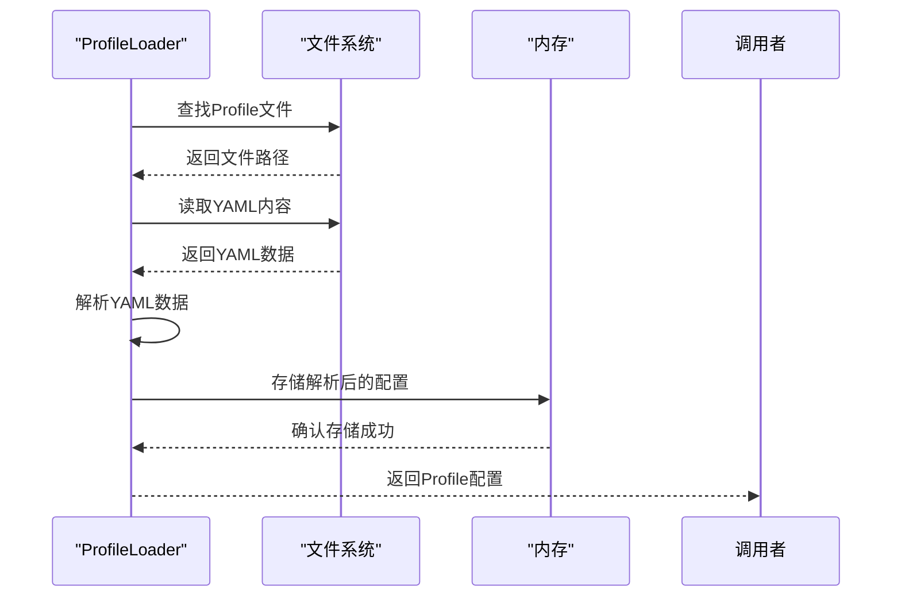
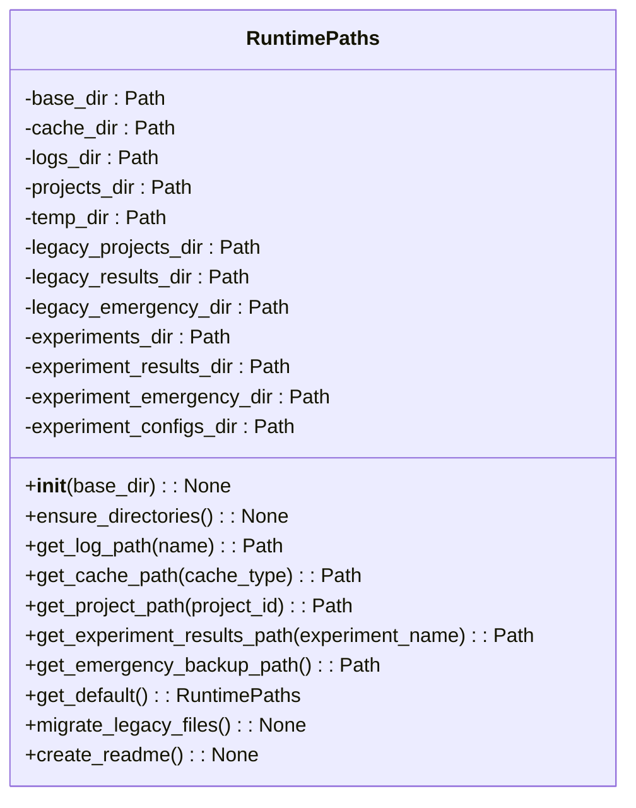

# 配置管理系统

<cite>
**本文档引用的文件**  
- [config.py](file://src/sentientresearchagent/config/config.py)
- [unified_config.py](file://src/sentientresearchagent/config/unified_config.py)
- [config_utils.py](file://src/sentientresearchagent/config/config_utils.py)
- [paths.py](file://src/sentientresearchagent/config/paths.py)
- [sentient.yaml](file://sentient.yaml)
- [deep_research_agent.yaml](file://src/sentientresearchagent/hierarchical_agent_framework/agent_configs/profiles/deep_research_agent.yaml)
</cite>

## 目录
1. [简介](#简介)
2. [统一配置架构设计](#统一配置架构设计)
3. [核心配置组件分析](#核心配置组件分析)
4. [多源配置加载机制](#多源配置加载机制)
5. [配置验证与默认值填充](#配置验证与默认值填充)
6. [代理Profile继承机制](#代理profile继承机制)
7. [路径解析规则](#路径解析规则)
8. [典型配置案例](#典型配置案例)
9. [扩展自定义配置](#扩展自定义配置)

## 简介

本系统为Sentient研究代理框架提供了一个全面且灵活的配置管理系统。该系统通过整合环境变量、命令行参数和YAML配置文件，实现了多源配置加载逻辑，确保了配置的一致性和可维护性。系统采用分层设计，将不同类型的配置项（如LLM设置、缓存策略、执行框架等）组织在独立的模块中，并通过统一的接口进行访问。

整个配置体系以`SentientConfig`为核心，它是一个Pydantic模型，包含了所有主要的配置类别：LLM配置、缓存配置、执行配置、日志配置、Web服务器配置以及实验管理配置。这种结构化的配置方式不仅提高了代码的可读性，还便于进行类型检查和数据验证。

此外，系统提供了便捷的工具函数来自动发现和加载配置文件，支持从多个预定义位置查找配置，包括当前目录下的`sentient.yaml`、用户主目录中的隐藏文件夹，以及系统的全局配置目录。这使得开发者可以在不同的部署环境中轻松地管理和切换配置。

**Section sources**
- [config.py](file://src/sentientresearchagent/config/config.py#L1-L50)
- [sentient.yaml](file://sentient.yaml#L1-L10)

## 统一配置架构设计

### 配置层次结构

本系统的配置架构遵循一个清晰的优先级顺序，确保了配置的灵活性和一致性。当多个配置源同时存在时，它们按照以下优先级进行合并：

1. **默认配置**：系统内置的默认值，作为最基础的配置层。
2. **环境变量**：通过环境变量提供的配置，允许在不修改代码的情况下调整行为。
3. **YAML配置文件**：存储在磁盘上的配置文件，适合长期保存和版本控制。

这种设计允许开发者在开发、测试和生产环境中使用不同的配置组合，而无需更改代码本身。



**Diagram sources**
- [config.py](file://src/sentientresearchagent/config/config.py#L596-L637)

### 配置单例模式

为了保证在整个应用程序生命周期内只有一个配置实例，系统采用了单例模式。`ConfigurationManager`类负责管理这个唯一的配置实例，确保所有组件都访问到相同的配置状态。



**Diagram sources**
- [unified_config.py](file://src/sentientresearchagent/config/unified_config.py#L16-L215)

## 核心配置组件分析

### LLM配置

`LLMConfig`类定义了与大型语言模型相关的所有配置选项，包括提供商、模型名称、温度参数、最大令牌数、API密钥等。这些配置直接影响到AI代理的行为和性能。



**Diagram sources**
- [config.py](file://src/sentientresearchagent/config/config.py#L21-L43)

### 执行配置

`ExecutionConfig`类涵盖了任务执行过程中的各种参数，如并发节点数量、重试次数、超时限制等。这些配置对于优化系统性能至关重要。



**Diagram sources**
- [config.py](file://src/sentientresearchagent/config/config.py#L79-L287)

### 缓存配置

`CacheConfig`类管理缓存系统的相关设置，包括是否启用缓存、TTL（生存时间）、最大大小、缓存类型（内存、Redis或文件）等。



**Diagram sources**
- [config.py](file://src/sentientresearchagent/config/config.py#L45-L77)

## 多源配置加载机制

### YAML文件加载

`SentientConfig`类提供了`from_yaml`方法，可以从指定路径的YAML文件中加载配置。该方法首先检查文件是否存在，然后使用`yaml.safe_load`解析文件内容，并将其转换为`SentientConfig`实例。



**Diagram sources**
- [config.py](file://src/sentientresearchagent/config/config.py#L408-L443)

### 环境变量加载

`from_env`方法允许从环境变量中加载配置。系统会根据预定义的映射关系，将环境变量的值映射到相应的配置字段上。例如，`SENTIENT_LLM_PROVIDER`环境变量会被映射到`llm.provider`字段。



**Diagram sources**
- [config.py](file://src/sentientresearchagent/config/config.py#L446-L501)

### 字典配置创建

除了从文件和环境变量加载外，还可以直接从字典创建配置实例。`from_dict`方法接受一个包含配置数据的字典，并返回一个新的`SentientConfig`实例。

```python
[SPEC SYMBOL](file://src/sentientresearchagent/config/config.py#L504-L514)
```

**Section sources**
- [config.py](file://src/sentientresearchagent/config/config.py#L504-L514)

## 配置验证与默认值填充

### 验证功能

`config_utils.py`模块提供了`validate_config`函数，用于对配置进行综合验证。该函数会检查API密钥是否缺失、执行设置是否合理、缓存设置是否正确等问题，并返回包含问题和警告的字典。

```python
[SPEC SYMBOL](file://src/sentientresearchagent/config/config_utils.py#L52-L91)
```

**Section sources**
- [config_utils.py](file://src/sentientresearchagent/config/config_utils.py#L52-L91)

### 默认值填充

系统利用Pydantic的`Field(default_factory=...)`机制来提供合理的默认值。例如，`LLMConfig`中的`api_key`字段默认从`OPENAI_API_KEY`环境变量获取，如果没有设置，则为`None`。

```python
[SPEC SYMBOL](file://src/sentientresearchagent/config/config.py#L27-L27)
```

**Section sources**
- [config.py](file://src/sentientresearchagent/config/config.py#L27-L27)

## 代理Profile继承机制

### Deep Research Agent Profile

以`deep_research_agent.yaml`为例，展示了代理Profile的继承机制。该Profile定义了一套专门用于深度研究任务的配置，包括根规划器适配器、聚合器适配器、计划者适配器等。

```yaml
[SPEC SYMBOL](file://src/sentientresearchagent/hierarchical_agent_framework/agent_configs/profiles/deep_research_agent.yaml#L1-L52)
```

**Section sources**
- [deep_research_agent.yaml](file://src/sentientresearchagent/hierarchical_agent_framework/agent_configs/profiles/deep_research_agent.yaml#L1-L52)

### 动态加载过程

系统通过`profile_loader.py`中的`load_profile`函数动态加载这些Profile。加载过程中，系统会根据需要合并多个Profile的配置，实现灵活的继承和覆盖机制。



**Diagram sources**
- [profile_loader.py](file://src/sentientresearchagent/hierarchical_agent_framework/agent_configs/profile_loader.py#L1-L50)

## 路径解析规则

### RuntimePaths类

`paths.py`模块中的`RuntimePaths`类负责管理应用程序的所有运行时路径。它确保所有运行时文件都被组织在一个一致的结构中。



**Diagram sources**
- [paths.py](file://src/sentientresearchagent/config/paths.py#L16-L147)

### 跨平台部署作用

`RuntimePaths`的设计考虑到了跨平台兼容性。无论是在Windows还是Linux系统上，它都能正确地处理路径分隔符和权限问题，确保应用能够在不同操作系统上无缝运行。

```python
[SPEC SYMBOL](file://src/sentientresearchagent/config/paths.py#L10-L147)
```

**Section sources**
- [paths.py](file://src/sentientresearchagent/config/paths.py#L10-L147)

## 典型配置案例

### 切换LLM提供商

要切换LLM提供商，只需修改`llm.provider`字段即可。例如，从OpenAI切换到Anthropic：

```yaml
llm:
  provider: "anthropic"
  model: "claude-2"
  api_key: "your-anthropic-api-key"
```

### 调整超时阈值

可以通过修改`execution.node_execution_timeout_seconds`来调整节点执行的超时阈值：

```yaml
execution:
  node_execution_timeout_seconds: 3600.0  # 设置为1小时
```

### 启用HITL模式

启用人类参与循环（Human-in-the-Loop）模式：

```yaml
execution:
  enable_hitl: true
  hitl_timeout_seconds: 1800.0  # 30分钟
```

**Section sources**
- [sentient.yaml](file://sentient.yaml#L1-L117)

## 扩展自定义配置

### 添加新的Agent Profile模板

要添加新的Agent Profile模板，可以在`agent_configs/profiles/`目录下创建一个新的YAML文件，例如`custom_agent.yaml`：

```yaml
profile:
  name: "CustomAgent"
  description: "Custom agent profile for specific tasks"

  root_planner_adapter_name: "CustomPlanner"
  root_aggregator_adapter_name: "CustomAggregator"

  planner_adapter_names:
    SEARCH: "CustomSearchPlanner"
    WRITE: "CustomWritePlanner"
    THINK: "CustomThinkPlanner"

  executor_adapter_names:
    SEARCH: "CustomSearchExecutor"
    THINK: "CustomThinkExecutor"
    WRITE: "CustomWriteExecutor"

  aggregator_adapter_names:
    SEARCH: "CustomSearchAggregator"
    THINK: "CustomThinkAggregator"
    WRITE: "CustomWriteAggregator"

  atomizer_adapter_name: "default_atomizer"
  plan_modifier_adapter_name: "PlanModifier"

  default_planner_adapter_name: "CorePlanner"
  default_executor_adapter_name: "BasicExecutor"
  default_node_agent_name_prefix: "Custom"
```

### 扩展自定义配置项

如果需要扩展自定义配置项，可以在`SentientConfig`类中添加新的字段，或者使用`custom`字段来存储额外的配置信息：

```python
[SPEC SYMBOL](file://src/sentientresearchagent/config/config.py#L397-L397)
```

然后在YAML文件中添加对应的配置：

```yaml
custom:
  my_custom_setting: "value"
  another_setting: 42
```

**Section sources**
- [config.py](file://src/sentientresearchagent/config/config.py#L397-L397)
- [sentient.yaml](file://sentient.yaml#L1-L117)