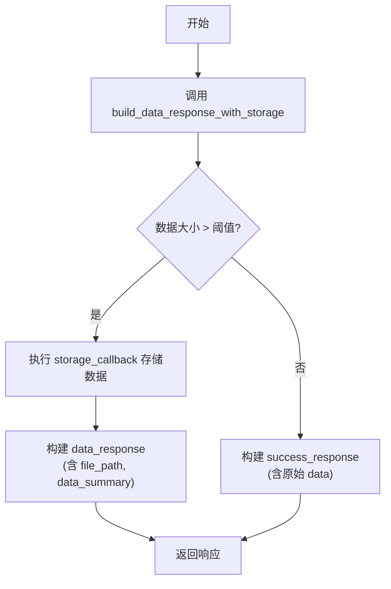

# 工具包核心工具与公共组件

<cite>
**本文档引用的文件**
- [http_client.py](file://src\sentientresearchagent\hierarchical_agent_framework\toolkits\utils\http_client.py)
- [data_validator.py](file://src\sentientresearchagent\hierarchical_agent_framework\toolkits\utils\data_validator.py)
- [filename_generator.py](file://src\sentientresearchagent\hierarchical_agent_framework\toolkits\utils\filename_generator.py)
- [response_builder.py](file://src\sentientresearchagent\hierarchical_agent_framework\toolkits\utils\response_builder.py)
- [base_api.py](file://src\sentientresearchagent\hierarchical_agent_framework\toolkits\base\base_api.py)
</cite>

## 目录
1. [简介](#简介)
2. [HTTP客户端：异步请求与稳定性保障](#http客户端异步请求与稳定性保障)
3. [数据验证器：字段检查与模式匹配](#数据验证器字段检查与模式匹配)
4. [文件名生成器：缓存存储唯一标识](#文件名生成器缓存存储唯一标识)
5. [响应构建器：多源数据聚合与标准化输出](#响应构建器多源数据聚合与标准化输出)
6. [基础API类：统一方法签名与抽象封装](#基础api类统一方法签名与抽象封装)
7. [扩展指南：快速构建新工具包](#扩展指南快速构建新工具包)

## 简介
本技术文档深入解析了智能研究代理系统中的核心公共基础设施组件。这些共享工具为各类数据工具包提供了稳定、一致且可复用的功能支持，涵盖网络通信、数据校验、文件管理及响应构造等关键领域。通过分析`http_client.py`、`data_validator.py`、`filename_generator.py`和`response_builder.py`等模块，并结合`base_api.py`中的抽象基类设计，本文旨在阐明其内部机制与最佳实践，为开发者提供清晰的扩展路径。

## HTTP客户端：异步请求与稳定性保障

`DataHTTPClient` 类是整个系统进行外部API调用的核心，它基于 `httpx` 库构建了一个功能强大且稳定的异步HTTP客户端，专门用于处理来自不同数据源的请求。

该客户端通过以下机制显著提升了外部API调用的稳定性：

*   **连接池管理**：客户端为每个配置的端点（endpoint）维护一个独立的 `httpx.AsyncClient` 实例。这种设计实现了连接池化，避免了每次请求都建立新连接的开销，从而提高了性能和资源利用率。
*   **超时控制**：在初始化时可以设置全局默认超时时间 (`default_timeout`)，同时在添加端点 (`add_endpoint`) 时也可以为特定端点指定自定义超时。这确保了任何请求都不会无限期地挂起，有效防止了因后端服务无响应而导致的系统阻塞。
*   **自动重试策略**：客户端内置了灵活的重试逻辑。当请求失败时（特别是服务器错误，即5xx状态码），会根据配置的最大重试次数 (`max_retries`) 和延迟 (`retry_delay`) 进行指数退避重试。例如，在 `_make_request` 方法中，每次重试的等待时间会递增（`self._retry_delay * (attempt + 1)`），以减轻对故障服务的压力。
*   **速率限制**：为了遵守API提供商的调用频率限制，客户端支持为每个端点配置 `rate_limit`。在发起请求前，`_apply_rate_limit` 方法会检查上一次请求的时间，如果间隔小于设定的限速值，则会主动休眠，确保请求符合规范。

```mermaid
sequenceDiagram
participant Toolkit as "数据工具包"
participant Client as "DataHTTPClient"
participant Endpoint as "外部API端点"
Toolkit->>Client : 发起GET/POST请求
Note over Client,Endpoint : 请求前应用速率限制
Client->>Client : _apply_rate_limit()
alt 达到速率限制
Client-->>Client : 暂停至间隔达标
end
Client->>Client : 获取或创建AsyncClient实例
loop 最多重试N次
Client->>Endpoint : 发送HTTP请求
Endpoint-->>Client : 返回响应
alt 响应成功(2xx)
Client->>Toolkit : 解析JSON并返回结果
break 成功
else 服务器错误(5xx)
Client->>Client : 计算退避时间并等待
else 客户端错误(4xx)或其他异常
Client->>Toolkit : 抛出HTTPClientError
break 失败
end
end
```

**图示来源**
- [http_client.py](file://src\sentientresearchagent\hierarchical_agent_framework\toolkits\utils\http_client.py#L37-L440)

**节来源**
- [http_client.py](file://src\sentientresearchagent\hierarchical_agent_framework\toolkits\utils\http_client.py#L37-L440)

## 数据验证器：字段检查与模式匹配

`DataValidator` 类提供了一套全面的数据验证工具，确保输入数据的完整性和正确性，是保证下游业务逻辑可靠运行的第一道防线。

其主要功能包括：

*   **结构完整性检查**：`validate_structure` 方法可以验证数据的基本类型（如列表、字典、DataFrame）以及是否包含所有必需的字段。它能智能地处理列表（检查第一个元素）、字典和Pandas DataFrame，确保数据结构符合预期。
*   **必填项验证**：通过 `required_fields` 参数，可以明确指定哪些字段是必须存在的。如果数据中缺少这些字段，验证将失败并返回详细的错误信息。
*   **模式匹配与字段映射**：`validate_ohlcv_fields` 方法是一个高级验证示例，专门用于处理金融市场的OHLCV（开盘价、最高价、最低价、收盘价、成交量）数据。它不仅能检查必要字段的存在，还能通过预设的变体列表（如 `"openPrice"`, `"open_price"`）自动识别不同API返回的不同字段命名方式，实现智能的字段映射。
*   **数值与时间戳验证**：`validate_numeric_data` 和 `validate_timestamps` 方法分别用于验证数据中的数值有效性和时间戳格式。它们能够统计有效和无效数据的数量，并对时间戳的范围进行合理性检查。

**节来源**
- [data_validator.py](file://src\sentientresearchagent\hierarchical_agent_framework\toolkits\utils\data_validator.py#L28-L258)

## 文件名生成器：缓存存储唯一标识

`FileNameGenerator` 类负责为系统生成标准化、描述性强且唯一的文件名，主要用于缓存数据的持久化存储，确保文件组织有序且易于追溯。

其核心特性如下：

*   **参数化生成**：`generate_data_filename` 是核心方法，它接受前缀、主标识符、次标识符和附加参数等信息，将它们按固定顺序拼接成文件名。例如，生成类似 `klines_BTCUSDT_spot_1h_500` 的文件名，其中包含了数据类型、交易对、市场类型和查询参数。
*   **时间戳集成**：通过 `include_timestamp=True` 参数，可以在文件名末尾自动追加当前Unix时间戳，确保即使其他参数相同，每次生成的文件名也是唯一的，完美解决了缓存冲突问题。
*   **专用模板**：`generate_market_data_filename` 提供了针对市场数据的专用模板，简化了常见场景下的文件名生成流程。
*   **字符清理**：生成的文件名会经过清理，移除不合法的字符（如 `/`, ` `），只保留字母、数字、下划线、连字符和点号，保证了文件名的兼容性。

**节来源**
- [filename_generator.py](file://src\sentientresearchagent\hierarchical_agent_framework\toolkits\utils\filename_generator.py#L28-L160)

## 响应构建器：多源数据聚合与标准化输出

`ResponseBuilder` 类是构建对外API响应的标准化工厂，它确保了所有工具包返回的响应格式高度一致，极大地方便了前端和下游系统的消费。

其作用体现在：

*   **标准化输出结构**：无论是成功还是失败，响应都遵循固定的JSON结构。成功响应包含 `success: true`、`message`、`fetched_at` 时间戳和 `data`；错误响应则包含 `success: false`、`error_type` 和 `details`。这种一致性降低了集成复杂度。
*   **自动化信息注入**：在初始化时，`ResponseBuilder` 可以接收一个 `toolkit_info` 字典（包含工具包名称、类别等）。此后，所有通过它构建的响应都会自动注入这些元信息，无需在每个方法中手动添加。
*   **智能数据存储决策**：`build_data_response_with_storage` 方法实现了智能化的大数据处理。它会估算待返回数据的JSON大小（以KB为单位），如果超过预设阈值，则调用 `storage_callback` 将数据保存到文件，并在响应中返回文件路径和摘要信息，而不是直接传输庞大的数据流，从而优化了性能和带宽使用。



**图示来源**
- [response_builder.py](file://src\sentientresearchagent\hierarchical_agent_framework\toolkits\utils\response_builder.py#L49-L383)

**节来源**
- [response_builder.py](file://src\sentientresearchagent\hierarchical_agent_framework\toolkits\utils\response_builder.py#L49-L383)

## 基础API类：统一方法签名与抽象封装

`BaseAPIToolkit` 类作为所有具体数据工具包的抽象基类，定义了统一的方法签名和通用的业务逻辑，实现了代码的高度复用和架构的一致性。

其关键设计原则包括：

*   **单一职责**：该类专注于API层面的业务逻辑，如参数验证、标识符解析和响应构建，而将HTTP传输交给 `DataHTTPClient`，数据存储交给 `BaseDataToolkit`，体现了良好的关注点分离。
*   **统一方法签名**：通过继承 `BaseAPIToolkit`，所有子类都天然具备了如 `_resolve_identifier`、`_validate_api_parameters` 等方法。这确保了不同工具包在处理符号转换、参数校验等任务时采用相同的接口和行为。
*   **增强的业务功能**：除了基础验证，它还提供了更高级的功能，如：
    *   **标识符模糊匹配**：`_find_fuzzy_match` 利用 `difflib` 库，能在用户输入有轻微拼写错误时找到最接近的有效选项。
    *   **通用缓存系统**：`_init_cache_system` 和相关方法提供了一个简单的内存缓存机制，可用于缓存API响应、有效的符号列表等，减少重复请求。
    *   **日期时间工具**：提供了 `iso_to_unix` 和 `unix_to_iso` 等静态方法，方便地在不同时间格式间转换。

**节来源**
- [base_api.py](file://src\sentientresearchagent\hierarchical_agent_framework\toolkits\base\base_api.py#L38-L637)

## 扩展指南：快速构建新工具包

要利用这些公共组件快速构建一个新的数据工具包，可以遵循以下步骤：

1.  **继承基础类**：创建新类时，继承 `Toolkit`、`BaseDataToolkit` 和 `BaseAPIToolkit`。
2.  **初始化辅助工具**：在 `__init__` 方法中，调用 `self._init_data_helpers()` 和 `self._init_api_helpers()` 来初始化数据和API相关的辅助功能。
3.  **配置HTTP客户端**：创建 `DataHTTPClient` 实例，并使用 `add_endpoint` 方法配置目标API的URL和认证头。
4.  **实现具体方法**：编写具体的业务方法。在方法内部：
    *   使用 `_resolve_identifier` 和 `_validate_api_parameters` 对输入进行清洗和验证。
    *   使用 `DataHTTPClient` 的 `get` 或 `post` 方法发起网络请求。
    *   使用 `ResponseBuilder` 的 `success_response` 或 `error_response` 构建最终的响应。

通过这种方式，开发者可以将精力集中在特定API的业务逻辑上，而无需重复造轮子，极大地提升了开发效率和代码质量。