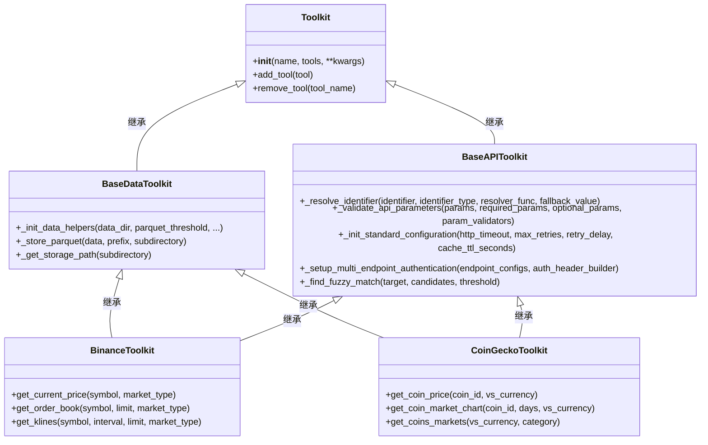
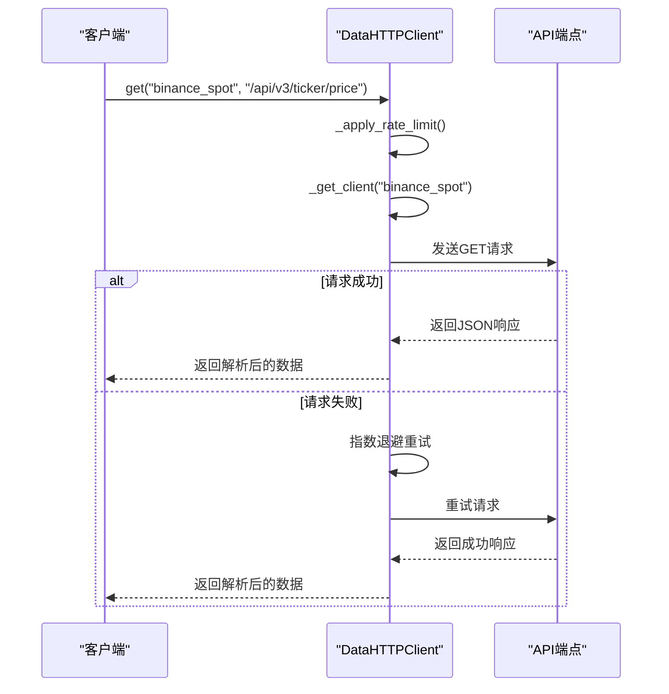

# 工具包集成

<cite>
**本文档引用的文件**   
- [binance_toolkit.py](file://src\sentientresearchagent\hierarchical_agent_framework\toolkits\data\binance_toolkit.py)
- [coingecko_toolkit.py](file://src\sentientresearchagent\hierarchical_agent_framework\toolkits\data\coingecko_toolkit.py)
- [defillama_toolkit.py](file://src\sentientresearchagent\hierarchical_agent_framework\toolkits\data\defillama_toolkit.py)
- [arkham_toolkit.py](file://src\sentientresearchagent\hierarchical_agent_framework\toolkits\data\arkham_toolkit.py)
- [base_api.py](file://src\sentientresearchagent\hierarchical_agent_framework\toolkits\base\base_api.py)
- [base_data.py](file://src\sentientresearchagent\hierarchical_agent_framework\toolkits\base\base_data.py)
- [http_client.py](file://src\sentientresearchagent\hierarchical_agent_framework\toolkits\utils\http_client.py)
- [web_search_tool.py](file://src\sentientresearchagent\hierarchical_agent_framework\tools\web_search_tool.py)
</cite>

## 目录
1. [简介](#简介)
2. [核心工具包集成](#核心工具包集成)
3. [基类与HTTP客户端设计](#基类与http客户端设计)
4. [网络搜索功能实现](#网络搜索功能实现)
5. [代理执行中的工具调用示例](#代理执行中的工具调用示例)
6. [开发新工具包的最佳实践](#开发新工具包的最佳实践)
7. [结论](#结论)

## 简介
本文档详细介绍了ROMA平台中工具包（Toolkit）的集成机制，重点阐述了如何通过统一的架构连接外部数据源与服务能力。文档涵盖金融数据工具包（如Binance、CoinGecko、DefiLlama和Arkham）的集成方式、API调用方法，以及`web_search_tool`的实现原理。同时，深入解析了工具包的基类设计（`base_api.py`）和HTTP客户端封装（`http_client.py`），为开发者提供遵循相同模式开发新工具包（如Twitter API或数据库集成）的完整指导。

## 核心工具包集成

### Binance工具包
Binance工具包提供了对币安现货交易、USDⓈ-M永续合约和COIN-M交割合约市场的全面访问。该工具包支持动态市场切换，允许在单个实例中查询不同市场的数据。

**关键特性：**
- **多市场支持**：通过`market_type`参数在`spot`、`usdm`和`coinm`市场间切换。
- **实时价格数据**：获取最新的交易价格。
- **订单簿深度分析**：检索买卖盘口信息。
- **K线历史数据**：获取用于技术分析的蜡烛图数据。
- **智能数据管理**：大型响应自动存储为Parquet文件以优化内存使用。

**配置示例：**
```yaml
toolkits:
  - name: "BinanceToolkit"
    params:
      symbols: ["BTCUSDT", "ETHUSDT"]
      default_market_type: "spot"
      data_dir: "./data/binance"
```

**API调用方法：**
- `get_current_price(symbol, market_type)`：获取指定交易对的最新价格。
- `get_order_book(symbol, limit, market_type)`：获取指定深度的订单簿。
- `get_klines(symbol, interval, limit, market_type)`：获取K线数据。
- `validate_symbol(symbol, market_type)`：验证交易对是否有效。

**Section sources**
- [binance_toolkit.py](file://src\sentientresearchagent\hierarchical_agent_framework\toolkits\data\binance_toolkit.py#L175-L2191)

### CoinGecko工具包
CoinGecko工具包集成了CoinGecko的公开REST API，提供超过17,000种加密货币的市场数据、价格行情和区块链分析。

**关键特性：**
- **多货币支持**：可将价格转换为100多种法币和加密货币。
- **历史数据分析**：支持自定义时间范围的历史价格、市值和交易量数据。
- **硬币信息查询**：获取代币的元数据、社会链接和合约地址。
- **搜索与发现**：在硬币、交易所和类别中进行搜索。

**配置示例：**
```yaml
toolkits:
  - name: "CoinGeckoToolkit"
    params:
      coins: ["bitcoin", "ethereum"]
      default_vs_currency: "usd"
      api_key: "${COINGECKO_API_KEY}"
```

**API调用方法：**
- `get_coin_price(coin_id, vs_currency)`：获取指定硬币的价格。
- `get_coin_market_chart(coin_id, days, vs_currency)`：获取指定天数内的市场图表数据。
- `get_coins_markets(vs_currency, category)`：获取所有硬币的市场概览。
- `search_coins_exchanges_categories(query)`：搜索硬币、交易所和类别。

**Section sources**
- [coingecko_toolkit.py](file://src\sentientresearchagent\hierarchical_agent_framework\toolkits\data\coingecko_toolkit.py#L199-L3970)

### DefiLlama工具包
DefiLlama工具包专注于DeFi领域的分析，提供协议TVL（总锁仓价值）、费用/收入跟踪和生态系统指标。

**关键特性：**
- **多层API支持**：区分免费端点和需要API密钥的Pro端点。
- **财务分析**：提供高级财务指标和统计分析。
- **跨链比较**：支持在不同区块链网络间进行比较。

**配置示例：**
```yaml
toolkits:
  - name: "DefiLlamaToolkit"
    params:
      api_key: "${DEFILLAMA_API_KEY}"
      enable_pro_features: true
      default_chain: "ethereum"
```

**API调用方法：**
- `get_protocol_tvl(protocol)`：获取特定协议的当前TVL。
- `get_protocol_fees(protocol, data_type)`：获取协议的每日费用和收入。
- `get_chains()`：获取所有支持的区块链列表。
- `get_chain_historical_tvl(chain)`：获取特定链的历史TVL趋势。

**Section sources**
- [defillama_toolkit.py](file://src\sentientresearchagent\hierarchical_agent_framework\toolkits\data\defillama_toolkit.py#L198-L2184)

### Arkham工具包
Arkham工具包提供了对链上实体和钱包活动的洞察，帮助用户追踪机构投资者和鲸鱼钱包的行为。

**关键特性：**
- **实体识别**：将钱包地址映射到已知的实体（如交易所、基金）。
- **投资组合分析**：查看特定实体持有的资产组合。
- **交易监控**：监控大额资金流动。

**API调用方法：**
- `get_entity_info(entity_id)`：获取实体的基本信息。
- `get_entity_portfolio(entity_id)`：获取实体的投资组合详情。
- `get_wallet_transactions(wallet_address)`：获取钱包的交易历史。

**Section sources**
- [arkham_toolkit.py](file://src\sentientresearchagent\hierarchical_agent_framework\toolkits\data\arkham_toolkit.py#L162-L1580)

## 基类与HTTP客户端设计

### BaseAPIToolkit (base_api.py)
`BaseAPIToolkit`是所有API工具包的基类，它提供了可重用的API业务逻辑功能，确保代码的一致性和可维护性。

**核心功能：**
- **标识符解析**：`_resolve_identifier`方法用于解析和验证符号、硬币ID等标识符。
- **参数验证**：`_validate_api_parameters`方法验证API参数并返回清理后的参数字典。
- **日期时间工具**：提供`iso_to_unix`和`unix_to_iso`方法在ISO 8601格式和Unix时间戳之间转换。
- **高级缓存模式**：`_init_cache_system`初始化缓存系统，`_cache_data`和`_get_cached_data`用于缓存任何类型的数据。
- **模糊匹配**：`_find_fuzzy_match`方法使用`difflib`库查找相似的字符串，提高用户体验。

**继承关系：**


**Diagram sources **
- [base_api.py](file://src\sentientresearchagent\hierarchical_agent_framework\toolkits\base\base_api.py#L31-L637)
- [base_data.py](file://src\sentientresearchagent\hierarchical_agent_framework\toolkits\base\base_data.py#L34-L682)

### BaseDataToolkit (base_data.py)
`BaseDataToolkit`专为处理大量数据的工具包设计，提供自动化的Parquet存储和数据管理功能。

**核心功能：**
- **数据助手初始化**：`_init_data_helpers`方法根据项目结构设置数据目录和阈值。
- **项目上下文检测**：`_maybe_refresh_project_context`确保工具包在正确的项目上下文中运行。
- **S3集成**：`_detect_e2b_context`检测E2B执行环境并配置S3路径。
- **数据清理**：`_clean_data_for_parquet`方法清理混合数据类型，确保兼容Parquet格式。
- **Parquet存储**：`_store_parquet`方法将数据存储为Parquet文件，并返回文件路径。

**Section sources**
- [base_data.py](file://src\sentientresearchagent\hierarchical_agent_framework\toolkits\base\base_data.py#L34-L682)

### DataHTTPClient (http_client.py)
`DataHTTPClient`是一个通用的异步HTTP客户端，为数据工具包操作提供统一的接口。

**核心功能：**
- **多端点支持**：`add_endpoint`方法添加新的端点配置，支持多个API。
- **认证头管理**：`update_endpoint_headers`更新端点的认证头。
- **速率限制**：`_apply_rate_limit`应用速率限制，防止请求过于频繁。
- **重试机制**：`_make_request`包含重试逻辑，在服务器错误时自动重试。
- **资源管理**：`aclose`方法关闭所有HTTP客户端，防止资源泄漏。



**Diagram sources **
- [http_client.py](file://src\sentientresearchagent\hierarchical_agent_framework\toolkits\utils\http_client.py#L37-L440)

## 网络搜索功能实现

`web_search_tool.py`模块实现了网络搜索功能，它不依赖于复杂的代理注册表，而是直接调用外部API。

**实现原理：**
1. **优先使用Gemini API**：首先检查是否存在`GOOGLE_API_KEY`或`GEMINI_API_KEY`。
2. **构建搜索提示**：创建一个面向事实信息的提示，要求模型简洁直接地回答。
3. **调用Gemini API**：向`generativelanguage.googleapis.com`发送POST请求。
4. **降级到OpenAI**：如果Gemini不可用，则尝试使用`OPENAI_API_KEY`调用OpenAI的GPT-3.5-Turbo模型。
5. **错误处理**：如果两个API都不可用，则返回相应的错误信息。

**代码示例：**
```python
def web_search(query: str) -> str:
    # 尝试使用Gemini
    gemini_key = os.getenv("GOOGLE_API_KEY") or os.getenv("GEMINI_API_KEY")
    if gemini_key:
        url = f"https://generativelanguage.googleapis.com/v1beta/models/gemini-2.5-flash:generateContent?key={gemini_key}"
        payload = {
            "contents": [{"parts": [{"text": f"Answer this search query with factual information... Query: {query}"}]}],
            "generationConfig": {"temperature": 0.1, "maxOutputTokens": 500}
        }
        response = requests.post(url, json=payload)
        if response.status_code == 200:
            return response.json()["candidates"][0]["content"]["parts"][0]["text"].strip()
    
    # 降级到OpenAI
    openai_key = os.getenv("OPENAI_API_KEY")
    if openai_key:
        headers = {"Authorization": f"Bearer {openai_key}"}
        payload = {
            "model": "gpt-3.5-turbo",
            "messages": [
                {"role": "system", "content": "You are a search engine. Provide concise, factual answers."},
                {"role": "user", "content": query}
            ]
        }
        response = requests.post("https://api.openai.com/v1/chat/completions", headers=headers, json=payload)
        if response.status_code == 200:
            return response.json()["choices"][0]["message"]["content"].strip()
    
    return "Error: No API keys found for web search."
```

**Section sources**
- [web_search_tool.py](file://src\sentientresearchagent\hierarchical_agent_framework\tools\web_search_tool.py#L0-L139)

## 代理执行中的工具调用示例

以下是在代理执行过程中调用工具包获取实时市场数据或链上信息的代码示例。

### 获取实时市场价格
```python
# 初始化Binance工具包
toolkit = BinanceToolkit(symbols=["BTCUSDT", "ETHUSDT"], default_market_type="spot")

# 获取比特币现货价格
btc_price_result = await toolkit.get_current_price("BTCUSDT", market_type="spot")
if btc_price_result["success"]:
    print(f"比特币现货价格: ${btc_price_result['data']['price']}")
else:
    print(f"获取价格失败: {btc_price_result['message']}")

# 获取以太坊期货价格
eth_futures_result = await toolkit.get_current_price("ETHUSDT", market_type="usdm")
if eth_futures_result["success"]:
    print(f"以太坊期货价格: ${eth_futures_result['data']['price']}")
```

### 分析大型订单簿数据
```python
# 获取深度订单簿，结果可能存储为Parquet文件
order_book_result = await toolkit.get_order_book("BTCUSDT", limit=5000, market_type="spot")

if order_book_result["success"]:
    if "data" in order_book_result:
        # 数据较小，直接在内存中处理
        bids = order_book_result["data"]["bids"]
        asks = order_book_result["data"]["asks"]
        spread = float(asks[0][0]) - float(bids[0][0])
        print(f"价差: ${spread:.2f}")
    elif "file_path" in order_book_result:
        # 数据较大，从Parquet文件加载
        import pandas as pd
        df = pd.read_parquet(order_book_result["file_path"])
        print(f"已加载包含{len(df)}个价位的深度订单簿")
```

### 执行网络搜索
```python
# 使用web_search_tool进行网络搜索
search_query = "最新的比特币减半事件是什么时候？"
search_result = web_search(search_query)
print(f"搜索结果: {search_result}")
```

**Section sources**
- [binance_toolkit.py](file://src\sentientresearchagent\hierarchical_agent_framework\toolkits\data\binance_toolkit.py#L175-L2191)
- [web_search_tool.py](file://src\sentientresearchagent\hierarchical_agent_framework\tools\web_search_tool.py#L0-L139)

## 开发新工具包的最佳实践

### 认证处理
- **环境变量**：始终从环境变量（如`os.getenv("API_KEY")`）读取API密钥，而不是硬编码。
- **条件认证**：在`__init__`方法中检查密钥是否存在，并据此决定是否启用需要认证的功能。
- **安全传输**：使用HTTPS并在请求头中安全地传递认证信息。

### 错误重试
- **指数退避**：在`_make_request`方法中实现指数退避重试策略，避免因瞬时故障导致失败。
- **分类重试**：仅对服务器错误（5xx状态码）进行重试，对客户端错误（4xx）则立即失败。
- **可配置性**：允许通过`max_retries`和`retry_delay`参数自定义重试行为。

### 响应解析
- **标准化响应**：使用`ResponseBuilder`创建一致的成功和错误响应格式。
- **数据验证**：在解析响应前，使用`DataValidator`验证其结构和字段。
- **异常处理**：捕获并处理JSON解析、网络请求等可能出现的异常，返回清晰的错误信息。

### 遵循现有模式
1. **继承基类**：新工具包应继承`Toolkit`、`BaseDataToolkit`和`BaseAPIToolkit`。
2. **初始化配置**：在`__init__`方法中调用`_init_standard_configuration`和`_init_data_helpers`。
3. **管理HTTP客户端**：使用`_http_client`属性进行所有HTTP通信。
4. **利用缓存**：对昂贵的操作（如符号列表加载）使用`_cache_data`和`_get_cached_data`。
5. **处理大数据**：对于可能产生大量数据的响应，使用`_store_parquet`将其保存为文件。

**Section sources**
- [base_api.py](file://src\sentientresearchagent\hierarchical_agent_framework\toolkits\base\base_api.py#L31-L637)
- [base_data.py](file://src\sentientresearchagent\hierarchical_agent_framework\toolkits\base\base_data.py#L34-L682)
- [http_client.py](file://src\sentientresearchagent\hierarchical_agent_framework\toolkits\utils\http_client.py#L37-L440)

## 结论
ROMA平台的工具包集成框架提供了一个强大、灵活且易于扩展的架构，用于连接各种外部数据源和服务。通过`BaseAPIToolkit`和`BaseDataToolkit`提供的抽象，开发者可以轻松地集成新的API，而无需重复编写底层的HTTP通信、认证、缓存和错误处理逻辑。`DataHTTPClient`确保了高效且可靠的网络请求，而`web_search_tool`则展示了如何快速集成外部服务。遵循本文档中概述的最佳实践，开发者可以创建出健壮、高性能且用户友好的新工具包，极大地扩展ROMA平台的能力。