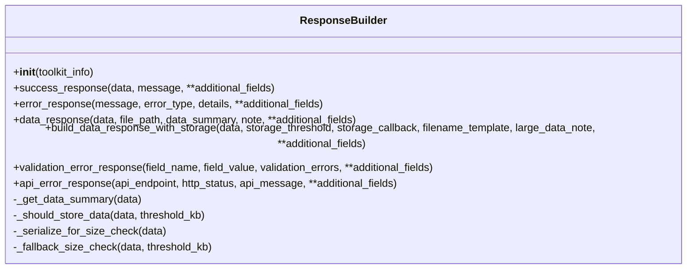
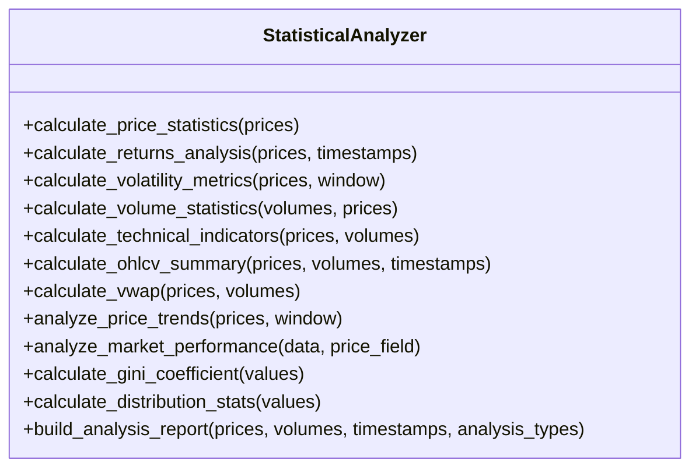

# 网络搜索工具

<cite>
**本文档引用的文件**   
- [web_search_tool.py](file://src\sentientresearchagent\hierarchical_agent_framework\tools\web_search_tool.py)
- [response_builder.py](file://src\sentientresearchagent\hierarchical_agent_framework\toolkits\utils\response_builder.py)
- [statistics.py](file://src\sentientresearchagent\hierarchical_agent_framework\toolkits\utils\statistics.py)
</cite>

## 目录
1. [简介](#简介)
2. [核心功能与实现机制](#核心功能与实现机制)
3. [输入参数设计](#输入参数设计)
4. [输出格式规范](#输出格式规范)
5. [结果清洗与摘要生成](#结果清洗与摘要生成)
6. [统计信息收集与查询优化](#统计信息收集与查询优化)
7. [实际调用示例](#实际调用示例)
8. [开发者定制指南](#开发者定制指南)

## 简介
网络搜索工具是智能研究代理系统中的关键组件，旨在通过外部搜索引擎API执行关键词查询，并将非结构化的网页内容整合为结构化上下文供代理使用。该工具通过集成Gemini和OpenAI等大型语言模型（LLM）的能力，直接生成简洁、事实性的答案，从而补充知识盲区。本技术文档详细说明了`web_search_tool.py`的实现机制及其在智能研究代理中的应用。

## 核心功能与实现机制
网络搜索工具的核心功能是根据用户提供的查询语句，利用外部API获取相关信息并返回处理后的结果。其主要实现机制如下：

- **多API支持**：首先尝试使用Google的Gemini API进行搜索，若未配置相关密钥，则回退到OpenAI的GPT-3.5 Turbo模型。
- **环境变量检查**：通过读取环境变量`GOOGLE_API_KEY`或`GEMINI_API_KEY`来确定是否可以使用Gemini服务；同样地，通过`OPENAI_API_KEY`判断OpenAI服务的可用性。
- **请求构建**：对于Gemini API，构造一个包含特定提示词的POST请求，要求模型以简洁直接的方式回答问题；对于OpenAI API，则设置系统角色为“搜索引擎”，确保响应风格一致。
- **错误处理**：在整个过程中捕获异常，并记录详细的错误日志，同时向用户提供清晰的错误信息。

此工具的设计使得它能够灵活适应不同的部署环境，无需依赖复杂的注册表机制即可兼容AgnoAgent的工具调用框架。

**Section sources**
- [web_search_tool.py](file://src\sentientresearchagent\hierarchical_agent_framework\tools\web_search_tool.py#L15-L96)

## 输入参数设计
网络搜索工具接受以下输入参数：

- `query` (字符串)：需要执行的搜索查询语句。这是唯一的必填参数，代表了用户希望查找的具体内容。

该工具目前仅支持基本的文本查询，未来可通过扩展支持更多高级选项如结果数量限制、时间范围筛选等。

**Section sources**
- [web_search_tool.py](file://src\sentientresearchagent\hierarchical_agent_framework\tools\web_search_tool.py#L15-L96)

## 输出格式规范
网络搜索工具的输出是一个字符串形式的结果，具体包括：

- 当成功从Gemini或OpenAI获得响应时，返回经过LLM处理后的最终答案。
- 如果没有找到合适的API密钥，返回一条明确的错误消息：“Error: No API keys found for web search. Please set GOOGLE_API_KEY or OPENAI_API_KEY.”
- 在发生其他错误的情况下，返回带有详细描述的失败信息，例如“Search failed: <error details>”。

这种统一的输出格式简化了上层应用对搜索结果的解析和展示逻辑。

**Section sources**
- [web_search_tool.py](file://src\sentientresearchagent\hierarchical_agent_framework\tools\web_search_tool.py#L15-L96)

## 结果清洗与摘要生成
虽然当前版本的`web_search_tool.py`直接依赖于LLM生成摘要，但结合`response_builder.py`中的`ResponseBuilder`类，可以进一步增强结果的标准化和结构化能力。`ResponseBuilder`提供了多种方法用于创建标准的成功/错误响应，以及数据操作响应，这些都可用于后续的数据清洗和存储流程中。

例如，当搜索结果较大时，可利用`build_data_response_with_storage`方法自动决定是否将数据保存至文件，并提供相应的元数据摘要。此外，`_get_data_summary`函数能生成关于数据大小、类型等关键属性的概要信息，有助于快速了解返回内容的特点。



**Diagram sources **
- [response_builder.py](file://src\sentientresearchagent\hierarchical_agent_framework\toolkits\utils\response_builder.py#L14-L381)

## 统计信息收集与查询优化
尽管`statistics.py`文件中的`StatisticalAnalyzer`主要用于金融时间序列数据分析，但其提供的通用分析报告生成功能（`build_analysis_report`）也可被借鉴用于评估搜索质量与优化查询策略。通过对历史搜索性能指标（如平均响应时间、成功率等）进行统计分析，可以帮助识别低效查询模式并提出改进建议。

此外，`calculate_distribution_stats`等方法可用于分析不同来源搜索结果的质量分布情况，进而指导如何调整权重分配或选择更优的数据源。



**Diagram sources **
- [statistics.py](file://src\sentientresearchagent\hierarchical_agent_framework\toolkits\utils\statistics.py#L27-L763)

## 实际调用示例
以下是如何在复杂研究任务中触发网络搜索的实际代码示例：

```python
# 示例：执行一次简单的网络搜索
result = web_search("最新的AI发展趋势")
print(result)

# 示例：处理可能的错误情况
try:
    result = web_search("不存在的主题")
    print(result)
except Exception as e:
    print(f"搜索过程中出现错误: {e}")
```

在这个例子中，我们首先尝试获取有关最新AI趋势的信息，然后演示了如何优雅地处理潜在的异常状况。

**Section sources**
- [web_search_tool.py](file://src\sentientresearchagent\hierarchical_agent_framework\tools\web_search_tool.py#L15-L96)

## 开发者定制指南
为了满足特定需求，开发者可以根据以下步骤自定义搜索逻辑或替换为其他搜索引擎API：

1. **修改现有实现**：可以直接编辑`web_search`函数，在其中添加新的API调用逻辑，比如接入Bing Search API或其他第三方服务。
2. **增加配置项**：引入额外的配置参数（如`num_results`, `time_range`），并通过环境变量或配置文件传递给函数。
3. **集成新工具**：如果需要完全不同的行为，可以在`tools`目录下创建一个新的Python模块，并遵循相同的接口规范注册成独立工具。
4. **测试与验证**：确保所有更改都经过充分测试，特别是边界条件下的表现，保证系统的稳定性和可靠性。

通过上述方式，不仅可以轻松扩展功能，还能保持整个架构的一致性和可维护性。

**Section sources**
- [web_search_tool.py](file://src\sentientresearchagent\hierarchical_agent_framework\tools\web_search_tool.py#L15-L96)
- [response_builder.py](file://src\sentientresearchagent\hierarchical_agent_framework\toolkits\utils\response_builder.py#L14-L381)
- [statistics.py](file://src\sentientresearchagent\hierarchical_agent_framework\toolkits\utils\statistics.py#L27-L763)