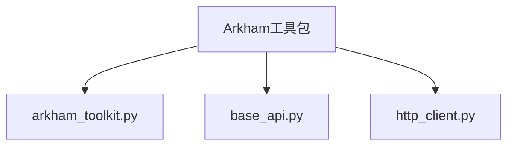
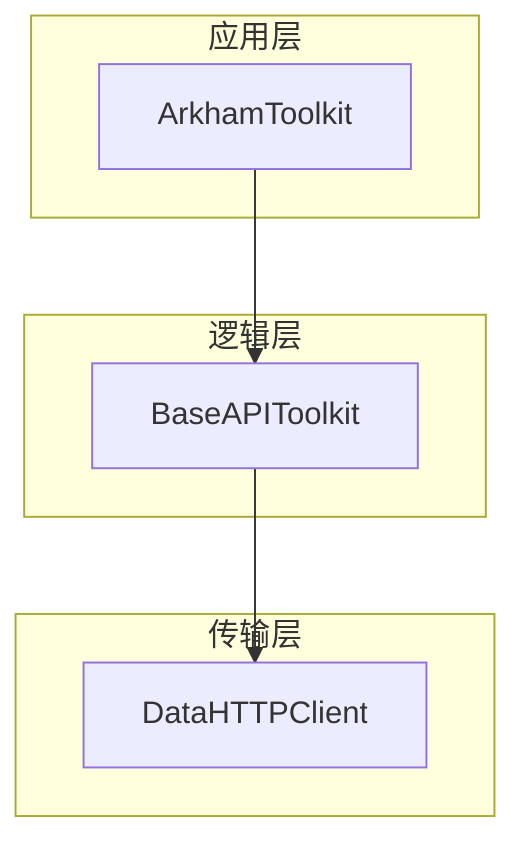
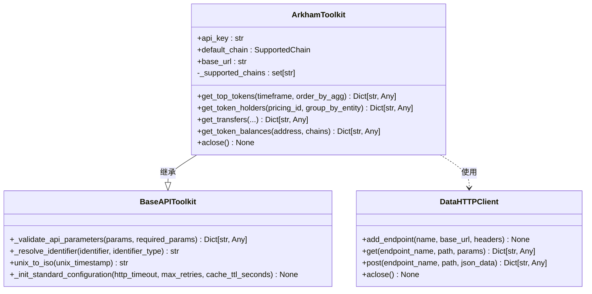
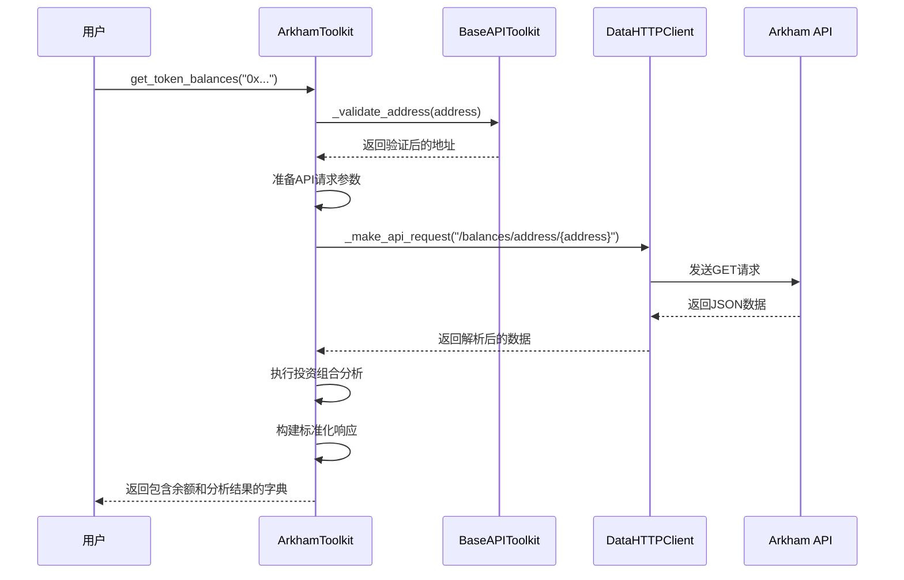
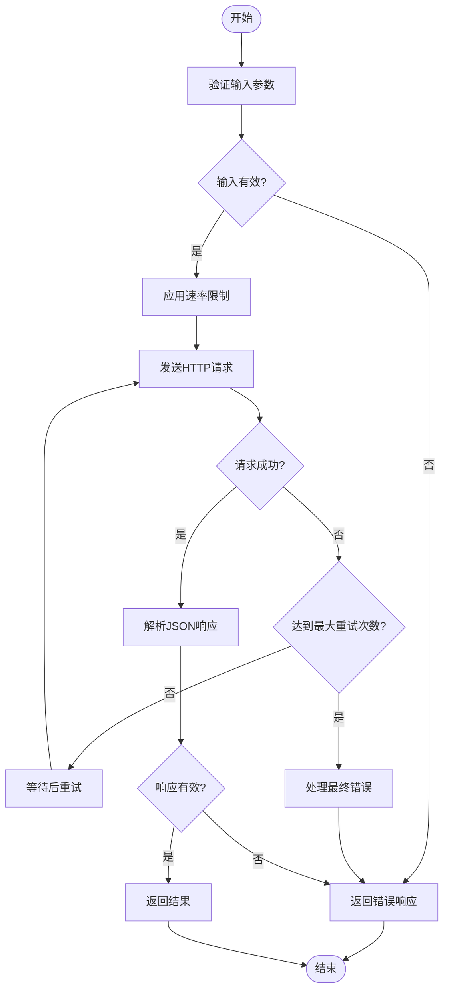
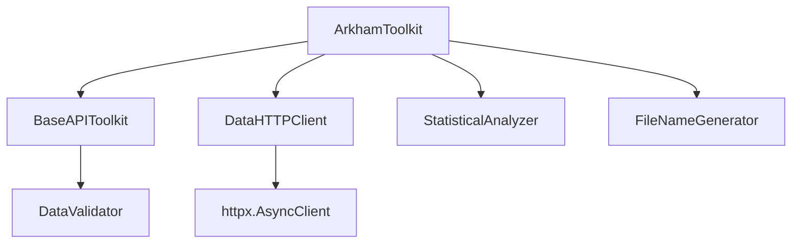

# Arkham工具包

<cite>
**本文档中引用的文件**
- [arkham_toolkit.py](file://src\sentientresearchagent\hierarchical_agent_framework\toolkits\data\arkham_toolkit.py)
- [base_api.py](file://src\sentientresearchagent\hierarchical_agent_framework\toolkits\base\base_api.py)
- [http_client.py](file://src\sentientresearchagent\hierarchical_agent_framework\toolkits\utils\http_client.py)
</cite>

## 目录
1. [简介](#简介)
2. [项目结构](#项目结构)
3. [核心组件](#核心组件)
4. [架构概述](#架构概述)
5. [详细组件分析](#详细组件分析)
6. [依赖关系分析](#依赖关系分析)
7. [性能考量](#性能考量)
8. [故障排除指南](#故障排除指南)
9. [结论](#结论)

## 简介
Arkham工具包是一个专为区块链情报分析设计的综合性工具集，旨在通过标准化接口实现对链上实体数据的高效访问。该工具包基于`base_api.BaseAPI`类构建，继承了其核心功能并扩展了针对区块链数据分析的特定能力。它支持多种关键功能，包括查询机构钱包持仓、追踪大额转账、识别关联地址群组以及获取实体标签信息等。通过使用`get_entity_holdings`和`get_wallet_transactions`等方法，开发者可以在智能研究任务中执行高级链上分析。此外，工具包内置了安全机制来处理身份认证（如API Key）和敏感数据请求，并通过结构化处理与验证流程确保高价值情报数据的可靠性。文档还提供了扩展新实体分析能力的最佳实践指导。

## 项目结构
Arkham工具包位于项目的`src\sentientresearchagent\hierarchical_agent_framework\toolkits\data\`目录下，是整个分层代理框架中的一个关键模块。其设计遵循清晰的分层架构，将业务逻辑、API交互和数据管理分离。主要文件包括`arkham_toolkit.py`，这是核心实现文件；`base_api.py`，提供基础API功能支持；以及`http_client.py`，负责底层HTTP通信。这种组织方式不仅提高了代码的可维护性，也便于未来的功能扩展。

**图示来源**
- [arkham_toolkit.py](file://src\sentientresearchagent\hierarchical_agent_framework\toolkits\data\arkham_toolkit.py)
- [base_api.py](file://src\sentientresearchagent\hierarchical_agent_framework\toolkits\base\base_api.py)
- [http_client.py](file://src\sentientresearchagent\hierarchical_agent_framework\toolkits\utils\http_client.py)

**章节来源**
- [arkham_toolkit.py](file://src\sentientresearchagent\hierarchical_agent_framework\toolkits\data\arkham_toolkit.py)

## 核心组件
Arkham工具包的核心在于`ArkhamToolkit`类，该类继承自`BaseAPIToolkit`，从而获得了标准化的API业务逻辑处理能力。此类封装了与Arkham Intelligence API的所有交互，提供了诸如`get_top_tokens`、`get_token_holders`、`get_transfers`和`get_token_balances`等方法。这些方法不仅简化了对复杂API端点的调用，还内置了参数验证、错误处理和响应格式化等功能。工具包利用`DataHTTPClient`进行异步HTTP通信，确保了高性能的数据检索。同时，通过`StatisticalAnalyzer`和`DataValidator`等辅助工具，实现了对返回数据的深度分析和质量保证。

**章节来源**
- [arkham_toolkit.py](file://src\sentientresearchagent\hierarchical_agent_framework\toolkits\data\arkham_toolkit.py#L150-L200)
- [base_api.py](file://src\sentientresearchagent\hierarchical_agent_framework\toolkits\base\base_api.py#L50-L100)

## 架构概述
Arkham工具包采用了一种分层且模块化的架构设计，确保了系统的灵活性和可扩展性。在最顶层是`ArkhamToolkit`类，它作为用户与外部API之间的主要接口。中间层由`BaseAPIToolkit`提供通用的API业务逻辑，如参数验证和标识符解析。最底层则是`DataHTTPClient`，负责所有网络层面的操作，包括请求发送、重试策略和速率限制控制。这三层协同工作，共同构成了一个健壮的数据访问解决方案。

**图示来源**
- [arkham_toolkit.py](file://src\sentientresearchagent\hierarchical_agent_framework\toolkits\data\arkham_toolkit.py)
- [base_api.py](file://src\sentientresearchagent\hierarchical_agent_framework\toolkits\base\base_api.py)
- [http_client.py](file://src\sentientresearchagent\hierarchical_agent_framework\toolkits\utils\http_client.py)

## 详细组件分析

### ArkhamToolkit 类分析
`ArkhamToolkit`类是整个工具包的心脏，它通过继承`BaseAPIToolkit`实现了对链上实体情报数据的标准化访问。该类的初始化过程会设置API密钥、默认链、支持的链列表以及数据存储目录等关键配置。它定义了一系列工具方法，每个方法都对应一个特定的分析功能。

#### 类图

**图示来源**
- [arkham_toolkit.py](file://src\sentientresearchagent\hierarchical_agent_framework\toolkits\data\arkham_toolkit.py#L150-L200)
- [base_api.py](file://src\sentientresearchagent\hierarchical_agent_framework\toolkits\base\base_api.py#L50-L100)
- [http_client.py](file://src\sentientresearchagent\hierarchical_agent_framework\toolkits\utils\http_client.py#L50-L100)

#### 功能调用序列图
当调用`get_token_balances`方法时，其内部执行流程如下：

**图示来源**
- [arkham_toolkit.py](file://src\sentientresearchagent\hierarchical_agent_framework\toolkits\data\arkham_toolkit.py#L1427-L1580)
- [base_api.py](file://src\sentientresearchagent\hierarchical_agent_framework\toolkits\base\base_api.py#L200-L250)
- [http_client.py](file://src\sentientresearchagent\hierarchical_agent_framework\toolkits\utils\http_client.py#L200-L250)

**章节来源**
- [arkham_toolkit.py](file://src\sentientresearchagent\hierarchical_agent_framework\toolkits\data\arkham_toolkit.py#L1427-L1580)

### HTTP客户端安全机制分析
`DataHTTPClient`类是处理所有HTTP通信的核心组件，它在安全性方面扮演着至关重要的角色。该类通过在请求头中包含API密钥来实现身份认证，确保只有授权用户才能访问敏感数据。它还实现了自动重试和指数退避算法，以应对临时性的网络故障或服务器过载，从而提高了请求的成功率。

#### 安全请求流程图

**图示来源**
- [http_client.py](file://src\sentientresearchagent\hierarchical_agent_framework\toolkits\utils\http_client.py#L200-L400)

**章节来源**
- [http_client.py](file://src\sentientresearchagent\hierarchical_agent_framework\toolkits\utils\http_client.py#L200-L400)

## 依赖关系分析
Arkham工具包的各个组件之间存在着明确的依赖关系。`ArkhamToolkit`直接依赖于`BaseAPIToolkit`和`DataHTTPClient`。`BaseAPIToolkit`提供了高层次的API业务逻辑抽象，而`DataHTTPClient`则专注于底层的网络传输细节。这种设计模式有效地解耦了不同层次的关注点，使得代码更加模块化和易于测试。此外，工具包还依赖于外部库如`httpx`进行实际的HTTP通信，以及`loguru`用于日志记录。

**图示来源**
- [arkham_toolkit.py](file://src\sentientresearchagent\hierarchical_agent_framework\toolkits\data\arkham_toolkit.py)
- [base_api.py](file://src\sentientresearchagent\hierarchical_agent_framework\toolkits\base\base_api.py)
- [http_client.py](file://src\sentientresearchagent\hierarchical_agent_framework\toolkits\utils\http_client.py)

**章节来源**
- [arkham_toolkit.py](file://src\sentientresearchagent\hierarchical_agent_framework\toolkits\data\arkham_toolkit.py)
- [base_api.py](file://src\sentientresearchagent\hierarchical_agent_framework\toolkits\base\base_api.py)
- [http_client.py](file://src\sentientresearchagent\hierarchical_agent_framework\toolkits\utils\http_client.py)

## 性能考量
Arkham工具包在设计时充分考虑了性能因素。首先，它完全基于异步编程模型，允许并发执行多个API请求，极大地提升了数据检索效率。其次，`DataHTTPClient`内置了连接池和持久连接，减少了建立新连接的开销。对于大规模数据集，工具包采用了智能的存储策略：当响应数据超过预设阈值时，会自动将其保存为Parquet文件，并在响应中返回文件路径，从而避免内存溢出。此外，合理的缓存机制（TTL可配置）可以减少对API的重复调用，进一步优化性能。

## 故障排除指南
在使用Arkham工具包时，可能会遇到各种问题。最常见的错误是API密钥缺失或无效，这会导致所有请求失败。应确保`ARKHAM_API_KEY`环境变量已正确设置。另一个常见问题是参数验证失败，例如传递了不支持的区块链名称或格式错误的钱包地址。此时应检查相关方法的文档以确认正确的参数格式。对于网络相关的错误，如超时或连接拒绝，可以尝试增加`http_timeout`配置或检查网络连接。如果遇到速率限制错误，说明请求过于频繁，应调整调用频率或利用内置的缓存机制。

**章节来源**
- [arkham_toolkit.py](file://src\sentientresearchagent\hierarchical_agent_framework\toolkits\data\arkham_toolkit.py#L200-L250)
- [base_api.py](file://src\sentientresearchagent\hierarchical_agent_framework\toolkits\base\base_api.py#L300-L350)
- [http_client.py](file://src\sentientresearchagent\hierarchical_agent_framework\toolkits\utils\http_client.py#L300-L350)

## 结论
Arkham工具包是一个功能强大且设计精良的区块链数据分析工具。它通过继承`base_api.BaseAPI`实现了对链上实体情报数据的标准化访问，为开发者提供了一套简洁而高效的API。其模块化的架构、强大的安全机制和智能的数据管理策略，使其成为进行高级链上分析的理想选择。未来，可以通过添加更多分析工具、支持更多区块链网络或集成更先进的机器学习模型来进一步扩展其功能。