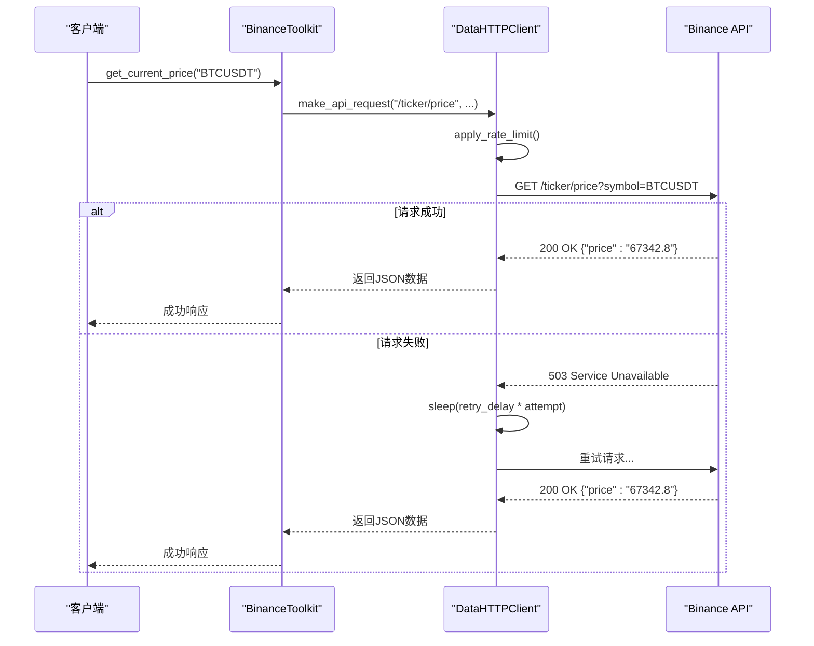

# Binance工具包

<cite>
**本文档引用的文件**
- [binance_toolkit.py](file://src\sentientresearchagent\hierarchical_agent_framework\toolkits\data\binance_toolkit.py)
- [base_api.py](file://src\sentientresearchagent\hierarchical_agent_framework\toolkits\base\base_api.py)
- [http_client.py](file://src\sentientresearchagent\hierarchical_agent_framework\toolkits\utils\http_client.py)
- [response_builder.py](file://src\sentientresearchagent\hierarchical_agent_framework\toolkits\utils\response_builder.py)
- [data_validator.py](file://src\sentientresearchagent\hierarchical_agent_framework\toolkits\utils\data_validator.py)
- [statistics.py](file://src\sentientresearchagent\hierarchical_agent_framework\toolkits\utils\statistics.py)
</cite>

## 目录
1. [简介](#简介)
2. [架构与设计](#架构与设计)
3. [核心功能详解](#核心功能详解)
4. [代理任务中的调用示例](#代理任务中的调用示例)
5. [HTTP客户端与错误恢复](#http客户端与错误恢复)
6. [响应解析与数据验证](#响应解析与数据验证)
7. [扩展新的Binance端点](#扩展新的binance端点)
8. [结论](#结论)

## 简介

Binance工具包是一个专为加密货币市场数据分析而设计的综合性工具，它继承自`base_api.BaseAPI`并实现了标准化接口。该工具包支持多市场操作，包括现货交易、USDⓈ-M期货以及COIN-M期货市场，并且能够通过动态切换市场类型来获取实时价格、历史K线数据及交易对信息等关键数据。此外，对于大型响应（超过阈值）会自动存储为Parquet文件以优化内存使用和下游处理效率。

本工具包还提供了符号验证和过滤功能，确保了所请求的数据符合预期结构。开发者可以通过配置API密钥和秘密进行身份验证，同时利用环境变量或参数传递方式灵活地管理这些凭据。所有工具方法都返回一致的JSON结构，便于集成到各种应用中。

**文档来源**
- [binance_toolkit.py](file://src\sentientresearchagent\hierarchical_agent_framework\toolkits\data\binance_toolkit.py#L1-L100)

## 架构与设计

Binance工具包的设计基于面向对象的原则，采用了分层架构来分离关注点。其主要组成部分包括：

- **基础API类 (BaseAPIToolkit)**: 提供了通用的API业务逻辑，如参数验证、标识符解析和响应格式化。
- **数据HTTP客户端 (DataHTTPClient)**: 负责处理HTTP传输细节，包括多个端点的支持、自定义头部设置、超时控制及重试机制。
- **响应构建器 (ResponseBuilder)**: 用于创建标准化的成功/失败响应，确保跨不同工具的一致性。
- **统计分析器 (StatisticalAnalyzer)**: 实现了一系列金融时间序列数据分析函数，可用于计算技术指标、波动率度量等。

这种模块化设计使得每个组件都可以独立开发和测试，同时也方便了未来的维护和扩展。

```mermaid
classDiagram
class BaseAPIToolkit {
+_resolve_identifier(identifier, identifier_type, resolver_func, fallback_value) str
+_validate_api_parameters(params, required_params, optional_params, param_validators) Dict[str, Any]
+_init_cache_system(cache_ttl_seconds) None
+_is_cache_valid(cache_key) bool
+_cache_data(cache_key, data, metadata) None
+_get_cached_data(cache_key) Optional[Any]
+_validate_configuration_enum(value, enum_class, config_name) None
+_validate_configuration_mapping(value, config_mapping, config_name) None
+_setup_multi_endpoint_authentication(endpoint_configs, auth_header_builder) None
+_execute_pending_endpoint_setup() None
+_find_fuzzy_match(target, candidates, threshold) Optional[str]
+_build_identifier_validation_response(identifier, is_valid, config_context, identifier_type, suggestions, **additional_data) Dict[str, Any]
+_init_standard_configuration(http_timeout, max_retries, retry_delay, cache_ttl_seconds) None
+_validate_identifier_and_prepare_params(identifier, identifier_type, validation_func, additional_params, identifier_transform_func) Dict[str, Any]
}
class DataHTTPClient {
-_default_timeout float
-_default_headers Dict[str, str]
-_max_retries int
-_retry_delay float
-_default_rate_limit Optional[float]
-_endpoints Dict[str, Dict[str, Any]]
-_clients Dict[str, httpx.AsyncClient]
-_last_request_times Dict[str, float]
+__init__(default_timeout, default_headers, max_retries, retry_delay, default_rate_limit) None
+add_endpoint(name, base_url, headers, timeout, rate_limit, **client_kwargs) None
+_get_client(endpoint_name) httpx.AsyncClient
+_apply_rate_limit(endpoint_name) None
+get(endpoint_name, path, params, headers, timeout, retries) Dict[str, Any]
+post(endpoint_name, path, json_data, data, params, headers, timeout, retries) Dict[str, Any]
+_make_request(endpoint_name, method, path, json_data, data, params, headers, timeout, retries) Dict[str, Any]
+get_endpoints() Dict[str, str]
+update_endpoint_headers(endpoint_name, headers) None
+remove_endpoint(endpoint_name) None
+aclose() None
+unix_to_iso8601(timestamp_ms) str
+__aenter__() DataHTTPClient
+__aexit__(exc_type, exc_val, exc_tb) None
}
class ResponseBuilder {
-toolkit_info Dict[str, Any]
+__init__(toolkit_info) None
+success_response(data, message, **additional_fields) Dict[str, Any]
+error_response(message, error_type, details, **additional_fields) Dict[str, Any]
+data_response(data, file_path, data_summary, note, **additional_fields) Dict[str, Any]
+build_data_response_with_storage(data, storage_threshold, storage_callback, filename_template, large_data_note, **additional_fields) Dict[str, Any]
+validation_error_response(field_name, field_value, validation_errors, **additional_fields) Dict[str, Any]
+api_error_response(api_endpoint, http_status, api_message, **additional_fields) Dict[str, Any]
+_get_data_summary(data) Dict[str, Any]
+_should_store_data(data, threshold_kb) bool
+_serialize_for_size_check(data) str
+_fallback_size_check(data, threshold_kb) bool
}
class StatisticalAnalyzer {
+calculate_price_statistics(prices) Dict[str, Any]
+calculate_returns_analysis(prices, timestamps) Dict[str, Any]
+calculate_volatility_metrics(prices, window) Dict[str, Any]
+calculate_volume_statistics(volumes, prices) Dict[str, Any]
+calculate_technical_indicators(prices, volumes) Dict[str, Any]
+calculate_ohlcv_summary(prices, volumes, timestamps) Dict[str, Any]
+calculate_vwap(prices, volumes) float
+analyze_price_trends(prices, window) Dict[str, Any]
+_calculate_skewness(data) float
+_calculate_kurtosis(data) float
+_calculate_downside_deviation(returns, target) float
+_calculate_sortino_ratio(returns, target) float
+_classify_volatility_regime(daily_vol_pct) str
+_estimate_garch_volatility(returns, alpha, beta) float
+_calculate_rsi(prices, period) float
+_classify_rsi_signal(rsi) str
+_calculate_bollinger_bands(prices, period, std_dev) Tuple[float, float, float]
+_calculate_bollinger_position(price, upper, lower) float
+_analyze_volume_distribution(volumes) Dict[str, float]
+_calculate_volume_profile(prices, volumes, bins) Dict[str, Any]
+analyze_market_performance(data, price_field) Dict[str, Any]
+_get_change_value(item) float
+_classify_market_cap_distribution(market_caps) Dict[str, int]
+classify_trend_from_change(change_pct) str
+classify_volatility_from_change(change_pct) str
+calculate_gini_coefficient(values) float
+calculate_distribution_stats(values) Dict[str, float]
+build_analysis_report(prices, volumes, timestamps, analysis_types) Dict[str, Any]
}
class BinanceToolkit {
-_toolkit_category str
-_toolkit_type str
-_toolkit_icon str
-default_market_type MarketType
-_api_key str | None
-_api_secret str | None
-_user_symbols Set[str] | None
-stats StatisticalAnalyzer
+__init__(symbols, default_market_type, api_key, api_secret, data_dir, parquet_threshold, name, **kwargs) None
+_build_binance_auth_headers(endpoint_name, config) Dict[str, str]
+_setup_endpoints() None
+_make_api_request(endpoint, market_type, params, signed) Dict[str, Any]
+_validate_symbol_and_prepare_params(symbol, market_type, additional_params) Dict[str, Any]
+_ensure_symbols_loaded(market_type) None
+_resolve_symbol(symbol, market_type) Optional[str]
+reload_symbols(market_type) Dict[str, Any]
+validate_symbol(symbol, market_type) Dict[str, Any]
+get_current_price(symbol, market_type) Dict[str, Any]
+get_symbol_ticker_change(symbol, window_size, market_type) Dict[str, Any]
+get_order_book(symbol, limit, market_type) Dict[str, Any]
+get_recent_trades(symbol, limit, market_type) Dict[str, Any]
+get_klines(symbol, interval, limit, market_type) Dict[str, Any]
+get_book_ticker(symbols, market_type) Dict[str, Any]
+aclose() None
}
BaseAPIToolkit <|-- BinanceToolkit : 继承
DataHTTPClient <|-- BinanceToolkit : 使用
ResponseBuilder <|-- BinanceToolkit : 使用
StatisticalAnalyzer <|-- BinanceToolkit : 使用
```



**图表来源**
- [base_api.py](file://src\sentientresearchagent\hierarchical_agent_framework\toolkits\base\base_api.py#L1-L638)
- [http_client.py](file://src\sentientresearchagent\hierarchical_agent_framework\toolkits\utils\http_client.py#L1-L441)
- [response_builder.py](file://src\sentientresearchagent\hierarchical_agent_framework\toolkits\utils\response_builder.py#L1-L384)
- [statistics.py](file://src\sentientresearchagent\hierarchical_agent_framework\toolkits\utils\statistics.py#L1-L764)
- [binance_toolkit.py](file://src\sentientresearchagent\hierarchical_agent_framework\toolkits\data\binance_toolkit.py#L1-L2192)

**文档来源**
- [binance_toolkit.py](file://src\sentientresearchagent\hierarchical_agent_framework\toolkits\data\binance_toolkit.py#L1-L2192)

## 核心功能详解

### 实时价格查询

`get_current_price` 方法允许用户获取指定交易对在特定市场的最新成交价。此方法接受一个 `symbol` 参数表示交易对名称（例如 "BTCUSDT"），以及一个可选的 `market_type` 参数来选择市场类型（默认为 "spot"）。如果未提供API密钥，则只能访问公开数据；若需访问私有数据，则必须通过环境变量或构造函数参数传入有效的API密钥和秘密。

```python
# 获取比特币现货价格
btc_spot = await toolkit.get_current_price("BTCUSDT", "spot")
if btc_spot["success"]:
    print(f"BTC Spot: ${btc_spot['price']:,.2f}")
```

### 历史K线数据获取

`get_klines` 方法支持多种时间间隔的历史K线数据检索，包括秒级、分钟级、小时级、日级、周级和月级。用户可以指定 `interval` 参数来选择所需的时间粒度（如 "1m", "5m", "1h" 等），并通过 `limit` 参数限制返回的数据条数。当数据量较大时，系统将自动将其保存为Parquet文件并返回文件路径。

```python
# 技术分析用的每小时K线数据
klines = await toolkit.get_klines("BTCUSDT", interval="1h", limit=100, market_type="spot")
if klines["success"]:
    if "data" in klines:
        # 计算简单移动平均线
        closes = [float(c["close"]) for c in klines["data"]]
        sma_20 = sum(closes[-20:]) / 20
        current_price = closes[-1]
        if current_price > sma_20:
            print("📈 价格高于SMA20 - 看涨信号")
        else:
            print("📉 价格低于SMA20 - 看跌信号")
```

### 交易对信息检索

除了基本的价格和K线数据外，Binance工具包还提供了丰富的交易对相关信息查询功能。例如，`get_order_book` 可以获取订单簿深度信息，帮助分析市场流动性状况；`get_recent_trades` 则能获取最近的成交记录，用于研究市场活动模式。

```python
# 分析市场深度
order_book = await toolkit.get_order_book("BTCUSDT", limit=100, market_type="spot")
if order_book["success"]:
    if "data" in order_book:
        book_data = order_book["data"]
        bids = [item for item in book_data if item['side'] == 'bid']
        asks = [item for item in book_data if item['side'] == 'ask']
        
        best_bid = max(bids, key=lambda x: x['price'])['price'] if bids else 0
        best_ask = min(asks, key=lambda x: x['price'])['price'] if asks else 0
        spread = best_ask - best_bid
        
        print(f"最佳买价: ${best_bid:,.2f}")
        print(f"最佳卖价: ${best_ask:,.2f}")
        print(f"价差: ${spread:.2f} ({spread/best_bid*100:.3f}%)")
```

**文档来源**
- [binance_toolkit.py](file://src\sentientresearchagent\hierarchical_agent_framework\toolkits\data\binance_toolkit.py#L175-L2192)

## 代理任务中的调用示例

在实际应用场景中，Binance工具包通常被集成到自动化代理任务中执行周期性的市场监控或策略回测。以下是一个简单的例子展示了如何在一个异步循环中定期调用 `get_price` 和 `get_klines` 方法：

```python
import asyncio
from datetime import datetime

async def monitor_market(toolkit):
    while True:
        try:
            # 每隔5分钟检查一次BTC价格
            btc_price = await toolkit.get_current_price("BTCUSDT", "spot")
            if btc_price["success"]:
                print(f"[{datetime.now()}] BTC Price: ${btc_price['price']:,.2f}")
            
            # 每小时获取一次K线数据进行趋势分析
            if datetime.now().minute == 0:
                klines = await toolkit.get_klines("BTCUSDT", interval="1h", limit=24, market_type="spot")
                if klines["success"] and "data" in klines:
                    closes = [float(c["close"]) for c in klines["data"]]
                    trend = "上涨" if closes[-1] > closes[0] else "下跌"
                    print(f"过去24小时趋势: {trend}")
                    
        except Exception as e:
            print(f"Error occurred: {e}")
        
        await asyncio.sleep(300)  # 等待5分钟

# 启动监控任务
toolkit = BinanceToolkit()
await monitor_market(toolkit)
```

**文档来源**
- [binance_toolkit.py](file://src\sentientresearchagent\hierarchical_agent_framework\toolkits\data\binance_toolkit.py#L175-L2192)

## HTTP客户端与错误恢复

`DataHTTPClient` 类是整个工具包的核心组件之一，负责处理所有HTTP通信相关的事务。它不仅支持多端点配置，还能自动应用速率限制规则以避免触发API限制。此外，该类内置了强大的错误恢复机制，能够在遇到网络故障或其他异常情况时自动重试请求，并采用指数退避算法减少服务器压力。



**图表来源**
- [http_client.py](file://src\sentientresearchagent\hierarchical_agent_framework\toolkits\utils\http_client.py#L1-L441)
- [binance_toolkit.py](file://src\sentientresearchagent\hierarchical_agent_framework\toolkits\data\binance_toolkit.py#L175-L2192)

**文档来源**
- [http_client.py](file://src\sentientresearchagent\hierarchical_agent_framework\toolkits\utils\http_client.py#L1-L441)

## 响应解析与数据验证

为了保证返回结果符合预期结构，Binance工具包实施了一套严格的响应解析和数据验证流程。首先，`ResponseBuilder` 类确保所有响应都遵循统一的格式标准，无论成功还是失败都会包含必要的元信息如时间戳、消息描述等。其次，`DataValidator` 工具类会对收到的数据进行多层次校验，包括但不限于字段完整性、数值有效性及时间戳合理性等方面。

例如，在调用 `get_klines` 方法后，系统会先检查返回的JSON是否包含必需的字段（如 open, high, low, close, volume 等），然后进一步验证每个字段的内容是否符合预定义的数据类型要求。一旦发现任何不符合规范的情况，立即抛出相应的错误提示给调用者。

```python
# 验证K线数据结构
validation = DataValidator.validate_structure(
    raw_data,
    required_fields=["open_time", "open", "high", "low", "close", "volume"],
    expected_type=list
)
if not validation["valid"]:
    logger.warning(f"Unexpected kline data structure: {validation['errors']}")
```

**文档来源**
- [response_builder.py](file://src\sentientresearchagent\hierarchical_agent_framework\toolkits\utils\response_builder.py#L1-L384)
- [data_validator.py](file://src\sentientresearchagent\hierarchical_agent_framework\toolkits\utils\data_validator.py#L1-L259)

## 扩展新的Binance端点

要向现有框架中添加新的Binance数据端点，开发者需要遵循一套明确的最佳实践指南。这主要包括以下几个步骤：

1. **认证配置**: 确保新端点所需的任何身份验证信息都能通过环境变量或构造函数参数正确传递。
2. **参数映射**: 定义清晰的输入参数映射关系，以便于外部调用者理解和使用。
3. **异常处理**: 实现健壮的异常捕获逻辑，针对可能出现的各种错误情形给出恰当的反馈信息。
4. **文档编写**: 为新增功能撰写详尽的技术文档，说明其用途、用法示例及相关注意事项。

具体来说，假设我们要增加一个名为 `get_account_info` 的新方法来获取账户详细信息，那么应该这样做：

```python
async def get_account_info(self, market_type: Optional[MarketType] = None) -> Dict[str, Any]:
    """获取账户详细信息。
    
    Args:
        market_type: 市场类型，默认使用工具包的默认市场类型
        
    Returns:
        dict: 包含账户详情的字典
    """
    market_type = market_type or self.default_market_type
    
    try:
        # 使用标准化API请求方法
        account_data = await self._make_api_request(
            _API_ENDPOINTS["account_info"], 
            market_type, 
            signed=True  # 此端点需要签名
        )
        
        return self.response_builder.success_response(
            data=account_data,
            market_type=market_type,
            endpoint=_API_ENDPOINTS["account_info"]
        )
    except Exception as e:
        logger.error(f"Failed to get account info for {market_type}: {e}")
        return self.response_builder.api_error_response(
            api_endpoint=_API_ENDPOINTS["account_info"],
            api_message=f"Failed to get account info: {str(e)}",
            market_type=market_type
        )
```

**文档来源**
- [binance_toolkit.py](file://src\sentientresearchagent\hierarchical_agent_framework\toolkits\data\binance_toolkit.py#L175-L2192)

## 结论

综上所述，Binance工具包凭借其模块化设计、丰富的功能集以及强大的错误恢复能力，成为了一个高效可靠的加密货币市场数据分析解决方案。通过对 `base_api.BaseAPI` 的继承和标准化接口的实现，它不仅简化了开发者的工作负担，还提高了代码的可维护性和可扩展性。未来，随着更多高级特性的加入，相信这一工具包将在量化交易领域发挥越来越重要的作用。