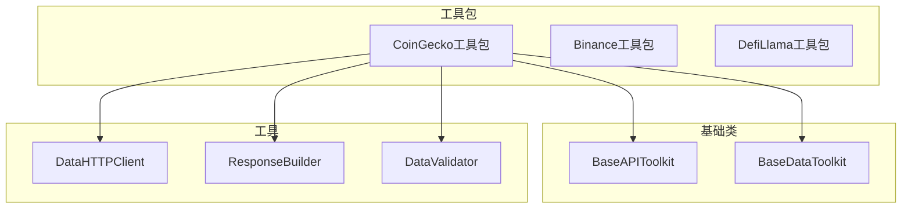
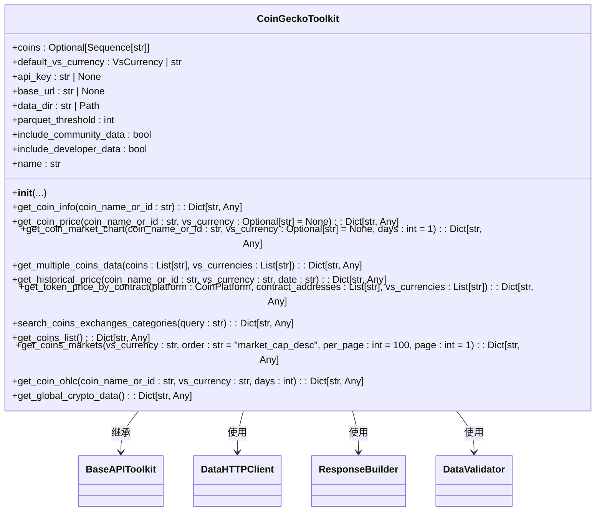
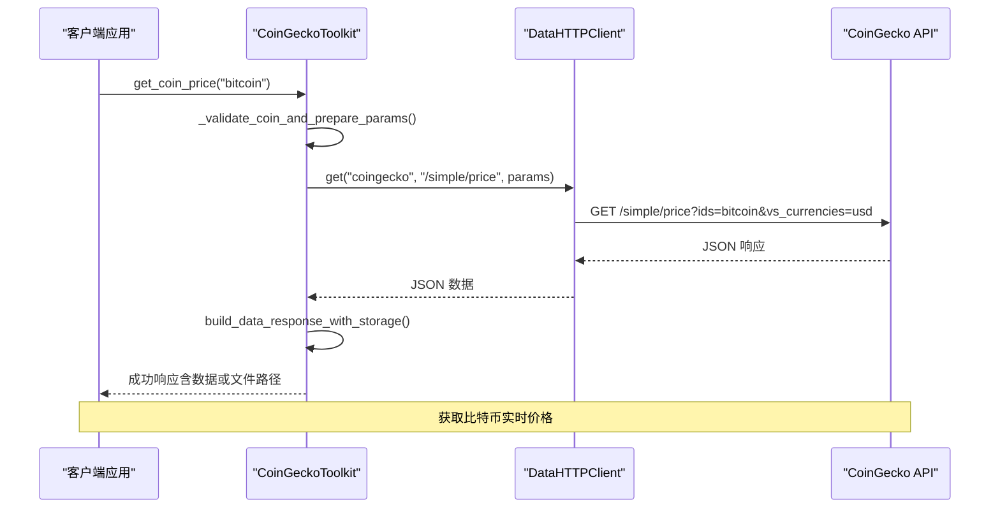
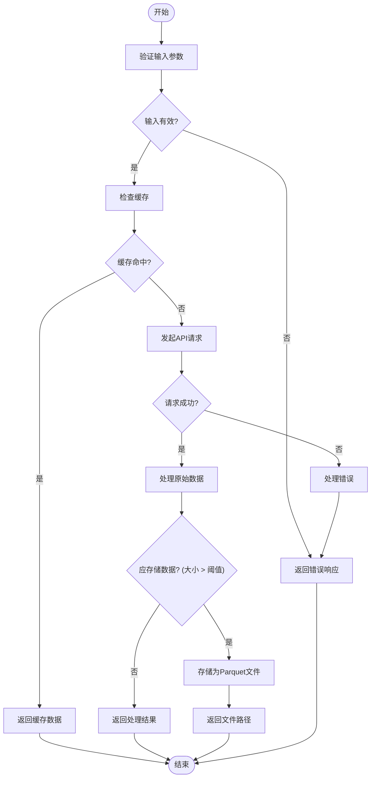
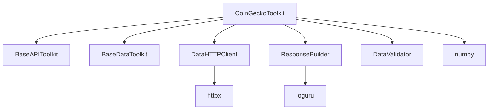

# CoinGecko工具包

<cite>
**本文档中引用的文件**
- [coingecko_toolkit.py](file://src\sentientresearchagent\hierarchical_agent_framework\toolkits\data\coingecko_toolkit.py)
- [base_api.py](file://src\sentientresearchagent\hierarchical_agent_framework\toolkits\base\base_api.py)
- [http_client.py](file://src\sentientresearchagent\hierarchical_agent_framework\toolkits\utils\http_client.py)
- [response_builder.py](file://src\sentientresearchagent\hierarchical_agent_framework\toolkits\utils\response_builder.py)
- [data_validator.py](file://src\sentientresearchagent\hierarchical_agent_framework\toolkits\utils\data_validator.py)
</cite>

## 目录
1. [简介](#简介)
2. [项目结构](#项目结构)
3. [核心组件](#核心组件)
4. [架构概述](#架构概述)
5. [详细组件分析](#详细组件分析)
6. [依赖分析](#依赖分析)
7. [性能考虑](#性能考虑)
8. [故障排除指南](#故障排除指南)
9. [结论](#结论)

## 简介
CoinGecko工具包是一个全面的加密货币市场数据工具包，旨在为研究代理任务提供对CoinGecko公共REST API的访问。该工具包基于`base_api.BaseAPI`构建，实现了标准化接口，支持获取广泛的加密资产数据，包括代币实时价格、历史市场数据、链上指标、代币持仓分布和项目基本信息等。通过智能的数据管理和LLM优化的响应格式，该工具包能够高效处理大规模数据查询，并自动将大型响应存储为Parquet文件以优化内存使用。

## 项目结构
CoinGecko工具包位于项目的`src\sentientresearchagent\hierarchical_agent_framework\toolkits\data`目录下，是整个分层代理框架的一部分。该工具包与其他数据工具包（如Binance、DefiLlama）并列，共享通用的基础类和工具模块。其设计遵循单一职责原则，专注于API业务逻辑，与HTTP传输（DataHTTPClient）和数据存储（BaseDataToolkit）分离。

**图表来源**
- [coingecko_toolkit.py](file://src\sentientresearchagent\hierarchical_agent_framework\toolkits\data\coingecko_toolkit.py)
- [base_api.py](file://src\sentientresearchagent\hierarchical_agent_framework\toolkits\base\base_api.py)
- [http_client.py](file://src\sentientresearchagent\hierarchical_agent_framework\toolkits\utils\http_client.py)

**章节来源**
- [coingecko_toolkit.py](file://src\sentientresearchagent\hierarchical_agent_framework\toolkits\data\coingecko_toolkit.py)

## 核心组件
CoinGecko工具包的核心组件包括`CoinGeckoToolkit`类，它继承自`Toolkit`、`BaseDataToolkit`和`BaseAPIToolkit`。该类提供了访问CoinGecko API的各种方法，如`get_coin_price`、`get_coin_market_chart`、`get_coins_markets`等。这些方法利用`DataHTTPClient`进行HTTP请求，并通过`ResponseBuilder`生成标准化的响应格式。此外，工具包还集成了`StatisticalAnalyzer`用于丰富的OHLCV分析，并支持NumPy集成。

**章节来源**
- [coingecko_toolkit.py](file://src\sentientresearchagent\hierarchical_agent_framework\toolkits\data\coingecko_toolkit.py#L199-L3970)

## 架构概述
CoinGecko工具包的架构设计遵循了模块化和可重用的原则。它通过继承`BaseAPIToolkit`来获得API参数验证、标识符解析和响应格式化的通用模式。同时，通过`DataHTTPClient`实现HTTP传输功能，支持多个端点、自定义头部和速率限制。响应数据的解析与验证由`DataValidator`负责，确保数据完整性。对于大型数据集，工具包会自动将其存储为Parquet文件，并返回文件路径而非原始数据，从而优化内存使用。

```mermaid
classDiagram
class CoinGeckoToolkit {
+coins : Optional[Sequence[str]]
+default_vs_currency : VsCurrency | str
+api_key : str | None
+base_url : str | None
+data_dir : str | Path
+parquet_threshold : int
+include_community_data : bool
+include_developer_data : bool
+name : str
+__init__(...)
+get_coin_info(coin_name_or_id : str) : Dict[str, Any]
+get_coin_price(coin_name_or_id : str, vs_currency : Optional[str] = None) : Dict[str, Any]
+get_coin_market_chart(coin_name_or_id : str, vs_currency : Optional[str] = None, days : int = 1) : Dict[str, Any]
+get_multiple_coins_data(coins : List[str], vs_currencies : List[str]) : Dict[str, Any]
+get_historical_price(coin_name_or_id : str, vs_currency : str, date : str) : Dict[str, Any]
+get_token_price_by_contract(platform : CoinPlatform, contract_addresses : List[str], vs_currencies : List[str]) : Dict[str, Any]
+search_coins_exchanges_categories(query : str) : Dict[str, Any]
+get_coins_list() : Dict[str, Any]
+get_coins_markets(vs_currency : str, order : str = "market_cap_desc", per_page : int = 100, page : int = 1) : Dict[str, Any]
+get_coin_ohlc(coin_name_or_id : str, vs_currency : str, days : int) : Dict[str, Any]
+get_global_crypto_data() : Dict[str, Any]
}
class BaseAPIToolkit {
+_resolve_identifier(identifier : str, identifier_type : str = "symbol", resolver_func : Optional[Callable[[str], str]] = None, fallback_value : Optional[str] = None) : str
+_validate_api_parameters(params : Dict[str, Any], required_params : List[str], optional_params : Optional[List[str]] = None, param_validators : Optional[Dict[str, Callable]] = None) : Dict[str, Any]
+iso_to_unix(iso_date : str) : int
+unix_to_iso(unix_timestamp : Union[int, float]) : str
+_init_cache_system(cache_ttl_seconds : int = 3600) : None
+_is_cache_valid(cache_key : str) : bool
+_cache_data(cache_key : str, data : Any, metadata : Optional[Dict[str, Any]] = None) : None
+_get_cached_data(cache_key : str) : Optional[Any]
+_cache_identifiers(cache_key : str, identifiers : Union[Set[str], List[str]], metadata : Optional[Dict[str, Any]] = None) : None
+_get_cached_identifiers(cache_key : str) : Optional[Set[str]]
+_validate_configuration_enum(value : str, enum_class : type, config_name : str = "configuration") : None
+_validate_configuration_mapping(value : str, config_mapping : Dict[str, Any], config_name : str = "configuration") : None
+_setup_multi_endpoint_authentication(endpoint_configs : Dict[str, Dict[str, Any]], auth_header_builder : Callable[[str, Dict[str, Any]], Dict[str, str]]) : None
+_execute_pending_endpoint_setup() : None
+_find_fuzzy_match(target : str, candidates : Union[Set[str], List[str]], threshold : float = 0.6) : Optional[str]
+_build_identifier_validation_response(identifier : str, is_valid : bool, config_context : str, identifier_type : str = "identifier", suggestions : Optional[List[str]] = None, **additional_data : Any) : Dict[str, Any]
+_init_standard_configuration(http_timeout : float = 30.0, max_retries : int = 3, retry_delay : float = 1.0, cache_ttl_seconds : int = 3600) : None
+_validate_identifier_and_prepare_params(identifier : str, identifier_type : str, validation_func : Callable, additional_params : Optional[Dict[str, Any]] = None, identifier_transform_func : Optional[Callable[[str], str]] = None) : Dict[str, Any]
}
class DataHTTPClient {
+_default_timeout : float
+_default_headers : Optional[Dict[str, str]]
+_max_retries : int
+_retry_delay : float
+_default_rate_limit : Optional[float]
+_endpoints : Dict[str, Dict[str, Any]]
+_clients : Dict[str, httpx.AsyncClient]
+_last_request_times : Dict[str, float]
+__init__(default_timeout : float = 30.0, default_headers : Optional[Dict[str, str]] = None, max_retries : int = 3, retry_delay : float = 1.0, default_rate_limit : Optional[float] = None)
+add_endpoint(name : str, base_url : str, headers : Optional[Dict[str, str]] = None, timeout : Optional[float] = None, rate_limit : Optional[float] = None, **client_kwargs : Any) : None
+_get_client(endpoint_name : str) : httpx.AsyncClient
+_apply_rate_limit(endpoint_name : str) : None
+get(endpoint_name : str, path : str, params : Optional[Dict[str, Any]] = None, headers : Optional[Dict[str, str]] = None, timeout : Optional[float] = None, retries : Optional[int] = None) : Dict[str, Any]
+post(endpoint_name : str, path : str, json_data : Optional[Dict[str, Any]] = None, data : Optional[Dict[str, Any]] = None, params : Optional[Dict[str, Any]] = None, headers : Optional[Dict[str, str]] = None, timeout : Optional[float] = None, retries : Optional[int] = None) : Dict[str, Any]
+_make_request(endpoint_name : str, method : str, path : str, json_data : Optional[Dict[str, Any]] = None, data : Optional[Dict[str, Any]] = None, params : Optional[Dict[str, Any]] = None, headers : Optional[Dict[str, str]] = None, timeout : Optional[float] = None, retries : Optional[int] = None) : Dict[str, Any]
+get_endpoints() : Dict[str, str]
+update_endpoint_headers(endpoint_name : str, headers : Dict[str, str]) : None
+remove_endpoint(endpoint_name : str) : None
+aclose() : None
+unix_to_iso8601(timestamp_ms) : str
+__aenter__() : DataHTTPClient
+__aexit__(exc_type, exc_val, exc_tb) : None
}
class ResponseBuilder {
+toolkit_info : Optional[Dict[str, Any]]
+__init__(toolkit_info : Optional[Dict[str, Any]] = None)
+success_response(data : Any = None, message : str = "Operation completed successfully", **additional_fields) : Dict[str, Any]
+error_response(message : str, error_type : str = "unknown_error", details : Optional[Dict[str, Any]] = None, **additional_fields) : Dict[str, Any]
+data_response(data : Any, file_path : Optional[Union[str, Path]] = None, data_summary : Optional[Dict[str, Any]] = None, note : Optional[str] = None, **additional_fields) : Dict[str, Any]
+build_data_response_with_storage(data : Any, storage_threshold : int, storage_callback : callable, filename_template : str, large_data_note : str = "Large dataset stored as file", **additional_fields) : Dict[str, Any]
+validation_error_response(field_name : str, field_value : Any, validation_errors : list, **additional_fields) : Dict[str, Any]
+api_error_response(api_endpoint : str, http_status : Optional[int] = None, api_message : Optional[str] = None, **additional_fields) : Dict[str, Any]
+_get_data_summary(data : Any) : Dict[str, Any]
+_should_store_data(data : Any, threshold_kb : int) : bool
+_serialize_for_size_check(data : Any) : str
+_fallback_size_check(data : Any, threshold_kb : int) : bool
}
class DataValidator {
+validate_structure(data : Any, required_fields : Optional[List[str]] = None, expected_type : Optional[type] = None) : Dict[str, Any]
+validate_ohlcv_fields(data : List[Dict[str, Any]], price_fields : Optional[Dict[str, str]] = None) : Dict[str, Any]
+validate_numeric_data(data : Any, field_name : str = "value") : Dict[str, Any]
+validate_timestamps(data : Union[List[int], List[str], _pd.Series], format_type : str = "unix_ms") : Dict[str, Any]
}
CoinGeckoToolkit --> BaseAPIToolkit : 继承
CoinGeckoToolkit --> DataHTTPClient : 使用
CoinGeckoToolkit --> ResponseBuilder : 使用
CoinGeckoToolkit --> DataValidator : 使用
```

**图表来源**
- [coingecko_toolkit.py](file://src\sentientresearchagent\hierarchical_agent_framework\toolkits\data\coingecko_toolkit.py#L199-L3970)
- [base_api.py](file://src\sentientresearchagent\hierarchical_agent_framework\toolkits\base\base_api.py#L31-L637)
- [http_client.py](file://src\sentientresearchagent\hierarchical_agent_framework\toolkits\utils\http_client.py#L37-L440)
- [response_builder.py](file://src\sentientresearchagent\hierarchical_agent_framework\toolkits\utils\response_builder.py#L1-L383)
- [data_validator.py](file://src\sentientresearchagent\hierarchical_agent_framework\toolkits\utils\data_validator.py#L1-L258)

## 详细组件分析

### CoinGeckoToolkit 分析
`CoinGeckoToolkit`类是整个工具包的核心，它提供了访问CoinGecko API的各种方法。这些方法包括获取代币实时价格、历史市场数据、链上指标、代币持仓分布和项目基本信息等。每个方法都遵循一致的响应格式，包含成功/失败指示器、数据或文件路径、硬币ID、报价货币和获取时间戳。

#### 对象导向组件：

**图表来源**
- [coingecko_toolkit.py](file://src\sentientresearchagent\hierarchical_agent_framework\toolkits\data\coingecko_toolkit.py#L199-L3970)

#### API/服务组件：

**图表来源**
- [coingecko_toolkit.py](file://src\sentientresearchagent\hierarchical_agent_framework\toolkits\data\coingecko_toolkit.py#L199-L3970)
- [http_client.py](file://src\sentientresearchagent\hierarchical_agent_framework\toolkits\utils\http_client.py#L37-L440)

#### 复杂逻辑组件：

**图表来源**
- [coingecko_toolkit.py](file://src\sentientresearchagent\hierarchical_agent_framework\toolkits\data\coingecko_toolkit.py#L199-L3970)
- [response_builder.py](file://src\sentientresearchagent\hierarchical_agent_framework\toolkits\utils\response_builder.py#L1-L383)

**章节来源**
- [coingecko_toolkit.py](file://src\sentientresearchagent\hierarchical_agent_framework\toolkits\data\coingecko_toolkit.py#L199-L3970)

## 依赖分析
CoinGecko工具包依赖于多个内部和外部组件。内部依赖包括`BaseAPIToolkit`、`BaseDataToolkit`、`DataHTTPClient`、`ResponseBuilder`和`DataValidator`，这些组件提供了API业务逻辑、HTTP传输、响应格式化和数据验证的功能。外部依赖包括`httpx`库用于异步HTTP请求，`loguru`库用于日志记录，以及`numpy`库用于统计分析。这些依赖关系确保了工具包的模块化和可维护性。

**图表来源**
- [coingecko_toolkit.py](file://src\sentientresearchagent\hierarchical_agent_framework\toolkits\data\coingecko_toolkit.py#L199-L3970)
- [base_api.py](file://src\sentientresearchagent\hierarchical_agent_framework\toolkits\base\base_api.py#L31-L637)
- [http_client.py](file://src\sentientresearchagent\hierarchical_agent_framework\toolkits\utils\http_client.py#L37-L440)
- [response_builder.py](file://src\sentientresearchagent\hierarchical_agent_framework\toolkits\utils\response_builder.py#L1-L383)
- [data_validator.py](file://src\sentientresearchagent\hierarchical_agent_framework\toolkits\utils\data_validator.py#L1-L258)

**章节来源**
- [coingecko_toolkit.py](file://src\sentientresearchagent\hierarchical_agent_framework\toolkits\data\coingecko_toolkit.py#L199-L3970)
- [base_api.py](file://src\sentientresearchagent\hierarchical_agent_framework\toolkits\base\base_api.py#L31-L637)
- [http_client.py](file://src\sentientresearchagent\hierarchical_agent_framework\toolkits\utils\http_client.py#L37-L440)
- [response_builder.py](file://src\sentientresearchagent\hierarchical_agent_framework\toolkits\utils\response_builder.py#L1-L383)
- [data_validator.py](file://src\sentientresearchagent\hierarchical_agent_framework\toolkits\utils\data_validator.py#L1-L258)

## 性能考虑
CoinGecko工具包在设计时充分考虑了性能因素。首先，通过缓存机制减少了对API的重复调用，提高了响应速度。其次，对于大型数据集，工具包会自动将其存储为Parquet文件，避免了内存溢出的风险。此外，HTTP客户端实现了重试策略和速率限制，能够在网络波动或API调用限制的情况下保持稳定运行。最后，工具包支持异步操作，可以并发处理多个请求，进一步提升了性能。

## 故障排除指南
在使用CoinGecko工具包时，可能会遇到一些常见问题。例如，API调用失败可能是由于网络连接问题或API密钥无效导致的。此时，可以通过检查网络连接和API密钥的有效性来解决。另外，如果返回的数据不完整或格式错误，可能是由于参数设置不当或数据源本身的问题。建议仔细检查参数设置，并参考官方文档确认数据格式。对于大型数据集的处理，如果出现内存不足的情况，可以调整`parquet_threshold`参数，使工具包更早地将数据存储为文件。

**章节来源**
- [coingecko_toolkit.py](file://src\sentientresearchagent\hierarchical_agent_framework\toolkits\data\coingecko_toolkit.py#L199-L3970)
- [http_client.py](file://src\sentientresearchagent\hierarchical_agent_framework\toolkits\utils\http_client.py#L37-L440)

## 结论
CoinGecko工具包是一个功能强大且设计精良的加密货币市场数据工具包。它基于`base_api.BaseAPI`构建，实现了标准化接口，支持多种数据查询功能。通过智能的数据管理和LLM优化的响应格式，该工具包能够高效处理大规模数据查询，并自动将大型响应存储为Parquet文件以优化内存使用。其模块化的设计和丰富的功能使其成为研究代理任务的理想选择。