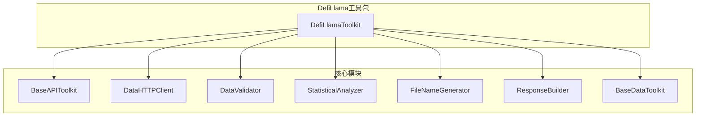
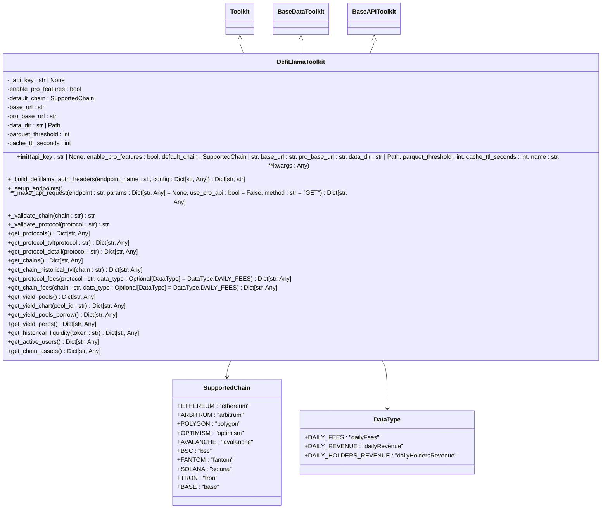
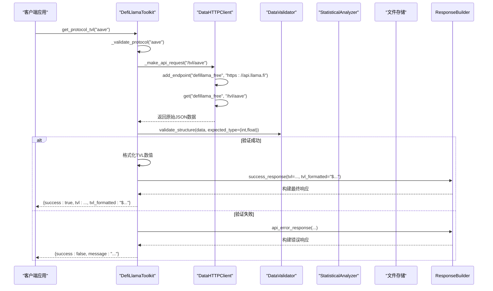
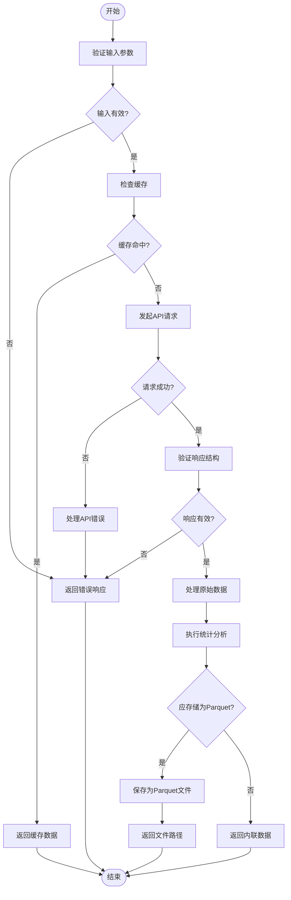
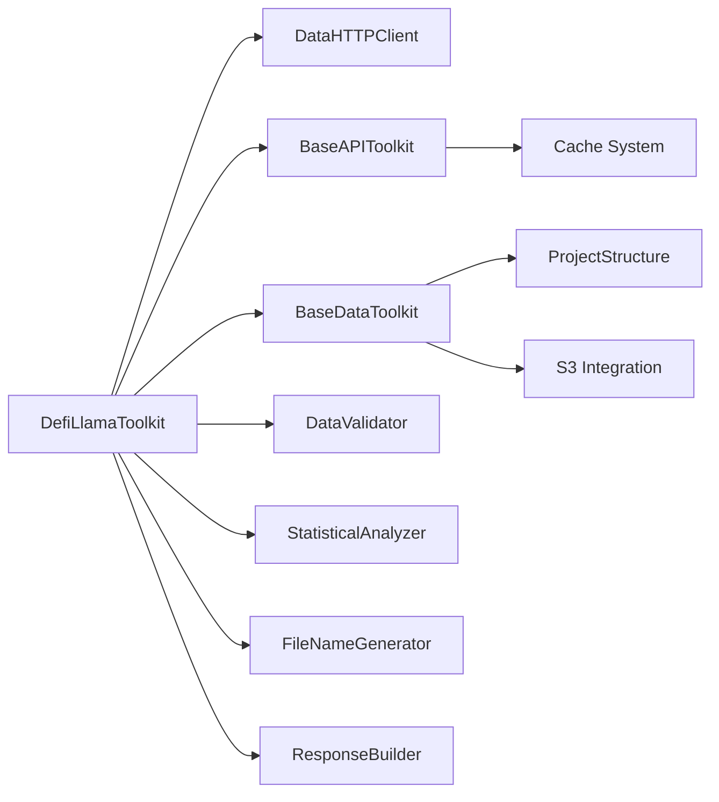

# DefiLlama工具包

<cite>
**本文档中引用的文件 **  
- [defillama_toolkit.py](file://src\sentientresearchagent\hierarchical_agent_framework\toolkits\data\defillama_toolkit.py)
- [base_api.py](file://src\sentientresearchagent\hierarchical_agent_framework\toolkits\base\base_api.py)
- [http_client.py](file://src\sentientresearchagent\hierarchical_agent_framework\toolkits\utils\http_client.py)
- [data_validator.py](file://src\sentientresearchagent\hierarchical_agent_framework\toolkits\utils\data_validator.py)
- [statistics.py](file://src\sentientresearchagent\hierarchical_agent_framework\toolkits\utils\statistics.py)
- [filename_generator.py](file://src\sentientresearchagent\hierarchical_agent_framework\toolkits\utils\filename_generator.py)
- [response_builder.py](file://src\sentientresearchagent\hierarchical_agent_framework\toolkits\utils\response_builder.py)
- [base_data.py](file://src\sentientresearchagent\hierarchical_agent_framework\toolkits\base\base_data.py)
</cite>

## 目录
1. [简介](#简介)
2. [项目结构](#项目结构)
3. [核心组件](#核心组件)
4. [架构概述](#架构概述)
5. [详细组件分析](#详细组件分析)
6. [依赖关系分析](#依赖关系分析)
7. [性能考虑](#性能考虑)
8. [故障排除指南](#故障排除指南)
9. [结论](#结论)

## 简介
DefiLlama工具包是一个专为去中心化金融（DeFi）数据分析设计的综合性工具集，旨在通过继承`base_api.BaseAPI`的方式实现与DefiLlama平台的无缝集成。该工具包提供了标准化接口以获取关键的DeFi相关数据，包括协议总锁仓价值（TVL）、链上收益、代币价格以及跨链资产分布等信息。其核心功能不仅限于数据查询，还涵盖了高级财务指标和统计分析能力，支持跨协议和跨链比较，并通过Parquet文件存储大规模响应来优化内存使用。

工具包的设计充分考虑了实际应用场景中的需求，例如在代理任务中调用`get_protocol_tvl`或`get_chain_tvls`方法进行深度研究时，能够提供高效且准确的数据支持。此外，它内置了HTTP客户端用于处理长时间轮询和大规模数据响应时的性能优化机制，确保即使面对复杂嵌套结构的数据也能保持稳定性和可靠性。为了保证数据准确性，工具包采用了严格的数据验证逻辑对从DefiLlama API获取的信息进行校验。

对于开发者而言，本工具包遵循统一的错误处理和缓存策略，指导如何安全地集成新的DeFi数据维度，从而简化开发流程并提高代码质量。无论是初学者还是经验丰富的研究人员，都可以利用这一强大而灵活的工具快速开展DeFi领域的深入探索工作。

## 项目结构
DefiLlama工具包位于项目的`src\sentientresearchagent\hierarchical_agent_framework\toolkits\data\`目录下，作为整个框架的一部分与其他模块协同工作。其主要依赖于几个关键组件：`base_api.py`定义了API业务逻辑的基础类；`http_client.py`提供了异步HTTP客户端以管理多个端点及认证头；`data_validator.py`负责验证数据结构和内容；`statistics.py`则包含了用于金融时间序列数据分析的各种统计函数；`filename_generator.py`帮助生成标准化的文件名；`response_builder.py`构建一致性的响应格式；最后，`base_data.py`辅助处理大量数据集的操作如Parquet文件存储等。

**图表来源**
- [defillama_toolkit.py](file://src\sentientresearchagent\hierarchical_agent_framework\toolkits\data\defillama_toolkit.py#L198-L2184)
- [base_api.py](file://src\sentientresearchagent\hierarchical_agent_framework\toolkits\base\base_api.py#L0-L637)
- [http_client.py](file://src\sentientresearchagent\hierarchical_agent_framework\toolkits\utils\http_client.py#L37-L440)
- [data_validator.py](file://src\sentientresearchagent\hierarchical_agent_framework\toolkits\utils\data_validator.py#L15-L258)
- [statistics.py](file://src\sentientresearchagent\hierarchical_agent_framework\toolkits\utils\statistics.py#L27-L763)
- [filename_generator.py](file://src\sentientresearchagent\hierarchical_agent_framework\toolkits\utils\filename_generator.py#L13-L160)
- [response_builder.py](file://src\sentientresearchagent\hierarchical_agent_framework\toolkits\utils\response_builder.py#L14-L381)
- [base_data.py](file://src\sentientresearchagent\hierarchical_agent_framework\toolkits\base\base_data.py#L34-L682)

**章节来源**
- [defillama_toolkit.py](file://src\sentientresearchagent\hierarchical_agent_framework\toolkits\data\defillama_toolkit.py#L0-L2185)

## 核心组件
DefiLlama工具包的核心在于其实现了`Toolkit`、`BaseDataToolkit`和`BaseAPIToolkit`三个基类的多重继承，这使得它可以同时具备通用工具集的功能、大数据处理能力和API业务逻辑的支持。其中，`DefiLlamaToolkit`类是整个工具包的主要入口点，封装了一系列针对DefiLlama平台特性的方法，比如获取协议TVL、链上费用收入等。

每个公开的方法都返回一个标准格式化的JSON响应对象，包含成功/失败标志、具体数据或指向大型数据集的文件路径、请求时间戳以及其他元信息。这种设计不仅提高了易用性也增强了与其他系统的互操作性。特别值得注意的是，当响应体大小超过预设阈值时，系统会自动将数据保存为Parquet文件并将文件路径返回给用户，以此避免内存溢出问题。

此外，工具包内部集成了智能缓存机制，默认情况下所有API响应都会被缓存一段时间（可配置），有效减少了重复请求带来的网络开销。对于需要更高权限访问Pro版API的情况，则要求用户提供有效的API密钥并通过环境变量`DEFILLAMA_API_KEY`传递进来。

**章节来源**
- [defillama_toolkit.py](file://src\sentientresearchagent\hierarchical_agent_framework\toolkits\data\defillama_toolkit.py#L198-L2184)

## 架构概述
DefiLlama工具包的整体架构体现了清晰的责任分离原则，各组成部分之间通过明确定义的接口相互协作。最底层是由`DataHTTPClient`提供的异步HTTP通信能力，它允许并发执行多个请求并对不同端点实施速率限制控制。往上一层则是由`BaseAPIToolkit`抽象出来的API业务逻辑层，这里实现了诸如参数验证、标识符解析等功能。

中间件部分主要包括`DataValidator`和`StatisticalAnalyzer`两个实用工具类，前者专注于确保输入输出数据的有效性，后者则致力于提供丰富的统计分析服务。至于顶层的应用逻辑，则完全由`DefiLlamaToolkit`自身承担，它整合了上述所有资源并向外部暴露简洁直观的API供调用者使用。

值得一提的是，尽管大部分功能都是围绕着特定类型的数据源定制开发的，但整体架构仍然保持了足够的灵活性以便未来扩展至其他领域。例如，只需替换相应的适配器即可轻松接入另一个类似的金融服务提供商。

```mermaid
classDiagram
class Toolkit {
+__init__(name : str, tools : List[Callable], **kwargs)
+register_tool(tool : Callable)
+execute_tool(tool_name : str, *args, **kwargs)
}
class BaseDataToolkit {
+_init_data_helpers(data_dir : str | Path, parquet_threshold : int, file_prefix : str, toolkit_name : str)
+_store_parquet(data : Union[List[Dict[str, Any]], _pd.DataFrame], prefix : str, subdirectory : Optional[str])
+_should_store_as_parquet(data : Union[List, _pd.DataFrame, Dict[str, Any]]) bool
+_clean_data_directory(max_age_hours : int = 24, pattern : str = "*.parquet", dry_run : bool = False) Dict[str, Any]
}
class BaseAPIToolkit {
+_validate_configuration_enum(value : str, enum_class : type, config_name : str = "configuration")
+_validate_configuration_mapping(value : str, config_mapping : Dict[str, Any], config_name : str = "configuration")
+_init_standard_configuration(http_timeout : float = 30.0, max_retries : int = 3, retry_delay : float = 1.0, cache_ttl_seconds : int = 3600)
+_setup_multi_endpoint_authentication(endpoint_configs : Dict[str, Dict[str, Any]], auth_header_builder : Callable[[str, Dict[str, Any]], Dict[str, str]])
+_execute_pending_endpoint_setup()
+_find_fuzzy_match(target : str, candidates : Union[Set[str], List[str]], threshold : float = 0.6) Optional[str]
+_build_identifier_validation_response(identifier : str, is_valid : bool, config_context : str, identifier_type : str = "identifier", suggestions : Optional[List[str]] = None, **additional_data : Any) Dict[str, Any]
}
class DataHTTPClient {
+__init__(default_timeout : float = 30.0, default_headers : Optional[Dict[str, str]] = None, max_retries : int = 3, retry_delay : float = 1.0, default_rate_limit : Optional[float] = None)
+add_endpoint(name : str, base_url : str, headers : Optional[Dict[str, str]] = None, timeout : Optional[float] = None, rate_limit : Optional[float] = None, **client_kwargs : Any)
+get(endpoint_name : str, path : str, params : Optional[Dict[str, Any]] = None, headers : Optional[Dict[str, str]] = None, timeout : Optional[float] = None, retries : Optional[int] = None) Dict[str, Any]
+post(endpoint_name : str, path : str, json_data : Optional[Dict[str, Any]] = None, data : Optional[Dict[str, Any]] = None, params : Optional[Dict[str, Any]] = None, headers : Optional[Dict[str, str]] = None, timeout : Optional[float] = None, retries : Optional[int] = None) Dict[str, Any]
+aclose()
}
class DataValidator {
+validate_structure(data : Any, required_fields : Optional[List[str]] = None, expected_type : Optional[type] = None) Dict[str, Any]
+validate_ohlcv_fields(data : List[Dict[str, Any]], price_fields : Optional[Dict[str, str]] = None) Dict[str, Any]
+validate_numeric_data(data : Any, field_name : str = "value") Dict[str, Any]
+validate_timestamps(data : Union[List[int], List[str], _pd.Series], format_type : str = "unix_ms") Dict[str, Any]
}
class StatisticalAnalyzer {
+calculate_price_statistics(prices : _np.ndarray) Dict[str, Any]
+calculate_returns_analysis(prices : _np.ndarray, timestamps : Optional[_np.ndarray] = None) Dict[str, Any]
+calculate_volatility_metrics(prices : _np.ndarray, window : int = 30) Dict[str, Any]
+calculate_volume_statistics(volumes : _np.ndarray, prices : Optional[_np.ndarray] = None) Dict[str, Any]
+calculate_technical_indicators(prices : _np.ndarray, volumes : Optional[_np.ndarray] = None) Dict[str, Any]
+calculate_ohlcv_summary(prices : _np.ndarray, volumes : Optional[_np.ndarray] = None, timestamps : Optional[_np.ndarray] = None) Dict[str, Any]
+calculate_vwap(prices : _np.ndarray, volumes : _np.ndarray) float
+analyze_price_trends(prices : _np.ndarray, window : int = 20) Dict[str, Any]
+calculate_gini_coefficient(values : _np.ndarray) float
+calculate_distribution_stats(values : _np.ndarray) Dict[str, float]
+build_analysis_report(prices : _np.ndarray, volumes : Optional[_np.ndarray] = None, timestamps : Optional[_np.ndarray] = None, analysis_types : Optional[List[str]] = None) Dict[str, Any]
}
class FileNameGenerator {
+generate_data_filename(prefix : str, primary_identifier : str, secondary_identifier : Optional[str] = None, additional_params : Optional[Dict[str, Any]] = None, include_timestamp : bool = False, file_prefix : str = "") str
+generate_timestamped_filename(base_name : str, extension : str = "parquet", file_prefix : str = "") str
+generate_market_data_filename(data_type : str, symbol : str, market_type : Optional[str] = None, interval : Optional[str] = None, date_range : Optional[str] = None, file_prefix : str = "") str
}
class ResponseBuilder {
+__init__(toolkit_info : Optional[Dict[str, Any]] = None)
+success_response(data : Any = None, message : str = "Operation completed successfully", **additional_fields) Dict[str, Any]
+error_response(message : str, error_type : str = "unknown_error", details : Optional[Dict[str, Any]] = None, **additional_fields) Dict[str, Any]
+data_response(data : Any, file_path : Optional[Union[str, Path]] = None, data_summary : Optional[Dict[str, Any]] = None, note : Optional[str] = None, **additional_fields) Dict[str, Any]
+build_data_response_with_storage(data : Any, storage_threshold : int, storage_callback : callable, filename_template : str, large_data_note : str = "Large dataset stored as file", **additional_fields) Dict[str, Any]
+validation_error_response(field_name : str, field_value : Any, validation_errors : list, **additional_fields) Dict[str, Any]
+api_error_response(api_endpoint : str, http_status : Optional[int] = None, api_message : Optional[str] = None, **additional_fields) Dict[str, Any]
}
Toolkit <|-- DefiLlamaToolkit
BaseDataToolkit <|-- DefiLlamaToolkit
BaseAPIToolkit <|-- DefiLlamaToolkit
DefiLlamaToolkit --> DataHTTPClient
DefiLlamaToolkit --> DataValidator
DefiLlamaToolkit --> StatisticalAnalyzer
DefiLlamaToolkit --> FileNameGenerator
DefiLlamaToolkit --> ResponseBuilder
```

**图表来源**
- [defillama_toolkit.py](file://src\sentientresearchagent\hierarchical_agent_framework\toolkits\data\defillama_toolkit.py#L198-L2184)
- [base_data.py](file://src\sentientresearchagent\hierarchical_agent_framework\toolkits\base\base_data.py#L34-L682)
- [base_api.py](file://src\sentientresearchagent\hierarchical_agent_framework\toolkits\base\base_api.py#L0-L637)
- [http_client.py](file://src\sentientresearchagent\hierarchical_agent_framework\toolkits\utils\http_client.py#L37-L440)
- [data_validator.py](file://src\sentientresearchagent\hierarchical_agent_framework\toolkits\utils\data_validator.py#L15-L258)
- [statistics.py](file://src\sentientresearchagent\hierarchical_agent_framework\toolkits\utils\statistics.py#L27-L763)
- [filename_generator.py](file://src\sentientresearchagent\hierarchical_agent_framework\toolkits\utils\filename_generator.py#L13-L160)
- [response_builder.py](file://src\sentientresearchagent\hierarchical_agent_framework\toolkits\utils\response_builder.py#L14-L381)

## 详细组件分析

### DefiLlamaToolkit 分析
`DefiLlamaToolkit` 类是整个工具包的核心实现，它通过多重继承结合了 `Toolkit`、`BaseDataToolkit` 和 `BaseAPIToolkit` 的功能特性。此类初始化时接受一系列参数如 API 密钥、默认链路选择、基础 URL 地址等，并据此配置内部状态。一旦实例化完成，就可以直接调用其公开方法来进行各种类型的查询操作。

#### 对象导向组件：

**图表来源**
- [defillama_toolkit.py](file://src\sentientresearchagent\hierarchical_agent_framework\toolkits\data\defillama_toolkit.py#L198-L2184)

#### API/服务组件：

**图表来源**
- [defillama_toolkit.py](file://src\sentientresearchagent\hierarchical_agent_framework\toolkits\data\defillama_toolkit.py#L651-L724)
- [http_client.py](file://src\sentientresearchagent\hierarchical_agent_framework\toolkits\utils\http_client.py#L37-L440)
- [data_validator.py](file://src\sentientresearchagent\hierarchical_agent_framework\toolkits\utils\data_validator.py#L15-L258)
- [response_builder.py](file://src\sentientresearchagent\hierarchical_agent_framework\toolkits\utils\response_builder.py#L14-L381)

#### 复杂逻辑组件：

**图表来源**
- [defillama_toolkit.py](file://src\sentientresearchagent\hierarchical_agent_framework\toolkits\data\defillama_toolkit.py#L198-L2184)
- [base_data.py](file://src\sentientresearchagent\hierarchical_agent_framework\toolkits\base\base_data.py#L34-L682)
- [data_validator.py](file://src\sentientresearchagent\hierarchical_agent_framework\toolkits\utils\data_validator.py#L15-L258)
- [statistics.py](file://src\sentientresearchagent\hierarchical_agent_framework\toolkits\utils\statistics.py#L27-L763)

**章节来源**
- [defillama_toolkit.py](file://src\sentientresearchagent\hierarchical_agent_framework\toolkits\data\defillama_toolkit.py#L198-L2184)

## 依赖关系分析
DefiLlama工具包与其依赖项之间的关系紧密且层次分明。首先，`DefiLlamaToolkit`直接依赖于`DataHTTPClient`来执行HTTP请求，后者又独立运作但需正确配置才能正常工作。接着，`BaseAPIToolkit`提供了许多通用的API业务逻辑辅助函数，这些都被`DefiLlamaToolkit`所复用。同样地，`BaseDataToolkit`贡献了关于大数据管理和文件操作方面的功能。

除此之外，还有几个工具性质的类如`DataValidator`、`StatisticalAnalyzer`、`FileNameGenerator`以及`ResponseBuilder`分别负责各自领域的任务，它们共同构成了支撑整个工具包运行的基础设施。值得注意的是，虽然这些组件理论上可以单独使用，但在实践中通常会一起出现以形成完整的解决方案。

**图表来源**
- [defillama_toolkit.py](file://src\sentientresearchagent\hierarchical_agent_framework\toolkits\data\defillama_toolkit.py#L198-L2184)
- [base_data.py](file://src\sentientresearchagent\hierarchical_agent_framework\toolkits\base\base_data.py#L34-L682)
- [base_api.py](file://src\sentientresearchagent\hierarchical_agent_framework\toolkits\base\base_api.py#L0-L637)
- [http_client.py](file://src\sentientresearchagent\hierarchical_agent_framework\toolkits\utils\http_client.py#L37-L440)
- [data_validator.py](file://src\sentientresearchagent\hierarchical_agent_framework\toolkits\utils\data_validator.py#L15-L258)
- [statistics.py](file://src\sentientresearchagent\hierarchical_agent_framework\toolkits\utils\statistics.py#L27-L763)
- [filename_generator.py](file://src\sentientresearchagent\hierarchical_agent_framework\toolkits\utils\filename_generator.py#L13-L160)
- [response_builder.py](file://src\sentientresearchagent\hierarchical_agent_framework\toolkits\utils\response_builder.py#L14-L381)

**章节来源**
- [defillama_toolkit.py](file://src\sentientresearchagent\hierarchical_agent_framework\toolkits\data\defillama_toolkit.py#L198-L2184)

## 性能考虑
为了应对长时间轮询和大规模数据响应带来的挑战，DefiLlama工具包采取了一系列措施来优化性能表现。首先是利用异步编程模型配合`DataHTTPClient`实现高效的并发请求处理能力，这显著缩短了等待时间并提升了吞吐量。其次，在面对可能产生巨大体积结果集的情况下，系统会自动判断是否超出预设阈值，若是则立即切换到磁盘持久化模式——即将数据写入Parquet文件而非保留在内存中。

另外，内置的缓存机制也在很大程度上缓解了频繁访问同一资源所带来的压力，特别是对于那些变化频率较低但查询频次较高的静态信息来说尤为有效。与此同时，合理的重试策略加上指数退避算法进一步增强了系统的鲁棒性，使其能够在遇到临时性故障时仍能顺利完成任务。

最后不得不提的是，通过对数据流各个环节施加严格的类型检查与格式验证，我们从根本上杜绝了许多潜在的问题源头，从而保障了最终输出的质量可靠。综上所述，这套综合性的优化方案确保了DefiLlama工具包即便在极端条件下也能维持良好的用户体验。

## 故障排除指南
当使用DefiLlama工具包过程中遇到问题时，建议按照以下步骤逐一排查：

1. **确认API密钥有效性**：如果尝试调用需要Pro权限的功能却收到“Pro API features required”之类的提示，请检查是否已正确设置`DEFILLAMA_API_KEY`环境变量或通过构造函数传入有效凭证。
2. **检查网络连接状况**：由于所有请求均需经由互联网发送至远程服务器，因此任何网络中断都将导致操作失败。请确保当前设备处于联网状态并且防火墙规则允许对外通信。
3. **审查输入参数合法性**：某些方法会对传入的字符串形式的标识符执行严格的格式校验，若发现非法字符或者空值等情况则会抛出异常。务必保证所提供的名称符合官方文档规定的要求。
4. **查看日志输出详情**：启用调试级别日志记录可以帮助定位具体出错位置及其原因。重点关注`logger.error()`产生的条目，它们往往包含了足够多的信息用于诊断问题根源。
5. **测试基本连通性**：先从简单的非敏感接口入手，比如调用`get_protocols()`获取最新列表，以此验证整体配置无误后再逐步深入更复杂的场景。

遵循以上指南应该能够解决绝大多数常见问题。当然，若依然无法恢复正常，则不妨联系技术支持团队寻求进一步的帮助。

**章节来源**
- [defillama_toolkit.py](file://src\sentientresearchagent\hierarchical_agent_framework\toolkits\data\defillama_toolkit.py#L198-L2184)

## 结论
综上所述，DefiLlama工具包凭借其精心设计的架构和丰富实用的功能集，已成为研究去中心化金融领域不可或缺的重要工具之一。它不仅简化了与DefiLlama平台交互的过程，而且还引入了许多现代化的最佳实践做法，如异步IO、智能缓存、自动化数据验证等等。更重要的是，该工具包始终保持开放态度欢迎社区贡献新想法和技术改进，相信随着时间推移必将变得更加完善强大。