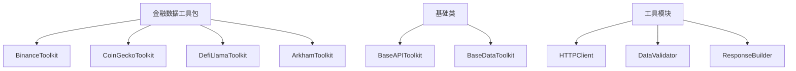
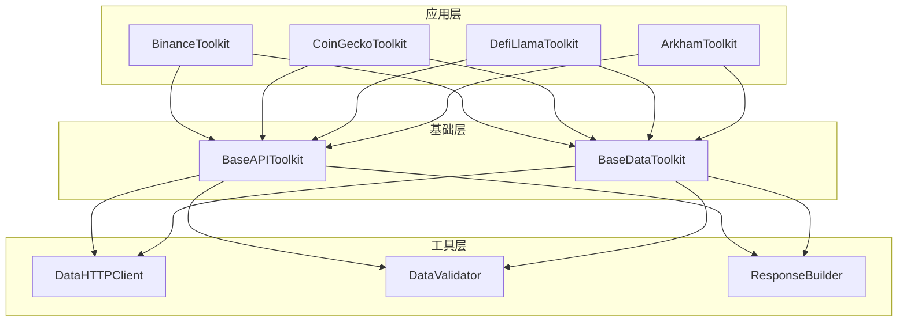
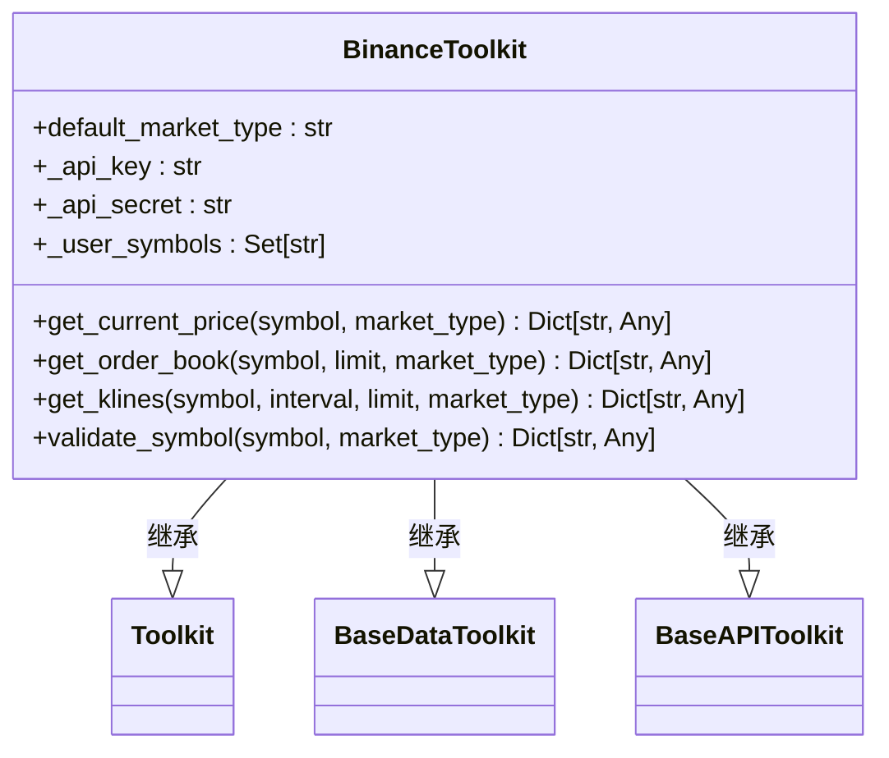
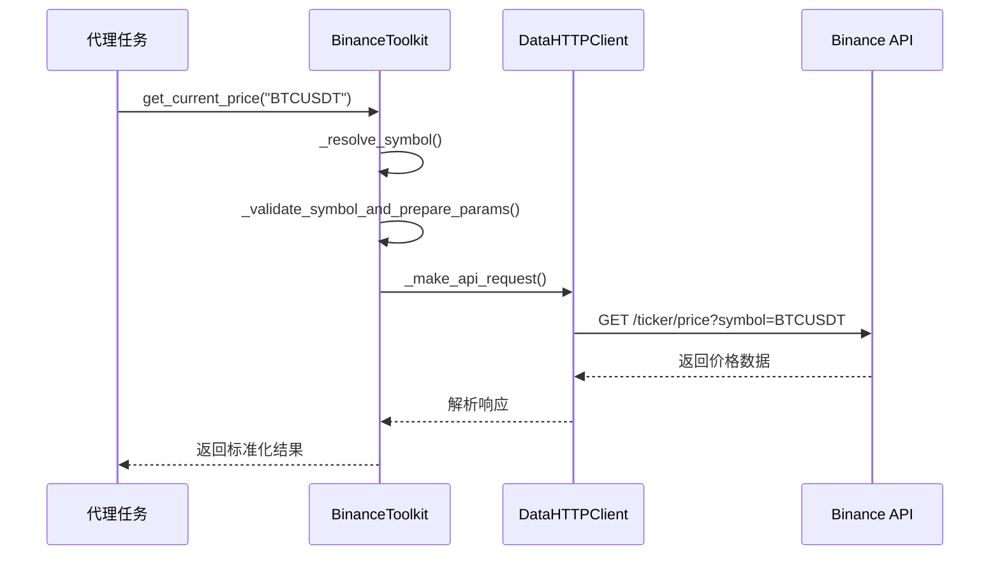
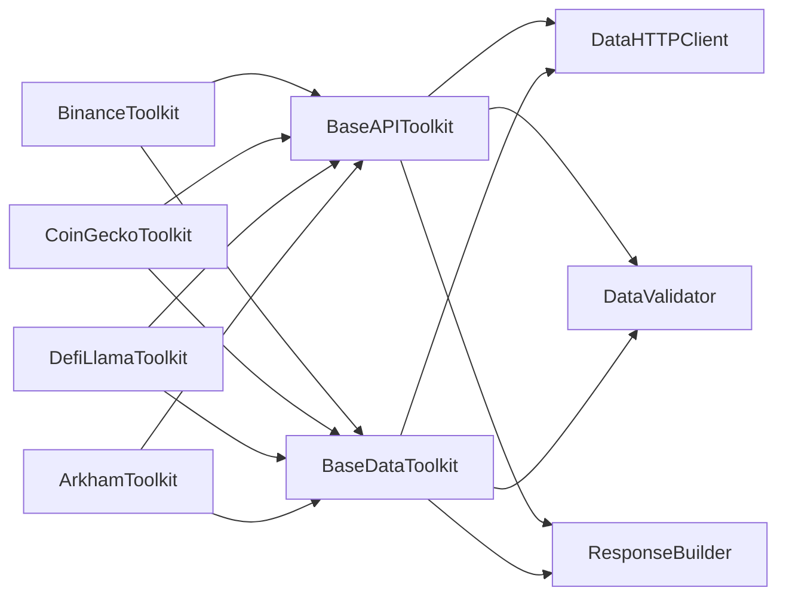

# 金融数据工具包

<cite>
**本文档引用的文件**  
- [base_api.py](file://src/sentientresearchagent/hierarchical_agent_framework/toolkits/base/base_api.py)
- [base_data.py](file://src/sentientresearchagent/hierarchical_agent_framework/toolkits/base/base_data.py)
- [http_client.py](file://src/sentientresearchagent/hierarchical_agent_framework/toolkits/utils/http_client.py)
- [data_validator.py](file://src/sentientresearchagent/hierarchical_agent_framework/toolkits/utils/data_validator.py)
- [binance_toolkit.py](file://src/sentientresearchagent/hierarchical_agent_framework/toolkits/data/binance_toolkit.py)
- [coingecko_toolkit.py](file://src/sentientresearchagent/hierarchical_agent_framework/toolkits/data/coingecko_toolkit.py)
- [arkham_toolkit.py](file://src/sentientresearchagent/hierarchical_agent_framework/toolkits/data/arkham_toolkit.py)
- [defillama_toolkit.py](file://src/sentientresearchagent/hierarchical_agent_framework/toolkits/data/defillama_toolkit.py)
</cite>

## 目录
1. [简介](#简介)
2. [项目结构](#项目结构)
3. [核心组件](#核心组件)
4. [架构概述](#架构概述)
5. [详细组件分析](#详细组件分析)
6. [依赖分析](#依赖分析)
7. [性能考量](#性能考量)
8. [故障排除指南](#故障排除指南)
9. [结论](#结论)

## 简介
本文档详细介绍ROMA系统中集成的各类金融数据工具包的设计与实现。这些工具包包括Binance、CoinGecko、DefiLlama和Arkham，均继承自`base_api.BaseAPI`基类并实现了标准化接口。文档将说明各工具包如何支持获取实时价格、历史K线、链上指标、代币持仓等核心功能，并提供具体代码示例展示在代理任务中调用这些工具获取加密市场数据的方法。

## 项目结构
金融数据工具包位于`src/sentientresearchagent/hierarchical_agent_framework/toolkits/data/`目录下，采用模块化设计，每个数据源都有独立的实现文件。工具包共享通用基础设施，包括HTTP客户端封装、响应解析逻辑和数据验证流程。

**图示来源**
- [binance_toolkit.py](file://src/sentientresearchagent/hierarchical_agent_framework/toolkits/data/binance_toolkit.py#L175-L2191)
- [coingecko_toolkit.py](file://src/sentientresearchagent/hierarchical_agent_framework/toolkits/data/coingecko_toolkit.py#L199-L3970)
- [arkham_toolkit.py](file://src/sentientresearchagent/hierarchical_agent_framework/toolkits/data/arkham_toolkit.py#L162-L1580)
- [defillama_toolkit.py](file://src/sentientresearchagent/hierarchical_agent_framework/toolkits/data/defillama_toolkit.py#L198-L2184)

**章节来源**
- [binance_toolkit.py](file://src/sentientresearchagent/hierarchical_agent_framework/toolkits/data/binance_toolkit.py#L175-L2191)
- [coingecko_toolkit.py](file://src/sentientresearchagent/hierarchical_agent_framework/toolkits/data/coingecko_toolkit.py#L199-L3970)

## 核心组件
金融数据工具包的核心组件包括统一的基类设计、HTTP客户端封装机制以及数据验证流程。所有工具包都遵循相同的初始化模式，通过`_init_standard_configuration()`方法配置HTTP超时、重试次数和缓存TTL等参数。

**章节来源**
- [base_api.py](file://src/sentientresearchagent/hierarchical_agent_framework/toolkits/base/base_api.py#L31-L637)
- [base_data.py](file://src/sentientresearchagent/hierarchical_agent_framework/toolkits/base/base_data.py#L34-L682)

## 架构概述
金融数据工具包采用分层架构设计，上层为具体的数据源实现（如Binance、CoinGecko），中间层为通用的基础类（BaseAPIToolkit和BaseDataToolkit），底层为HTTP通信和数据处理工具模块。

**图示来源**
- [base_api.py](file://src/sentientresearchagent/hierarchical_agent_framework/toolkits/base/base_api.py#L31-L637)
- [base_data.py](file://src/sentientresearchagent/hierarchical_agent_framework/toolkits/base/base_data.py#L34-L682)

## 详细组件分析
### Binance工具包分析
Binance工具包提供了对现货交易、USDⓈ-M期货和COIN-M期货市场的全面支持。它能够动态切换市场类型而无需创建多个工具包实例。

#### 类图

**图示来源**
- [binance_toolkit.py](file://src/sentientresearchagent/hierarchical_agent_framework/toolkits/data/binance_toolkit.py#L175-L2191)

#### 功能调用序列图

**图示来源**
- [binance_toolkit.py](file://src/sentientresearchagent/hierarchical_agent_framework/toolkits/data/binance_toolkit.py#L175-L2191)
- [base_api.py](file://src/sentientresearchagent/hierarchical_agent_framework/toolkits/base/base_api.py#L31-L637)

**章节来源**
- [binance_toolkit.py](file://src/sentientresearchagent/hierarchical_agent_framework/toolkits/data/binance_toolkit.py#L175-L2191)

### CoinGecko工具包分析
CoinGecko工具包专注于提供广泛的加密货币市场数据，包括价格、市值、交易量等信息。

**章节来源**
- [coingecko_toolkit.py](file://src/sentientresearchagent/hierarchical_agent_framework/toolkits/data/coingecko_toolkit.py#L199-L3970)

### Arkham工具包分析
Arkham工具包专注于链上数据分析，提供钱包地址追踪、资金流向分析等功能。

**章节来源**
- [arkham_toolkit.py](file://src/sentientresearchagent/hierarchical_agent_framework/toolkits/data/arkham_toolkit.py#L162-L1580)

### DefiLlama工具包分析
DefiLlama工具包专注于去中心化金融协议的数据，包括TVL（总锁定价值）、协议收入等关键指标。

**章节来源**
- [defillama_toolkit.py](file://src/sentientresearchagent/hierarchical_agent_framework/toolkits/data/defillama_toolkit.py#L198-L2184)

## 依赖分析
金融数据工具包之间不存在直接依赖关系，它们都依赖于共同的基础类和工具模块。这种设计确保了各个工具包的独立性和可维护性。

**图示来源**
- [base_api.py](file://src/sentientresearchagent/hierarchical_agent_framework/toolkits/base/base_api.py#L31-L637)
- [base_data.py](file://src/sentientresearchagent/hierarchical_agent_framework/toolkits/base/base_data.py#L34-L682)

**章节来源**
- [base_api.py](file://src/sentientresearchagent/hierarchical_agent_framework/toolkits/base/base_api.py#L31-L637)
- [base_data.py](file://src/sentientresearchagent/hierarchical_agent_framework/toolkits/base/base_data.py#L34-L682)

## 性能考量
金融数据工具包在设计时充分考虑了性能因素。对于大型数据集，工具包会自动将其存储为Parquet文件以优化内存使用。此外，所有工具包都实现了缓存机制，可以显著减少重复请求带来的延迟。

## 故障排除指南
当遇到问题时，首先检查API密钥配置是否正确。其次，确认网络连接正常且目标API服务可用。如果出现数据格式错误，请检查`data_validator.py`中的验证逻辑。

**章节来源**
- [data_validator.py](file://src/sentientresearchagent/hierarchical_agent_framework/toolkits/utils/data_validator.py)
- [http_client.py](file://src/sentientresearchagent/hierarchical_agent_framework/toolkits/utils/http_client.py)

## 结论
ROMA系统的金融数据工具包通过统一的基类设计和标准化接口，实现了对多种数据源的高效集成。开发者可以轻松扩展新的金融数据源，只需遵循既定的认证配置、端点映射和异常处理最佳实践即可。