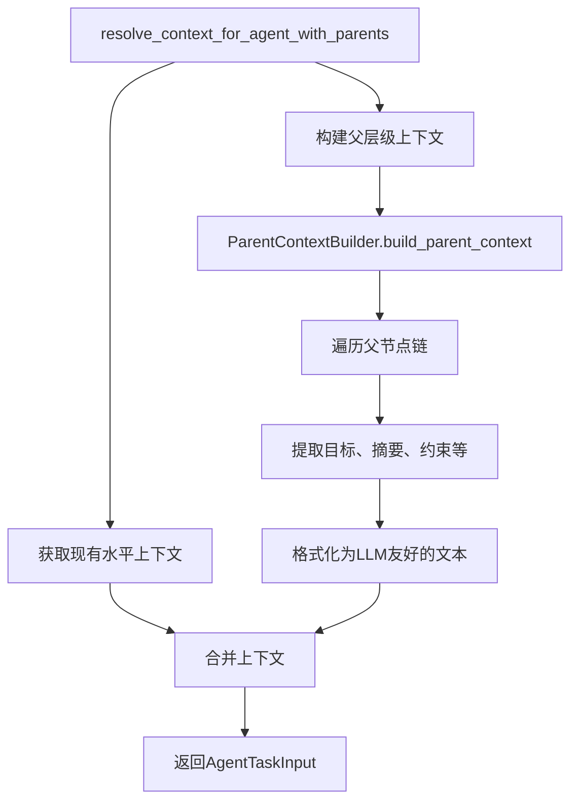
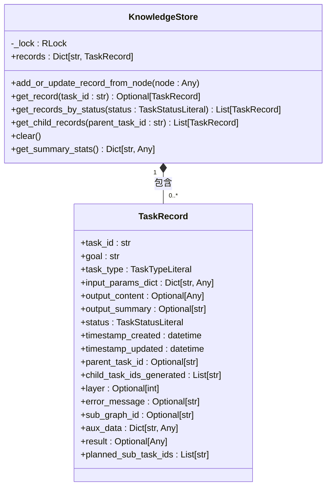
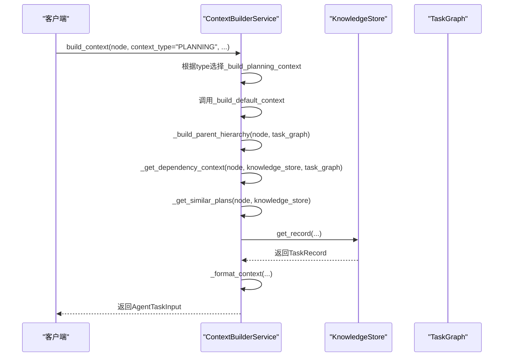

# 上下文构建与管理

<cite>
**本文档引用的文件**
- [planner_context_builder.py](file://src\sentientresearchagent\hierarchical_agent_framework\context\planner_context_builder.py)
- [enhanced_context_builder.py](file://src\sentientresearchagent\hierarchical_agent_framework\context\enhanced_context_builder.py)
- [knowledge_store.py](file://src\sentientresearchagent\hierarchical_agent_framework\context\knowledge_store.py)
- [context_builder_service.py](file://src\sentientresearchagent\hierarchical_agent_framework\services\context_builder_service.py)
</cite>

## 目录
1. [引言](#引言)
2. [规划代理上下文构建](#规划代理上下文构建)
3. [增强型上下文构建机制](#增强型上下文构建机制)
4. [知识持久化与缓存交互](#知识持久化与缓存交互)
5. [上下文构建服务入口](#上下文构建服务入口)
6. [上下文模板与敏感信息过滤](#上下文模板与敏感信息过滤)
7. [提示工程优化建议](#提示工程优化建议)
8. [结论](#结论)

## 引言
本技术文档详细阐述了上下文管理系统的核心组件，重点分析`planner_context_builder.py`和`enhanced_context_builder.py`如何为规划代理构建富含历史信息和领域知识的输入上下文。文档说明了`knowledge_store.py`实现的知识持久化机制及其与缓存层的交互策略，并描述了`context_builder_service.py`作为服务入口如何协调多源数据聚合（如项目元数据、过往执行记录、外部知识库）。同时，结合代码示例展示上下文模板的动态填充过程及敏感信息过滤规则，为AI工程师提供提示工程优化建议。

## 规划代理上下文构建

`planner_context_builder.py`模块负责为规划代理（Planner Agent）构建结构化的输入上下文。其核心函数`resolve_input_for_planner_agent`通过整合当前任务目标、整体项目目标以及丰富的执行历史和上下文信息，生成一个全面的`PlannerInput`对象。

该过程首先从`KnowledgeStore`中获取当前任务的记录，并通过`get_task_record_path_to_root`函数遍历任务记录路径以确定父级任务。系统会提取父级任务的输出摘要作为祖先上下文，如果摘要不存在或过长，则使用`get_context_summary`函数对原始输出内容进行总结或截断处理。

此外，系统还会收集先序兄弟任务的输出。通过检查父任务生成的子任务ID列表，筛选出在当前任务之前完成的兄弟任务，并将其成功输出纳入上下文。此过程同样包含摘要处理逻辑，确保上下文信息的简洁性。

最终，所有相关信息被封装进`ExecutionHistoryAndContext`对象，与当前任务目标、整体目标等一起构成完整的`PlannerInput`，为规划代理提供决策依据。

**Section sources**
- [planner_context_builder.py](file://src\sentientresearchagent\hierarchical_agent_framework\context\planner_context_builder.py#L153-L228)
- [planner_context_builder.py](file://src\sentientresearchagent\hierarchical_agent_framework\context\planner_context_builder.py#L10-L64)
- [planner_context_builder.py](file://src\sentientresearchagent\hierarchical_agent_framework\context\planner_context_builder.py#L67-L150)
- [agent_io_models.py](file://src\sentientresearchagent\hierarchical_agent_framework\context\agent_io_models.py#L190-L202)

## 增强型上下文构建机制

`enhanced_context_builder.py`模块提供了`resolve_context_for_agent_with_parents`函数，用于为各类代理构建包含父层级上下文的增强型输入。该机制在基础水平上下文（如兄弟任务、历史任务）之上，增加了垂直的父层级信息流。

该函数首先调用`resolve_context_for_agent`获取现有的水平上下文，然后实例化`ParentContextBuilder`并调用其`build_parent_context`方法来构建父层级上下文。这个父层级上下文包含了从根任务到直接父任务的完整路径信息，包括各层级的任务目标、结果摘要和关键洞察。

构建完成后，系统将父层级上下文置于格式化字符串的最前面（最高优先级），随后添加来自水平依赖的上下文项。每个上下文项都清晰地标明了来源任务、内容类型和具体内容。这种分层组织方式确保了最重要的战略指导（来自父级）始终位于上下文的开头，而具体的执行细节（来自兄弟任务）则作为补充。

**Diagram sources**
- [enhanced_context_builder.py](file://src\sentientresearchagent\hierarchical_agent_framework\context\enhanced_context_builder.py#L6-L62)

**Section sources**
- [enhanced_context_builder.py](file://src\sentientresearchagent\hierarchical_agent_framework\context\enhanced_context_builder.py#L6-L62)
- [parent_context_builder.py](file://src\sentientresearchagent\hierarchical_agent_framework\context\parent_context_builder.py)

## 知识持久化与缓存交互

`knowledge_store.py`模块实现了`KnowledgeStore`类，作为所有任务记录的中央存储库。它基于Pydantic模型定义了`TaskRecord`，用于持久化任务的完整生命周期数据，包括任务ID、目标、状态、输入参数、输出内容、摘要、时间戳、父子关系、错误信息以及用于依赖解析的`aux_data`等。

`KnowledgeStore`通过`add_or_update_record_from_node`方法从`TaskNode`创建或更新`TaskRecord`，并使用线程锁保证并发安全。`get_record`等查询方法也受到锁保护，确保数据一致性。`TaskRecord`中的`result`和`planned_sub_task_ids`字段专门用于支持依赖关系的解析。

为了提升性能，系统还存在一个`OptimizedKnowledgeStore`（未在本次分析中详述），它通过读取缓存（LRU Cache）和写入缓冲区（Write Buffering）来减少锁竞争和I/O开销。当启用优化时，`get_record`会优先从缓存中查找，若命中则直接返回；否则从底层存储读取并更新缓存。这显著降低了高频读取场景下的延迟。

**Diagram sources**
- [knowledge_store.py](file://src\sentientresearchagent\hierarchical_agent_framework\context\knowledge_store.py#L48-L138)
- [knowledge_store.py](file://src\sentientresearchagent\hierarchical_agent_framework\context\knowledge_store.py#L12-L46)

**Section sources**
- [knowledge_store.py](file://src\sentientresearchagent\hierarchical_agent_framework\context\knowledge_store.py#L48-L138)
- [knowledge_store.py](file://src\sentientresearchagent\hierarchical_agent_framework\context\knowledge_store.py#L60-L95)

## 上下文构建服务入口

`context_builder_service.py`模块是上下文构建的统一服务入口，通过`ContextBuilderService`类集中管理所有上下文构建逻辑。该服务根据不同的`ContextType`（如PLANNING、EXECUTION、AGGREGATION）采用相应的构建策略。

服务初始化时，会注册一系列策略函数（`_strategies`字典），例如`_build_planning_context`和`_build_execution_context`。`build_context`主方法接收任务节点、知识库、任务图等参数，根据请求的上下文类型选择合适的策略执行。

`_build_default_context`是基础构建流程，它会：
1.  **构建父层级上下文**：通过`_build_parent_hierarchy`递归获取父节点信息。
2.  **获取依赖上下文**：通过`_get_dependency_context`识别并提取前置依赖任务的结果。
3.  **聚合相似任务上下文**：可选地搜索语义相似的已完成任务。
4.  **添加附加上下文**：集成用户提供的额外信息。

对于特定场景，如计划修改（MODIFICATION），`_build_modification_context`会在基础计划上下文上，额外注入“原始计划”和“修改指令”等关键信息，形成针对性更强的输入。

**Diagram sources**
- [context_builder_service.py](file://src\sentientresearchagent\hierarchical_agent_framework\services\context_builder_service.py#L45-L598)
- [context_builder_service.py](file://src\sentientresearchagent\hierarchical_agent_framework\services\context_builder_service.py#L84-L134)

**Section sources**
- [context_builder_service.py](file://src\sentientresearchagent\hierarchical_agent_framework\services\context_builder_service.py#L45-L598)
- [context_builder_service.py](file://src\sentientresearchagent\hierarchical_agent_framework\services\context_builder_service.py#L136-L200)
- [context_builder_service.py](file://src\sentientresearchagent\hierarchical_agent_framework\services\context_builder_service.py#L381-L437)
- [context_builder_service.py](file://src\sentientresearchagent\hierarchical_agent_framework\services\context_builder_service.py#L439-L534)

## 上下文模板与敏感信息过滤

上下文的最终格式化由`_format_context`方法完成，它利用`ContextFormatter.format_context`将结构化的`context_items`列表转换为适合大语言模型（LLM）阅读的纯文本字符串。虽然具体模板未在此处详述，但其设计原则是清晰分隔不同来源的信息。

在构建过程中，系统已内置了信息过滤和压缩机制。例如，在`_get_parent_context_for_planner`和`_get_prior_sibling_context_for_planner`中，会对过长的摘要进行截断或重新总结，确保单个上下文项不会过度占用token预算。`TARGET_WORD_COUNT_FOR_CTX_SUMMARIES`常量定义了摘要的目标长度。

此外，`aux_data`字段可能包含敏感的内部元数据。虽然当前代码未显式展示过滤逻辑，但最佳实践要求在将`aux_data`的内容（如`full_result`）加入`ContextItem`前，应进行严格的审查和脱敏处理，移除任何认证凭据、内部标识符或其他机密信息。

## 提示工程优化建议

为AI工程师提供以下提示工程优化建议：

### 上下文压缩技巧
- **摘要先行**：始终优先使用`output_summary`而非完整的`output_content`。仅当摘要缺失或不足以表达关键信息时，才考虑引入部分内容。
- **分层裁剪**：实施多级压缩。第一级是自动摘要/截断（如`_get_parent_context_for_planner`所示）。第二级是在`_build_execution_context`中限制`relevant_context_items`的数量（如`max_items = 10`），只保留最相关的几项。
- **关键信息突出**：利用`relevance_score`字段（如依赖项设为1.0）或排序算法（如按相关性和时效性排序），确保最重要的信息排在上下文的前面，因为LLM更关注输入的开头部分。

### 防止信息过载的设计模式
- **上下文类型分离**：遵循`ContextType`的设计，为不同目的（计划、执行、聚合）构建专用的上下文。避免创建一个“万能”的超大上下文。
- **明确的边界**：在`_build_parent_hierarchy`中设置`max_depth = 3`，防止上下文无限向上追溯。这强制代理聚焦于直接相关的上级信息。
- **降级策略**：实现`_build_minimal_context`作为故障安全机制。当主构建流程失败时，返回一个极简上下文，确保代理至少能收到基本指令，而不是完全崩溃。

## 结论
本上下文管理系统通过`planner_context_builder`和`enhanced_context_builder`协同工作，为规划代理提供了深度的历史和领域知识。`KnowledgeStore`作为单一事实源，确保了数据的一致性和持久性，其与缓存层的交互策略保障了系统的高性能。`ContextBuilderService`作为统一的服务入口，通过灵活的策略模式，能够高效地协调多源数据聚合，生成针对不同场景优化的上下文。结合合理的上下文压缩和信息突出技巧，该系统有效平衡了信息丰富度与LLM的token限制，为构建复杂、可靠的AI代理系统奠定了坚实的基础。