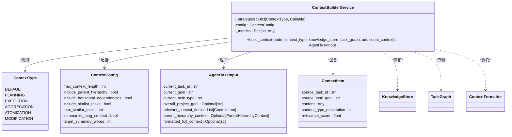
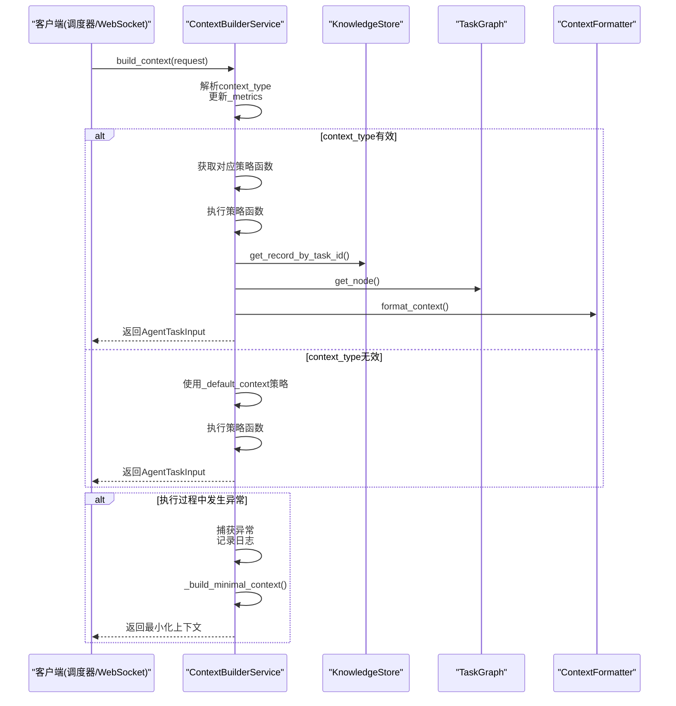
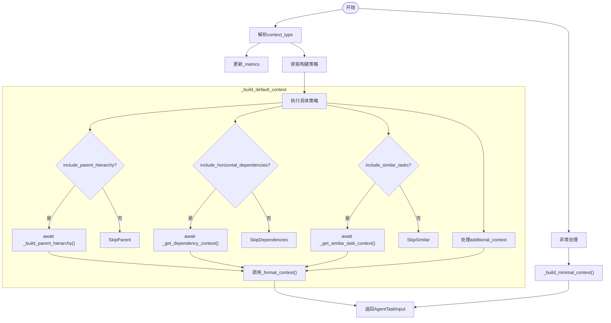

# 上下文构建服务接口

<cite>
**本文档引用的文件**
- [context_builder_service.py](file://src\sentientresearchagent\hierarchical_agent_framework\services\context_builder_service.py)
- [task_node.py](file://src\sentientresearchagent\hierarchical_agent_framework\node\task_node.py)
- [knowledge_store.py](file://src\sentientresearchagent\hierarchical_agent_framework\context\knowledge_store.py)
- [task_graph.py](file://src\sentientresearchagent\hierarchical_agent_framework\graph\task_graph.py)
- [context_formatter.py](file://src\sentientresearchagent\hierarchical_agent_framework\services\context_formatter.py)
- [agent_io_models.py](file://src\sentientresearchagent\hierarchical_agent_framework\context\agent_io_models.py)
</cite>

## 目录
1. [引言](#引言)
2. [核心职责与架构角色](#核心职责与架构角色)
3. [请求处理流程](#请求处理流程)
4. [上下文生成编排逻辑](#上下文生成编排逻辑)
5. [错误处理与降级机制](#错误处理与降级机制)
6. [API网关集成设计](#api网关集成设计)
7. [服务扩展指南](#服务扩展指南)
8. [性能监控与度量指标](#性能监控与度量指标)

## 引言
`ContextBuilderService` 是智能研究代理系统中负责上下文生成的核心服务组件。作为系统的对外服务入口，它承担着为各类智能体（Agent）提供结构化、相关性强且格式统一的任务执行上下文的关键职责。该服务接收来自任务调度器或WebSocket前端的请求，协调调用多种构建器（Builder）和存储组件（Store），完成端到端的上下文组装。本文档将深入剖析其内部工作机制、服务编排逻辑、错误处理策略以及与API网关的集成方式，并为开发者提供清晰的扩展路径。

## 核心职责与架构角色
`ContextBuilderService` 在系统架构中扮演着“上下文中枢”的角色，其主要职责包括：

- **集中化上下文管理**：将所有上下文构建逻辑集中于单一服务，提高了代码的可维护性和可理解性。
- **多类型上下文支持**：根据不同的任务需求（如规划、执行、聚合等），动态选择并应用相应的构建策略。
- **依赖协调与数据整合**：协调 `KnowledgeStore` 和 `TaskGraph` 等组件，从父节点、横向依赖项和历史记录中提取相关信息。
- **标准化输出**：通过 `ContextFormatter` 统一上下文的呈现格式，确保下游智能体接收到一致的输入。

**图表来源**
- [context_builder_service.py](file://src\sentientresearchagent\hierarchical_agent_framework\services\context_builder_service.py#L56-L82)
- [context_builder_service.py](file://src\sentientresearchagent\hierarchical_agent_framework\services\context_builder_service.py#L23-L30)
- [context_builder_service.py](file://src\sentientresearchagent\hierarchical_agent_framework\services\context_builder_service.py#L34-L42)
- [agent_io_models.py](file://src\sentientresearchagent\hierarchical_agent_framework\context\agent_io_models.py#L102-L118)
- [agent_io_models.py](file://src\sentientresearchagent\hierarchical_agent_framework\context\agent_io_models.py#L64-L69)

**章节来源**
- [context_builder_service.py](file://src\sentientresearchagent\hierarchical_agent_framework\services\context_builder_service.py#L1-L50)

## 请求处理流程
`ContextBuilderService` 的主入口是 `build_context` 方法，它是整个上下文生成过程的总控开关。

### 入口方法分析
`build_context` 方法接收一个 `TaskNode` 对象、上下文类型、知识库实例、任务图实例和附加上下文作为参数。其处理流程如下：
1.  **类型解析**：将传入的字符串类型的 `context_type` 转换为 `ContextType` 枚举值。如果类型未知，则默认使用 `DEFAULT` 类型。
2.  **度量更新**：更新内部的统计指标，如已构建的上下文总数和按类型分类的计数。
3.  **策略分发**：根据解析出的上下文类型，从 `_strategies` 字典中查找对应的构建函数。
4.  **异常安全执行**：在 `try-except` 块中调用具体的构建策略。一旦发生任何异常，服务会捕获错误，记录详细的日志和堆栈跟踪，并返回一个最小化的上下文以保证系统不中断。

**图表来源**
- [context_builder_service.py](file://src\sentientresearchagent\hierarchical_agent_framework\services\context_builder_service.py#L84-L134)
- [context_builder_service.py](file://src\sentientresearchagent\hierarchical_agent_framework\services\context_builder_service.py#L569-L580)

**章节来源**
- [context_builder_service.py](file://src\sentientresearchagent\hierarchical_agent_framework\services\context_builder_service.py#L84-L134)

## 上下文生成编排逻辑
`ContextBuilderService` 的核心能力在于其灵活的服务编排逻辑，能够根据不同场景的需求，协调多个组件并行或串行地获取所需信息。

### 并行数据获取
服务通过异步方法实现了高效的并行数据获取。例如，在构建默认上下文时，`_build_default_context` 方法会同时发起对父层级、横向依赖和相似任务的查询：
- **项目元数据**：通过 `task_graph` 获取父节点信息，构建 `ParentHierarchyContext`，明确当前任务在整个项目中的位置。
- **历史记录**：通过 `knowledge_store` 查询已完成的依赖任务结果，这些结果被封装为 `ContextItem` 加入上下文列表。
- **附加信息**：直接处理 `additional_context` 参数，将其内容也转换为 `ContextItem`。

这种并行获取的方式显著提升了上下文构建的效率，避免了不必要的等待时间。

### 多种上下文策略
服务内置了多种预定义的上下文构建策略，每种策略针对特定的使用场景进行了优化：
- **`_build_planning_context`**：在默认上下文基础上，额外添加来自相似成功任务的计划摘要，为规划类智能体提供参考。
- **`_build_execution_context`**：对依赖结果进行排序，优先展示最相关的内容，并限制上下文条目数量，确保执行环境的简洁高效。
- **`_build_aggregation_context`**：专注于父节点和横向依赖，为聚合操作准备基础信息，子任务的结果由专门的处理器单独添加。
- **`_build_atomization_context`**：仅提供极简的父节点信息，满足原子化决策所需的最低限度上下文。

**图表来源**
- [context_builder_service.py](file://src\sentientresearchagent\hierarchical_agent_framework\services\context_builder_service.py#L136-L200)
- [context_builder_service.py](file://src\sentientresearchagent\hierarchical_agent_framework\services\context_builder_service.py#L381-L437)
- [context_builder_service.py](file://src\sentientresearchagent\hierarchical_agent_framework\services\context_builder_service.py#L439-L534)
- [context_builder_service.py](file://src\sentientresearchagent\hierarchical_agent_framework\services\context_builder_service.py#L556-L566)

**章节来源**
- [context_builder_service.py](file://src\sentientresearchagent\hierarchical_agent_framework\services\context_builder_service.py#L136-L200)
- [context_builder_service.py](file://src\sentientresearchagent\hierarchical_agent_framework\services\context_builder_service.py#L202-L232)
- [context_builder_service.py](file://src\sentientresearchagent\hierarchical_agent_framework\services\context_builder_service.py#L234-L262)
- [context_builder_service.py](file://src\sentientresearchagent\hierarchical_agent_framework\services\context_builder_service.py#L264-L297)

## 错误处理与降级机制
`ContextBuilderService` 设计了健壮的错误处理和降级策略，以保障系统的稳定性和可用性。

### 异常捕获与日志追踪
在 `build_context` 方法的顶层，通过 `try-except` 块捕获所有可能的运行时异常。当构建失败时，服务会：
1.  记录一条包含任务ID和错误信息的 `ERROR` 级别日志。
2.  输出完整的堆栈跟踪，便于开发人员快速定位问题根源。
3.  避免让异常向上抛出导致整个调用链崩溃。

### 最小化上下文降级
当上下文构建失败时，服务不会返回空值或引发更严重的错误，而是立即调用 `_build_minimal_context` 方法。此方法创建一个包含最基本信息（如当前任务ID、目标和类型）的 `AgentTaskInput` 实例，但省略了所有复杂的上下文项和格式化内容。这种“优雅降级”策略确保了即使在部分功能失效的情况下，下游智能体仍能获得一个有效的、可处理的输入，从而维持了系统的整体运行。

**章节来源**
- [context_builder_service.py](file://src\sentientresearchagent\hierarchical_agent_framework\services\context_builder_service.py#L84-L134)
- [context_builder_service.py](file://src\sentientresearchagent\hierarchical_agent_framework\services\context_builder_service.py#L569-L580)

## API网关集成设计
`ContextBuilderService` 的设计遵循了现代API网关的设计原则，确保了服务的可靠性、可观测性和安全性。

### 输入验证
虽然 `build_context` 方法本身没有显式的输入验证逻辑，但其依赖的Pydantic模型（如 `TaskNode` 和 `AgentTaskInput`）提供了强大的数据验证能力。这些模型在对象创建时自动验证字段类型和约束，确保了输入数据的有效性，防止了因脏数据导致的运行时错误。

### 日志追踪
服务广泛使用 `loguru` 进行日志记录，贯穿于上下文构建的各个关键步骤：
- 在构建开始时记录任务ID和上下文类型。
- 详细记录依赖解析的过程，包括找到的依赖项及其来源。
- 记录最终格式化上下文的长度，用于性能分析。
- 在错误处理分支中，记录详细的错误信息和堆栈跟踪。
这些结构化的日志为系统调试、行为审计和性能分析提供了宝贵的数据。

### 性能监控
服务内置了一个简单的度量系统（`_metrics` 字典），用于跟踪关键性能指标：
- `contexts_built`：累计构建的上下文总数。
- `average_context_size`：平均上下文大小（字符数）。
- `contexts_by_type`：按类型分类的上下文构建次数。
通过 `get_metrics()` 方法，外部监控系统可以定期拉取这些指标，实现对服务健康状况的实时监控。

**章节来源**
- [context_builder_service.py](file://src\sentientresearchagent\hierarchical_agent_framework\services\context_builder_service.py#L84-L134)
- [context_builder_service.py](file://src\sentientresearchagent\hierarchical_agent_framework\services\context_builder_service.py#L591-L593)

## 服务扩展指南
为了支持未来的功能演进，`ContextBuilderService` 提供了清晰的扩展点。

### 自定义数据源接入
要接入新的数据源，开发者可以继承或修改现有的构建策略。例如，可以重写 `_get_similar_task_context` 方法，集成语义搜索技术来查找真正语义上相似的历史任务，而不是像当前实现那样返回空列表。新数据源的信息同样需要被封装成 `ContextItem` 对象，并添加到 `relevant_context_items` 列表中。

### 异步构建支持
服务本身已经基于 `async/await` 模式构建，天然支持异步操作。对于耗时较长的构建步骤（如网络请求或复杂计算），应确保其异步实现。可以通过 `update_config` 方法动态调整 `ContextConfig` 中的参数（如 `max_context_length`），以适应不同场景下的性能和资源需求。

**章节来源**
- [context_builder_service.py](file://src\sentientresearchagent\hierarchical_agent_framework\services\context_builder_service.py#L536-L544)
- [context_builder_service.py](file://src\sentientresearchagent\hierarchical_agent_framework\services\context_builder_service.py#L595-L598)

## 性能监控与度量指标
`ContextBuilderService` 内置了基本的性能监控能力，通过其 `_metrics` 属性收集和暴露关键运行时数据。这些指标不仅有助于了解服务的负载情况，还能为容量规划和性能优化提供依据。建议将这些指标集成到Prometheus等监控系统中，结合Grafana进行可视化展示，实现全面的可观测性。

**章节来源**
- [context_builder_service.py](file://src\sentientresearchagent\hierarchical_agent_framework\services\context_builder_service.py#L591-L593)