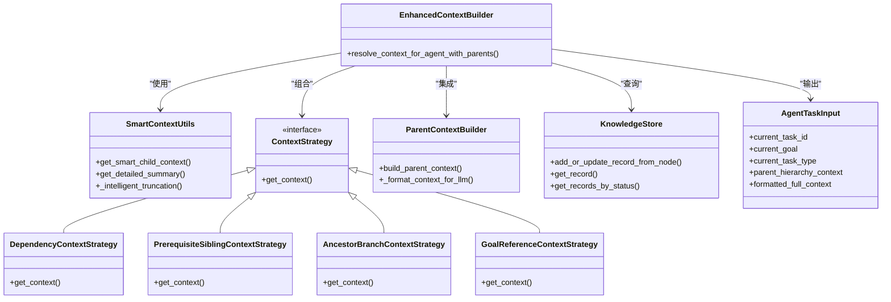
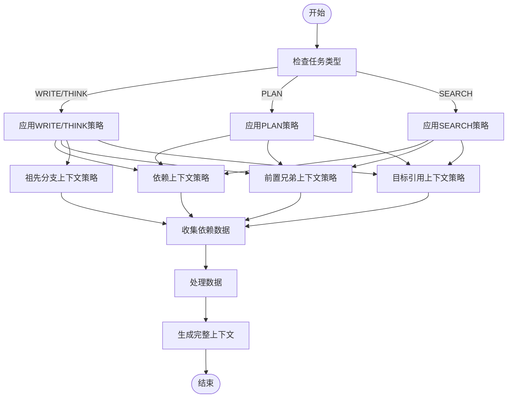
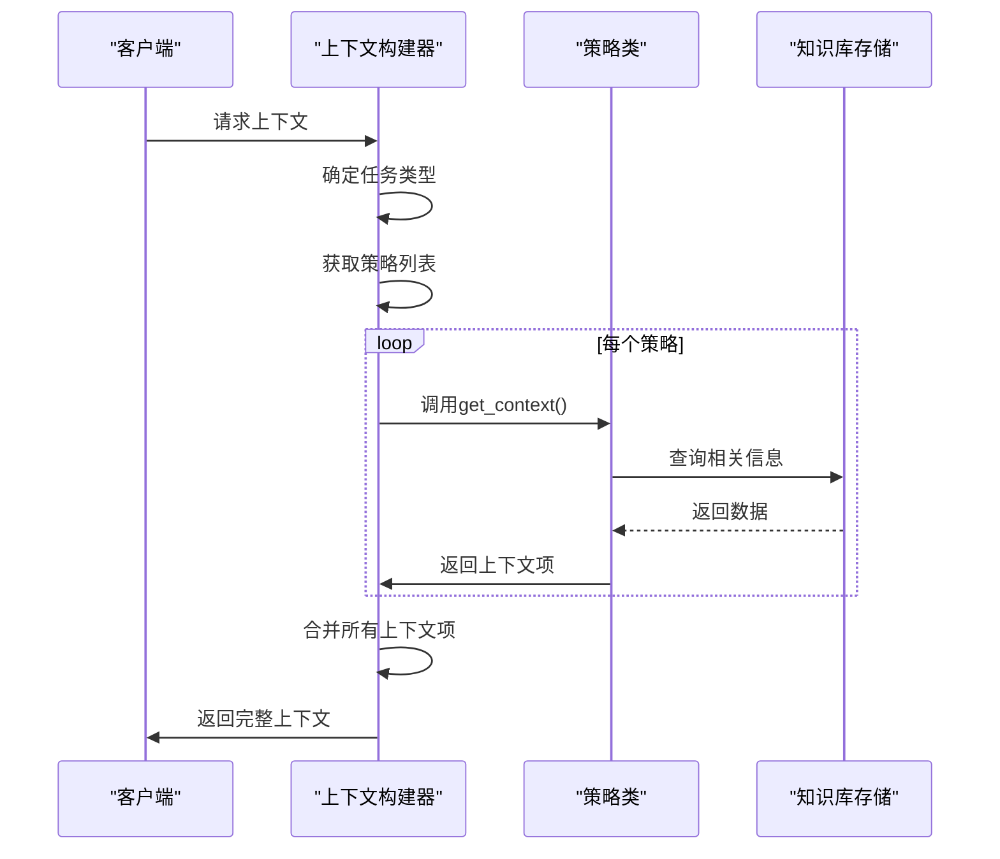
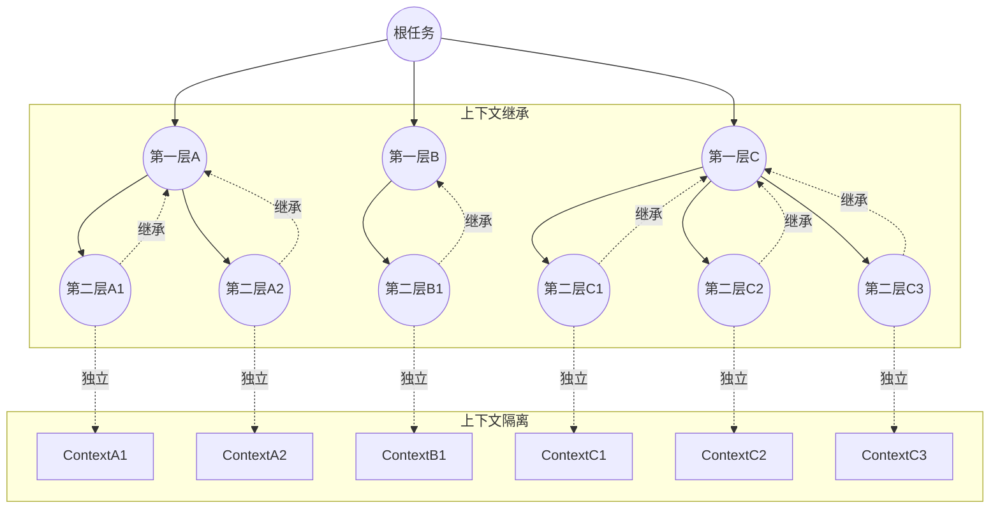

# 增强型上下文构建

<cite>
**本文档引用文件**
- [enhanced_context_builder.py](file://src\sentientresearchagent\hierarchical_agent_framework\context\enhanced_context_builder.py)
- [smart_context_utils.py](file://src\sentientresearchagent\hierarchical_agent_framework\context\smart_context_utils.py)
- [parent_context_builder.py](file://src\sentientresearchagent\hierarchical_agent_framework\context\parent_context_builder.py)
- [context_builder.py](file://src\sentientresearchagent\hierarchical_agent_framework\context\context_builder.py)
- [strategies.py](file://src\sentientresearchagent\hierarchical_agent_framework\context\strategies.py)
- [knowledge_store.py](file://src\sentientresearchagent\hierarchical_agent_framework\context\knowledge_store.py)
- [agent_io_models.py](file://src\sentientresearchagent\hierarchical_agent_framework\context\agent_io_models.py)
</cite>

## 目录
1. [引言](#引言)
2. [核心架构与设计模式](#核心架构与设计模式)
3. [多源信息融合机制](#多源信息融合机制)
4. [策略类动态调用流程](#策略类动态调用流程)
5. [SmartContextUtils协作关系](#smartcontextutils协作关系)
6. [递归子任务上下文管理](#递归子任务上下文管理)
7. [实际案例分析](#实际案例分析)
8. [性能瓶颈与优化方案](#性能瓶颈与优化方案)
9. [结论](#结论)

## 引言
增强型上下文构建模块是智能研究代理系统的核心组件，负责在复杂研究任务中整合来自知识库、实时工具调用和人机交互反馈（HITL）的多源信息。该模块通过动态调用不同策略类实现上下文扩展，确保代理在执行过程中能够获取全面且相关的背景信息。

## 核心架构与设计模式
增强型上下文构建采用分层架构设计，主要由`EnhancedContextBuilder`、`SmartContextUtils`和多种策略类组成。系统通过`KnowledgeStore`作为中央存储库，维护所有任务记录，并利用`AgentTaskInput`模型提供结构化输入。



**图示来源**
- [enhanced_context_builder.py](file://src\sentientresearchagent\hierarchical_agent_framework\context\enhanced_context_builder.py#L1-L62)
- [smart_context_utils.py](file://src\sentientresearchagent\hierarchical_agent_framework\context\smart_context_utils.py#L1-L121)
- [strategies.py](file://src\sentientresearchagent\hierarchical_agent_framework\context\strategies.py#L22-L765)

**章节来源**
- [enhanced_context_builder.py](file://src\sentientresearchagent\hierarchical_agent_framework\context\enhanced_context_builder.py#L1-L62)
- [smart_context_utils.py](file://src\sentientresearchagent\hierarchical_agent_framework\context\smart_context_utils.py#L1-L121)

## 多源信息融合机制
增强型上下文构建模块通过多种策略实现多源信息的融合：

1. **知识库存取**：从`KnowledgeStore`中检索相关任务记录，包括已完成的任务输出和历史数据。
2. **实时工具调用结果**：集成外部工具（如网络搜索、区块链数据分析）的实时结果。
3. **人机交互反馈（HITL）**：纳入人工审核和反馈信息，提高决策质量。

系统通过`TASK_TYPE_STRATEGY_MAPPING`配置不同任务类型的上下文构建策略，确保不同类型的任务能够获取最相关的上下文信息。



**图示来源**
- [context_builder.py](file://src\sentientresearchagent\hierarchical_agent_framework\context\context_builder.py#L38-L77)
- [strategies.py](file://src\sentientresearchagent\hierarchical_agent_framework\context\strategies.py#L22-L765)

**章节来源**
- [context_builder.py](file://src\sentientresearchagent\hierarchical_agent_framework\context\context_builder.py#L38-L77)
- [strategies.py](file://src\sentientresearchagent\hierarchical_agent_framework\context\strategies.py#L22-L765)

## 策略类动态调用流程
系统根据当前任务类型动态选择并调用相应的上下文构建策略。这一过程通过`TASK_TYPE_STRATEGY_MAPPING`字典实现，该字典将任务类型映射到一组策略对象。

```python
TASK_TYPE_STRATEGY_MAPPING: Dict[str, List[ContextResolutionStrategy]] = {
    "WRITE": [
        DependencyContextStrategy(),
        PrerequisiteSiblingContextStrategy(),
        AncestorBranchContextStrategy(),
        GoalReferenceContextStrategy(),
    ],
    "THINK": [
        DependencyContextStrategy(),
        PrerequisiteSiblingContextStrategy(),
        AncestorBranchContextStrategy(),
        GoalReferenceContextStrategy(),
    ],
    "PLAN": [
        DependencyContextStrategy(),
        PrerequisiteSiblingContextStrategy(),
        GoalReferenceContextStrategy(),
    ],
    "RESEARCH_WEB": [
        DependencyContextStrategy(),
        GoalReferenceContextStrategy(),
    ],
    "SEARCH": [
        DependencyContextStrategy(),
        PrerequisiteSiblingContextStrategy(),
        GoalReferenceContextStrategy(),
    ]
}
```

每个策略类都实现了`get_context`方法，该方法接收当前任务记录、知识库存储和其他参数，返回一个`ContextItem`列表。这些策略按优先级顺序执行，确保最重要的上下文信息首先被处理。



**图示来源**
- [context_builder.py](file://src\sentientresearchagent\hierarchical_agent_framework\context\context_builder.py#L180-L292)
- [strategies.py](file://src\sentientresearchagent\hierarchical_agent_framework\context\strategies.py#L22-L765)

**章节来源**
- [context_builder.py](file://src\sentientresearchagent\hierarchical_agent_framework\context\context_builder.py#L180-L292)
- [strategies.py](file://src\sentientresearchagent\hierarchical_agent_framework\context\strategies.py#L22-L765)

## SmartContextUtils协作关系
`SmartContextUtils`模块与增强型上下文构建器紧密协作，提供智能化的上下文处理功能。其主要职责包括：

1. **智能上下文裁剪**：根据内容长度决定是否包含全文或创建详细摘要。
2. **详细摘要生成**：使用专门的摘要代理生成高质量的摘要。
3. **智能截断**：当摘要生成失败时，提供智能截断作为备用方案。

```python
def get_smart_child_context(
    content: Any, 
    child_task_goal: str,
    child_task_type: str,
    force_detailed_summary: bool = False
) -> tuple[str, str]:
    """
    用于子节点到父节点流的智能上下文大小控制。
    
    返回:
        tuple[content_text, processing_method]
        - content_text: 要向上传递的实际内容
        - processing_method: 处理方式描述 ("full", "detailed_summary")
    """
    if not content:
        return "", "empty"
    
    # 转换为字符串
    content_str = ""
    if isinstance(content, str):
        content_str = content
    elif hasattr(content, 'model_dump_json'):
        content_str = content.model_dump_json(indent=2)
    else:
        content_str = str(content)
    
    if not content_str.strip():
        return "", "empty"
    
    # 计算大小指标
    char_count = len(content_str)
    word_count = len(content_str.split())
    
    # 决策逻辑：除非内容过长，否则包含全文
    if not force_detailed_summary and word_count <= FULL_CONTENT_WORD_LIMIT and char_count <= FULL_CONTENT_CHAR_LIMIT:
        logger.info(f"包含全文内容 ({word_count} 词, {char_count} 字符)")
        return content_str, "full"
    
    # 内容过长 - 创建详细摘要
    logger.info(f"为长内容创建详细摘要 ({word_count} 词, {char_count} 字符)")
    return get_detailed_summary(content_str, child_task_goal, child_task_type), "detailed_summary"
```

这种协作关系确保了系统能够在保持上下文完整性的同时，有效管理上下文大小，避免信息过载。

**章节来源**
- [smart_context_utils.py](file://src\sentientresearchagent\hierarchical_agent_framework\context\smart_context_utils.py#L1-L121)

## 递归子任务上下文管理
在处理递归子任务时，系统采用继承与隔离相结合的机制来管理上下文。`ParentContextBuilder`负责构建父层级上下文，而`KnowledgeStore`确保每个任务都有独立的上下文空间。

### 上下文继承机制
```python
def build_parent_context(self, current_task_id: str, overall_project_goal: str) -> Optional[ParentHierarchyContext]:
    """
    为任务构建结构化的父上下文。
    
    参数:
        current_task_id: 请求上下文的任务ID
        overall_project_goal: 项目的总体目标
    
    返回:
        包含格式化父信息的ParentHierarchyContext
    """
    try:
        # 获取从当前任务到根节点的路径
        path_to_root = get_task_record_path_to_root(current_task_id, self.knowledge_store)
        
        # 🔥 FIX: 函数返回根到当前，但我们需要当前到根
        # 所以需要反转，然后获取父节点
        path_from_current = path_to_root[::-1]  # 现在: [当前, 父节点, 祖先节点, ...]
        
        if len(path_from_current) <= 1:  # 无父节点（根任务）
            return None
        
        # 当前任务是第一个，父节点随后
        current_task = path_from_current[0]
        parent_records = path_from_current[1:]  # 直接父节点到根节点
        
        # 构建带优先级的父上下文节点
        parent_nodes = []
        for i, parent_record in enumerate(parent_records):
            priority = self._determine_priority(i, len(parent_records), parent_record)
            
            parent_node = ParentContextNode(
                task_id=parent_record.task_id,
                goal=parent_record.goal,
                layer=parent_record.layer or 0,
                task_type=parent_record.task_type,
                result_summary=None,
                key_insights=None,
                constraints_identified=None,
                requirements_specified=None,
                planning_reasoning=None,
                coordination_notes=None,
                timestamp_completed=parent_record.timestamp_completed.isoformat() if parent_record.timestamp_completed else None
            )
            parent_nodes.append(parent_node)
        
        # 格式化供LLM消费
        formatted_context = self._format_context_for_llm(
            current_task=current_task,
            parent_nodes=parent_nodes,
            overall_project_goal=overall_project_goal
        )
        
        # 确定整体优先级
        overall_priority = self._determine_overall_priority(parent_nodes)
        
        # 创建位置描述
        position_desc = self._create_position_description(current_task, parent_nodes)
        
        return ParentHierarchyContext(
            current_position=position_desc,
            parent_chain=parent_nodes,
            formatted_context=formatted_context,
            priority_level=overall_priority
        )
        
    except Exception as e:
        logger.error(f"ParentContextBuilder: 为 {current_task_id} 构建上下文时出错: {e}")
        return None
```

### 上下文隔离机制
每个子任务在执行时都会创建独立的上下文空间，通过`TaskRecord`中的`aux_data`字段存储特定于任务的元数据，确保不同子任务之间的上下文不会相互干扰。



**图示来源**
- [parent_context_builder.py](file://src\sentientresearchagent\hierarchical_agent_framework\context\parent_context_builder.py#L6-L264)
- [knowledge_store.py](file://src\sentientresearchagent\hierarchical_agent_framework\context\knowledge_store.py#L12-L46)

**章节来源**
- [parent_context_builder.py](file://src\sentientresearchagent\hierarchical_agent_framework\context\parent_context_builder.py#L6-L264)
- [knowledge_store.py](file://src\sentientresearchagent\hierarchical_agent_framework\context\knowledge_store.py#L12-L46)

## 实际案例分析
考虑一个投资报告撰写任务，系统需要整合多个来源的信息来支持代理决策。

### 案例场景
假设用户请求："撰写一份关于2024年加密货币市场趋势的投资报告，重点关注ESG因素。"

### 上下文增强前后对比

#### 增强前
- **可用信息**：基本任务目标和约束
- **决策质量**：有限，缺乏具体数据支持
- **输出示例**：
```json
{
 "parent_goal": "撰写投资报告",
 "parent_constraints": ["关注2024年数据", "包含ESG因素"],
 "inherited_context": {
   "总体目标": "季度投资组合回顾",
   "风格指南": "正式"
 }
}
```

#### 增强后
- **可用信息**：整合了知识库中的历史数据、实时市场数据、先前任务的结果和人工反馈
- **决策质量**：显著提升，基于全面的数据分析
- **输出示例**：
```json
{
  "dependency_context": {
    "depends_on": ["research_task_1", "research_task_2"],
    "sibling_results": [
      {"task_id": "research_task_1", "output": "公司A分析..."},
      {"task_id": "research_task_2", "output": "公司B分析..."}
    ]
  },
  "parent_hierarchy_context": {
    "current_position": "第2层任务，位于'市场分析'之下（深度：2）",
    "parent_chain": [
      {
        "task_id": "plan_1",
        "goal": "制定研究计划",
        "layer": 1,
        "task_type": "PLAN",
        "planning_reasoning": "计划了5个子任务"
      }
    ],
    "formatted_context": "项目目标：撰写2024年加密货币市场趋势报告\n\n父任务上下文：\n  直接父任务：市场分析\n    规划方法：计划了5个子任务"
  },
  "formatted_full_context": "项目目标：撰写2024年加密货币市场趋势报告\n\n=== 同级与历史上下文 ===\n\n来源：市场分析\n类型：研究结果\n内容：比特币价格预测...\n---\n\n来源：竞争对手分析\n类型：竞争情报\n内容：以太坊市场份额...\n---"
}
```

通过上下文增强，代理能够生成更加深入和准确的分析报告，显著提高了决策质量。

**章节来源**
- [enhanced_context_builder.py](file://src\sentientresearchagent\hierarchical_agent_framework\context\enhanced_context_builder.py#L1-L62)
- [context_builder.py](file://src\sentientresearchagent\hierarchical_agent_framework\context\context_builder.py#L180-L292)

## 性能瓶颈与优化方案
尽管增强型上下文构建模块功能强大，但在实际应用中仍存在一些潜在的性能瓶颈，特别是信息冗余累积问题。

### 潜在瓶颈
1. **信息冗余累积**：随着任务层级加深，上下文信息可能重复累积，导致上下文过大。
2. **计算开销**：多个策略类的连续执行增加了计算负担。
3. **内存占用**：大量上下文数据的存储和传输消耗较多内存资源。

### 基于注意力权重的筛选优化方案
为解决上述问题，提出基于注意力权重的上下文筛选优化方案：

```python
class AttentionBasedContextFilter:
    """基于注意力权重的上下文筛选器"""
    
    def __init__(self, attention_model: AgnoAgent):
        self.attention_model = attention_model
    
    def calculate_attention_weights(self, context_items: List[ContextItem], 
                                  current_task_goal: str) -> Dict[str, float]:
        """
        计算每个上下文项的注意力权重。
        
        参数:
            context_items: 上下文项列表
            current_task_goal: 当前任务目标
            
        返回:
            任务ID到注意力权重的映射
        """
        weights = {}
        for item in context_items:
            prompt = f"""
            任务目标: {current_task_goal}
            上下文项目标: {item.source_task_goal}
            内容类型: {item.content_type_description}
            内容摘要: {str(item.content)[:500]}...
            
            请评估此上下文项对完成上述任务目标的重要性，
            用0-1之间的数值表示重要性程度。
            只返回数字，不要解释。
            """
            try:
                response = self.attention_model.run(prompt)
                weight = float(response.content.strip())
                weights[item.source_task_id] = max(0, min(1, weight))  # 确保在0-1范围内
            except:
                weights[item.source_task_id] = 0.5  # 默认权重
                
        return weights
    
    def filter_context_by_attention(self, context_items: List[ContextItem],
                                  current_task_goal: str,
                                  top_k: int = 10) -> List[ContextItem]:
        """
        根据注意力权重筛选上下文项。
        
        参数:
            context_items: 原始上下文项列表
            current_task_goal: 当前任务目标
            top_k: 保留的最高权重项数量
            
        返回:
            筛选后的上下文项列表
        """
        if not context_items:
            return []
            
        # 计算注意力权重
        weights = self.calculate_attention_weights(context_items, current_task_goal)
        
        # 按权重排序并选择top-k
        sorted_items = sorted(context_items, 
                            key=lambda x: weights.get(x.source_task_id, 0), 
                            reverse=True)
        
        return sorted_items[:top_k]
```

该优化方案通过以下步骤实现：
1. 使用专门的注意力模型评估每个上下文项与当前任务目标的相关性。
2. 为每个上下文项分配一个0-1之间的注意力权重。
3. 根据权重对上下文项进行排序，并只保留最重要的top-k项。

这种方法可以有效减少信息冗余，同时确保最关键的上下文信息被保留，从而在保证决策质量的同时优化系统性能。

**章节来源**
- [smart_context_utils.py](file://src\sentientresearchagent\hierarchical_agent_framework\context\smart_context_utils.py#L1-L121)
- [utility_agents.py](file://src\sentientresearchagent\hierarchical_agent_framework\agents\definitions\utility_agents.py#L20-L20)

## 结论
增强型上下文构建模块通过创新的设计架构和灵活的策略机制，成功实现了在复杂研究任务中对多源信息的有效融合。系统不仅能够从知识库、实时工具调用和人机交互反馈中提取关键信息，还能通过`SmartContextUtils`实现智能化的上下文处理。

在递归子任务处理方面，系统采用了继承与隔离相结合的机制，既保证了上下文的连贯性，又避免了不同任务间的干扰。实际案例表明，经过上下文增强的代理能够做出更高质量的决策。

针对信息冗余累积等潜在瓶颈，提出的基于注意力权重的筛选优化方案为系统性能提升提供了新的方向。未来的工作可以进一步探索更高效的注意力机制和自适应的上下文管理策略，以应对日益复杂的任务需求。