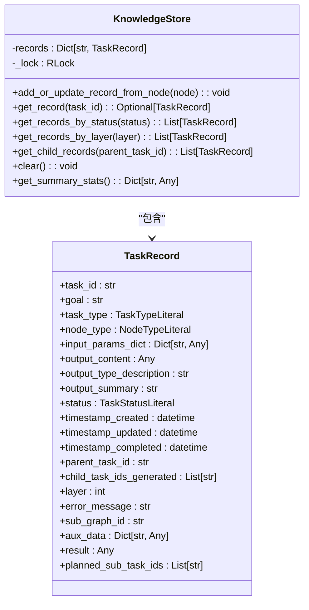
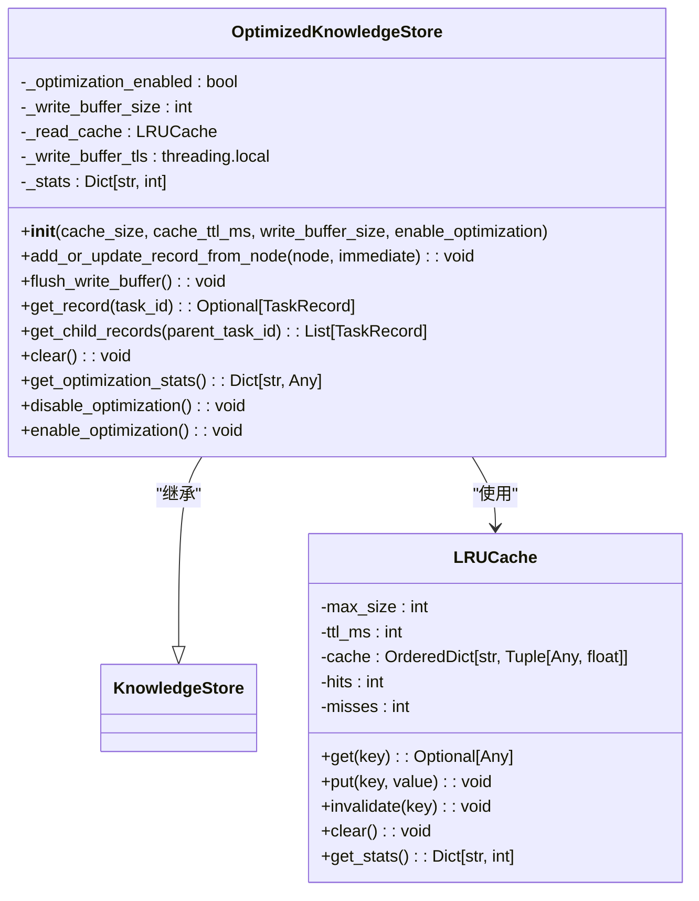
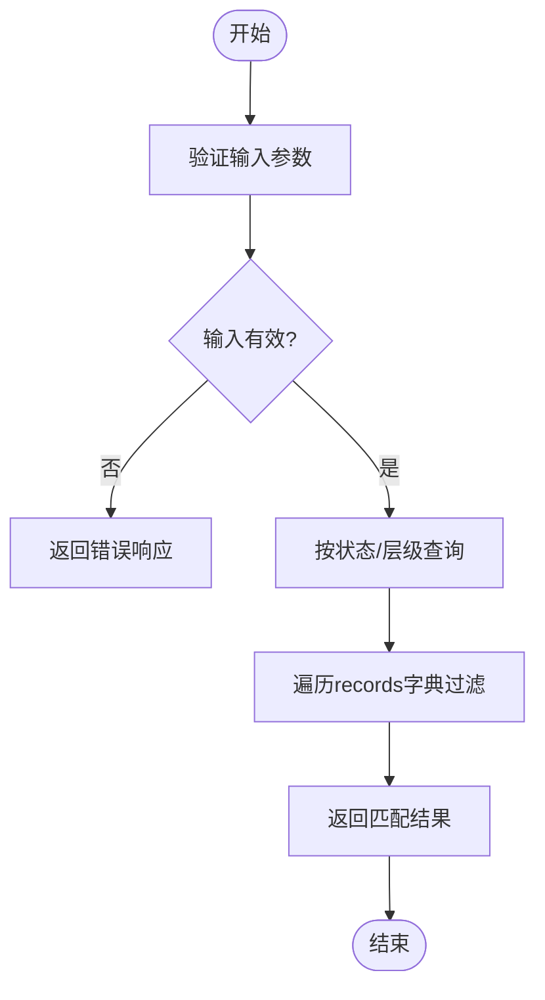
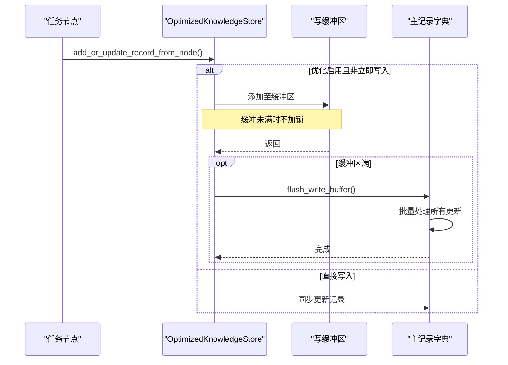
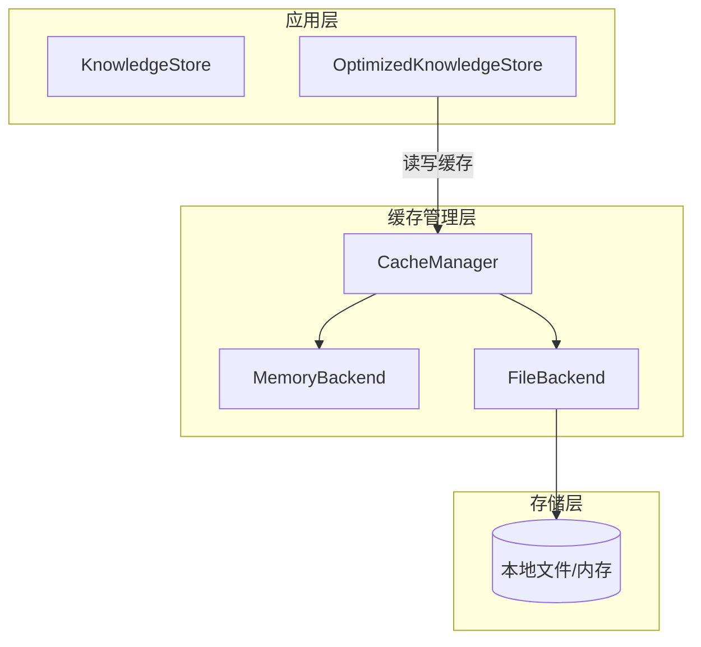
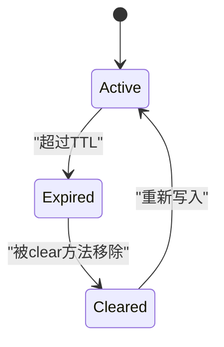

# 知识存储系统

<cite>
**本文档中引用的文件**
- [knowledge_store.py](file://src\sentientresearchagent\hierarchical_agent_framework\context\knowledge_store.py)
- [optimized_knowledge_store.py](file://src\sentientresearchagent\hierarchical_agent_framework\context\optimized_knowledge_store.py)
- [cache_manager.py](file://src\sentientresearchagent\core\cache\cache_manager.py)
</cite>

## 目录
1. [引言](#引言)
2. [核心组件分析](#核心组件分析)
3. [知识条目建模与索引结构](#知识条目建模与索引结构)
4. [基础版与优化版对比](#基础版与优化版对比)
5. [缓存预热、批量写入与增量更新策略](#缓存预热批量写入与增量更新策略)
6. [与CacheManager的协同工作模式](#与cachemanager的协同工作模式)
7. [典型使用场景](#典型使用场景)
8. [数据版本控制与过期清理](#数据版本控制与过期清理)
9. [安全访问控制](#安全访问控制)
10. [结论](#结论)

## 引言
本系统旨在实现一个持久化的知识管理机制，支持长期记忆回溯和跨项目知识迁移。通过`KnowledgeStore`及其优化版本`OptimizedKnowledgeStore`，系统提供了高效的知识条目存储、检索和上下文一致性保障能力。结合`CacheManager`多级缓存架构，在降低数据库压力的同时确保了高性能的数据访问。

## 核心组件分析

### KnowledgeStore 基础实现
`KnowledgeStore`作为任务记录的核心仓库，采用线程安全的字典结构存储所有任务的历史记录，并提供基于任务ID、状态、层级等维度的查询接口。



**图示来源**
- [knowledge_store.py](file://src\sentientresearchagent\hierarchical_agent_framework\context\knowledge_store.py#L48-L138)

**节来源**
- [knowledge_store.py](file://src\sentientresearchagent\hierarchical_agent_framework\context\knowledge_store.py#L48-L138)

### OptimizedKnowledgeStore 优化实现
`OptimizedKnowledgeStore`继承自`KnowledgeStore`，引入读缓存（LRU）、写缓冲区和统计信息收集等功能，显著提升高并发场景下的性能表现。



**图示来源**
- [optimized_knowledge_store.py](file://src\sentientresearchagent\hierarchical_agent_framework\context\optimized_knowledge_store.py#L75-L275)

**节来源**
- [optimized_knowledge_store.py](file://src\sentientresearchagent\hierarchical_agent_framework\context\optimized_knowledge_store.py#L75-L275)

## 知识条目建模与索引结构

### 知识条目模型设计
`TaskRecord`类定义了完整的任务历史记录结构，包含任务元数据、输入输出、执行状态、父子关系及辅助数据字段，支持复杂依赖解析和上下文构建。

#### 主要字段说明：
| 字段名 | 类型 | 描述 |
|-------|------|------|
| task_id | str | 任务唯一标识符 |
| goal | str | 任务目标描述 |
| task_type | TaskTypeLiteral | 任务类型（如搜索、执行、规划） |
| node_type | NodeTypeLiteral | 节点类型 |
| input_params_dict | Dict[str, Any] | 输入参数字典 |
| output_content | Any | 输出内容 |
| status | TaskStatusLiteral | 当前状态（待处理、进行中、已完成等） |
| parent_task_id | str | 父任务ID |
| child_task_ids_generated | List[str] | 生成的子任务ID列表 |
| layer | int | 执行层级 |
| aux_data | Dict[str, Any] | 辅助数据（用于依赖解析等） |

**节来源**
- [knowledge_store.py](file://src\sentientresearchagent\hierarchical_agent_framework\context\knowledge_store.py#L4-L46)

### 索引与检索机制
系统通过内存字典直接索引`task_id`实现O(1)级别的快速查找，并支持按状态、层级、父任务等条件进行过滤查询。



**节来源**
- [knowledge_store.py](file://src\sentientresearchagent\hierarchical_agent_framework\context\knowledge_store.py#L97-L138)

## 基础版与优化版对比

### 查询效率对比
| 指标 | KnowledgeStore | OptimizedKnowledgeStore |
|------|----------------|-------------------------|
| 单次读取复杂度 | O(1) | O(1) 平均，缓存命中时更快 |
| 写入延迟 | 同步写入，低延迟 | 可配置缓冲，批量提交降低峰值负载 |
| 锁竞争 | 高频读写需获取锁 | 读操作优先走缓存，减少锁争用 |

### 内存占用对比
| 指标 | KnowledgeStore | OptimizedKnowledgeStore |
|------|----------------|-------------------------|
| 基础存储 | records字典 | records字典 + LRU缓存 |
| 缓存开销 | 无额外缓存 | 默认1000条记录缓存容量 |
| 写缓冲 | 无 | 线程局部缓冲区，默认100条 |

**节来源**
- [optimized_knowledge_store.py](file://src\sentientresearchagent\hierarchical_agent_framework\context\optimized_knowledge_store.py#L75-L275)

## 缓存预热、批量写入与增量更新策略

### 批量写入机制
`OptimizedKnowledgeStore`通过线程局部缓冲区暂存写操作，达到阈值后批量刷新到主存储，有效减少锁持有时间和日志输出频率。



**图示来源**
- [optimized_knowledge_store.py](file://src\sentientresearchagent\hierarchical_agent_framework\context\optimized_knowledge_store.py#L128-L197)

**节来源**
- [optimized_knowledge_store.py](file://src\sentientresearchagent\hierarchical_agent_framework\context\optimized_knowledge_store.py#L128-L197)

### 增量更新策略
每次调用`add_or_update_record_from_node`都会创建或覆盖现有记录，实现自然的增量更新。缓存层会自动失效对应键值，保证数据一致性。

### 缓存预热机制
虽然当前代码未显式实现启动时的缓存预热，但高频访问的记录会在首次读取后自动进入LRU缓存，形成"被动预热"效果。

## 与CacheManager的协同工作模式

### 协同架构设计
`KnowledgeStore`专注于内存中的任务上下文管理，而`CacheManager`提供跨会话、持久化的通用缓存服务，二者分工明确又互补。



**图示来源**
- [cache_manager.py](file://src\sentientresearchagent\core\cache\cache_manager.py#L305-L504)

### 一致性保障机制
- **跨会话一致性**：通过`CacheManager`的文件后端实现跨进程/重启后的数据共享。
- **内存压力控制**：`KnowledgeStore`仅保留当前会话活跃数据，长期缓存交由`CacheManager`管理。
- **命名空间隔离**：`CacheManager`使用namespace+identifier+context生成唯一键，避免冲突。

**节来源**
- [cache_manager.py](file://src\sentientresearchagent\core\cache\cache_manager.py#L305-L504)

## 典型使用场景

### 长期记忆回溯
利用`KnowledgeStore.get_record()`和`get_child_records()`追溯任意任务的历史执行情况，支持调试和审计。

```python
# 示例：回溯某个计划任务的所有子任务
record = knowledge_store.get_record("plan_task_123")
children = knowledge_store.get_child_records("plan_task_123")
```

### 跨项目知识迁移
通过序列化`KnowledgeStore.records`并配合`CacheManager.set()`将知识持久化，可在不同项目间迁移上下文。

```python
# 导出知识
cache_manager.set("knowledge", "project_v1", knowledge_store.records)

# 导入知识
imported_records = cache_manager.get("knowledge", "project_v1")
if imported_records:
    for task_id, record in imported_records.items():
        knowledge_store.records[task_id] = record
```

**节来源**
- [knowledge_store.py](file://src\sentientresearchagent\hierarchical_agent_framework\context\knowledge_store.py#L97-L138)
- [cache_manager.py](file://src\sentientresearchagent\core\cache\cache_manager.py#L356-L387)

## 数据版本控制与过期清理

### 版本控制机制
目前系统主要通过`timestamp_updated`字段追踪记录变更时间，支持基于时间戳的版本比较和恢复。

### 过期清理策略
- `KnowledgeStore.clear()`：清除所有内存记录
- `CacheManager` TTL机制：基于配置自动过期
- `clear_namespace()`：按命名空间批量清理



**节来源**
- [cache_manager.py](file://src\sentientresearchagent\core\cache\cache_manager.py#L471-L480)

## 安全访问控制

### 访问权限设计
当前系统运行在可信环境中，未实现细粒度的RBAC权限控制。安全性主要依赖：
- 内部模块间调用的信任关系
- `CacheManager`的命名空间隔离防止越权访问
- 日志审计跟踪所有关键操作

### 敏感数据处理
建议敏感信息不在`TaskRecord.aux_data`中明文存储，可通过外部加密服务处理后再存入。

**节来源**
- [cache_manager.py](file://src\sentientresearchagent\core\cache\cache_manager.py#L333-L354)

## 结论
`KnowledgeStore`系列组件构建了一个高效、可扩展的知识管理系统。基础版提供了可靠的内存存储能力，优化版通过缓存和批量写入显著提升了性能。与`CacheManager`的协同工作实现了内存与持久化存储的优势互补，为长期记忆管理和跨项目知识迁移提供了坚实基础。未来可进一步增强版本控制、压缩算法和安全访问机制。