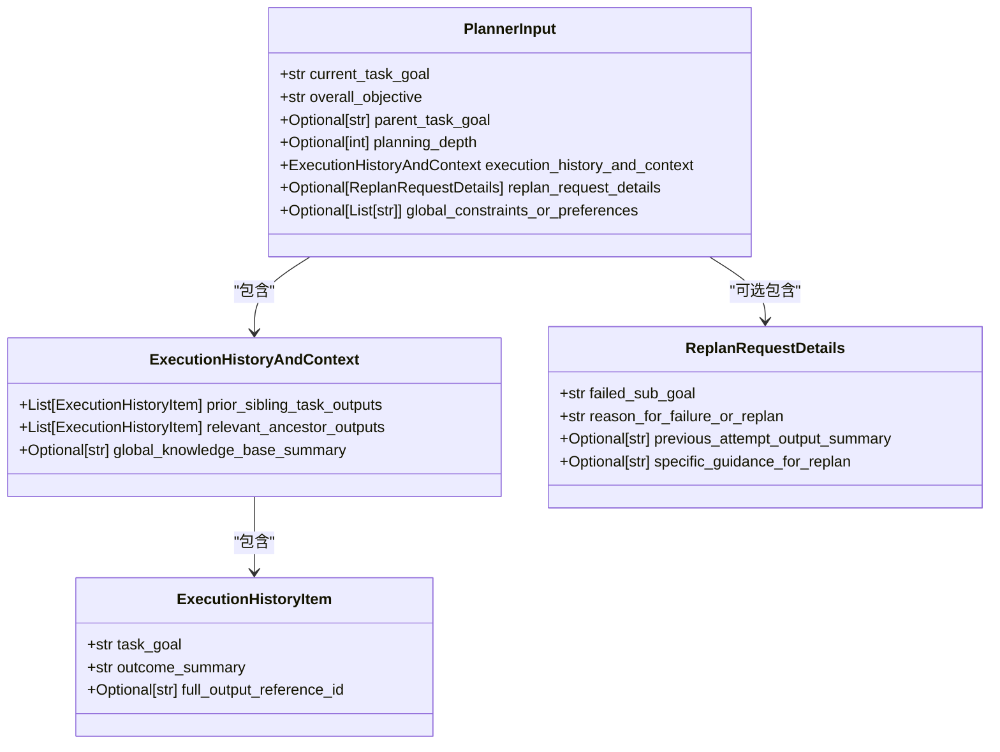
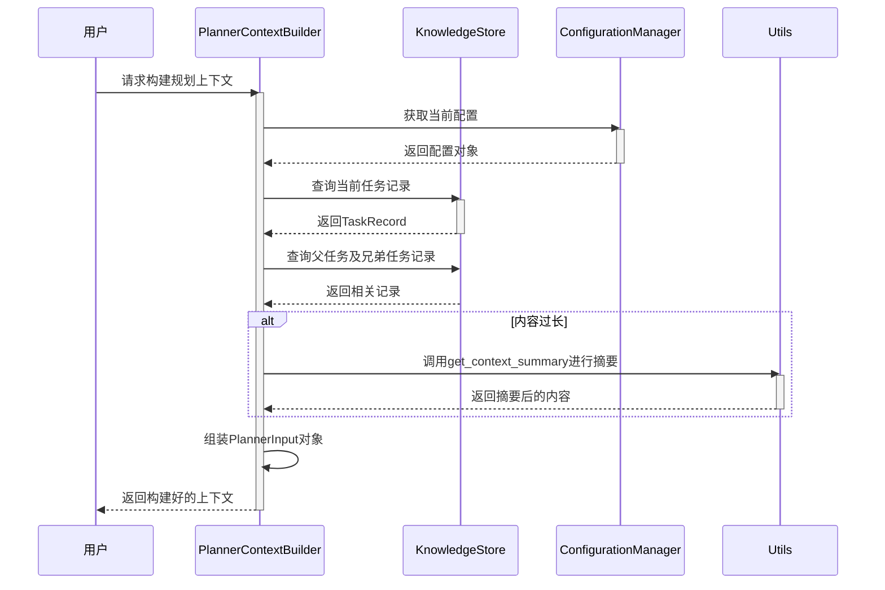

# 规划上下文构建器

<cite>
**本文档中引用的文件**
- [planner_context_builder.py](file://src\sentientresearchagent\hierarchical_agent_framework\context\planner_context_builder.py)
- [unified_config.py](file://src\sentientresearchagent\config\unified_config.py)
- [agent_io_models.py](file://src\sentientresearchagent\hierarchical_agent_framework\context\agent_io_models.py)
- [knowledge_store.py](file://src\sentientresearchagent\hierarchical_agent_framework\context\knowledge_store.py)
- [context_utils.py](file://src\sentientresearchagent\hierarchical_agent_framework\context\context_utils.py)
- [utils.py](file://src\sentientresearchagent\hierarchical_agent_framework\agents\utils.py)
</cite>

## 目录
1. [引言](#引言)
2. [核心机制概述](#核心机制概述)
3. [上下文分层组装过程](#上下文分层组装过程)
4. [与UnifiedConfig的集成](#与unifiedconfig的集成)
5. [性能优化建议](#性能优化建议)
6. [结论](#结论)

## 引言
`planner_context_builder.py` 是一个关键模块，负责为高层规划代理构造结构化输入上下文。该模块通过整合用户查询、项目目标、历史执行轨迹和约束条件，并利用模板引擎生成符合LLM理解格式的提示文本，从而支持复杂的多跳推理任务。本文将深入分析其实现机制，详细说明其如何实现上下文的分层组装、元数据注入、任务边界定义以及多跳推理引导策略。

## 核心机制概述

`planner_context_builder.py` 模块的核心功能是 `resolve_input_for_planner_agent` 函数，它负责构建并返回一个 `PlannerInput` 对象，作为规划代理的输入。此函数接收当前任务ID、知识存储（KnowledgeStore）、总体目标等参数，并从知识库中提取相关信息以构建完整的上下文。

该模块依赖于多个辅助函数来完成上下文的构建：
- `_get_parent_context_for_planner`: 用于提取父任务的输出摘要。
- `_get_prior_sibling_context_for_planner`: 用于收集先前兄弟任务的输出结果。
- `get_task_record_path_to_root`: 辅助函数，用于获取从指定任务到根任务的路径记录。

这些函数共同协作，确保规划代理能够获得足够的上下文信息来进行有效的决策和计划制定。

**本节来源**
- [planner_context_builder.py](file://src\sentientresearchagent\hierarchical_agent_framework\context\planner_context_builder.py#L1-L229)

## 上下文分层组装过程

### 元数据注入
在构建上下文时，`resolve_input_for_planner_agent` 首先会检查当前任务是否存在对应的 `TaskRecord`。如果存在，则从中提取当前任务的目标 (`current_task_goal`) 和其他相关元数据。此外，还会根据任务的层级关系确定父任务的目标 (`parent_task_goal`)，并将这些信息包含在最终的 `PlannerInput` 中。

### 任务边界定义
为了明确任务的范围和边界，模块使用了 `planning_depth` 参数来表示当前递归深度。这有助于区分不同层次的任务，并防止无限递归或循环引用的发生。同时，通过 `replan_request_details` 字段可以传递重新规划请求的详细信息，使得系统能够在必要时调整原有的计划。

### 多跳推理引导策略
为了支持多跳推理，模块引入了 `ExecutionHistoryAndContext` 类型，其中包含了两个重要的列表：
- `prior_sibling_task_outputs`: 存储之前已完成的兄弟任务的输出摘要。
- `relevant_ancestor_outputs`: 存储相关的祖先任务输出摘要。

这两个列表允许规划代理访问历史执行轨迹中的关键信息，从而进行更深层次的推理和决策。例如，在处理复杂问题时，代理可以根据之前的尝试结果选择不同的解决方案路径。

**图表来源**
- [agent_io_models.py](file://src\sentientresearchagent\hierarchical_agent_framework\context\agent_io_models.py#L190-L202)
- [planner_context_builder.py](file://src\sentientresearchagent\hierarchical_agent_framework\context\planner_context_builder.py#L153-L228)

**本节来源**
- [planner_context_builder.py](file://src\sentientresearchagent\hierarchical_agent_framework\context\planner_context_builder.py#L10-L150)
- [agent_io_models.py](file://src\sentientresearchagent\hierarchical_agent_framework\context\agent_io_models.py#L177-L202)

## 与UnifiedConfig的集成

`planner_context_builder.py` 模块与 `UnifiedConfig` 系统紧密集成，以确保配置的一致性和灵活性。`UnifiedConfig` 提供了一个全局的配置管理器，允许动态加载和覆盖配置项。具体来说，以下配置项对上下文构建过程有重要影响：

- **上下文长度限制**: 通过 `TARGET_WORD_COUNT_FOR_CTX_SUMMARIES` 常量控制每个上下文块的最大字数。当原始内容超过此阈值时，系统会自动调用 `get_context_summary` 函数对其进行摘要处理。
- **关键信息加权**: 虽然目前没有直接体现“加权”逻辑，但可以通过自定义 `SUMMARIZER_SYSTEM_MESSAGE` 来指导摘要模型优先保留某些类型的信息，间接实现加权效果。

此外，`ConfigurationManager` 支持临时覆盖配置，这对于测试不同场景下的行为非常有用。例如，在调试模式下可以降低上下文长度限制以便更快地观察结果变化。

**图表来源**
- [unified_config.py](file://src\sentientresearchagent\config\unified_config.py#L1-L248)
- [planner_context_builder.py](file://src\sentientresearchagent\hierarchical_agent_framework\context\planner_context_builder.py#L153-L228)

**本节来源**
- [unified_config.py](file://src\sentientresearchagent\config\unified_config.py#L1-L248)
- [planner_context_builder.py](file://src\sentientresearchagent\hierarchical_agent_framework\context\planner_context_builder.py#L153-L228)

## 性能优化建议

### 延迟加载非必要上下文块
对于大型项目而言，一次性加载所有历史执行轨迹可能会导致内存占用过高。因此，建议采用延迟加载策略，仅在需要时才从知识库中读取特定任务的详细信息。这样不仅可以减少初始加载时间，还能有效避免不必要的资源消耗。

### 动态截断长历史记录
尽管 `get_context_summary` 已经提供了基本的摘要功能，但在极端情况下仍可能出现过长的文本片段。为此，可以在 `get_context_summary` 函数内部增加额外的字符数检查，并设置硬性上限（如 `MAX_SUMMARY_LENGTH_FALLBACK_CHARS`）。一旦超出该限制，立即进行截断操作并附加省略号标记。

### 缓存频繁访问的数据
考虑到某些任务可能被多次引用，建议引入缓存机制来存储常用的 `TaskRecord` 或摘要结果。这样可以显著提高后续查询的速度，尤其是在高并发环境下表现尤为明显。

### 并行处理独立任务
在构建上下文的过程中，许多子任务实际上是相互独立的，比如获取各个兄弟任务的输出摘要。通过并行化这些操作，可以大幅缩短整体处理时间。Python 的 `concurrent.futures` 模块为此类场景提供了良好的支持。

## 结论
`planner_context_builder.py` 模块通过精心设计的架构实现了高效且灵活的上下文构建能力。它不仅能够准确地整合各种来源的信息，还具备强大的扩展性和可维护性。未来的工作方向包括进一步优化摘要算法、增强错误恢复机制以及探索更多高级特性，如基于机器学习的智能推荐等。