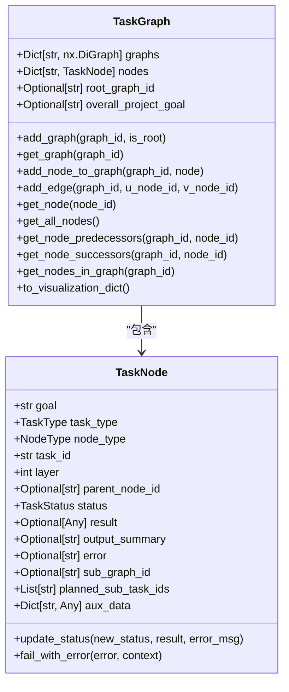
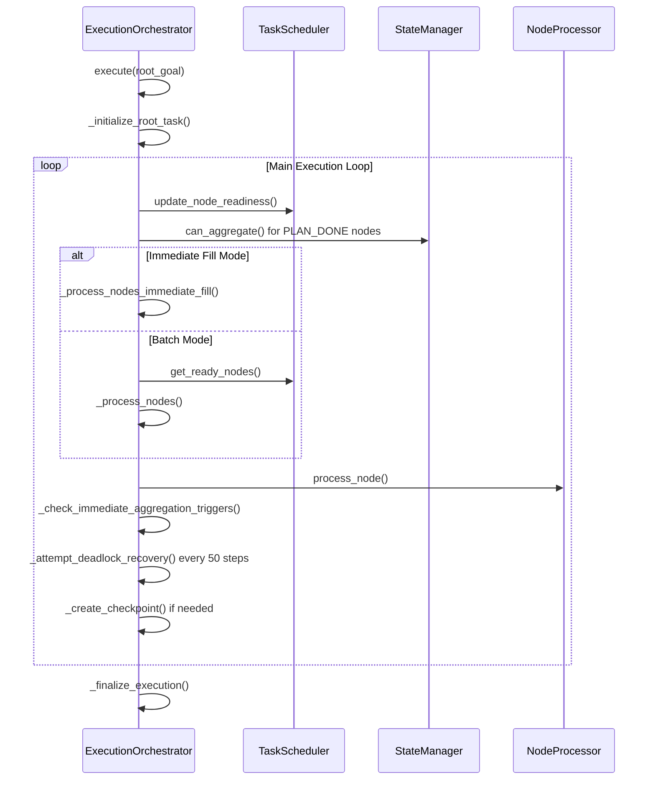
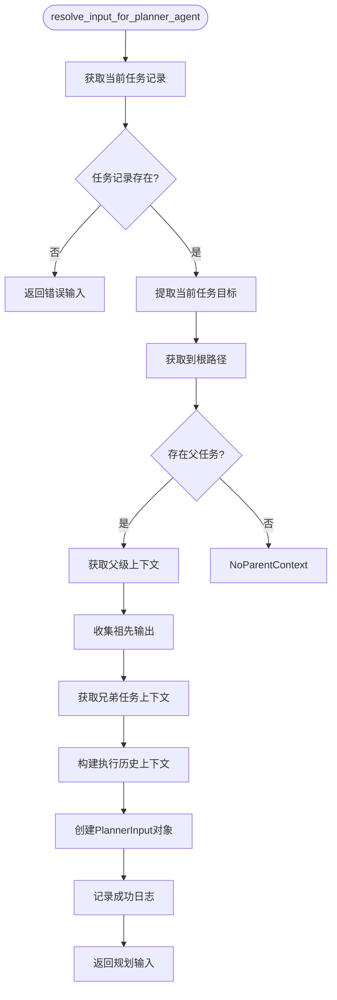

# 代理框架

<cite>
**本文档中引用的文件**  
- [agents.yaml](file://src\sentientresearchagent\hierarchical_agent_framework\agent_configs\agents.yaml)
- [task_graph.py](file://src\sentientresearchagent\hierarchical_agent_framework\graph\task_graph.py)
- [execution_orchestrator.py](file://src\sentientresearchagent\hierarchical_agent_framework\orchestration\execution_orchestrator.py)
- [planner_context_builder.py](file://src\sentientresearchagent\hierarchical_agent_framework\context\planner_context_builder.py)
- [task_node.py](file://src\sentientresearchagent\hierarchical_agent_framework\node\task_node.py)
</cite>

## 目录
1. [引言](#引言)
2. [多层级代理角色与职责划分](#多层级代理角色与职责划分)
3. [任务图构建机制](#任务图构建机制)
4. [执行调度器核心功能](#执行调度器核心功能)
5. [上下文构建器工作原理](#上下文构建器工作原理)
6. [从目标到原子操作的转化流程](#从目标到原子操作的转化流程)
7. [调优方法论](#调优方法论)
8. [结论](#结论)

## 引言
本技术文档深入解析分层代理框架的核心架构与运行机制。该框架通过递归任务分解与自主执行能力，实现复杂目标的智能求解。系统采用多层级代理协同模式，包括规划者（planner）、执行者（executor）和搜索者（searcher），各司其职并高效协作。任务图（task graph）作为核心数据结构，记录了任务间的依赖关系与执行计划。执行调度器（execution orchestrator）负责协调并行任务、检测死锁及失败恢复。上下文构建器（planner context builder）则聚合历史信息以支持智能决策。本文将结合代码逻辑，全面揭示从高层目标到原子操作的完整转化路径，并为AI工程团队提供行为调优、提示工程改进与性能瓶颈诊断的方法论。

## 多层级代理角色与职责划分
分层代理框架在`agents.yaml`配置文件中定义了多种代理类型，每种代理具有明确的角色分工与职责边界。这些代理通过类型（type）字段进行分类，主要包括规划者、执行者、自定义搜索者、聚合器和原子化器等。

### 规划者代理（Planner Agents）
规划者代理负责将复杂目标分解为可管理的子任务。根据任务性质的不同，系统配置了多个专用规划者：
- **EnhancedSearchPlanner**：专为搜索型研究任务优化，具备日期感知和并行执行能力。
- **EnhancedThinkPlanner**：针对分析推理类任务设计，确保逻辑连贯性。
- **EnhancedWritePlanner**：专注于内容生成类任务，保证输出质量。
- **DeepResearchPlanner**：作为主规划者，负责高层次研究项目的整体策略制定。
- **CryptoAnalyticsPlanner**：面向加密货币与DeFi分析领域，具备深度专业知识。

所有规划者均使用`PlannerAdapter`适配器类，并通过`prompt_source`指定不同的系统提示词，以适应特定领域的规划需求。

### 执行者代理（Executor Agents）
执行者代理负责执行原子级别的具体任务，如搜索、写作或思考。关键执行者包括：
- **BasicReasoningExecutor**：执行信息的分析与综合，利用Python工具和推理工具进行深度处理。
- **BasicReportWriter**：基于提供的上下文撰写详细报告。
- **SmartWebSearcher**：结合AI驱动的搜索与维基百科资源，进行智能化信息检索。
- **CryptoMarketAnalyzer**：高级加密市场分析师，集成Binance、Coingecko、DefiLlama等多个工具包，用于技术分析和链上指标计算。

执行者通过`tools`字段声明所需工具，并由`ExecutorAdapter`统一调度。

### 自定义搜索代理（Custom Search Agents）
自定义搜索代理绕过LLM开销，直接调用API进行高效搜索：
- **OpenAICustomSearcher**：使用OpenAI的搜索能力，支持通过OpenRouter路由。
- **GeminiCustomSearcher**：利用Google Gemini的搜索功能。
- **ExaComprehensiveSearcher**：通过Exa API进行综合性搜索，优先选择可靠来源。

这类代理显著提升了搜索效率，适用于对响应速度要求较高的场景。

### 聚合器代理（Aggregator Agents）
聚合器代理负责合并子任务的结果：
- **DefaultAggregator**：通用结果合成器。
- **SearchAggregator**：专门用于合并搜索结果，具备去重和相关性排序功能。
- **ThinkAggregator**：合成分析输出，得出逻辑结论。
- **WriteAggregator**：整合书面内容，注重叙事流畅性和一致性。
- **RootResearchAggregator**：根级研究任务的主聚合器，提供战略建议。

不同类型的聚合器使用不同的提示词模板，确保聚合过程符合任务特性。

### 原子化器与计划修改器
- **DefaultAtomizer**：判断任务是否已原子化，决定是否需要进一步拆分。
- **PlanModifier**：根据用户反馈修改现有计划，支持动态调整执行路径。

**Section sources**
- [agents.yaml](file://src\sentientresearchagent\hierarchical_agent_framework\agent_configs\agents.yaml#L1-L586)

## 任务图构建机制
任务图是整个代理框架的核心数据结构，由`TaskGraph`类实现，位于`task_graph.py`文件中。它采用有向无环图（DAG）的形式来表示任务之间的依赖关系。

### 任务节点创建
每个任务由`TaskNode`类表示，包含以下关键属性：
- `goal`：任务目标描述。
- `task_type`：任务类型（如WRITE, SEARCH, THINK）。
- `node_type`：节点类型（PLAN或EXECUTE）。
- `status`：当前状态（PENDING, READY, RUNNING, DONE等）。
- `layer`：规划深度，反映任务在层次结构中的层级。
- `parent_node_id`：父任务ID，用于建立父子关系。
- `sub_graph_id`：子任务图ID，指向其下属的任务图。

当一个新任务被创建时，系统会为其分配唯一ID，并初始化状态为PENDING。

### 依赖关系建立
任务图通过添加边（edge）来建立任务间的依赖关系。`add_edge`方法在两个节点之间创建有向边，表示前驱任务必须完成后继任务才能开始。这种机制确保了任务按正确的顺序执行。

**Diagram sources**
- [task_node.py](file://src\sentientresearchagent\hierarchical_agent_framework\node\task_node.py#L18-L285)
- [task_graph.py](file://src\sentientresearchagent\hierarchical_agent_framework\graph\task_graph.py#L12-L137)

### 执行计划生成
当规划者代理完成任务分解后，生成的子任务会被逐一添加到任务图中。系统首先调用`add_graph`创建一个新的子图，然后使用`add_node_to_graph`将每个`TaskNode`加入该图。接着，根据任务间的逻辑依赖，通过`add_edge`建立连接。最终形成一棵或多棵任务树，构成完整的执行计划。

**Section sources**
- [task_graph.py](file://src\sentientresearchagent\hierarchical_agent_framework\graph\task_graph.py#L1-L138)
- [task_node.py](file://src\sentientresearchagent\hierarchical_agent_framework\node\task_node.py#L18-L285)

## 执行调度器核心功能
执行调度器（`ExecutionOrchestrator`）是整个框架的大脑，负责协调所有组件的运行。其实现位于`execution_orchestrator.py`文件中。

### 并行任务协调
调度器支持两种并行处理模式：
1. **即时填充模式（Immediate Fill）**：一旦有空闲槽位，立即启动下一个就绪任务，最大化资源利用率。
2. **批处理模式（Batch Processing）**：定期获取一批就绪任务并行处理，适合稳定负载场景。

调度器通过`_process_nodes_immediate_fill`和`_process_nodes`方法分别实现这两种策略，并可根据配置动态切换。

### 死锁检测与恢复
系统内置死锁检测机制，通过`DeadlockDetector`组件周期性检查任务图的状态。若发现所有任务均无法推进，则判定为死锁。此时，`RecoveryManager`会介入尝试恢复，例如通过调整任务优先级或重启卡住的任务。`_attempt_deadlock_recovery`方法封装了这一逻辑，确保系统具备自我修复能力。

### 失败处理与容错
对于执行失败的任务，调度器提供多层次的恢复策略：
- 捕获异常并记录错误详情。
- 根据错误类型选择合适的恢复策略（如重试、降级或跳过）。
- 更新任务状态为FAILED，并触发后续补偿逻辑。
- 支持从检查点（checkpoint）恢复执行，避免重复劳动。

**Diagram sources**
- [execution_orchestrator.py](file://src\sentientresearchagent\hierarchical_agent_framework\orchestration\execution_orchestrator.py#L31-L927)

**Section sources**
- [execution_orchestrator.py](file://src\sentientresearchagent\hierarchical_agent_framework\orchestration\execution_orchestrator.py#L0-L799)

## 上下文构建器工作原理
上下文构建器（`planner_context_builder.py`）负责为规划者代理准备输入上下文，确保其能做出明智的决策。核心函数`resolve_input_for_planner_agent`聚合了多维度的历史信息。

### 父级上下文提取
系统通过`_get_parent_context_for_planner`函数提取父任务的输出摘要。如果原始输出过长，会自动调用`get_context_summary`进行摘要生成，确保上下文简洁有效。

### 兄弟任务上下文
`_get_prior_sibling_context_for_planner`函数收集先于当前任务执行的兄弟任务的成功输出。这使得规划者能够参考已完成工作的成果，避免重复劳动。

### 综合上下文构建
最终的规划输入（`PlannerInput`）包含：
- 当前任务目标
- 整体项目目标
- 父任务目标
- 规划深度
- 执行历史与上下文（含兄弟任务和祖先输出）
- 重规划请求细节
- 全局约束条件

此机制确保规划者拥有充分的信息来进行合理的任务分解。

**Diagram sources**
- [planner_context_builder.py](file://src\sentientresearchagent\hierarchical_agent_framework\context\planner_context_builder.py#L153-L228)

**Section sources**
- [planner_context_builder.py](file://src\sentientresearchagent\hierarchical_agent_framework\context\planner_context_builder.py#L0-L229)

## 从目标到原子操作的转化流程
整个转化流程始于一个高层目标，经过递归分解，最终落实为一系列原子操作。

1. **初始化**：系统创建根任务节点，目标为用户提供的高层目标，状态设为READY。
2. **规划阶段**：根任务被分配给合适的规划者代理（如DeepResearchPlanner）。该代理接收由上下文构建器准备的丰富上下文，生成详细的子任务列表。
3. **任务图更新**：新生成的子任务被添加到任务图中，并建立相应的依赖关系。
4. **执行阶段**：调度器监控任务状态，一旦子任务的前置条件满足，即将其状态转为READY并提交执行。
5. **原子操作执行**：每个子任务由对应的执行者代理处理。例如，搜索任务交由SmartWebSearcher，分析任务交由BasicReasoningExecutor。
6. **结果聚合**：当所有子任务完成后，其父任务状态变为PLAN_DONE，触发聚合器代理进行结果汇总。
7. **递归继续**：若聚合后的结果仍需进一步处理，则再次进入规划阶段，直至达到原子级别。
8. **最终输出**：根任务获得最终聚合结果，完成整个转化流程。

此流程体现了“分而治之”的思想，通过层层递进的方式解决复杂问题。

## 调优方法论
为提升代理框架的性能与效果，建议采取以下调优策略：

### 代理行为调优
- **模型选择**：根据任务类型选择最合适的LLM模型。例如，对于数学计算，选用Gemini；对于创意写作，选用Claude。
- **温度参数调整**：降低`temperature`值（如0.35）以提高输出稳定性，适用于需要精确答案的场景。
- **工具组合优化**：合理配置执行者的工具集，避免不必要的工具调用增加延迟。

### 提示工程改进
- **定制化提示词**：针对不同领域设计专用的系统提示词，增强代理的专业性。
- **上下文压缩**：对过长的上下文进行摘要或截断，防止超出模型上下文窗口。
- **反馈闭环**：利用`PlanModifier`代理实现人机交互式重规划，持续优化执行路径。

### 性能瓶颈诊断
- **并发控制**：监控速率限制错误，动态调整`max_concurrent_nodes`以平衡吞吐量与错误率。
- **检查点分析**：定期创建检查点，便于故障排查和性能回溯。
- **日志审计**：通过详细的状态转换日志（如`STATE TRANSITION`）追踪任务生命周期，识别卡顿环节。
- **聚合阻塞检测**：关注`PLAN_DONE`状态的任务，及时发现因子任务未完成导致的聚合阻塞。

## 结论
本文档全面剖析了分层代理框架的技术细节，展示了其如何通过多层级代理协同、任务图驱动和智能上下文管理，实现复杂目标的自主求解。该架构不仅具备强大的递归任务分解能力，还通过精细化的调度与容错机制保障了执行的可靠性。未来可通过引入更先进的规划算法、优化上下文表示学习以及增强人机协作能力，进一步提升系统的智能化水平。对于AI工程团队而言，理解并掌握上述调优方法论，将有助于充分发挥该框架的潜力，应对日益复杂的现实世界挑战。