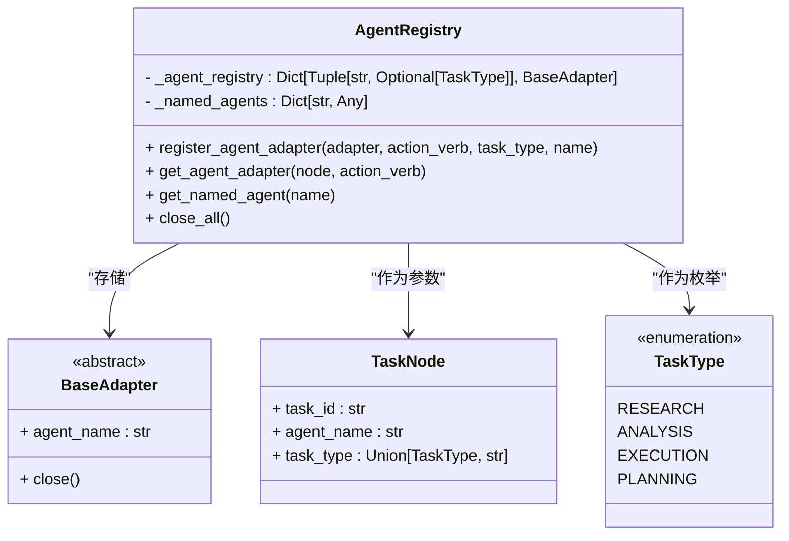
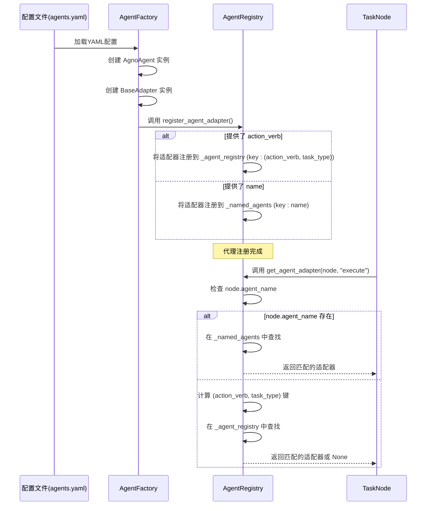

# 代理注册与发现机制

<cite>
**本文档引用的文件**
- [registry.py](file://src\sentientresearchagent\hierarchical_agent_framework\agents\registry.py)
- [agent_factory.py](file://src\sentientresearchagent\hierarchical_agent_framework\agent_configs\agent_factory.py)
- [models.py](file://src\sentientresearchagent\hierarchical_agent_framework\agent_configs\models.py)
</cite>

## 目录
1. [代理注册表核心逻辑](#代理注册表核心逻辑)
2. [基于装饰器的自动注册与运行时动态发现](#基于装饰器的自动注册与运行时动态发现)
3. [类型校验与生命周期管理](#类型校验与生命周期管理)
4. [任务调度中的代理实例化](#任务调度中的代理实例化)
5. [代理元数据结构及其交互关系](#代理元数据结构及其交互关系)
6. [扩展自定义代理类指南](#扩展自定义代理类指南)
7. [通过API查询可用代理列表](#通过api查询可用代理列表)
8. [线程安全与延迟初始化最佳实践](#线程安全与延迟初始化最佳实践)

## 代理注册表核心逻辑

`AgentRegistry` 类是整个系统中代理注册与发现的核心组件。它负责管理特定代理实例的适配器注册和检索，将之前全局的状态封装起来，使得每个代理实例完全独立，并且在多进程环境下安全使用。该类维护了两个主要的内部字典：`_agent_registry` 和 `_named_agents`。

`_agent_registry` 是一个映射（Map），其键是由动作动词（action verb）和任务类型（TaskType 枚举）组成的元组 `(str, Optional["TaskType"])`，值为 `BaseAdapter` 的实例。这个注册表用于根据动作和任务类型的组合来查找合适的代理适配器。

`_named_agents` 则是一个简单的字符串到适配器实例的映射 `Dict[str, Any]`，允许通过预定义的名称直接访问特定的代理。这种双重注册机制提供了极大的灵活性，既支持基于语义的动作-任务对查找，也支持快速的命名引用。



**图源**
- [registry.py](file://src\sentientresearchagent\hierarchical_agent_framework\agents\registry.py#L7-L145)

**节源**
- [registry.py](file://src\sentientresearchagent\hierarchical_agent_framework\agents\registry.py#L7-L145)

## 基于装饰器的自动注册与运行时动态发现

系统的代理注册机制并非依赖传统的装饰器模式，而是通过一个集中化的、程序化的流程来实现“自动”注册。这一过程由 `agent_factory.py` 中的 `AgentFactory` 类驱动，并最终调用 `registry.py` 中的 `AgentRegistry.register_agent_adapter` 方法完成实际的注册。

当系统启动或加载配置时，`AgentFactory` 会解析 YAML 配置文件（如 `agents.yaml`）。对于配置文件中的每一个代理定义，工厂会创建相应的 `AgnoAgent` 实例和 `BaseAdapter` 适配器实例。在创建完成后，工厂会检查代理配置中的 `registration` 字段。如果该字段包含 `action_keys` 或 `named_keys`，则会触发注册流程。

具体来说，`register_agent_adapter` 方法接受四个可选参数：`adapter`（适配器实例）、`action_verb`（动作动词）、`task_type`（任务类型）和 `name`（名称）。当提供 `action_verb` 时，方法会以 `(action_verb.lower(), task_type)` 为键，将适配器存入 `_agent_registry`。当提供 `name` 时，则以该名称为键，将适配器存入 `_named_agents`。这种设计实现了运行时的动态发现——所有代理都在配置加载阶段被发现并注册到中心注册表中，后续的任务执行者可以通过 `get_agent_adapter` 方法按需查找。



**图源**
- [registry.py](file://src\sentientresearchagent\hierarchical_agent_framework\agents\registry.py#L20-L59)
- [agent_factory.py](file://src\sentientresearchagent\hierarchical_agent_framework\agent_configs\agent_factory.py#L816-L933)

**节源**
- [registry.py](file://src\sentientresearchagent\hierarchical_agent_framework\agents\registry.py#L20-L59)
- [agent_factory.py](file://src\sentientresearchagent\hierarchical_agent_framework\agent_configs\agent_factory.py#L816-L933)

## 类型校验与生命周期管理

### 类型校验
系统在多个层面实施了严格的类型校验，确保了配置的正确性和运行时的安全性。

首先，在配置层面，`models.py` 文件利用 Pydantic v2 定义了一系列数据模型，如 `AgentConfig`, `ModelConfig`, `ToolkitConfig` 等。这些模型不仅定义了配置项的结构，还内置了验证规则。例如，`ModelConfig` 会验证 `provider` 是否为有效值（如 "litellm", "openai"），并在实例化时检查必要的环境变量（如 API Key）是否已设置。`AgentConfig` 会验证 `adapter_class` 是否属于预定义的有效适配器列表，并确保 `response_model` 与 `agent_type` 匹配。

其次，在运行时，`AgentRegistry` 对传入的适配器进行类型检查。`register_agent_adapter` 方法明确要求 `adapter` 参数必须是 `BaseAdapter` 的实例，否则会记录错误并拒绝注册。同样，`get_agent_adapter` 在从 `_named_agents` 查找后，也会检查返回的对象是否为 `BaseAdapter` 的实例，以防止因类型不匹配导致的运行时错误。

### 生命周期管理
`AgentRegistry` 提供了 `close_all()` 方法来管理注册代理的生命周期。该方法会遍历 `_agent_registry` 和 `_named_agents` 中的所有适配器实例，检查它们是否具有 `close` 方法，然后调用该方法。这通常用于释放底层资源，如网络连接、文件句柄等。此功能确保了在应用关闭或代理实例不再需要时，能够优雅地清理资源，避免内存泄漏。

```mermaid
flowchart TD
A[开始] --> B{配置加载}
B --> C[使用Pydantic模型<br/>验证配置文件]
C --> D{验证成功?}
D -- 是 --> E[创建AgnoAgent和Adapter]
D -- 否 --> F[抛出ValueError<br/>终止流程]
E --> G[调用register_agent_adapter]
G --> H{adapter是BaseAdapter?}
H -- 是 --> I[注册到注册表]
H -- 否 --> J[记录错误<br/>跳过注册]
I --> K[代理准备就绪]
K --> L[任务执行...]
L --> M[应用关闭/重置]
M --> N[调用close_all()]
N --> O[遍历所有注册的适配器]
O --> P{适配器有close方法?}
P -- 是 --> Q[调用adapter.close()]
P -- 否 --> R[跳过]
Q --> S[标记为已关闭]
R --> S
S --> T[结束]
style A fill:#f9f,stroke:#333
style T fill:#f9f,stroke:#333
```

**图源**
- [models.py](file://src\sentientresearchagent\hierarchical_agent_framework\agent_configs\models.py#L1-L828)
- [registry.py](file://src\sentientresearchagent\hierarchical_agent_framework\agents\registry.py#L123-L145)

**节源**
- [models.py](file://src\sentientresearchagent\hierarchical_agent_framework\agent_configs\models.py#L1-L828)
- [registry.py](file://src\sentientresearchagent\hierarchical_agent_framework\agents\registry.py#L123-L145)

## 任务调度中的代理实例化

在任务调度过程中，系统根据配置实例化对应的代理。这一过程的核心是 `AgentFactory.create_agent` 方法。

当一个任务（`TaskNode`）需要被执行时，调度器会调用 `AgentRegistry.get_agent_adapter(node, action_verb)` 来获取处理该任务的适配器。`get_agent_adapter` 的查找逻辑分为两步：

1.  **优先级查找（命名查找）**：首先检查 `TaskNode` 对象自身是否设置了 `agent_name` 属性。如果存在，则尝试在 `_named_agents` 字典中以此名称查找适配器。这种方式允许为特定任务节点指定专用的代理。
2.  **回退查找（动作-任务查找）**：如果第一步失败，则进入回退逻辑。系统会解析 `TaskNode` 的 `task_type`（无论是字符串还是枚举），并与传入的 `action_verb` 组合成一个键 `(action_verb.lower(), task_type_enum)`，然后在 `_agent_registry` 中进行查找。

一旦找到合适的适配器，调度器就可以调用其方法来执行任务。整个实例化过程是惰性的，即只有在真正需要时才会去查找和使用已预先创建好的代理实例，而不是在每次任务调度时都重新创建。

**节源**
- [registry.py](file://src\sentientresearchagent\hierarchical_agent_framework\agents\registry.py#L61-L95)
- [agent_factory.py](file://src\sentientresearchagent\hierarchical_agent_framework\agent_configs\agent_factory.py#L816-L933)

## 代理元数据结构及其交互关系

`models.py` 文件中定义的 Pydantic 模型构成了代理的元数据结构。这些模型描述了代理的配置、行为和约束。

关键的元数据模型包括：
*   **`AgentConfig`**: 代理的顶层配置，包含名称、类型、适配器类、模型配置、提示源、响应模型以及最重要的 `registration` 字段。
*   **`RegistrationConfig`**: 定义了代理如何被注册，包含 `action_keys`（动作键列表）和 `named_keys`（命名键列表）。
*   **`ActionKey`**: `action_keys` 列表中的元素，包含 `action_verb`（如 "plan", "execute"）和可选的 `task_type`（如 "RESEARCH"）。
*   **`ModelConfig`**: 定义了所使用的语言模型（LLM）的提供商、模型ID及各种参数（温度、最大令牌数等）。

这些元数据结构与注册机制紧密交互。`AgentFactory` 在解析 `AgentConfig` 时，会读取其中的 `registration` 信息，并据此调用 `AgentRegistry.register_agent_adapter`。例如，一个 `AgentConfig` 可能指定了 `action_keys` 为 `[{"action_verb": "plan", "task_type": "RESEARCH"}]`，这会导致工厂在创建完适配器后，调用 `register_agent_adapter(adapter, "plan", TaskType.RESEARCH)`，从而将该代理与“研究”任务的“规划”动作关联起来。

**节源**
- [models.py](file://src\sentientresearchagent\hierarchical_agent_framework\agent_configs\models.py#L1-L828)

## 扩展自定义代理类指南

要扩展系统并添加自定义代理类，请遵循以下步骤：

1.  **创建新的适配器类**：在 `src\sentientresearchagent\hierarchical_agent_framework\agents\definitions` 目录下创建一个新的 Python 文件（例如 `my_custom_agent.py`）。在此文件中，定义一个继承自 `BaseAdapter` 的新类。
    ```python
    # 示例代码路径，非实际内容
    from sentientresearchagent.hierarchical_agent_framework.agents.base_adapter import BaseAdapter

    class MyCustomAdapter(BaseAdapter):
        def __init__(self, agno_agent_instance, agent_name, custom_param="default"):
            super().__init__(agno_agent_instance, agent_name)
            self.custom_param = custom_param
        
        async def execute(self, context):
            # 实现你的自定义逻辑
            pass
    ```

2.  **更新工厂配置**：打开 `agent_factory.py`，在 `AgentFactory.__init__` 方法的 `self._adapter_classes` 字典中，添加你的新适配器类。
    ```python
    # 示例代码路径，非实际内容
    self._adapter_classes = {
        # ... 其他适配器
        "MyCustomAdapter": MyCustomAdapter,
    }
    ```

3.  **编写配置文件**：在 `agent_configs/agents.yaml` 文件中，为你的新代理添加一个条目。确保 `adapter_class` 字段与你在第2步中注册的名称完全一致，并在 `registration` 字段中定义其注册方式。
    ```yaml
    agents:
      - name: my_custom_planner
        type: planner
        adapter_class: MyCustomAdapter
        model:
          provider: openai
          model_id: gpt-4-turbo
        prompt_source: prompts.planner_prompts.SYSTEM_MESSAGE
        adapter_params:
          custom_param: "special_value"
        registration:
          action_keys:
            - action_verb: plan
              task_type: CUSTOM_TASK_TYPE
    ```

4.  **重启系统**：保存所有更改并重启应用。系统在启动时会加载 `agents.yaml` 并通过 `AgentFactory` 自动创建和注册你的新代理。

**节源**
- [agent_factory.py](file://src\sentientresearchagent\hierarchical_agent_framework\agent_configs\agent_factory.py#L72-L121)
- [models.py](file://src\sentientresearchagent\hierarchical_agent_framework\agent_configs\models.py#L1-L828)

## 通过API查询可用代理列表

虽然提供的代码片段中没有直接展示一个公开的 REST API 端点来查询代理列表，但 `AgentRegistry` 类本身提供了查询其内部状态的方法，这些方法可以很容易地被封装成 API。

`AgentRegistry` 提供了以下公共方法用于查询：
*   `get_all_registered_agents()`: 返回 `_agent_registry` 的一个副本，包含所有通过 `(action_verb, task_type)` 注册的代理。
*   `get_all_named_agents()`: 返回 `_named_agents` 的一个副本，包含所有通过名称注册的代理。
*   `get_named_agent(name)`: 根据名称精确查找一个代理。

一个典型的 API 实现可能会在 `server/api/simple_api.py` 或类似文件中创建一个路由，该路由调用这些方法并返回 JSON 格式的数据。例如，一个 `/api/agents` 的 GET 请求可能会返回一个包含所有已注册代理名称和基本信息的列表。

**节源**
- [registry.py](file://src\sentientresearchagent\hierarchical_agent_framework\agents\registry.py#L115-L121)

## 线程安全与延迟初始化最佳实践

### 线程安全
当前的 `AgentRegistry` 实现并未显式地使用锁（如 `threading.Lock`）来保护其内部字典 `_agent_registry` 和 `_named_agents`。这意味着在多线程环境中同时进行注册（写操作）和查找（读操作）可能存在竞态条件。

然而，该系统的架构可能通过其他方式规避了这个问题。一种常见的做法是，所有的代理注册都在应用启动的单一线程中完成。一旦注册表构建完毕，后续的操作主要是只读的查找（`get_agent_adapter`）。在这种“一次写入，多次读取”的场景下，即使没有显式加锁，也能保证安全性。此外，文档中提到 `AgentRegistry` “making agent instances fully independent and safe for multiprocessing”，这表明其设计更侧重于进程隔离而非线程同步。

### 延迟初始化
系统采用了延迟初始化（Lazy Initialization）的最佳实践。代理实例的创建和注册发生在配置加载阶段，而不是在应用启动的最早期。更重要的是，`integrate_yaml_agents_lazy` 函数明确地使用了“lazy”一词，表明这是一种惰性集成策略。

这种模式的优势在于：
*   **性能优化**：避免了在不需要时创建不必要的对象，减少了启动时间和内存占用。
*   **按需加载**：只有在真正需要某个代理来处理任务时，相关的资源（如模型、工具）才会被完全激活和使用。
*   **配置驱动**：代理的创建完全由外部配置文件驱动，使得系统更加灵活和易于配置。

**节源**
- [registry.py](file://src\sentientresearchagent\hierarchical_agent_framework\agents\__init__.py#L8-L38)
- [registry.py](file://src\sentientresearchagent\hierarchical_agent_framework\agents\registry.py#L7-L145)