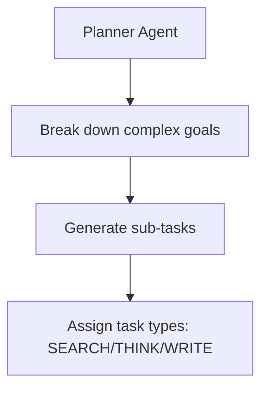
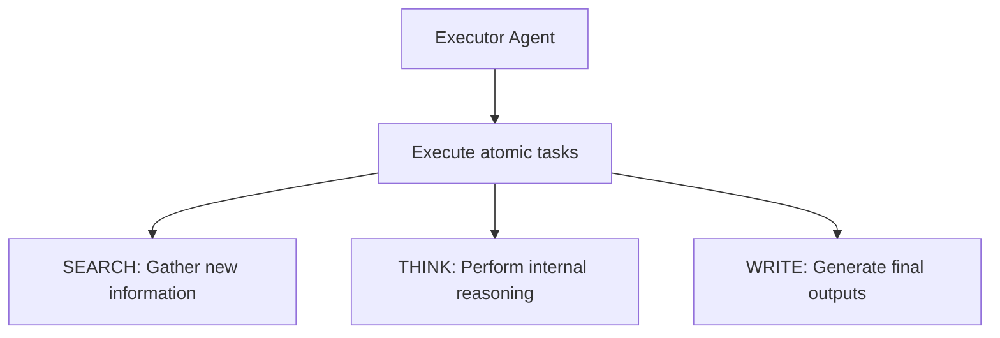
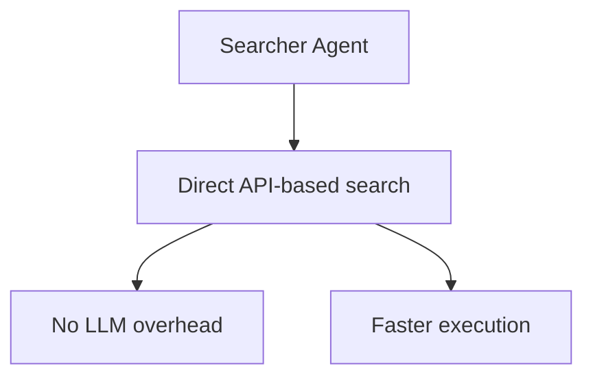

# 代理角色与提示工程

<cite>
**本文档引用的文件**
- [agents.yaml](file://src\sentientresearchagent\hierarchical_agent_framework\agent_configs\agents.yaml)
- [planner_prompts.py](file://src\sentientresearchagent\hierarchical_agent_framework\agent_configs\prompts\planner_prompts.py)
- [registry.py](file://src\sentientresearchagent\hierarchical_agent_framework\agents\registry.py)
- [crypto_analytics_agent.yaml](file://src\sentientresearchagent\hierarchical_agent_framework\agent_configs\profiles\crypto_analytics_agent.yaml)
</cite>

## 目录
1. [引言](#引言)
2. [核心代理角色配置](#核心代理角色配置)
3. [提示模板设计原理](#提示模板设计原理)
4. [动态注册与发现机制](#动态注册与发现机制)
5. [定制化案例：加密货币分析](#定制化案例：加密货币分析)
6. [A/B测试与安全最佳实践](#ab测试与安全最佳实践)

## 引言
本指南旨在深入解析`agents.yaml`中定义的planner、executor、searcher等代理角色的配置结构及其在任务流中的职责分工。我们将详细探讨各类提示模板的设计原理、变量注入机制和安全过滤策略，并阐述`registry.py`如何实现代理的动态注册与发现机制。通过真实案例展示如何定制新的代理角色或修改现有提示以适应特定研究领域（如加密货币分析），同时提供A/B测试不同提示版本效果的方法论，并强调避免提示注入攻击的安全最佳实践。

## 核心代理角色配置

### Planner代理
Planner代理负责将复杂目标分解为可管理的子任务。根据`agents.yaml`中的配置，系统提供了多种Planner代理，包括`CoreResearchPlanner`、`EnhancedSearchPlanner`、`DeepResearchPlanner`等。这些代理使用不同的模型和提示源来优化特定类型的任务规划。



**图示来源**
- [agents.yaml](file://src\sentientresearchagent\hierarchical_agent_framework\agent_configs\agents.yaml#L1-L587)

**章节来源**
- [agents.yaml](file://src\sentientresearchagent\hierarchical_agent_framework\agent_configs\agents.yaml#L1-L587)

### Executor代理
Executor代理执行原子任务，如搜索、写入和思考。例如，`SearchExecutor`使用LLM进行网络搜索，而`BasicReasoningExecutor`则专注于信息分析和综合。



**图示来源**
- [agents.yaml](file://src\sentientresearchagent\hierarchical_agent_framework\agent_configs\agents.yaml#L1-L587)

**章节来源**
- [agents.yaml](file://src\sentientresearchagent\hierarchical_agent_framework\agent_configs\agents.yaml#L1-L587)

### Searcher代理
Searcher代理直接通过API进行搜索，无需LLM开销。例如，`OpenAICustomSearcher`利用OpenAI的搜索能力，而`GeminiCustomSearcher`则使用Google Gemini的能力。



**图示来源**
- [agents.yaml](file://src\sentientresearchagent\hierarchical_agent_framework\agent_configs\agents.yaml#L1-L587)

**章节来源**
- [agents.yaml](file://src\sentientresearchagent\hierarchical_agent_framework\agent_configs\agents.yaml#L1-L587)

## 提示模板设计原理

### 变量注入机制
提示模板中的变量注入机制允许动态插入当前日期和其他上下文信息。例如，在`planner_prompts.py`中，`_CURRENT_DATE`变量被用于确保搜索任务获取最新的数据。

```python
_CURRENT_DATE = datetime.now().strftime('%B %d, %Y')
PLANNER_SYSTEM_MESSAGE = """Today's date: """ + _CURRENT_DATE + """
...
"""
```

**章节来源**
- [planner_prompts.py](file://src\sentientresearchagent\hierarchical_agent_framework\agent_configs\prompts\planner_prompts.py#L0-L799)

### 安全过滤策略
为了防止提示注入攻击，系统采用了严格的输入验证和输出格式控制。每个子任务必须包含明确的目标、任务类型和依赖关系索引，确保生成的计划既具体又安全。

```json
{
  "goal": "Find the current US tariff rate on Chinese-made solar panels",
  "task_type": "SEARCH",
  "depends_on_indices": []
}
```

**章节来源**
- [planner_prompts.py](file://src\sentientresearchagent\hierarchical_agent_framework\agent_configs\prompts\planner_prompts.py#L0-L799)

## 动态注册与发现机制

### Registry实现
`registry.py`中的`AgentRegistry`类负责管理和检索代理适配器。它通过`register_agent_adapter`方法注册代理，并通过`get_agent_adapter`方法根据任务节点和动作动词查找合适的适配器。

```python
class AgentRegistry:
    def __init__(self):
        self._agent_registry: Dict[Tuple[str, Optional["TaskType"]], "BaseAdapter"] = {}
        self._named_agents: Dict[str, Any] = {}

    def register_agent_adapter(self, adapter: "BaseAdapter", action_verb: Optional[str] = None, task_type: Optional["TaskType"] = None, name: Optional[str] = None):
        ...
    
    def get_agent_adapter(self, node: "TaskNode", action_verb: str) -> Optional["BaseAdapter"]:
        ...
```

**章节来源**
- [registry.py](file://src\sentientresearchagent\hierarchical_agent_framework\agents\registry.py#L7-L145)

## 定制化案例：加密货币分析

### 配置文件
`crypto_analytics_agent.yaml`定义了专门用于加密货币和DeFi分析的代理配置。该配置文件指定了根级规划者、聚合器以及针对不同类型任务的具体执行者。

```yaml
profile:
  name: "crypto_analytics_agent"
  root_planner_adapter_name: "CryptoAnalyticsPlanner"
  root_aggregator_adapter_name: "CryptoRootAggregator"
  planner_adapter_names:
    SEARCH: "CryptoSearchPlanner"
    WRITE: "CryptoAnalyticsPlanner"
    THINK: "CryptoAnalyticsPlanner"
  executor_adapter_names:
    SEARCH: "OpenAICustomSearcher"
    THINK: "CryptoMarketAnalyzer"
    WRITE: "CryptoResearchExecutor"
```

**章节来源**
- [crypto_analytics_agent.yaml](file://src\sentientresearchagent\hierarchical_agent_framework\agent_configs\profiles\crypto_analytics_agent.yaml#L0-L70)

## A/B测试与安全最佳实践

### A/B测试方法论
为了评估不同提示版本的效果，可以采用A/B测试方法。选择一组相似的任务，分别应用不同的提示模板，然后比较结果的质量和效率。

### 安全最佳实践
- **输入验证**：始终验证输入数据的有效性和安全性。
- **输出格式控制**：确保所有输出都符合预期的JSON格式，避免意外的代码执行。
- **最小权限原则**：仅授予代理完成其任务所需的最低权限。
- **定期审计**：定期审查代理的行为和输出，确保没有异常活动。

**章节来源**
- [planner_prompts.py](file://src\sentientresearchagent\hierarchical_agent_framework\agent_configs\prompts\planner_prompts.py#L0-L799)
- [registry.py](file://src\sentientresearchagent\hierarchical_agent_framework\agents\registry.py#L7-L145)