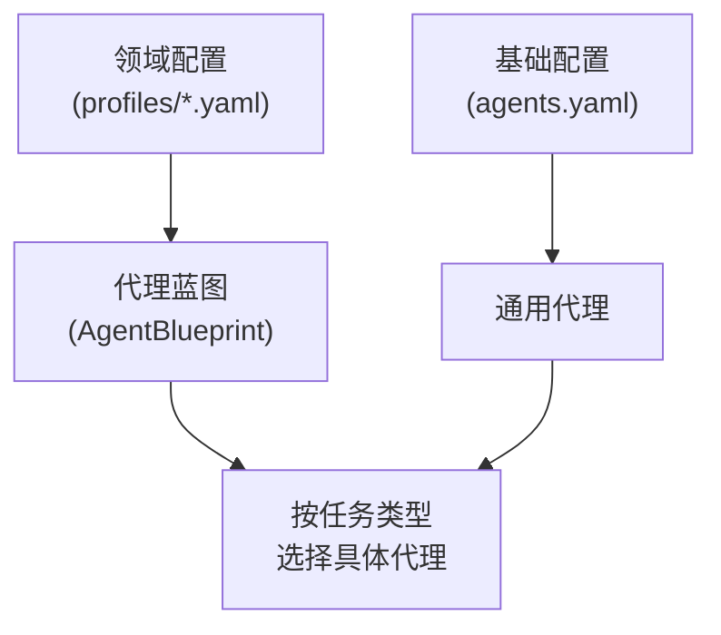
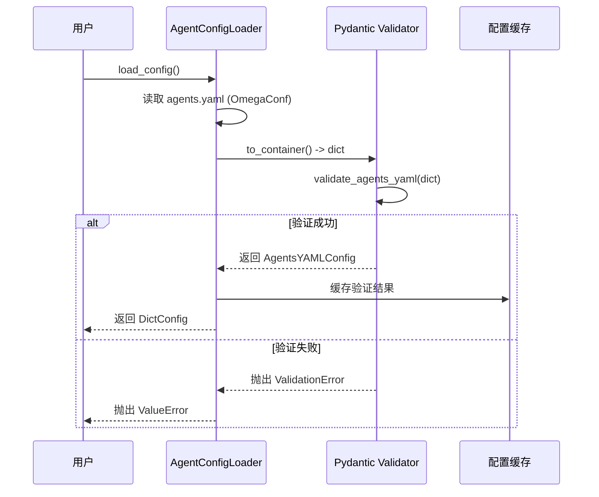

# 代理角色配置

<cite>
**本文档中引用的文件**  
- [agents.yaml](file://src\sentientresearchagent\hierarchical_agent_framework\agent_configs\agents.yaml)
- [config_loader.py](file://src\sentientresearchagent\hierarchical_agent_framework\agent_configs\config_loader.py)
- [crypto_analytics_agent.yaml](file://src\sentientresearchagent\hierarchical_agent_framework\agent_configs\profiles\crypto_analytics_agent.yaml)
- [models.py](file://src\sentientresearchagent\hierarchical_agent_framework\agent_configs\models.py)
- [profile_loader.py](file://src\sentientresearchagent\hierarchical_agent_framework\agent_configs\profile_loader.py)
</cite>

## 目录
1. [引言](#引言)
2. [核心代理角色配置结构](#核心代理角色配置结构)
3. [配置继承与覆盖机制](#配置继承与覆盖机制)
4. [配置加载流程与验证机制](#配置加载流程与验证机制)
5. [环境变量注入方式](#环境变量注入方式)
6. [新增自定义代理角色步骤](#新增自定义代理角色步骤)
7. [加密货币分析场景示例](#加密货币分析场景示例)
8. [配置安全性最佳实践](#配置安全性最佳实践)
9. [结论](#结论)

## 引言
本文档深入解析 `agents.yaml` 文件中定义的核心代理角色（如 planner、executor、searcher）的配置结构，涵盖角色类型、模型选择、工具权限、并发策略等关键字段。详细说明不同 profile（如 crypto_analytics_agent.yaml）如何继承和覆盖基础配置以适配特定领域任务。结合 `config_loader.py` 的实现，阐述配置加载流程、验证机制与环境变量注入方式。提供新增自定义代理角色的完整步骤，并通过加密货币分析场景示例展示配置优化技巧。强调配置安全性，避免敏感参数硬编码。

## 核心代理角色配置结构

`agents.yaml` 文件集中管理所有代理角色的配置，采用模块化设计，支持多种代理类型：planner（规划）、executor（执行）、custom_search（自定义搜索）、aggregator（聚合）、atomizer（原子化判断）和 plan_modifier（计划修改）。每个代理配置包含以下关键字段：

- **name**: 唯一标识符，用于在系统中查找和引用该代理。
- **type**: 角色类型，决定其功能职责（如 "planner", "executor"）。
- **adapter_class**: 适配器类名，必须与角色类型匹配（如 PlannerAdapter 对应 planner 类型）。
- **description**: 描述信息，便于理解代理用途。
- **enabled**: 启用状态，控制代理是否可用。
- **model**: LLM 模型配置，包含 provider（如 litellm, openai）和 model_id（如 gpt-4o-search-preview），仅非 custom_search 类型需要。
- **prompt_source**: 提示词来源路径，采用点号分隔的模块路径格式（如 prompts.planner_prompts.PLANNER_SYSTEM_MESSAGE），仅非 custom_search 类型需要。
- **response_model**: 结构化输出的 Pydantic 模型名称（如 PlanOutput），根据角色类型有特定要求。
- **tools / toolkits**: 工具权限配置，定义代理可调用的工具集及其参数。
- **registration**: 注册配置，包含 action_keys（动作动词和任务类型映射）和 named_keys（命名键，用于快速查找）。
- **adapter_params**: 适配器专用参数，如 OpenAICustomSearchAdapter 的 search_context_size 和 use_openrouter。

对于 custom_search 类型的代理（如 OpenAICustomSearcher），不使用 LLM 模型进行推理，而是直接调用 API，因此不应配置 model 或 prompt_source 字段，而需通过 adapter_params 配置 API 特定参数。

**Section sources**
- [agents.yaml](file://src\sentientresearchagent\hierarchical_agent_framework\agent_configs\agents.yaml#L0-L586)

## 配置继承与覆盖机制

系统通过 profiles 实现配置的继承与覆盖。基础配置在 `agents.yaml` 中定义，而特定领域的配置（如加密货币分析）则在 `profiles/` 目录下的 YAML 文件（如 crypto_analytics_agent.yaml）中定义。Profile 不定义新的代理，而是为现有代理创建一个“蓝图”（AgentBlueprint），指定在不同任务类型下应使用哪个具体的代理实例。

`ProfileConfig` 模型定义了以下映射关系：
- **root_planner_adapter_name / root_aggregator_adapter_name**: 为根节点任务指定专用的规划和聚合代理。
- **planner_adapter_names / executor_adapter_names / aggregator_adapter_names**: 按任务类型（SEARCH, WRITE, THINK）映射到相应的代理名称。
- **default_*_adapter_name**: 当没有更具体的映射时使用的默认代理。
- **atomizer_adapter_name / plan_modifier_adapter_name**: 指定特殊功能的代理。

例如，在 `crypto_analytics_agent.yaml` 中，所有 WRITE 任务都使用 `CryptoAnalyticsPlanner` 进行规划，而 SEARCH 任务则使用 `OpenAICustomSearcher` 执行，实现了对基础配置的精确覆盖，以适应加密货币领域的高性能和实时数据需求。

**Diagram sources**
- [crypto_analytics_agent.yaml](file://src\sentientresearchagent\hierarchical_agent_framework\agent_configs\profiles\crypto_analytics_agent.yaml#L0-L70)
- [models.py](file://src\sentientresearchagent\hierarchical_agent_framework\agent_configs\models.py#L738-L796)

**Section sources**
- [crypto_analytics_agent.yaml](file://src\sentientresearchagent\hierarchical_agent_framework\agent_configs\profiles\crypto_analytics_agent.yaml#L0-L70)
- [models.py](file://src\sentientresearchagent\hierarchical_agent_framework\agent_configs\models.py#L738-L796)

## 配置加载流程与验证机制

配置加载由 `AgentConfigLoader` 和 `ProfileLoader` 类协同完成，确保配置的正确性和完整性。

### AgentConfigLoader 流程
1.  **初始化**: 构造函数接受 `config_dir` 参数，默认指向 `agent_configs` 目录。它会检查环境变量 `SENTIENT_AGENTS_CONFIG` 以允许用户指定自定义的 `agents.yaml` 路径。
2.  **加载**: `load_config()` 方法使用 `OmegaConf.load()` 读取 YAML 文件。
3.  **验证**: 使用 Pydantic 模型 `AgentsYAMLConfig` 进行深度验证。这包括：
    -   确保所有代理名称唯一。
    -   验证 `adapter_class` 与 `type` 匹配。
    -   确保非 custom_search 代理具有 `model` 和 `prompt_source`。
    -   解析并验证 `prompt_source` 能否成功导入对应的提示词字符串。
4.  **缓存**: 验证后的配置被缓存，避免重复加载和验证。

### ProfileLoader 流程
1.  **初始化**: 默认从 `agent_configs/profiles/` 目录加载 `.yaml` 文件。
2.  **加载与验证**: `load_profile()` 方法读取指定的 profile 文件，并使用 `ProfileYAMLConfig` 模型进行验证，确保 task_type 键是有效的枚举值。
3.  **转换**: 将 YAML 中的字符串形式的任务类型（如 "WRITE"）转换为代码中的 `TaskType` 枚举。
4.  **构建蓝图**: 创建 `AgentBlueprint` 实例，该实例封装了所有映射规则，供运行时决策使用。

此机制保证了配置在应用前就已通过严格的校验，提高了系统的健壮性。

**Diagram sources**
- [config_loader.py](file://src\sentientresearchagent\hierarchical_agent_framework\agent_configs\config_loader.py#L21-L249)
- [profile_loader.py](file://src\sentientresearchagent\hierarchical_agent_framework\agent_configs\profile_loader.py#L50-L220)

**Section sources**
- [config_loader.py](file://src\sentientresearchagent\hierarchical_agent_framework\agent_configs\config_loader.py#L21-L249)
- [profile_loader.py](file://src\sentientresearchagent\hierarchical_agent_framework\agent_configs\profile_loader.py#L50-L220)

## 环境变量注入方式

配置系统通过环境变量实现灵活的外部配置，避免在代码或配置文件中硬编码敏感信息。主要体现在两个层面：

1.  **自定义配置文件路径**: 环境变量 `SENTIENT_AGENTS_CONFIG` 允许用户指定一个自定义的 `agents.yaml` 文件路径。`AgentConfigLoader` 在初始化时会优先检查此变量，从而实现配置的动态切换。
2.  **API 密钥注入**: 在 `ModelConfig` 和各个 `ToolkitParams`（如 `BinanceToolkitParams`, `CoingeckoToolkitParams`）的 Pydantic 模型中，通过 `default_factory=lambda: os.getenv("...")` 的方式，将 API 密钥的获取委托给环境变量。例如，`BinanceToolkitParams` 会自动从 `BINANCE_API_KEY` 和 `BINANCE_API_SECRET` 环境变量中读取凭据。这不仅增强了安全性，也方便了在不同环境（开发、测试、生产）间的部署。

**Section sources**
- [config_loader.py](file://src\sentientresearchagent\hierarchical_agent_framework\agent_configs\config_loader.py#L38-L52)
- [models.py](file://src\sentientresearchagent\hierarchical_agent_framework\agent_configs\models.py#L640-L650)

## 新增自定义代理角色步骤

要新增一个自定义代理角色，请遵循以下步骤：

1.  **定义适配器类**: 在代码中创建一个新的适配器类（如 `MyCustomAdapter`），并确保它继承自正确的基类（如 `ExecutorAdapter`）。
2.  **注册适配器**: 确保新适配器类的名称在 `AgentConfig` 模型的 `validate_adapter_class` 验证器中被列为有效选项。
3.  **编辑 agents.yaml**: 在 `agents.yaml` 文件中添加一个新的代理配置项。
    -   设置唯一的 `name`。
    -   正确设置 `type` 和 `adapter_class`。
    -   根据需要配置 `model`、`prompt_source`、`tools` 等。
    -   在 `registration` 中定义 `named_keys` 以便于引用。
    -   将 `enabled` 设为 `true`。
4.  **（可选）更新 Profile**: 如果新代理用于特定领域，修改相应的 profile YAML 文件（如 `my_domain_agent.yaml`），在 `executor_adapter_names` 或其他映射中添加对新代理的引用。
5.  **重启服务**: 应用更改后重启服务，使新配置生效。

**Section sources**
- [agents.yaml](file://src\sentientresearchagent\hierarchical_agent_framework\agent_configs\agents.yaml#L0-L586)
- [models.py](file://src\sentientresearchagent\hierarchical_agent_framework\agent_configs\models.py#L578-L715)

## 加密货币分析场景示例

`crypto_analytics_agent.yaml` 是一个典型的领域专用配置示例，展示了如何优化配置以满足特定需求。

-   **高性能规划**: 使用 `CryptoAnalyticsPlanner` 和 `CryptoSearchPlanner`，它们基于 `gemini-2.5-flash:nitro` 模型，相比通用的 o3 模型速度更快，适合处理大量市场数据。
-   **专业化的执行器**: `CryptoMarketAnalyzer` 代理集成了多个金融数据工具包（`BinanceToolkit`, `CoingeckoToolkit`, `DefiLlamaToolkit`, `ArkhamToolkit`），使其能够访问实时价格、K线图、链上数据和 DeFi 协议指标。
-   **安全的数据源**: 工具包的 API 密钥通过环境变量注入，且 `BinanceToolkitParams` 等模型会对密钥格式进行严格验证，防止因错误配置导致的安全问题。
-   **高效的搜索**: 执行 SEARCH 任务时，使用 `OpenAICustomSearcher`，它绕过 LLM 推理，直接利用 OpenAI 的搜索能力，降低了延迟和成本。

此配置通过组合专用的规划、执行和聚合代理，构建了一个强大的加密货币研究工作流。

**Section sources**
- [crypto_analytics_agent.yaml](file://src\sentientresearchagent\hierarchical_agent_framework\agent_configs\profiles\crypto_analytics_agent.yaml#L0-L70)
- [agents.yaml](file://src\sentientresearchagent\hierarchical_agent_framework\agent_configs\agents.yaml#L400-L500)

## 配置安全性最佳实践

为确保配置的安全性，应遵循以下最佳实践：

1.  **绝不硬编码敏感信息**: 所有 API 密钥、数据库密码等敏感数据必须通过环境变量注入，严禁写入 YAML 配置文件。
2.  **利用 Pydantic 验证**: 充分利用 Pydantic 模型的 `@field_validator` 和 `@model_validator` 对输入进行校验，例如验证 API 密钥的长度和格式，防止无效或恶意配置。
3.  **最小权限原则**: 在 `tools` 和 `toolkits` 配置中，只授予代理完成其任务所必需的工具权限，避免过度授权。
4.  **启用配置验证**: 确保 `AgentConfigLoader.validate_config()` 在启动时被调用，及时发现并报告配置错误。
5.  **使用版本控制忽略敏感文件**: 将包含敏感信息的 `.env` 文件或自定义配置文件添加到 `.gitignore` 中，防止意外提交到代码仓库。

**Section sources**
- [models.py](file://src\sentientresearchagent\hierarchical_agent_framework\agent_configs\models.py#L640-L650)
- [config_loader.py](file://src\sentientresearchagent\hierarchical_agent_framework\agent_configs\config_loader.py#L191-L249)

## 结论

`agents.yaml` 及其配套的配置加载系统提供了一个强大、灵活且安全的框架来管理多代理系统。通过清晰的角色划分、严格的 Pydantic 验证、基于 Profile 的继承覆盖机制以及环境变量注入，开发者可以高效地定制和优化代理行为，以应对从通用研究到加密货币分析等各种复杂任务。遵循本文档的最佳实践，可以确保配置的可靠性、安全性和可维护性。