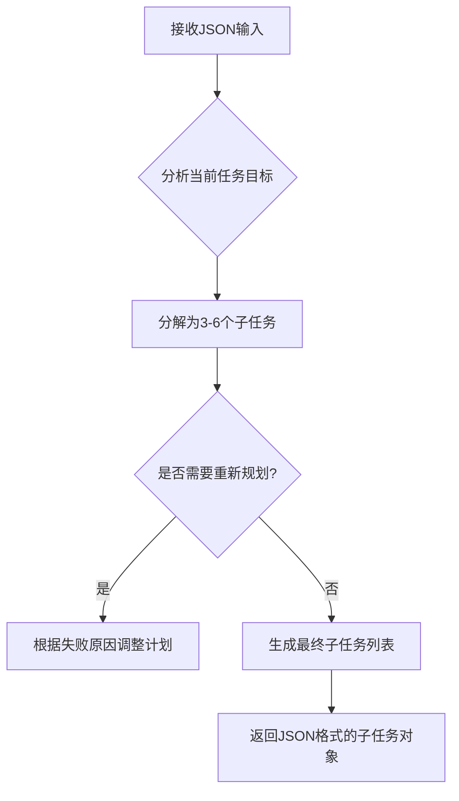
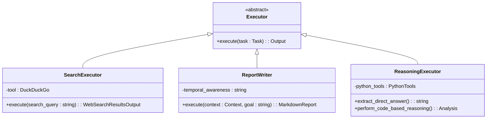
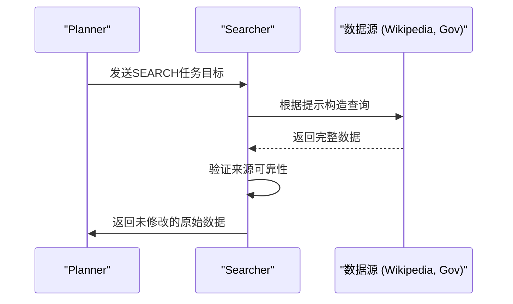
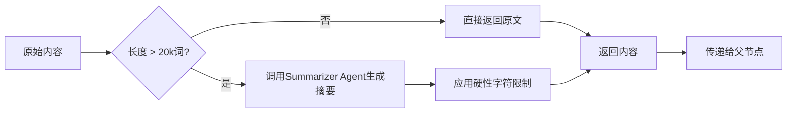

# 提示工程设计

<cite>
**本文档引用的文件**
- [planner_prompts.py](file://src\sentientresearchagent\hierarchical_agent_framework\agent_configs\prompts\planner_prompts.py)
- [executor_prompts.py](file://src\sentientresearchagent\hierarchical_agent_framework\agent_configs\prompts\executor_prompts.py)
- [searcher_prompts.py](file://src\sentientresearchagent\hierarchical_agent_framework\agent_configs\prompts\searcher_prompts.py)
- [utils.py](file://src\sentientresearchagent\hierarchical_agent_framework\agents\utils.py)
- [smart_context_utils.py](file://src\sentientresearchagent\hierarchical_agent_framework\context\smart_context_utils.py)
- [cached_context_builder.py](file://src\sentientresearchagent\hierarchical_agent_framework\context\cached_context_builder.py)
- [enhanced_context_builder.py](file://src\sentientresearchagent\hierarchical_agent_framework\context\enhanced_context_builder.py)
- [parent_context_builder.py](file://src\sentientresearchagent\hierarchical_agent_framework\context\parent_context_builder.py)
- [planner_context_builder.py](file://src\sentientresearchagent\hierarchical_agent_framework\context\planner_context_builder.py)
- [context_builder.py](file://src\sentientresearchagent\hierarchical_agent_framework\context\context_builder.py)
- [strategies.py](file://src\sentientresearchagent\hierarchical_agent_framework\context\strategies.py)
</cite>

## 目录
1. [引言](#引言)
2. [Planner多步推理框架](#planner多步推理框架)
3. [Executor任务执行指令集](#executor任务执行指令集)
4. [Searcher信息检索查询构造](#searcher信息检索查询构造)
5. [变量动态注入与安全过滤机制](#变量动态注入与安全过滤机制)
6. [结构化输出与错误恢复](#结构化输出与错误恢复)
7. [A/B测试方法论与垂直领域优化](#ab测试方法论与垂直领域优化)

## 引言

本系统采用分层代理架构，通过Planner、Executor和Searcher三类核心代理协同工作，实现复杂目标的自动化分解与执行。Planner负责将宏观目标拆解为可管理的子任务，Executor执行原子化操作，Searcher则专注于信息检索。整个流程通过精心设计的提示模板（Prompt Templates）进行引导，并结合上下文构建策略、变量注入和安全过滤机制，确保系统的高效性与安全性。

## Planner多步推理框架

Planner代理的核心是`PLANNER_SYSTEM_MESSAGE`，它定义了将复杂目标分解为3至6个可管理子任务的递归式任务分解能力。该框架强调任务的互斥性与互补性，避免过度碎片化。

### 输入模式与约束处理

Planner接收JSON格式的输入，包含`current_task_goal`（当前任务目标）、`overall_objective`（总体目标）、`execution_history_and_context`（执行历史与上下文）等关键字段。系统强制要求遵守`global_constraints_or_preferences`中的所有全局约束，如“优先准确性”或“最多3个子任务”，并在冲突时优先满足最严格的约束。

**图源**
- [planner_prompts.py](file://src\sentientresearchagent\hierarchical_agent_framework\agent_configs\prompts\planner_prompts.py#L1-L800)

### 任务类型与分解原则

框架定义了三种核心任务类型：
- **SEARCH**: 获取新信息。
- **THINK**: 进行内部推理或分析。
- **WRITE**: 生成最终文本或结构化输出。

分解原则强调**原子性**，每个子任务应只完成一个明确目的。例如，“查找2024年全球智能手机普及率统计”是有效的SEARCH任务，而“查找普及率并分析其对数字素养的影响”则违反了原子性原则，应被拆分为两个独立任务。

### 并行执行优先策略

Planner默认所有任务均可并行执行，仅在绝对必要时才建立依赖关系。这通过`depends_on_indices`字段实现，该字段指定当前子任务所依赖的其他子任务的索引。系统鼓励最小化依赖，避免创建必须等待所有前置任务完成的聚合瓶颈。

**节源**
- [planner_prompts.py](file://src\sentientresearchagent\hierarchical_agent_framework\agent_configs\prompts\planner_prompts.py#L1-L800)

## Executor任务执行指令集

Executor代理负责执行由Planner生成的原子化任务，其行为由一系列专用的系统提示（System Message）精确控制。

### 执行器类型与功能

不同类型的Executor针对特定任务进行了优化：
- **SEARCH_EXECUTOR**: 使用DuckDuckGo工具执行搜索，并将结果格式化为`WebSearchResultsOutput`模型。
- **SEARCH_SYNTHESIZER**: 将原始搜索结果综合成简洁、连贯的摘要。
- **BASIC_REPORT_WRITER**: 将研究数据转化为权威的研究报告，特别强调**直接回答优先**和**数据保真度**，要求保留原文中的具体名称、数字和排名。
- **REASONING_EXECUTOR**: 作为专业研究分析师，首先提取直接答案，然后提供分析深度。对于涉及计算的任务，它会使用Python工具进行代码推理。

**图源**
- [executor_prompts.py](file://src\sentientresearchagent\hierarchical_agent_framework\agent_configs\prompts\executor_prompts.py#L1-L800)

### 时间感知与数据验证

所有Executor都具备时间感知能力，通过`TEMPORAL_AWARENESS`模块获取当前UTC时间和年份。它们被严格禁止将过去事件描述为未来事件，并必须清晰区分“发生在2023年”、“预计在2025年”和“截至2024年的最新数据”。

**节源**
- [executor_prompts.py](file://src\sentientresearchagent\hierarchical_agent_framework\agent_configs\prompts\executor_prompts.py#L1-L800)

## Searcher信息检索查询构造

Searcher代理专门负责从可靠来源检索数据，其提示模板旨在最大化数据的完整性和可靠性。

### 检索适配器与提示

系统为不同的搜索后端提供了定制化的提示：
- **OPENAI_CUSTOM_SEARCH_PROMPT**: 优先使用维基百科，要求检索完整的表格和列表，不进行任何总结或截断。
- **GEMINI_CUSTOM_SEARCH_PROMPT**: 与OpenAI提示类似，遵循相同的全面性原则。
- **EXA_CUSTOM_SEARCH_SYSTEM_PROMPT**: 在多个来源中提取数据，优先考虑最可靠的来源，并在信息冲突时以维基百科等高可信度来源为准。

**图源**
- [searcher_prompts.py](file://src\sentientresearchagent\hierarchical_agent_framework\agent_configs\prompts\searcher_prompts.py#L1-L150)

### 上下文利用与完整性

Searcher提示中包含`CONTEXT_EMPHASIS_SECTION`，强调利用提供的上下文来指导搜索，确保新检索的数据能与已有发现相衔接。其核心原则是**完整性优于简洁性**，即宁可包含可能相关的信息，也不遗漏关键数据点。

**节源**
- [searcher_prompts.py](file://src\sentientresearchagent\hierarchical_agent_framework\agent_configs\prompts\searcher_prompts.py#L1-L150)

## 变量动态注入与安全过滤机制

系统通过环境变量和运行时配置实现了强大的动态注入能力，同时内置了多层次的安全防护。

### 动态变量注入

虽然代码中未直接展示`{{goal}}`和`{{context}}`的替换逻辑，但其机制体现在上下文构建过程中。例如，在`planner_prompts.py`中，`_CURRENT_DATE`变量在导入时被动态计算并注入到系统消息中，确保所有Planner实例都拥有最新的日期信息。

### 安全过滤与防注入攻击

系统通过以下方式防止提示注入攻击：
1.  **严格的输入模式**: 所有输入都遵循预定义的JSON Schema，限制了恶意内容的注入空间。
2.  **上下文隔离**: 执行节点（Node）无法看到兄弟任务的细节或整体计划，只能访问其明确的目标和依赖项输出，这从根本上阻止了通过上下文污染进行的攻击。
3.  **角色定义清晰**: 系统提示（System Message）明确界定了代理的角色和职责，使其难以被诱导执行越权操作。

**节源**
- [planner_prompts.py](file://src\sentientresearchagent\hierarchical_agent_framework\agent_configs\prompts\planner_prompts.py#L1-L800)
- [context_builder.py](file://src\sentientresearchagent\hierarchical_agent_framework\context\context_builder.py#L1-L300)

## 结构化输出与错误恢复

系统利用辅助函数和上下文构建策略来保证输出的结构化和鲁棒性。

### 结构化输出与上下文管理

`utils.py`中的`get_context_summary`函数用于生成长内容的摘要，当内容超过约20,000词时，它会调用`context_summarizer_agno_agent`进行智能摘要，否则直接返回原文。这确保了传递给上级节点的上下文既全面又精炼。

**图源**
- [utils.py](file://src\sentientresearchagent\hierarchical_agent_framework\agents\utils.py#L1-L423)
- [smart_context_utils.py](file://src\sentientresearchagent\hierarchical_agent_framework\context\smart_context_utils.py#L1-L122)

### 错误恢复与JSON修复

`utils.py`中的`OutputFixingParser`是一个强大的错误恢复组件。当解析LLM输出的JSON失败时，它会按顺序尝试多种修复策略：直接修复、提取Markdown代码块、检测括号、使用JSONDecoder，最后甚至调用另一个LLM进行结构化修复。这种渐进式的修复策略极大地提高了系统的容错能力。

**节源**
- [utils.py](file://src\sentientresearchagent\hierarchical_agent_framework\agents\utils.py#L1-L423)

## A/B测试方法论与垂直领域优化

系统的设计支持通过对比实验来评估不同提示的效果，并可针对特定领域进行优化。

### 对比实验与A/B测试

可以通过部署不同版本的提示模板（如`PLANNER_SYSTEM_MESSAGE`的不同变体）来运行相同的任务，然后比较任务成功率、执行时间等指标。例如，可以对比“并行优先”的Planner与传统串行Planner的性能差异。

### 垂直领域优化建议

对于金融数据分析等垂直领域，可以借鉴`CRYPTO_MARKET_ANALYZER_SYSTEM_MESSAGE`的设计思路：
- **集成专用工具**: 为金融领域集成彭博社、路孚特等数据源的工具包。
- **强化风险披露**: 在系统提示中加入“始终披露市场波动性和投资风险”等指令。
- **使用领域特定术语**: 在提示中明确定义“夏普比率”、“贝塔系数”等专业术语，确保LLM理解一致。
- **多源数据验证**: 要求代理交叉验证来自不同金融数据库的数据，以提高准确性。

**节源**
- [executor_prompts.py](file://src\sentientresearchagent\hierarchical_agent_framework\agent_configs\prompts\executor_prompts.py#L1-L800)