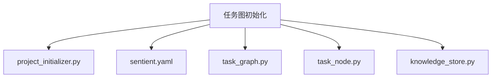
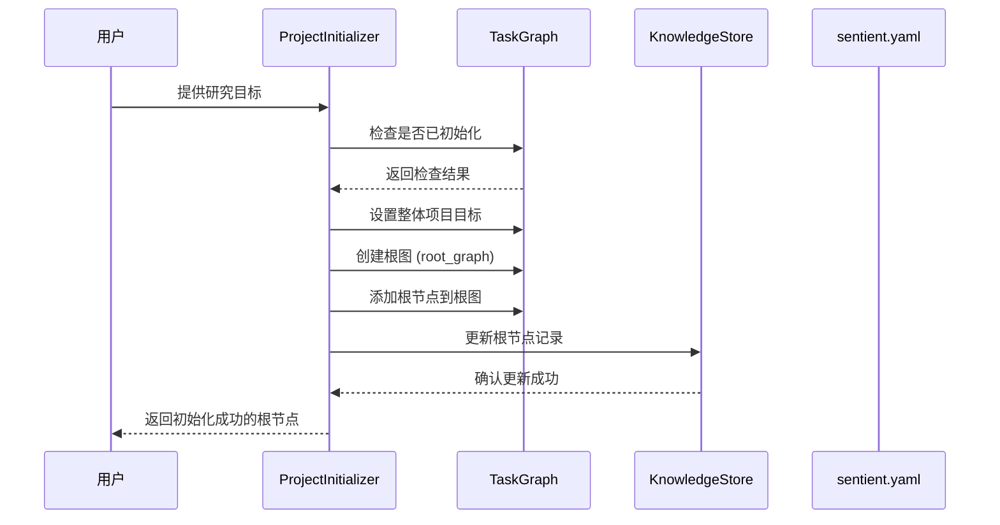
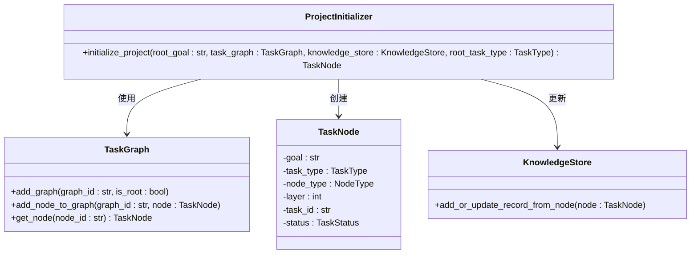
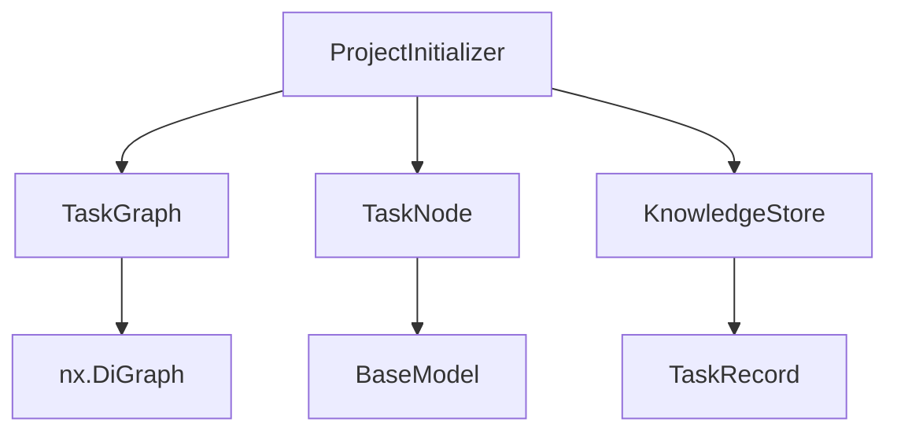

# 任务图初始化

<cite>
**本文档中引用的文件**
- [project_initializer.py](file://src/sentientresearchagent/hierarchical_agent_framework/graph/project_initializer.py)
- [sentient.yaml](file://sentient.yaml)
- [task_graph.py](file://src/sentientresearchagent/hierarchical_agent_framework/graph/task_graph.py)
- [task_node.py](file://src/sentientresearchagent/hierarchical_agent_framework/node/task_node.py)
- [knowledge_store.py](file://src/sentientresearchagent/hierarchical_agent_framework/context/knowledge_store.py)
</cite>

## 目录
1. [简介](#简介)
2. [项目结构](#项目结构)
3. [核心组件](#核心组件)
4. [架构概述](#架构概述)
5. [详细组件分析](#详细组件分析)
6. [依赖分析](#依赖分析)
7. [性能考虑](#性能考虑)
8. [故障排除指南](#故障排除指南)
9. [结论](#结论)

## 简介
本文档详细说明了`ProjectInitializer`类如何根据用户输入的研究目标生成初始任务图。涵盖了目标解析、根节点生成、初始上下文构建及默认代理配置加载的全过程。结合`sentient.yaml`配置文件说明初始化参数的来源与优先级，并提供自定义初始化逻辑的扩展点（如插件式目标分解器）的开发指南，同时列举常见初始化失败场景（如无效目标格式、配置缺失）及其解决方案。

## 项目结构
本节描述系统中与任务图初始化相关的模块组织结构。

**Diagram sources**
- [project_initializer.py](file://src/sentientresearchagent/hierarchical_agent_framework/graph/project_initializer.py)
- [sentient.yaml](file://sentient.yaml)
- [task_graph.py](file://src/sentientresearchagent/hierarchical_agent_framework/graph/task_graph.py)
- [task_node.py](file://src/sentientresearchagent/hierarchical_agent_framework/node/task_node.py)
- [knowledge_store.py](file://src/sentientresearchagent/hierarchical_agent_framework/context/knowledge_store.py)

**Section sources**
- [project_initializer.py](file://src/sentientresearchagent/hierarchical_agent_framework/graph/project_initializer.py)
- [sentient.yaml](file://sentient.yaml)

## 核心组件
`ProjectInitializer`是负责为新项目创建根任务节点和任务图的核心类。它通过`initialize_project`方法实现初始化流程，确保每次运行都从一个清晰的状态开始。

**Section sources**
- [project_initializer.py](file://src/sentientresearchagent/hierarchical_agent_framework/graph/project_initializer.py#L9-L49)

## 架构概述
以下图表展示了任务图初始化过程中各组件之间的交互关系。

**Diagram sources**
- [project_initializer.py](file://src/sentientresearchagent/hierarchical_agent_framework/graph/project_initializer.py#L9-L49)
- [task_graph.py](file://src/sentientresearchagent/hierarchical_agent_framework/graph/task_graph.py)
- [knowledge_store.py](file://src/sentientresearchagent/hierarchical_agent_framework/context/knowledge_store.py)

## 详细组件分析
### ProjectInitializer 分析
`ProjectInitializer`的主要功能是初始化一个新的项目任务图。其核心方法`initialize_project`接受用户的根目标，并据此生成初始的任务结构。

#### 类图

**Diagram sources**
- [project_initializer.py](file://src/sentientresearchagent/hierarchical_agent_framework/graph/project_initializer.py#L9-L49)
- [task_graph.py](file://src/sentientresearchagent/hierarchical_agent_framework/graph/task_graph.py)
- [task_node.py](file://src/sentientresearchagent/hierarchical_agent_framework/node/task_node.py)
- [knowledge_store.py](file://src/sentientresearchagent/hierarchical_agent_framework/context/knowledge_store.py)

**Section sources**
- [project_initializer.py](file://src/sentientresearchagent/hierarchical_agent_framework/graph/project_initializer.py#L9-L49)

### 配置管理分析
`sensitive.yaml` 文件中的配置项对初始化过程有重要影响，特别是关于执行框架和日志设置的部分。

#### 执行框架配置
| 参数 | 描述 | 默认值 |
|------|------|--------|
| `max_concurrent_nodes` | 最大并发节点数 | 10 |
| `max_parallel_nodes` | 最大并行处理节点数 | 8 |
| `max_execution_steps` | 最大执行步骤 | 500 |
| `enable_hitl` | 是否启用人工干预 | false |
| `force_root_node_planning` | 强制根节点进行规划 | true |
| `skip_atomization` | 跳过原子化处理 | true |

**Section sources**
- [sentient.yaml](file://sentient.yaml#L20-L60)

## 依赖分析
以下是任务图初始化过程中涉及的关键依赖关系。

**Diagram sources**
- [project_initializer.py](file://src/sentientresearchagent/hierarchical_agent_framework/graph/project_initializer.py)
- [task_graph.py](file://src/sentientresearchagent/hierarchical_agent_framework/graph/task_graph.py)
- [task_node.py](file://src/sentientresearchagent/hierarchical_agent_framework/node/task_node.py)
- [knowledge_store.py](file://src/sentientresearchagent/hierarchical_agent_framework/context/knowledge_store.py)

**Section sources**
- [project_initializer.py](file://src/sentientresearchagent/hierarchical_agent_framework/graph/project_initializer.py)
- [task_graph.py](file://src/sentientresearchagent/hierarchical_agent_framework/graph/task_graph.py)
- [task_node.py](file://src/sentientresearchagent/hierarchical_agent_framework/node/task_node.py)
- [knowledge_store.py](file://src/sentientresearchagent/hierarchical_agent_framework/context/knowledge_store.py)

## 性能考虑
在初始化阶段，系统会进行一系列操作以确保数据一致性与完整性。建议在高负载环境下适当调整`max_concurrent_nodes`和`max_parallel_nodes`参数，避免资源争用。

此外，缓存机制（由`cache.enabled`控制）可显著提升重复查询的响应速度，推荐保持开启状态。

## 故障排除指南
### 常见问题及解决方案
1. **错误：Root graph ID exists but root node is missing**
   - **原因**：任务图的根图ID存在，但对应的根节点丢失。
   - **解决方案**：检查代码逻辑，确保在设置`root_graph_id`的同时正确添加根节点。

2. **警告：Project already initialized or root graph exists. Skipping re-initialization**
   - **原因**：项目已被初始化或根图已存在。
   - **解决方案**：若需重新初始化，请先清除现有状态（调用`clear()`方法）。

3. **配置未生效**
   - **原因**：`sentient.yaml`中修改的参数未被正确读取。
   - **解决方案**：确认配置文件路径正确，并重启服务使更改生效。

**Section sources**
- [project_initializer.py](file://src/sentientresearchagent/hierarchical_agent_framework/graph/project_initializer.py#L15-L25)
- [sentient.yaml](file://sentient.yaml)

## 结论
`ProjectInitializer`作为整个任务图系统的入口点，承担着至关重要的角色。通过对目标的解析、根节点的生成以及上下文的构建，它为后续的任务分解与执行奠定了坚实的基础。结合灵活的配置机制与可扩展的设计，该模块能够适应多种复杂的研究场景需求。