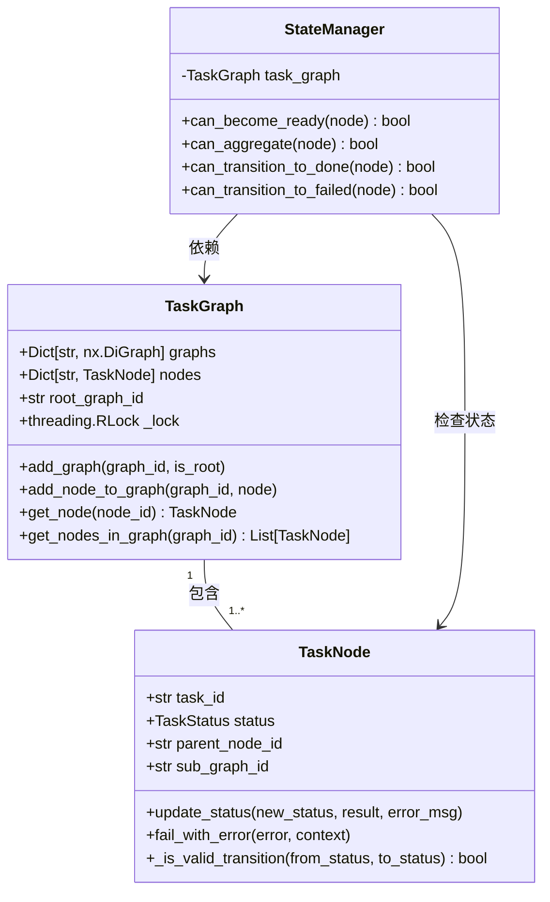

# 任务图状态管理

<cite>
**本文档引用的文件**
- [state_manager.py](file://src\sentientresearchagent\hierarchical_agent_framework\graph\state_manager.py)
- [task_node.py](file://src\sentientresearchagent\hierarchical_agent_framework\node\task_node.py)
- [task_graph.py](file://src\sentientresearchagent\hierarchical_agent_framework\graph\task_graph.py)
- [types.py](file://src\sentientresearchagent\hierarchical_agent_framework\types.py)
</cite>

## 目录
1. [简介](#简介)
2. [核心状态模型](#核心状态模型)
3. [状态转换逻辑](#状态转换逻辑)
4. [并发控制与原子性保障](#并发控制与原子性保障)
5. [事件通知机制](#事件通知机制)
6. [状态快照与恢复](#状态快照与恢复)
7. [状态一致性校验工具](#状态一致性校验工具)
8. [常见异常排查](#常见异常排查)
9. [结论](#结论)

## 简介
本技术文档深入解析`state_manager.py`模块如何维护任务图的全局执行状态。系统采用分层状态管理架构，结合内存缓存与持久化策略，确保在复杂任务调度场景下的状态一致性。通过精细化的状态转换规则和事件驱动机制，实现了对任务节点全生命周期的精确控制。

**Section sources**
- [state_manager.py](file://src\sentientresearchagent\hierarchical_agent_framework\graph\state_manager.py#L1-L160)

## 核心状态模型

### 任务节点状态定义
系统定义了完整的任务节点状态机，涵盖从待执行到完成的完整生命周期：


**Diagram sources**
- [types.py](file://src\sentientresearchagent\hierarchical_agent_framework\types.py#L12-L25)
- [task_node.py](file://src\sentientresearchagent\hierarchical_agent_framework\node\task_node.py#L18-L285)

### 状态存储设计模式
状态管理采用双层存储架构：
- **内存缓存层**：`TaskGraph`类中的`nodes`字典提供O(1)时间复杂度的节点查找
- **持久化层**：通过`GraphSerializer`实现状态序列化，支持故障恢复



**Diagram sources**
- [task_graph.py](file://src\sentientresearchagent\hierarchical_agent_framework\graph\task_graph.py#L12-L137)
- [state_manager.py](file://src\sentientresearchagent\hierarchical_agent_framework\graph\state_manager.py#L13-L160)

**Section sources**
- [task_graph.py](file://src\sentientresearchagent\hierarchical_agent_framework\graph\task_graph.py#L12-L137)
- [types.py](file://src\sentientresearchagent\hierarchical_agent_framework\types.py#L12-L33)

## 状态转换逻辑

### 就绪状态转换条件
`can_become_ready()`方法检查节点是否可以从PENDING状态转换为READY状态，需满足两个条件：

```mermaid
flowchart TD
A[开始检查就绪条件] --> B{节点状态为PENDING?}
B --> |否| C[返回false]
B --> |是| D{父节点条件满足?}
D --> |否| E[返回false]
D --> |是| F{前置依赖完成?}
F --> |否| G[返回false]
F --> |是| H[返回true]
subgraph 父节点条件
D1[存在父节点?]
D1 --> |否| D2[根节点，条件满足]
D1 --> |是| D3[获取父节点]
D3 --> D4{父节点状态 ∈ [RUNNING, PLAN_DONE, DONE, AGGREGATING]}
end
subgraph 前置依赖条件
F1[确定容器图ID]
F1 --> F2[获取所有前置节点]
F2 --> F3{所有前置节点状态为DONE?}
end
```

**Diagram sources**
- [state_manager.py](file://src\sentientresearchagent\hierarchical_agent_framework\graph\state_manager.py#L75-L97)

### 聚合状态转换条件
`can_aggregate()`方法检查PLAN类型节点是否可以进入AGGREGATING状态：


**Diagram sources**
- [state_manager.py](file://src\sentientresearchagent\hierarchical_agent_framework\graph\state_manager.py#L99-L149)

**Section sources**
- [state_manager.py](file://src\sentientresearchagent\hierarchical_agent_framework\graph\state_manager.py#L75-L149)

## 并发控制与原子性保障

### 线程安全设计
系统采用多层级锁机制确保并发环境下的状态一致性：


**Diagram sources**
- [task_graph.py](file://src\sentientresearchagent\hierarchical_agent_framework\graph\task_graph.py#L12-L137)
- [task_node.py](file://src\sentientresearchagent\hierarchical_agent_framework\node\task_node.py#L18-L285)

### 原子性状态更新流程
状态更新遵循严格的原子性原则，确保数据一致性：


**Diagram sources**
- [task_node.py](file://src\sentientresearchagent\hierarchical_agent_framework\node\task_node.py#L75-L184)

**Section sources**
- [task_node.py](file://src\sentientresearchagent\hierarchical_agent_framework\node\task_node.py#L75-L184)

## 事件通知机制

### 即时聚合触发
当子节点完成时，通过`aux_data`字段触发父节点立即聚合检查：

```python
# 在TaskNode.update_status中
if self.status == TaskStatus.DONE and self.parent_node_id:
    self.aux_data['trigger_parent_aggregation_check'] = {
        'parent_id': self.parent_node_id,
        'completion_time': datetime.now().isoformat(),
        'child_id': self.task_id
    }
```

该机制避免了轮询开销，实现了事件驱动的高效状态转换。

**Section sources**
- [task_node.py](file://src\sentientresearchagent\hierarchical_agent_framework\node\task_node.py#L75-L184)

## 状态快照与恢复

### 快照生成机制
通过`GraphSerializer`将任务图序列化为前端可视化格式：


**Diagram sources**
- [task_graph.py](file://src\sentientresearchagent\hierarchical_agent_framework\graph\task_graph.py#L130-L137)

### 故障容错应用
状态快照在以下场景中发挥关键作用：
- **系统崩溃恢复**：从持久化存储重建任务图状态
- **调试分析**：提供任务执行过程的完整时间线
- **进度同步**：前后端状态实时同步

**Section sources**
- [task_graph.py](file://src\sentientresearchagent\hierarchical_agent_framework\graph\task_graph.py#L130-L137)

## 状态一致性校验工具

### 有效状态转换验证
`_is_valid_transition()`方法定义了完整的状态转换规则：

```python
valid_transitions = {
    TaskStatus.PENDING: [TaskStatus.READY, TaskStatus.RUNNING, TaskStatus.FAILED, TaskStatus.CANCELLED],
    TaskStatus.READY: [TaskStatus.RUNNING, TaskStatus.FAILED, TaskStatus.CANCELLED],
    TaskStatus.RUNNING: [TaskStatus.DONE, TaskStatus.PLAN_DONE, TaskStatus.FAILED, TaskStatus.NEEDS_REPLAN, TaskStatus.CANCELLED],
    # ... 其他状态转换规则
}
```

开发者可通过此工具验证状态转换的合法性。

**Section sources**
- [task_node.py](file://src\sentientresearchagent\hierarchical_agent_framework\node\task_node.py#L231-L256)

## 常见异常排查

### 节点卡顿问题
当节点长时间处于PENDING状态时，可能的原因包括：


**Section sources**
- [state_manager.py](file://src\sentientresearchagent\hierarchical_agent_framework\graph\state_manager.py#L19-L55)

### 死锁预防与检测
系统通过以下机制预防死锁：
- **层级化锁获取**：先获取`TaskGraph._lock`，再获取`TaskNode._status_lock`
- **超时机制**：在关键操作中设置合理的超时
- **循环检测**：定期检查任务图中的循环依赖

**Section sources**
- [task_graph.py](file://src\sentientresearchagent\hierarchical_agent_framework\graph\task_graph.py#L12-L137)

## 结论
任务图状态管理系统通过精心设计的状态机、并发控制机制和事件通知体系，实现了复杂任务调度场景下的高可靠性和高性能。其分层存储架构既保证了内存访问效率，又支持持久化和故障恢复。开发者应充分利用提供的状态校验工具和调试信息，确保任务流的稳定执行。