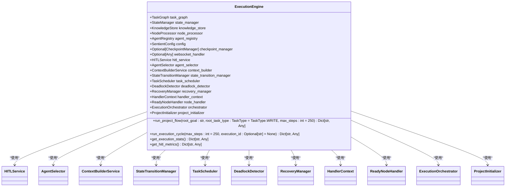

# 任务图系统

<cite>
**本文档引用的文件**
- [task_graph.py](file://src\sentientresearchagent\hierarchical_agent_framework\graph\task_graph.py)
- [project_initializer.py](file://src\sentientresearchagent\hierarchical_agent_framework\graph\project_initializer.py)
- [state_manager.py](file://src\sentientresearchagent\hierarchical_agent_framework\graph\state_manager.py)
- [execution_engine.py](file://src\sentientresearchagent\hierarchical_agent_framework\graph\execution_engine.py)
- [cycle_manager.py](file://src\sentientresearchagent\hierarchical_agent_framework\graph\cycle_manager.py)
- [graph_serializer.py](file://src\sentientresearchagent\hierarchical_agent_framework\graph\graph_serializer.py)
- [task_node.py](file://src\sentientresearchagent\hierarchical_agent_framework\node\task_node.py)
- [node_processor.py](file://src\sentientresearchagent\hierarchical_agent_framework\node\node_processor.py)
</cite>

## 目录
1. [简介](#简介)
2. [核心组件](#核心组件)
3. [任务图结构](#任务图结构)
4. [项目初始化](#项目初始化)
5. [状态管理](#状态管理)
6. [执行引擎](#执行引擎)
7. [循环管理器](#循环管理器)
8. [序列化与可视化](#序列化与可视化)
9. [性能优化建议](#性能优化建议)
10. [结论](#结论)

## 简介
任务图系统是一个复杂的分层代理框架，用于管理和执行研究任务。该系统通过有向无环图（DAG）来表示任务的分解和依赖关系，确保任务按照正确的顺序执行。本文档详细阐述了系统的各个组成部分及其交互方式。

## 核心组件

任务图系统由多个核心组件构成，包括任务图、项目初始化器、状态管理器、执行引擎、循环管理器、图序列化器、任务节点和节点处理器。这些组件协同工作，以实现高效的任务调度和执行。

**Section sources**
- [task_graph.py](file://src\sentientresearchagent\hierarchical_agent_framework\graph\task_graph.py#L12-L137)
- [project_initializer.py](file://src\sentientresearchagent\hierarchical_agent_framework\graph\project_initializer.py#L5-L49)
- [state_manager.py](file://src\sentientresearchagent\hierarchical_agent_framework\graph\state_manager.py#L13-L160)
- [execution_engine.py](file://src\sentientresearchagent\hierarchical_agent_framework\graph\execution_engine.py#L32-L212)
- [cycle_manager.py](file://src\sentientresearchagent\hierarchical_agent_framework\graph\cycle_manager.py#L104-L296)
- [graph_serializer.py](file://src\sentientresearchagent\hierarchical_agent_framework\graph\graph_serializer.py#L9-L175)
- [task_node.py](file://src\sentientresearchagent\hierarchical_agent_framework\node\task_node.py#L18-L285)
- [node_processor.py](file://src\sentientresearchagent\hierarchical_agent_framework\node\node_processor.py#L68-L254)

## 任务图结构

任务图是整个系统的核心数据结构，它使用有向无环图（DAG）来表示任务之间的依赖关系。每个任务节点都有一个唯一的ID，并且可以包含子任务。任务图支持动态添加和删除节点，以及更新节点的状态。

**Diagram sources**
- [task_graph.py](file://src\sentientresearchagent\hierarchical_agent_framework\graph\task_graph.py#L12-L137)
- [task_node.py](file://src\sentientresearchagent\hierarchical_agent_framework\node\task_node.py#L18-L285)

## 项目初始化

项目初始化器负责创建项目的初始根任务节点和图。当用户设定目标时，项目初始化器会根据目标生成一个根任务节点，并将其添加到任务图中。这个过程确保了所有后续任务都从一个明确的起点开始。

**Diagram sources**
- [project_initializer.py](file://src\sentientresearchagent\hierarchical_agent_framework\graph\project_initializer.py#L5-L49)
- [task_graph.py](file://src\sentientresearchagent\hierarchical_agent_framework\graph\task_graph.py#L12-L137)

## 状态管理

状态管理器负责检查节点是否可以转换状态。它通过一系列条件判断来确定节点是否可以从一种状态转换到另一种状态。例如，一个节点只有在其所有前置任务完成后才能从PENDING状态转换为READY状态。

**Diagram sources**
- [state_manager.py](file://src\sentientresearchagent\hierarchical_agent_framework\graph\state_manager.py#L13-L160)

## 执行引擎

执行引擎是驱动任务图遍历和节点执行的主要组件。它维护了一个新的模块化架构，同时保持了与旧API的兼容性。执行引擎通过调用不同的服务和管理器来协调任务的执行流程。

**Diagram sources**
- [execution_engine.py](file://src\sentientresearchagent\hierarchical_agent_framework\graph\execution_engine.py#L32-L212)

## 循环管理器

循环管理器负责在执行周期内处理节点状态转换和调度节点处理。它按顺序执行以下步骤：将PENDING状态的节点转换为READY状态，处理AGGREGATING状态的节点，批量并行处理READY状态的节点，以及处理NEEDS_REPLAN状态的节点。

**Diagram sources**
- [cycle_manager.py](file://src\sentientresearchagent\hierarchical_agent_framework\graph\cycle_manager.py#L104-L296)

## 序列化与可视化

图序列化器负责将任务图转换为适合前端可视化的字典格式。这使得前端能够显示任务图的当前状态，包括节点、边和各种属性。此外，序列化功能还支持持久化存储和调试。

**Diagram sources**
- [graph_serializer.py](file://src\sentientresearchagent\hierarchical_agent_framework\graph\graph_serializer.py#L9-L175)

## 性能优化建议

为了提高大规模图的性能，建议采取以下措施：
- **内存管理**：使用`OptimizedKnowledgeStore`类，它提供了读取缓存和写入缓冲区，减少了锁争用。
- **并行执行策略**：利用`TaskScheduler`类中的`get_ready_nodes`方法，批量获取可执行的节点，并使用`asyncio.gather`进行并行处理。
- **循环检测最佳实践**：定期调用`DeadlockDetector`类的`detect_deadlock`方法，及时发现并解决死锁问题。

**Diagram sources**
- [optimized_knowledge_store.py](file://src\sentientresearchagent\hierarchical_agent_framework\context\optimized_knowledge_store.py#L75-L275)
- [task_scheduler.py](file://src\sentientresearchagent\hierarchical_agent_framework\orchestration\task_scheduler.py#L22-L553)
- [deadlock_detector.py](file://src\sentientresearchagent\hierarchical_agent_framework\orchestration\deadlock_detector.py#L10-L100)

## 结论

任务图系统通过精心设计的组件和高效的算法实现了复杂研究任务的自动化执行。通过对任务图的合理建模和状态管理，系统能够有效地处理任务间的依赖关系，并确保任务按正确顺序执行。未来的工作可以进一步优化性能，增加更多的监控和调试工具，以提升系统的可靠性和可用性。