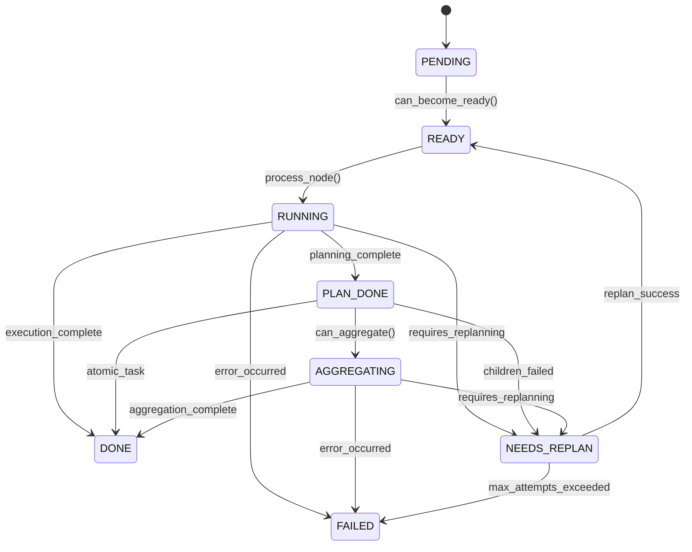
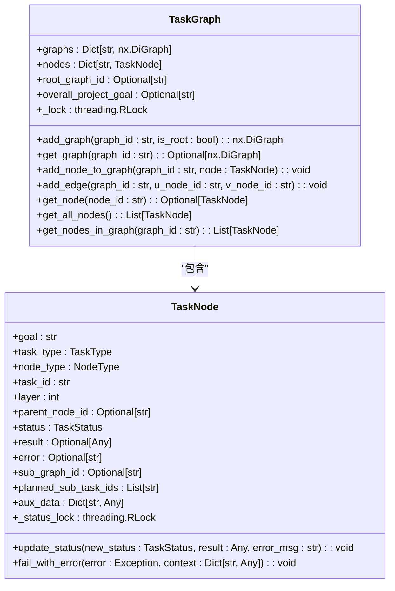
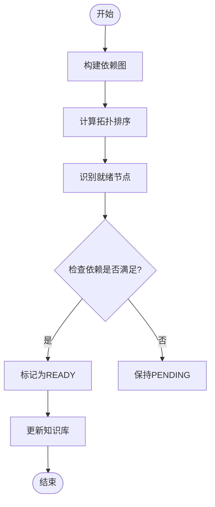
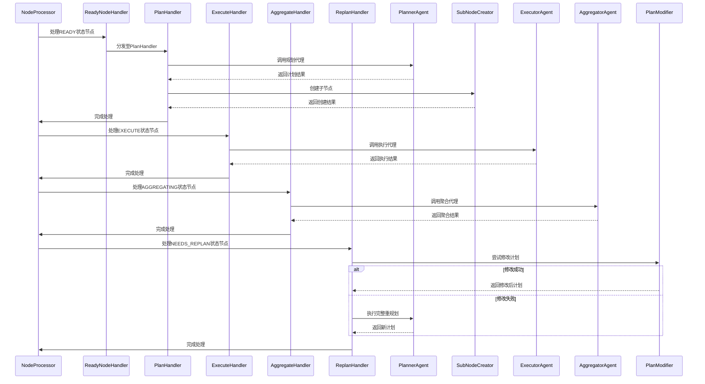

# 任务图结构

<cite>
**本文档中引用的文件**   
- [task_graph.py](file://src\sentientresearchagent\hierarchical_agent_framework\graph\task_graph.py)
- [cycle_manager.py](file://src\sentientresearchagent\hierarchical_agent_framework\graph\cycle_manager.py)
- [task_node.py](file://src\sentientresearchagent\hierarchical_agent_framework\node\task_node.py)
- [state_manager.py](file://src\sentientresearchagent\hierarchical_agent_framework\graph\state_manager.py)
- [types.py](file://src\sentientresearchagent\hierarchical_agent_framework\types.py)
- [execution_orchestrator.py](file://src\sentientresearchagent\hierarchical_agent_framework\orchestration\execution_orchestrator.py)
- [task_scheduler.py](file://src\sentientresearchagent\hierarchical_agent_framework\orchestration\task_scheduler.py)
- [node_processor.py](file://src\sentientresearchagent\hierarchical_agent_framework\node\node_processor.py)
- [base_handler.py](file://src\sentientresearchagent\hierarchical_agent_framework\node_handlers\base_handler.py)
- [ready_node_handler.py](file://src\sentientresearchagent\hierarchical_agent_framework\node_handlers\ready_node_handler.py)
- [plan_handler.py](file://src\sentientresearchagent\hierarchical_agent_framework\node_handlers\plan_handler.py)
- [execute_handler.py](file://src\sentientresearchagent\hierarchical_agent_framework\node_handlers\execute_handler.py)
- [aggregate_handler.py](file://src\sentientresearchagent\hierarchical_agent_framework\node_handlers\aggregate_handler.py)
- [replan_handler.py](file://src\sentientresearchagent\hierarchical_agent_framework\node_handlers\replan_handler.py)
</cite>

## 目录
1. [简介](#简介)
2. [核心组件](#核心组件)
3. [任务节点状态机](#任务节点状态机)
4. [任务图构建与依赖管理](#任务图构建与依赖管理)
5. [执行调度与循环检测](#执行调度与循环检测)
6. [节点处理流程](#节点处理流程)
7. [内存优化建议](#内存优化建议)
8. [自定义扩展指南](#自定义扩展指南)

## 简介
任务图结构是本系统的核心数据结构，采用有向无环图（DAG）来建模复杂研究任务的分解逻辑与依赖关系。该结构通过任务节点（TaskNode）和边（Edge）组织任务，支持层次化分解、依赖管理和状态跟踪。每个任务节点代表一个具体的研究子任务，具有明确的目标、类型和状态。系统通过拓扑排序算法确定任务执行顺序，并利用循环检测机制确保图的无环性。这种设计使得复杂的多步骤研究任务能够被系统化地分解、调度和执行。

## 核心组件

任务图结构由多个核心组件构成，包括任务图（TaskGraph）、任务节点（TaskNode）、状态管理器（StateManager）和循环管理器（CycleManager）。这些组件协同工作，实现任务的创建、连接、状态转换和执行调度。任务图负责整体结构的维护，任务节点封装单个任务的属性和行为，状态管理器验证状态转换的合法性，而循环管理器则协调整个执行周期中的节点处理。

**本文档中引用的文件**   
- [task_graph.py](file://src\sentientresearchagent\hierarchical_agent_framework\graph\task_graph.py)
- [task_node.py](file://src\sentientresearchagent\hierarchical_agent_framework\node\task_node.py)
- [state_manager.py](file://src\sentientresearchagent\hierarchical_agent_framework\graph\state_manager.py)
- [cycle_manager.py](file://src\sentientresearchagent\hierarchical_agent_framework\graph\cycle_manager.py)

## 任务节点状态机

任务节点的状态机设计是任务图执行控制的核心。每个任务节点在生命周期中经历一系列预定义的状态转换，这些转换受到严格的规则约束，以确保执行流程的正确性和一致性。

**图表来源**
- [types.py](file://src\sentientresearchagent\hierarchical_agent_framework\types.py#L10-L45)
- [task_node.py](file://src\sentientresearchagent\hierarchical_agent_framework\node\task_node.py#L200-L250)
- [state_manager.py](file://src\sentientresearchagent\hierarchical_agent_framework\graph\state_manager.py#L100-L150)

## 任务图构建与依赖管理

任务图通过`TaskGraph`类实现，采用NetworkX库作为底层图结构。该类提供了添加节点、建立边、管理子图等基本操作，并通过线程锁保证多线程环境下的操作安全性。

### 节点与边的创建
任务节点的创建和连接遵循严格的层次化原则。父节点通过`sub_graph_id`关联其子图，子节点通过`parent_node_id`指向父节点，形成清晰的父子关系。边的建立使用`add_edge`方法，在指定的子图中创建有向依赖关系。

**图表来源**
- [task_graph.py](file://src\sentientresearchagent\hierarchical_agent_framework\graph\task_graph.py#L15-L130)
- [task_node.py](file://src\sentientresearchagent\hierarchical_agent_framework\node\task_node.py#L10-L100)

### 层次化结构管理
任务图支持嵌套的层次化结构，允许将复杂任务分解为多个子任务组。根图（root graph）包含顶层任务节点，每个规划型节点（PLAN类型）可以拥有自己的子图，用于存放其分解出的子任务。这种设计实现了任务的递归分解，直到所有任务都达到可执行的原子级别。

## 执行调度与循环检测

系统的执行调度由`ExecutionOrchestrator`和`TaskScheduler`协同完成。`TaskScheduler`负责根据依赖关系和状态判断哪些节点可以执行，而`ExecutionOrchestrator`则协调整个执行流程。

### 拓扑排序与执行顺序
`TaskScheduler`利用拓扑排序算法确定任务的执行顺序。它首先构建完整的依赖图，然后使用Kahn算法计算拓扑序，确保前置任务总是在后续任务之前执行。这一过程避免了因依赖关系导致的死锁或竞态条件。

**图表来源**
- [task_scheduler.py](file://src\sentientresearchagent\hierarchical_agent_framework\orchestration\task_scheduler.py#L300-L350)
- [state_manager.py](file://src\sentientresearchagent\hierarchical_agent_framework\graph\state_manager.py#L50-L80)

### 循环检测机制
循环检测由`CycleManager`实现，它在每个执行周期中检查并处理节点状态转换。该机制通过原子性的状态转换操作防止竞态条件，并采用双检查模式确保状态的一致性。对于可能存在的循环依赖，系统会在构建依赖图时发出警告，并将相关节点置于错误状态。

## 节点处理流程

节点的处理流程采用策略模式，由`NodeProcessor`根据节点状态分发到不同的处理器。这一设计实现了关注点分离，使每种类型的处理逻辑独立且可扩展。

**图表来源**
- [node_processor.py](file://src\sentientresearchagent\hierarchical_agent_framework\node\node_processor.py#L100-L200)
- [ready_node_handler.py](file://src\sentientresearchagent\hierarchical_agent_framework\node_handlers\ready_node_handler.py#L50-L100)
- [plan_handler.py](file://src\sentientresearchagent\hierarchical_agent_framework\node_handlers\plan_handler.py#L50-L100)
- [execute_handler.py](file://src\sentientresearchagent\hierarchical_agent_framework\node_handlers\execute_handler.py#L50-L100)
- [aggregate_handler.py](file://src\sentientresearchagent\hierarchical_agent_framework\node_handlers\aggregate_handler.py#L50-L100)
- [replan_handler.py](file://src\sentientresearchagent\hierarchical_agent_framework\node_handlers\replan_handler.py#L50-L100)

## 内存优化建议

对于大规模任务图，内存使用可能成为性能瓶颈。以下是一些优化建议：

1. **批量状态更新**：使用`BatchedStateManager`进行批量状态更新，减少频繁的I/O操作。
2. **延迟更新策略**：在高并发场景下，采用"deferred"执行策略，将状态更新延迟到批处理阶段。
3. **轻量级节点表示**：对于已完成的任务节点，可以将其从主图中移除，仅保留关键元数据。
4. **图分区**：将大型任务图划分为多个逻辑分区，按需加载和处理。
5. **缓存优化**：合理配置`TaskScheduler`的依赖缓存，避免重复计算。

## 自定义扩展指南

开发者可以通过继承基类和实现接口契约来扩展系统功能。主要扩展点包括自定义节点处理器、状态转换规则和异常处理模式。

### 接口契约
所有自定义处理器必须继承`BaseNodeHandler`并实现抽象方法：
- `_validate_node_state`: 验证节点状态是否适合当前处理器
- `_process`: 实现核心处理逻辑
- `_get_stage_name`: 返回追踪阶段名称

### 异常处理模式
系统采用统一的异常处理模式，所有未捕获的异常都会导致节点状态转为`FAILED`。开发者应在处理器中捕获特定异常，并提供有意义的错误信息。对于可恢复的错误，可以设置`NEEDS_REPLAN`状态以触发重试机制。

**本文档中引用的文件**   
- [base_handler.py](file://src\sentientresearchagent\hierarchical_agent_framework\node_handlers\base_handler.py)
- [task_node.py](file://src\sentientresearchagent\hierarchical_agent_framework\node\task_node.py)
- [types.py](file://src\sentientresearchagent\hierarchical_agent_framework\types.py)