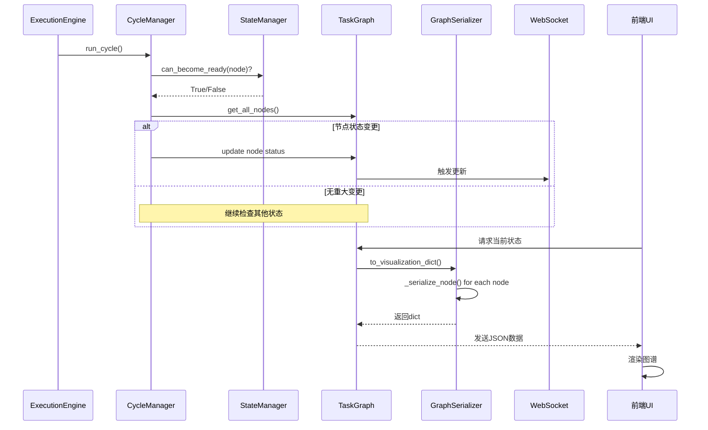
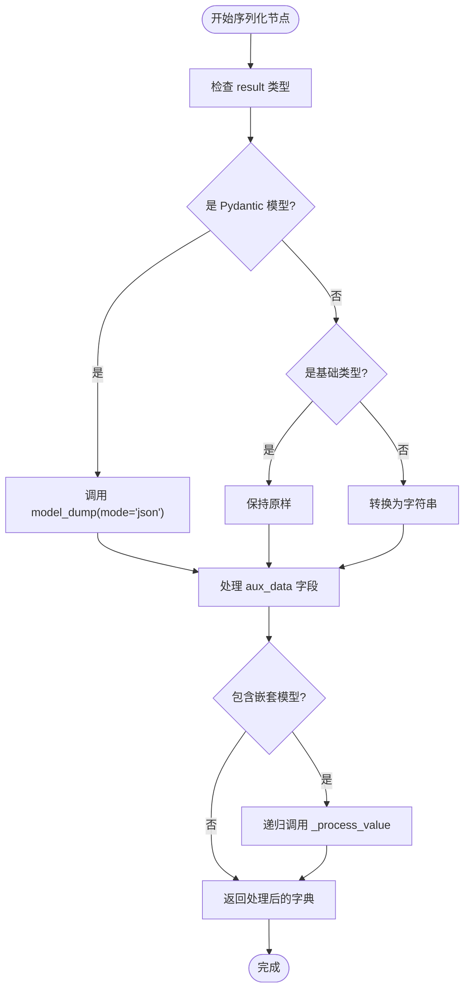
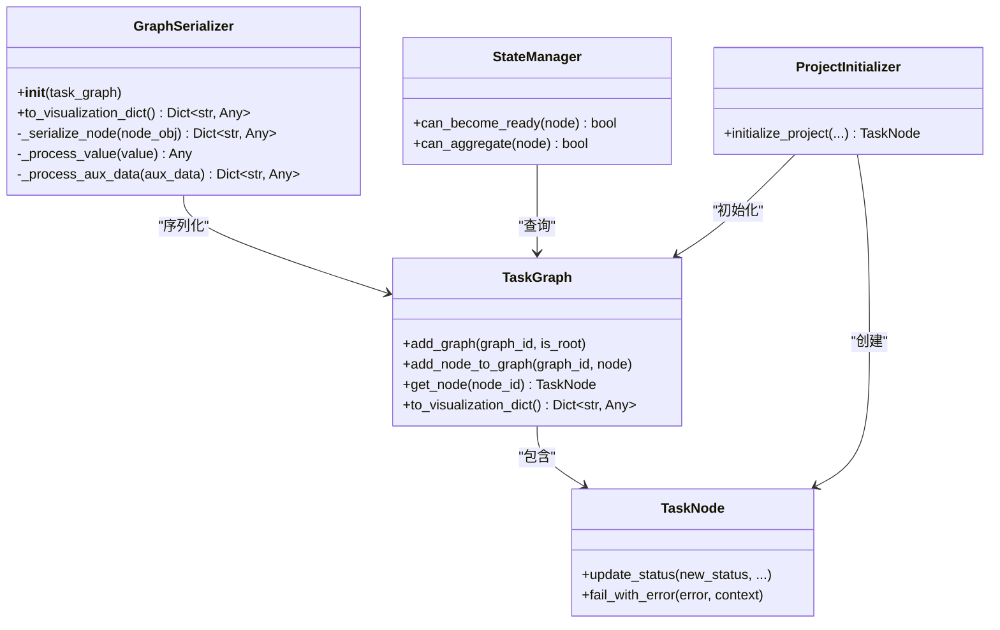

# 图序列化与持久化

<cite>
**本文档中引用的文件**   
- [graph_serializer.py](file://src\sentientresearchagent\hierarchical_agent_framework\graph\graph_serializer.py)
- [task_graph.py](file://src\sentientresearchagent\hierarchical_agent_framework\graph\task_graph.py)
- [task_node.py](file://src\sentientresearchagent\hierarchical_agent_framework\node\task_node.py)
- [state_manager.py](file://src\sentientresearchagent\hierarchical_agent_framework\graph\state_manager.py)
- [project_initializer.py](file://src\sentientresearchagent\hierarchical_agent_framework\graph\project_initializer.py)
- [cycle_manager.py](file://src\sentientresearchagent\hierarchical_agent_framework\graph\cycle_manager.py)
</cite>

## 目录
1. [简介](#简介)
2. [项目结构分析](#项目结构分析)
3. [核心组件](#核心组件)
4. [架构概述](#架构概述)
5. [详细组件分析](#详细组件分析)
6. [依赖关系分析](#依赖关系分析)
7. [性能考虑](#性能考虑)
8. [故障排除指南](#故障排除指南)
9. [结论](#结论)

## 简介
本参考文档旨在全面阐述`graph_serializer.py`模块实现的任务图JSON序列化与反序列化机制。该系统是智能研究代理框架的核心组成部分，负责将复杂的任务图结构转换为可持久化和可视化表示的格式。文档深入解析了序列化格式的设计原则、字段语义及其版本兼容性策略，并说明如何将任务图保存至磁盘或传输至其他服务以支持调试与分析。此外，文档还结合实际用例展示了从文件加载任务图以恢复执行状态的能力，为开发者提供了自定义序列化插件的接口规范，并指出了处理大型图时避免内存溢出的最佳实践。

## 项目结构分析
该项目采用分层的模块化设计，其核心功能围绕“层次化代理框架”（hierarchical_agent_framework）构建。任务图的序列化与持久化功能主要位于`src\sentientresearchagent\hierarchical_agent_framework\graph`目录下。该目录包含管理图结构的`task_graph.py`、负责节点状态管理的`state_manager.py`、初始化项目的`project_initializer.py`以及核心的序列化器`graph_serializer.py`。整个系统通过`TaskGraph`对象作为中心枢纽，协调`TaskNode`节点的创建、状态转换和执行流程。前端位于`frontend`目录，通过WebSocket与后端通信，接收由`GraphSerializer`生成的JSON数据进行可视化展示。

```mermaid
graph TD
subgraph "后端 (Python)"
A[graph_serializer.py] --> B[task_graph.py]
B --> C[task_node.py]
D[state_manager.py] --> B
E[project_initializer.py] --> B
F[cycle_manager.py] --> D
F --> C
end
subgraph "前端 (TypeScript/React)"
G[TaskGraph.tsx] --> H[GraphVisualization.tsx]
end
A < --> |JSON| I[(WebSocket)]
I < --> G
```

**图表来源**
- [graph_serializer.py](file://src\sentientresearchagent\hierarchical_agent_framework\graph\graph_serializer.py)
- [task_graph.py](file://src\sentientresearchagent\hierarchical_agent_framework\graph\task_graph.py)
- [frontend\src\types\index.ts](file://frontend\src\types\index.ts)

**章节来源**
- [graph_serializer.py](file://src\sentientresearchagent\hierarchical_agent_framework\graph\graph_serializer.py)
- [task_graph.py](file://src\sentientresearchagent\hierarchical_agent_framework\graph\task_graph.py)

## 核心组件
`GraphSerializer`类是实现图序列化的关键组件。它接收一个`TaskGraph`实例作为输入，遍历其所有节点和子图，将其转换为一个扁平化的、适合前端消费的字典结构。此过程不仅包括基本的图拓扑信息（节点和边），还深度处理了每个`TaskNode`的复杂属性，如枚举值、Pydantic模型结果和辅助数据（aux_data），确保所有内容都可被JSON序列化。`TaskGraph`类本身则负责维护图的完整结构，提供添加节点、建立边和查询等核心操作。`TaskNode`类代表图中的单个任务单元，封装了任务的目标、类型、状态、结果及与其他节点的关系。

**章节来源**
- [graph_serializer.py](file://src\sentientresearchagent\hierarchical_agent_framework\graph\graph_serializer.py#L1-L176)
- [task_graph.py](file://src\sentientresearchagent\hierarchical_agent_framework\graph\task_graph.py#L12-L137)
- [task_node.py](file://src\sentientresearchagent\hierarchical_agent_framework\node\task_node.py#L18-L285)

## 架构概述
系统的整体架构遵循前后端分离模式。后端的`ExecutionEngine`驱动任务图的执行循环，`CycleManager`根据`StateManager`的判断来决定节点的状态转换。当需要向客户端同步状态时，`TaskGraph`会调用其`to_visualization_dict`方法，该方法内部实例化`GraphSerializer`并返回一个完整的JSON对象。这个对象通过WebSocket实时推送到前端。前端的React应用接收到数据后，使用`react-flow`库渲染出交互式图谱。这种设计实现了业务逻辑与展示逻辑的解耦，使得序列化格式成为两者之间稳定的数据契约。



**图表来源**
- [task_graph.py](file://src\sentientresearchagent\hierarchical_agent_framework\graph\task_graph.py#L130-L137)
- [graph_serializer.py](file://src\sentientresearchagent\hierarchical_agent_framework\graph\graph_serializer.py#L157-L175)
- [cycle_manager.py](file://src\sentientresearchagent\hierarchical_agent_framework\graph\cycle_manager.py)

**章节来源**
- [task_graph.py](file://src\sentientresearchagent\hierarchical_agent_framework\graph\task_graph.py)
- [graph_serializer.py](file://src\sentientresearchagent\hierarchical_agent_framework\graph\graph_serializer.py)

## 详细组件分析

### GraphSerializer 分析
`GraphSerializer`是一个专门用于将`TaskGraph`对象转换为前端可视化所需字典格式的工具类。它的主要职责是递归地处理`TaskNode`中的各种复杂数据类型，确保最终输出是纯JSON兼容的。

#### 序列化机制
`GraphSerializer`通过`_serialize_node`方法对每个`TaskNode`进行深度处理。它会安全地提取枚举值（如`task_type`, `status`）、将时间戳转换为ISO字符串，并特别处理`result`和`aux_data`字段。对于`result`，如果它是Pydantic模型，则调用`model_dump(mode='json')`；如果是基础类型，则直接保留。`aux_data`字段可能包含任意嵌套的复杂对象，为此`GraphSerializer`提供了`_process_value`和`_process_aux_data`两个递归函数，确保所有层级的数据都能被正确序列化。



**图表来源**
- [graph_serializer.py](file://src\sentientresearchagent\hierarchical_agent_framework\graph\graph_serializer.py#L25-L155)

**章节来源**
- [graph_serializer.py](file://src\sentientresearchagent\hierarchical_agent_framework\graph\graph_serializer.py)

### TaskGraph 与 TaskNode 分析
`TaskGraph`和`TaskNode`共同构成了任务图的数据模型。`TaskGraph`作为容器，管理着多个有向无环图（DAG）和全局节点映射。`TaskNode`则代表了具体的任务，其丰富的属性定义了序列化输出的结构。

#### 数据模型
以下表格定义了`TaskNode`在序列化后暴露给前端的主要字段及其含义：

| 字段名 | 类型 | 描述 |
| :--- | :--- | :--- |
| `task_id` | string | 任务的唯一标识符 |
| `goal` | string | 任务的具体目标描述 |
| `task_type` | string | 任务的高层类别（如WRITE, SEARCH） |
| `node_type` | string | 节点的处理类型（PLAN 或 EXECUTE） |
| `status` | string | 当前执行状态（PENDING, READY, DONE等） |
| `layer` | number | 任务在规划层次中的深度 |
| `parent_node_id` | string? | 父任务的ID |
| `full_result` | any | 任务执行的完整结果，已序列化 |
| `error` | string? | 如果任务失败，记录错误信息 |
| `input_context_sources` | array | 输入上下文的来源任务摘要列表 |
| `timestamp_completed` | string? | 任务完成的时间戳（ISO格式） |
| `aux_data` | object | 包含任意附加数据的字典，已完全序列化 |

**章节来源**
- [task_node.py](file://src\sentientresearchagent\hierarchical_agent_framework\node\task_node.py#L18-L285)
- [graph_serializer.py](file://src\sentientresearchagent\hierarchical_agent_framework\graph\graph_serializer.py#L25-L155)

## 依赖关系分析
`GraphSerializer`的正常运行依赖于`TaskGraph`和`TaskNode`的稳定API。`TaskGraph`依赖`StateManager`来决策节点状态转换，而`StateManager`又依赖`TaskGraph`提供的图遍历方法。`ProjectInitializer`负责创建初始的`TaskGraph`和根节点，是整个执行流程的起点。`CycleManager`作为调度核心，协调了`StateManager`、`NodeProcessor`和`KnowledgeStore`等多个组件。这些组件共同构成了一个紧密协作的系统，其中`GraphSerializer`扮演着将内部复杂状态转化为外部可理解信息的关键角色。



**图表来源**
- [graph_serializer.py](file://src\sentientresearchagent\hierarchical_agent_framework\graph\graph_serializer.py)
- [task_graph.py](file://src\sentientresearchagent\hierarchical_agent_framework\graph\task_graph.py)
- [task_node.py](file://src\sentientresearchagent\hierarchical_agent_framework\node\task_node.py)
- [state_manager.py](file://src\sentientresearchagent\hierarchical_agent_framework\graph\state_manager.py)
- [project_initializer.py](file://src\sentientresearchagent\hierarchical_agent_framework\graph\project_initializer.py)

**章节来源**
- [graph_serializer.py](file://src\sentientresearchagent\hierarchical_agent_framework\graph\graph_serializer.py)
- [task_graph.py](file://src\sentientresearchagent\hierarchical_agent_framework\graph\task_graph.py)
- [task_node.py](file://src\sentientresearchagent\hierarchical_agent_framework\node\task_node.py)

## 性能考虑
在处理大型任务图时，序列化操作可能成为性能瓶颈。`GraphSerializer`的`to_visualization_dict`方法会一次性遍历所有节点和边，对于拥有数千个节点的图，这可能导致显著的延迟和高内存占用。为避免内存溢出，最佳实践是实现增量序列化或分页机制，只序列化当前视口内的节点。此外，应避免在`aux_data`中存储大型二进制数据或冗余信息。对于长时间运行的任务，建议定期将`TaskGraph`的状态快照持久化到磁盘，以便在崩溃后能够恢复，而不是依赖内存中的单一实例。

## 故障排除指南
当遇到序列化问题时，首先应检查`TaskNode`的`result`或`aux_data`是否包含无法被JSON序列化的对象（如未处理的Pydantic模型或自定义类）。`GraphSerializer`的日志可以帮助定位具体是哪个节点导致了问题。如果前端显示的图谱不完整或状态错误，请验证`TaskGraph`的`to_visualization_dict`方法返回的数据是否正确，并确认WebSocket消息是否成功送达。对于状态转换问题，应审查`StateManager`的`can_become_ready`和`can_aggregate`方法的返回值，它们是驱动`CycleManager`决策的基础。

**章节来源**
- [graph_serializer.py](file://src\sentientresearchagent\hierarchical_agent_framework\graph\graph_serializer.py)
- [state_manager.py](file://src\sentientresearchagent\hierarchical_agent_framework\graph\state_manager.py)
- [cycle_manager.py](file://src\sentientresearchagent\hierarchical_agent_framework\graph\cycle_manager.py)

## 结论
`GraphSerializer`是连接智能研究代理后端复杂逻辑与前端直观可视化的重要桥梁。它通过精心设计的序列化机制，将`TaskGraph`和`TaskNode`的丰富状态信息转化为标准的JSON格式，支持了系统的调试、监控和持久化需求。理解其工作原理对于开发新功能、优化性能和排查问题是至关重要的。未来的工作可以集中在优化大规模图的序列化效率和增强序列化格式的扩展性上。