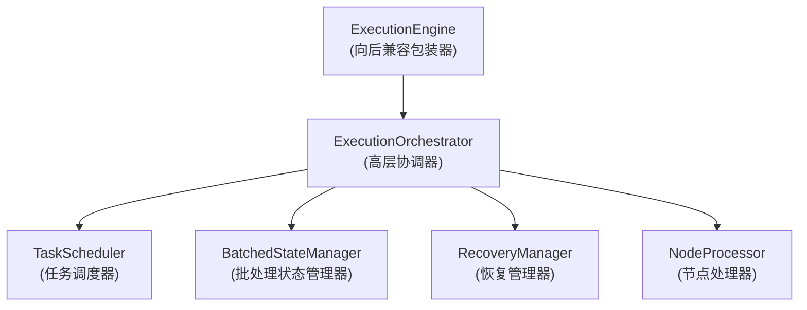
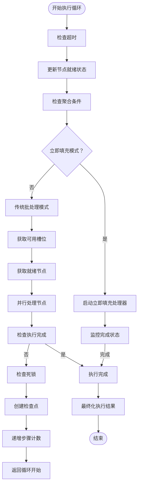
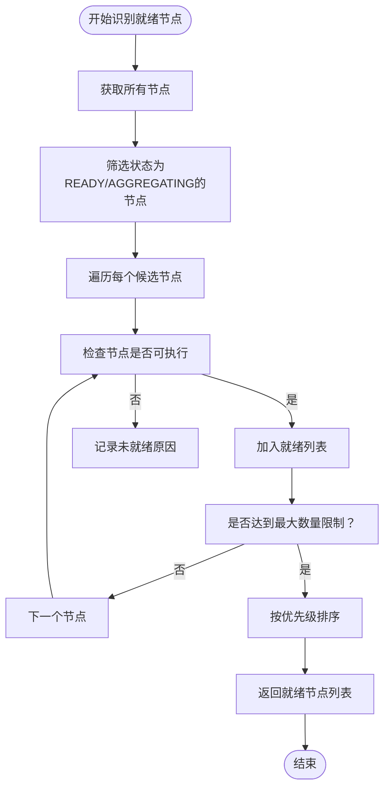
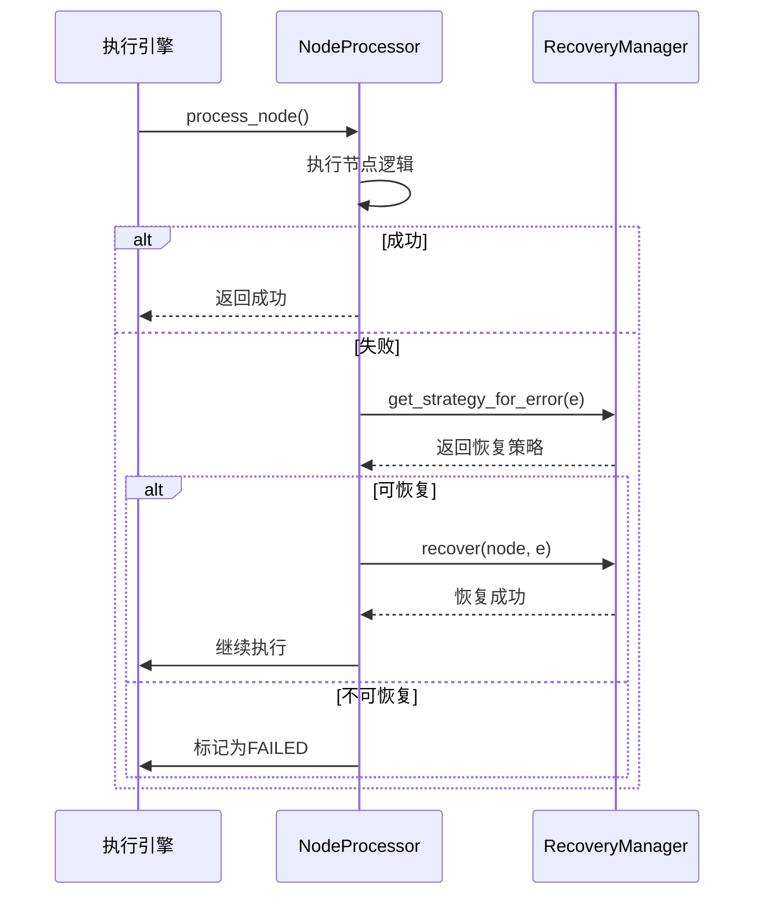
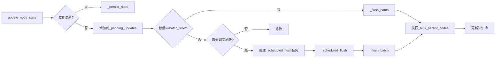

# 执行引擎

<cite>
**本文档引用的文件**
- [execution_engine.py](file://src\sentientresearchagent\hierarchical_agent_framework\graph\execution_engine.py)
- [execution_orchestrator.py](file://src\sentientresearchagent\hierarchical_agent_framework\orchestration\execution_orchestrator.py)
- [batched_state_manager.py](file://src\sentientresearchagent\hierarchical_agent_framework\orchestration\batched_state_manager.py)
- [task_scheduler.py](file://src\sentientresearchagent\hierarchical_agent_framework\orchestration\task_scheduler.py)
- [node_processor.py](file://src\sentientresearchagent\hierarchical_agent_framework\node\node_processor.py)
- [ReadyNodeHandler.py](file://src\sentientresearchagent\hierarchical_agent_framework\node_handlers\ready_node_handler.py)
</cite>

## 目录
1. [简介](#简介)
2. [核心架构与组件](#核心架构与组件)
3. [主控循环设计](#主控循环设计)
4. [就绪节点识别策略](#就绪节点识别策略)
5. [并行度控制机制](#并行度控制机制)
6. [错误传播与重试逻辑](#错误传播与重试逻辑)
7. [任务分发至代理处理器](#任务分发至代理处理器)
8. [批处理状态管理](#批处理状态管理)
9. [生命周期操作](#生命周期操作)
10. [性能调优建议](#性能调优建议)

## 简介
执行引擎是系统的核心调度中枢，负责驱动任务图的遍历与节点执行。它采用向后兼容的设计，通过`ExecutionEngine`类封装新的模块化架构组件（如`ExecutionOrchestrator`、`TaskScheduler`等），实现了任务执行流程的高效协调。该引擎支持并发执行独立任务、依赖感知调度以及死锁检测与恢复，确保复杂任务流的稳定运行。

## 核心架构与组件
执行引擎由多个协同工作的组件构成，形成清晰的职责分离架构：



**组件说明：**
- **ExecutionEngine**: 提供与旧版API兼容的接口，内部委托给新架构组件。
- **ExecutionOrchestrator**: 高层协调器，管理执行生命周期，协调各服务。
- **TaskScheduler**: 负责任务调度，确定哪些节点可执行。
- **BatchedStateManager**: 优化状态更新，通过批量操作减少I/O开销。
- **RecoveryManager**: 处理错误恢复策略。
- **NodeProcessor**: 处理单个节点的执行。

**Diagram sources**
- [execution_engine.py](file://src\sentientresearchagent\hierarchical_agent_framework\graph\execution_engine.py#L40-L131)
- [execution_orchestrator.py](file://src\sentientresearchagent\hierarchical_agent_framework\orchestration\execution_orchestrator.py#L100-L125)

## 主控循环设计
执行引擎的主控循环是其核心，负责持续监控和推进任务图的执行状态。循环通过`_execution_loop`方法实现，具备以下关键特性：



**关键流程：**
1. **初始化**：设置根任务，生成执行ID。
2. **状态同步**：定期更新节点状态，将满足依赖的PENDING节点转为READY。
3. **聚合检查**：检测PLAN_DONE状态的节点是否所有子任务已完成，若满足则转为AGGREGATING。
4. **模式选择**：根据配置决定使用“立即填充”或“传统批处理”模式。
5. **死锁检测**：周期性检查死锁，并尝试恢复。
6. **检查点创建**：在适当时机创建执行检查点以支持恢复。

**Section sources**
- [execution_orchestrator.py](file://src\sentientresearchagent\hierarchical_agent_framework\orchestration\execution_orchestrator.py#L226-L502)

## 就绪节点识别策略
就绪节点的识别由`TaskScheduler`组件负责，通过`get_ready_nodes`方法实现。一个节点被认为是就绪的，必须满足以下所有条件：
- 节点状态为READY或AGGREGATING。
- 所有依赖项均已满足。
- 其父节点处于适当的状态。



**Section sources**
- [task_scheduler.py](file://src\sentientresearchagent\hierarchical_agent_framework\orchestration\task_scheduler.py#L53-L102)

## 并行度控制机制
执行引擎通过动态并发管理来控制并行度，以适应系统负载和外部限制。核心机制如下：

1. **配置参数**：`max_concurrent_nodes`定义了最大并发节点数。
2. **动态调整**：当检测到速率限制错误时，会自动降低并发度（指数退避）；在无错误且处理速度快时，逐步增加并发度。
3. **即时填充模式**：启用`enable_immediate_slot_fill`时，一旦有节点完成，空出的槽位会立即被新就绪的节点填充，最大化资源利用率。

```python
async def _adjust_concurrency(self, error: Optional[Exception] = None) -> None:
    """
    动态调整并发度。
    """
    async with self._concurrency_lock:
        if error and "rate limit" in str(error).lower():
            # 速率限制错误 - 降低并发度
            new_concurrency = max(min_concurrency, self._current_concurrency // 2)
            self._current_concurrency = new_concurrency
        elif ... : # 恢复逻辑
            # 增加并发度
            new_concurrency = min(max_concurrency, self._current_concurrency + 1)
            self._current_concurrency = new_concurrency
```

**Section sources**
- [execution_orchestrator.py](file://src\sentientresearchagent\hierarchical_agent_framework\orchestration\execution_orchestrator.py#L879-L923)

## 错误传播与重试逻辑
执行引擎具备完善的错误处理和恢复机制，确保系统的鲁棒性。

**错误处理流程：**
1. 当节点处理失败时，`_process_single_node`捕获异常。
2. 引擎检查错误类型（如超时、速率限制、执行错误）。
3. `RecoveryManager`根据错误类型选择合适的恢复策略（如重试、重新规划）。
4. 如果恢复成功，节点继续执行；否则，标记为FAILED。



**Section sources**
- [execution_orchestrator.py](file://src\sentientresearchagent\hierarchical_agent_framework\orchestration\execution_orchestrator.py#L669-L720)
- [recovery_manager.py](file://src\sentientresearchagent\hierarchical_agent_framework\orchestration\recovery_manager.py#L450-L473)

## 任务分发至代理处理器
任务的分发由`NodeProcessor`和`ReadyNodeHandler`协作完成。`NodeProcessor`根据节点状态选择相应的处理器，而`ReadyNodeHandler`负责决策节点的具体类型（PLAN或EXECUTE）。

**分发流程：**
1. `NodeProcessor`接收到一个状态为READY的节点。
2. 它调用`ReadyNodeHandler.handle()`方法。
3. `ReadyNodeHandler`首先检查节点层级，如果超过`max_planning_layer`，则强制转为EXECUTE类型。
4. 对于根节点，通常强制进行规划（PLAN）。
5. 对于其他节点，通过`NodeAtomizer`分析决定是PLAN还是EXECUTE。
6. 根据最终决定的类型，调用`ready_plan_handler`或`ready_execute_handler`。

```python
async def handle(self, node: TaskNode, context: ProcessorContext) -> None:
    """
    ReadyNodeHandler的处理逻辑。
    """
    if node.layer >= max_planning_layer:
        node.node_type = NodeType.EXECUTE
        await self.ready_execute_handler.handle(node, context)
    elif is_root_node and force_root_node_planning:
        atomizer_decision_type = NodeType.PLAN
    else:
        atomizer_decision_type = await context.node_atomizer.atomize_node(node, context)
    
    node.node_type = atomizer_decision_type
    if node.node_type == NodeType.PLAN:
        await self.ready_plan_handler.handle(node, context)
    elif node.node_type == NodeType.EXECUTE:
        await self.ready_execute_handler.handle(node, context)
```

**Section sources**
- [node_processor.py](file://src\sentientresearchagent\hierarchical_agent_framework\node\node_processor.py#L178-L254)
- [ready_node_handler.py](file://src\sentientresearchagent\hierarchical_agent_framework\node_handlers\ready_node_handler.py#L666-L746)

## 批处理状态管理
`BatchedStateManager`是提升性能的关键组件，它通过批量更新和异步I/O显著减少了对知识库的写入操作次数。

**工作原理：**
1. 当调用`update_node_state`时，除非指定`immediate=True`，否则节点更新会被暂存到`_pending_updates`字典中。
2. 当暂存的更新数量达到`batch_size`或经过`batch_timeout_ms`时间后，会触发一次批量刷新（`_flush_batch`）。
3. 批量刷新将所有暂存的更新一次性提交到知识库。



此外，对于大型结果，还支持压缩存储，进一步节省存储空间和I/O带宽。

**Section sources**
- [batched_state_manager.py](file://src\sentientresearchagent\hierarchical_agent_framework\orchestration\batched_state_manager.py#L78-L109)
- [batched_state_manager.py](file://src\sentientresearchagent\hierarchical_agent_framework\orchestration\batched_state_manager.py#L33-L76)

## 生命周期操作
执行引擎提供了完整的生命周期管理功能，包括启动、暂停和恢复。

- **启动**：通过调用`run_project_flow`或`execute`方法启动执行。引擎会初始化根任务，然后进入主控循环。
- **暂停**：虽然代码中没有显式的暂停方法，但可以通过取消执行任务（如`immediate_fill_task`）来实现暂停效果。
- **恢复**：通过`CheckpointManager`支持从检查点恢复。当执行因故障中断后，可以从最近的检查点重新开始，避免重复工作。

```python
async def execute(
    self, 
    root_goal: str,
    max_steps: Optional[int] = None,
    execution_id: Optional[str] = None
) -> Dict[str, Any]:
    """
    启动执行流程。
    """
    if self._is_running:
        raise SentientError("执行已在进行中")
        
    self._is_running = True
    # ... 初始化和执行 ...
    finally:
        self._is_running = False
```

**Section sources**
- [execution_orchestrator.py](file://src\sentientresearchagent\hierarchical_agent_framework\orchestration\execution_orchestrator.py#L128-L192)
- [execution_engine.py](file://src\sentientresearchagent\hierarchical_agent_framework\graph\execution_engine.py#L133-L173)

## 性能调优建议
在高负载场景下，可通过调整以下配置参数来优化执行引擎的性能：

| 参数 | 默认值 | 说明 |
| :--- | :--- | :--- |
| `enable_immediate_slot_fill` | `True` | 启用后，节点完成后立即填充空槽，提高吞吐量。 |
| `max_concurrent_nodes` | (未指定) | 控制最大并发执行的节点数，避免系统过载。 |
| `state_batch_size` | `50` | 批处理状态管理器的批次大小，增大可减少I/O次数，但增加延迟。 |
| `state_batch_timeout_ms` | `100` | 批处理的最大等待时间，减小可降低延迟，但可能产生更多小批次。 |
| `enable_state_compression` | `True` | 对大型结果进行压缩，节省存储和I/O。 |
| `max_parallel_nodes` | (未指定) | 在批处理模式下，单次处理的最大并行节点数。 |

**建议：**
- **高吞吐量场景**：启用`enable_immediate_slot_fill`，适当提高`max_concurrent_nodes`。
- **低延迟场景**：减小`state_batch_timeout_ms`，但需权衡I/O开销。
- **内存受限环境**：减小`state_batch_size`和`max_concurrent_nodes`以控制内存使用。
- **网络不稳定环境**：开启`enable_state_compression`以减少传输数据量。