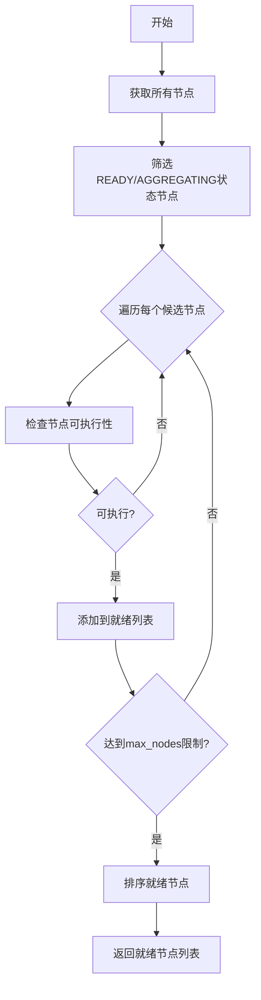
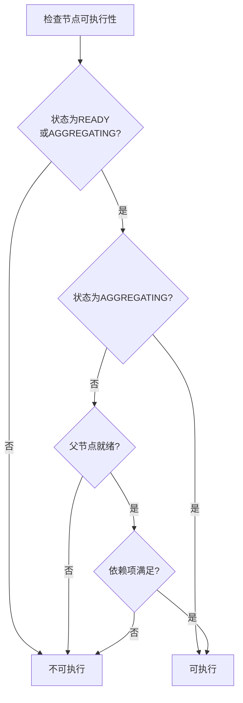
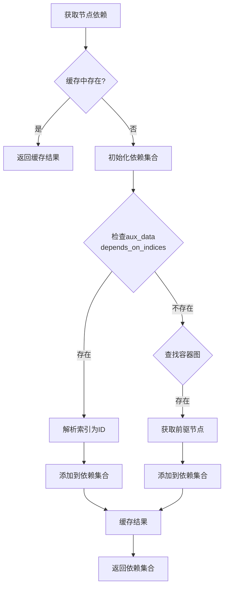
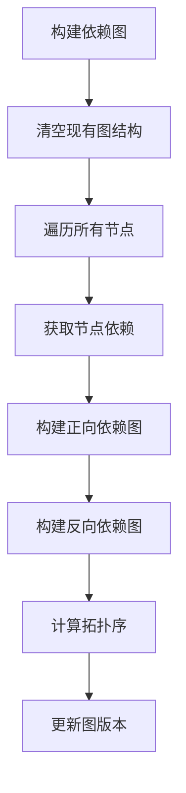
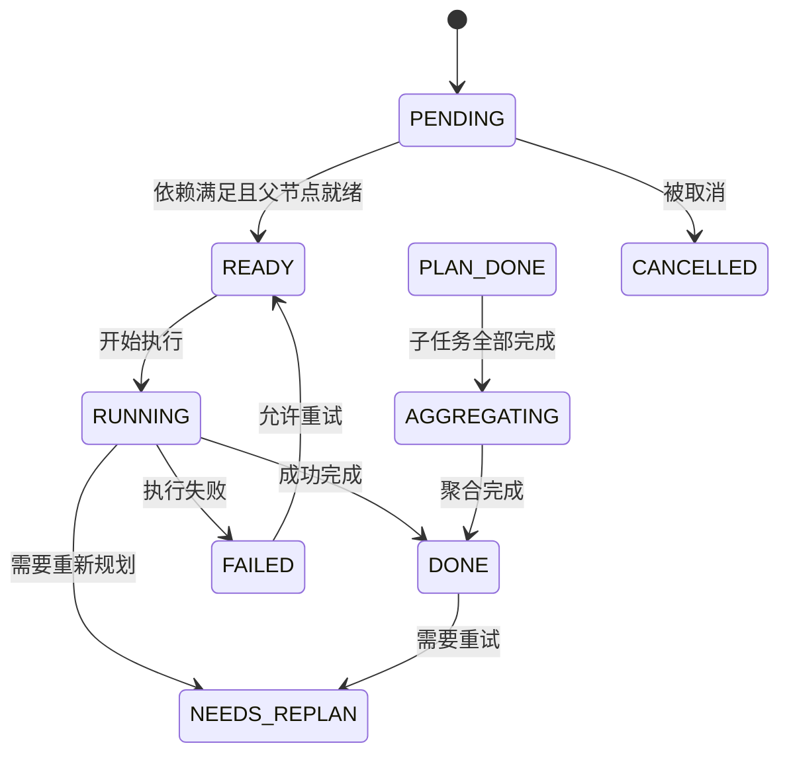
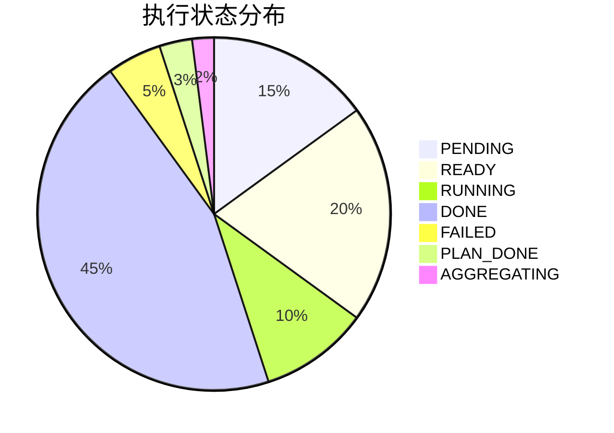
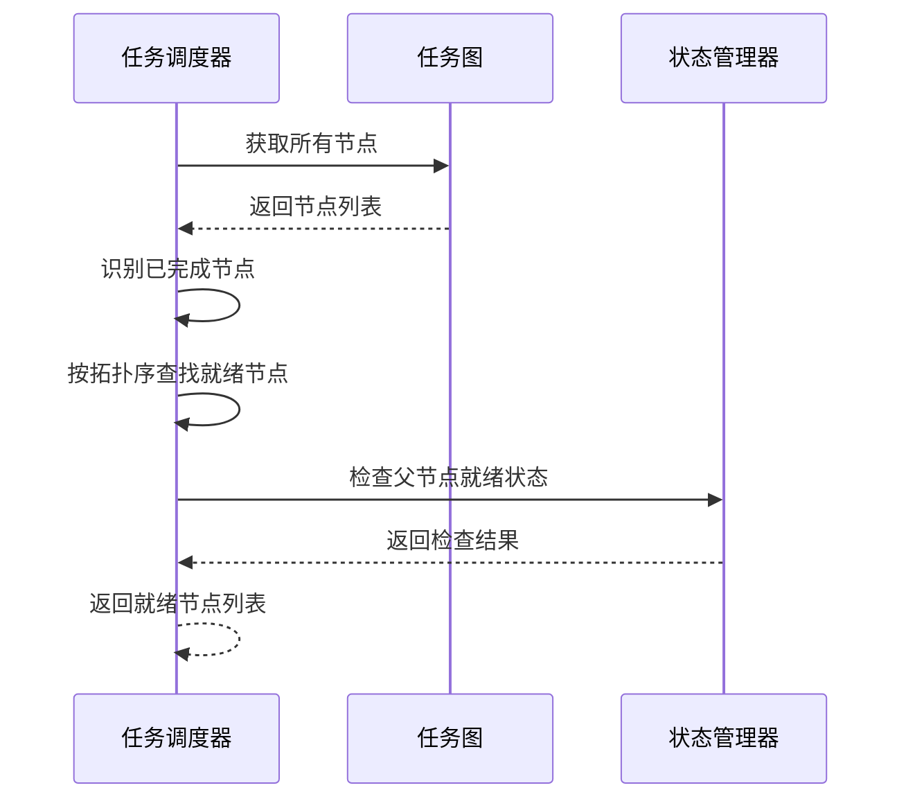
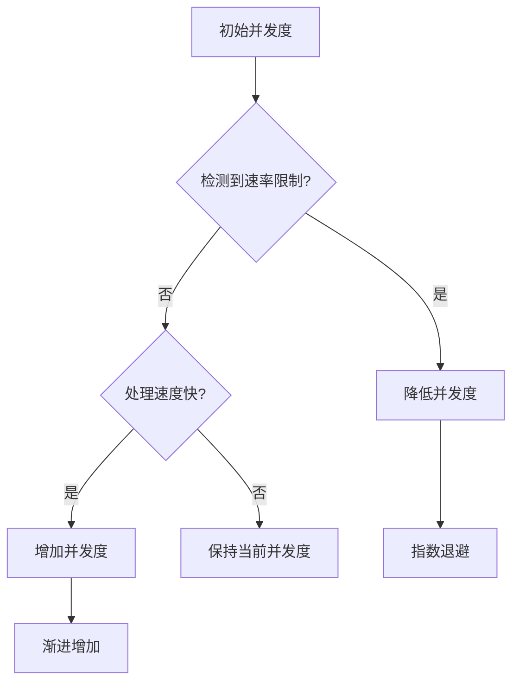
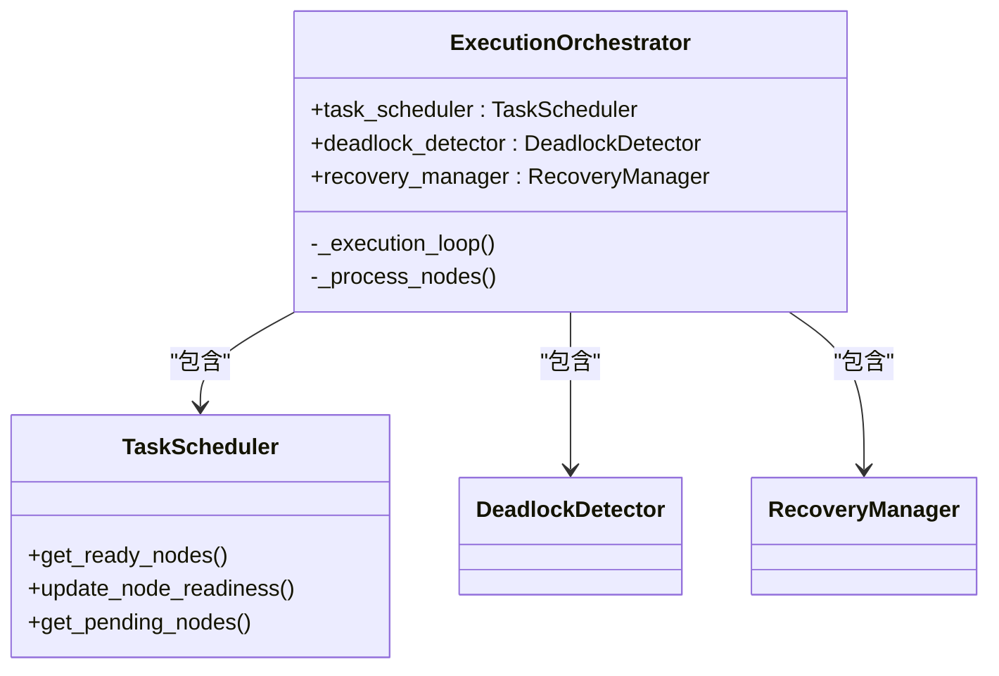
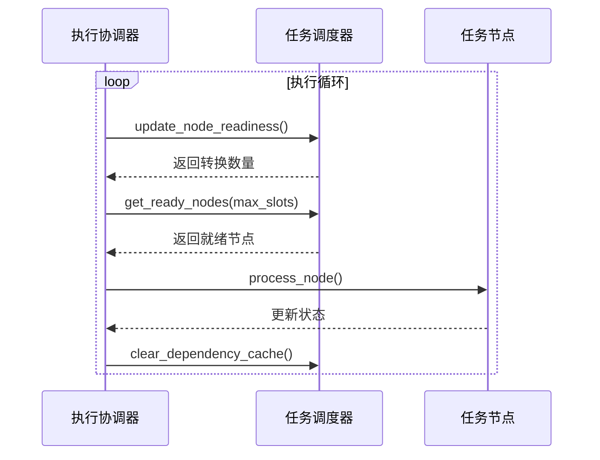

# 任务调度器

<cite>
**本文档中引用的文件**
- [task_scheduler.py](file://src\sentientresearchagent\hierarchical_agent_framework\orchestration\task_scheduler.py)
- [task_node.py](file://src\sentientresearchagent\hierarchical_agent_framework\node\task_node.py)
- [task_graph.py](file://src\sentientresearchagent\hierarchical_agent_framework\graph\task_graph.py)
- [state_manager.py](file://src\sentientresearchagent\hierarchical_agent_framework\graph\state_manager.py)
- [execution_orchestrator.py](file://src\sentientresearchagent\hierarchical_agent_framework\orchestration\execution_orchestrator.py)
</cite>

## 目录
1. [简介](#简介)
2. [核心调度算法](#核心调度算法)
3. [调度队列与数据结构](#调度队列与数据结构)
4. [线程安全与并发机制](#线程安全与并发机制)
5. [高并发性能分析](#高并发性能分析)
6. [可配置调度参数](#可配置调度参数)
7. [与执行引擎的交互协议](#与执行引擎的交互协议)
8. [典型场景调优建议](#典型场景调优建议)
9. [结论](#结论)

## 简介

任务调度器是智能研究代理框架中的核心组件，负责决定哪些任务节点可以执行。它基于任务优先级、依赖关系和资源可用性进行动态调度决策，确保任务按照正确的顺序和条件执行。

调度器的主要职责包括：
- 跟踪节点间的依赖关系
- 确定任务的执行就绪状态
- 管理执行顺序
- 处理并行执行约束

该调度器通过与任务图（TaskGraph）和状态管理器（StateManager）协作，实现了复杂的任务编排逻辑，支持分层任务分解和聚合。

**Section sources**
- [task_scheduler.py](file://src\sentientresearchagent\hierarchical_agent_framework\orchestration\task_scheduler.py#L0-L553)

## 核心调度算法

### 调度决策流程

任务调度器的核心算法通过`get_ready_nodes`方法实现，其决策流程如下：

1. **状态筛选**：首先筛选出所有处于READY或AGGREGATING状态的潜在可执行节点。
2. **可执行性检查**：对每个候选节点，检查其是否真正可执行。
3. **排序与限制**：根据优先级排序，并应用最大节点数限制。



**Diagram sources**
- [task_scheduler.py](file://src\sentientresearchagent\hierarchical_agent_framework\orchestration\task_scheduler.py#L53-L102)

### 可执行性判断

节点的可执行性由`_is_node_executable`方法判断，需要满足以下条件：

- 节点状态为READY或AGGREGATING
- 父节点处于适当状态（RUNNING、PLAN_DONE、DONE或AGGREGATING）
- 所有依赖项均已满足



**Diagram sources**
- [task_scheduler.py](file://src\sentientresearchagent\hierarchical_agent_framework\orchestration\task_scheduler.py#L170-L209)

### 依赖关系解析

调度器通过`_get_node_dependencies`方法解析节点依赖，采用双重策略：

1. **辅助数据检查**：从`aux_data`中的`depends_on_indices`获取依赖索引
2. **图结构检查**：在任务图中查找前驱节点



**Diagram sources**
- [task_scheduler.py](file://src\sentientresearchagent\hierarchical_agent_framework\orchestration\task_scheduler.py#L272-L320)

### 拓扑排序优化

为了提高调度效率，调度器使用Kahn算法构建拓扑排序，通过`build_dependency_graph`和`_compute_topological_order`方法实现。



**Diagram sources**
- [task_scheduler.py](file://src\sentientresearchagent\hierarchical_agent_framework\orchestration\task_scheduler.py#L412-L443)

## 调度队列与数据结构

### 核心数据结构

调度器维护了多个关键数据结构来支持高效的调度决策：

| 数据结构 | 类型 | 用途 |
|--------|-----|-----|
| `_dependency_cache` | Dict[str, Set[str]] | 缓存节点依赖关系，提升性能 |
| `_dependency_graph` | Dict[str, Set[str]] | 正向依赖图，存储节点到其依赖的映射 |
| `_reverse_dependencies` | Dict[str, Set[str]] | 反向依赖图，存储依赖到其被依赖者的映射 |
| `_topological_order` | List[str] | 拓扑排序后的节点ID列表，用于优化调度 |

**Section sources**
- [task_scheduler.py](file://src\sentientresearchagent\hierarchical_agent_framework\orchestration\task_scheduler.py#L36-L71)

### 任务状态模型

任务节点（TaskNode）的状态机定义了完整的生命周期：



**Diagram sources**
- [task_node.py](file://src\sentientresearchagent\hierarchical_agent_framework\node\task_node.py#L18-L285)

## 线程安全与并发机制

### 状态转换保护

任务节点通过内部锁机制确保状态转换的线程安全性：

```python
def update_status(self, new_status: TaskStatus, ...):
    with self._status_lock:
        # 原子性状态更新
        old_status = self.status
        self.status = new_status_enum
        self.timestamp_updated = transition_time
        # ...其他更新操作
```

这种设计避免了多线程环境下状态不一致的问题。

### 缓存同步

调度器的依赖缓存通过`clear_dependency_cache`方法管理，在图结构变化时清除：

```python
def clear_dependency_cache(self):
    """清除依赖缓存（在图结构变化时调用）"""
    self._dependency_cache.clear()
    logger.debug("TaskScheduler: Dependency cache cleared")
```

**Section sources**
- [task_scheduler.py](file://src\sentientresearchagent\hierarchical_agent_framework\orchestration\task_scheduler.py#L381-L385)

## 高并发性能分析

### 性能指标

调度器提供`get_execution_metrics`方法监控执行状态：



**Diagram sources**
- [task_scheduler.py](file://src\sentientresearchagent\hierarchical_agent_framework\orchestration\task_scheduler.py#L386-L411)

### 优化调度路径

对于大规模任务图，调度器提供`get_ready_nodes_optimized`方法，利用预计算的依赖信息提高效率：



**Diagram sources**
- [task_scheduler.py](file://src\sentientresearchagent\hierarchical_agent_framework\orchestration\task_scheduler.py#L507-L553)

## 可配置调度参数

### 参数配置

用户可通过配置文件调整以下调度参数：

| 参数 | 默认值 | 说明 |
|------|-------|------|
| max_concurrent_nodes | 6 | 最大并发节点数 |
| node_execution_timeout_seconds | 3600 | 节点执行超时时间（秒） |
| max_execution_steps | 250 | 最大执行步数 |
| enable_immediate_slot_fill | True | 是否启用即时插槽填充 |

这些参数在`ProjectConfigPanel.tsx`中提供前端配置界面。

**Section sources**
- [ProjectConfigPanel.tsx](file://frontend\src\components\project\ProjectConfigPanel.tsx#L187-L246)

### 并发控制

执行协调器（ExecutionOrchestrator）动态管理并发度：



**Diagram sources**
- [execution_orchestrator.py](file://src\sentientresearchagent\hierarchical_agent_framework\orchestration\execution_orchestrator.py#L1000-L1100)

## 与执行引擎的交互协议

### 协调架构

调度器作为执行协调器的组成部分工作：



**Diagram sources**
- [execution_orchestrator.py](file://src\sentientresearchagent\hierarchical_agent_framework\orchestration\execution_orchestrator.py#L31-L927)

### 交互流程

调度器与执行引擎的典型交互流程：



**Diagram sources**
- [execution_orchestrator.py](file://src\sentientresearchagent\hierarchical_agent_framework\orchestration\execution_orchestrator.py#L381-L403)

## 典型场景调优建议

### 高吞吐量场景

对于需要高吞吐量的任务流，建议：

1. **增加并发度**：将`max_concurrent_nodes`设置为系统可承受的最大值
2. **启用即时填充**：保持`enable_immediate_slot_fill`为True
3. **调整超时**：根据任务特性适当延长`node_execution_timeout_seconds`

### 依赖密集型场景

对于具有复杂依赖关系的任务图：

1. **预构建依赖图**：在执行前调用`build_dependency_graph`
2. **使用优化路径**：优先使用`get_ready_nodes_optimized`方法
3. **监控阻塞原因**：利用`get_pending_nodes`分析阻塞原因

### 内存敏感场景

对于内存受限的环境：

1. **减少缓存大小**：定期调用`clear_dependency_cache`
2. **限制最大步数**：设置合理的`max_execution_steps`
3. **启用压缩**：配置`enable_state_compression`为True

## 结论

任务调度器通过精心设计的算法和数据结构，实现了高效、可靠的任务调度功能。其核心优势包括：

- **灵活的依赖管理**：支持多种依赖解析策略
- **高效的调度决策**：提供标准和优化两种调度路径
- **强大的并发控制**：动态调整并发度以适应系统负载
- **完善的监控能力**：提供详细的执行指标和阻塞分析

通过合理配置调度参数和遵循调优建议，可以在各种应用场景下获得最佳性能表现。