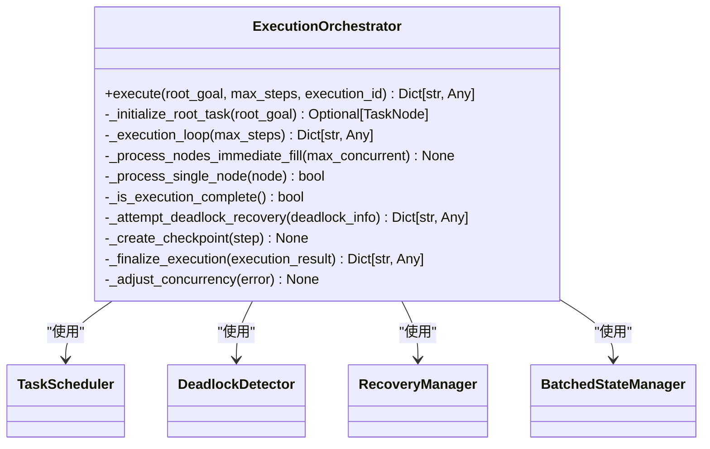
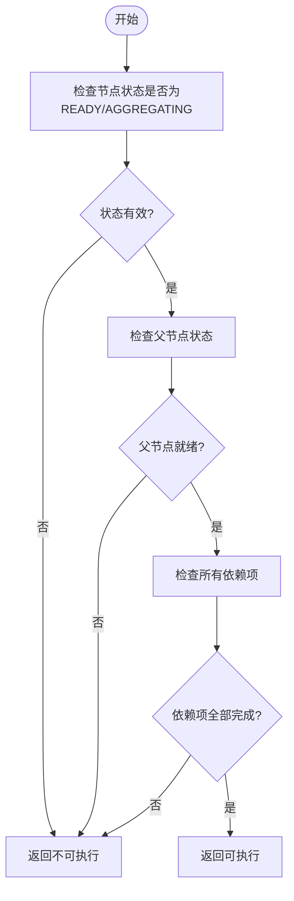
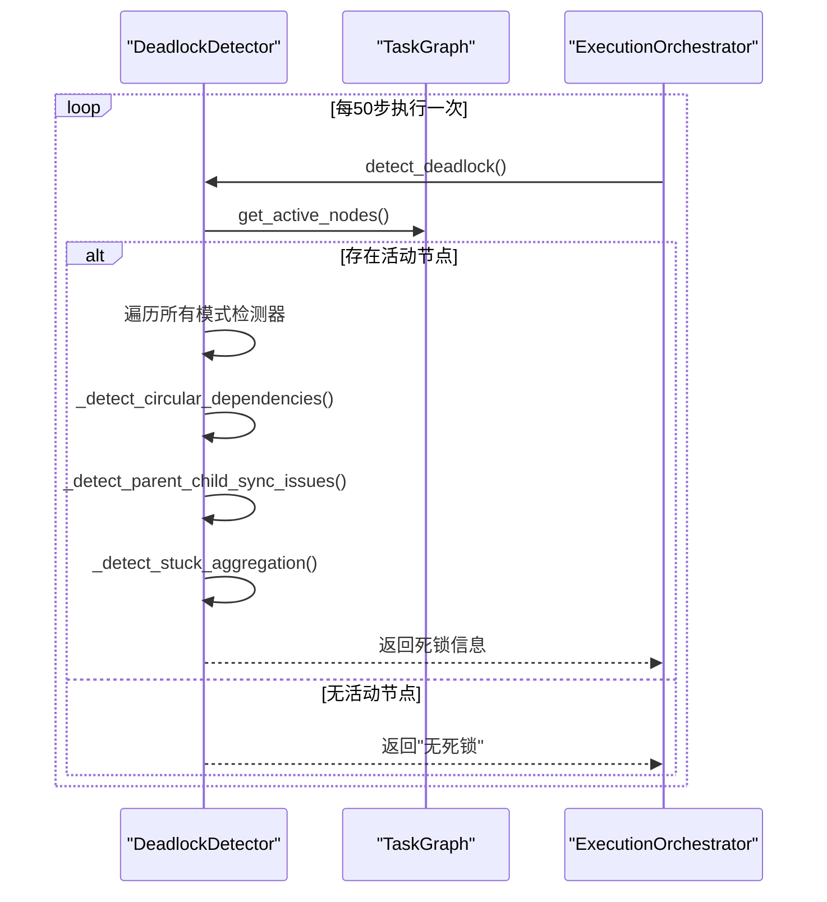
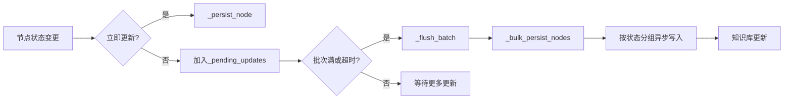
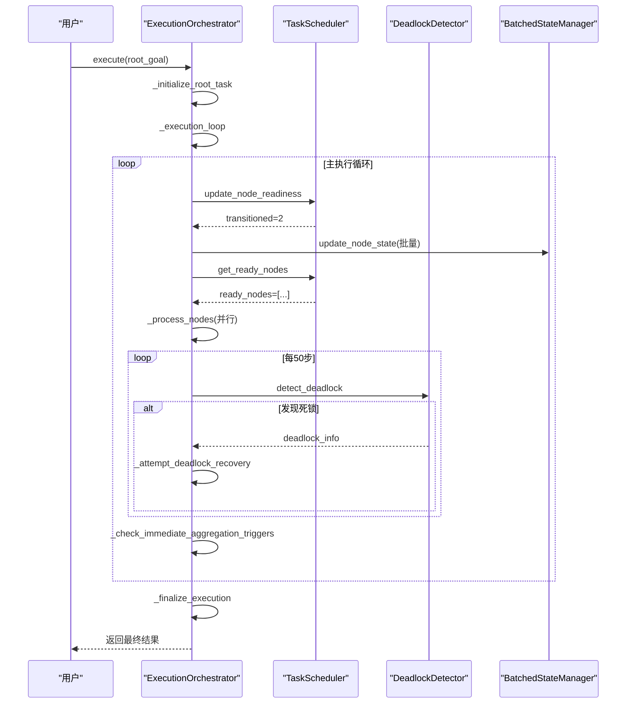

# 执行调度引擎

<cite>
**本文档引用的文件**
- [execution_orchestrator.py](file://src\sentientresearchagent\hierarchical_agent_framework\orchestration\execution_orchestrator.py)
- [task_scheduler.py](file://src\sentientresearchagent\hierarchical_agent_framework\orchestration\task_scheduler.py)
- [deadlock_detector.py](file://src\sentientresearchagent\hierarchical_agent_framework\orchestration\deadlock_detector.py)
- [recovery_manager.py](file://src\sentientresearchagent\hierarchical_agent_framework\orchestration\recovery_manager.py)
- [batched_state_manager.py](file://src\sentientresearchagent\hierarchical_agent_framework\orchestration\batched_state_manager.py)
</cite>

## 目录
1. [引言](#引言)
2. [核心控制器：ExecutionOrchestrator](#核心控制器executionorchestrator)
3. [任务调度策略](#任务调度策略)
4. [死锁检测机制](#死锁检测机制)
5. [故障恢复机制](#故障恢复机制)
6. [批处理状态管理](#批处理状态管理)
7. [多代理并行协调流程](#多代理并行协调流程)
8. [调优参数配置建议](#调优参数配置建议)

## 引言
执行调度引擎是整个代理框架的核心运行时协调系统，负责管理复杂任务图的生命周期。该引擎通过`execution_orchestrator.py`作为主控中心，协调`task_scheduler.py`进行智能调度、`deadlock_detector.py`实时监控循环阻塞，并结合`recovery_manager.py`实现弹性故障恢复。同时，`batched_state_manager.py`通过批量更新和压缩技术优化高并发场景下的性能表现。本技术文档将深入剖析这些组件的协同工作机制。

## 核心控制器：ExecutionOrchestrator
`ExecutionOrchestrator`类是整个执行流程的总指挥，它初始化并协调所有关键服务组件，包括任务调度器、死锁检测器和恢复管理器。其主要职责是启动执行循环、管理执行状态，并确保各组件间的无缝协作。

**图表来源**
- [execution_orchestrator.py](file://src\sentientresearchagent\hierarchical_agent_framework\orchestration\execution_orchestrator.py#L1-L928)

**章节来源**
- [execution_orchestrator.py](file://src\sentientresearchagent\hierarchical_agent_framework\orchestration\execution_orchestrator.py#L1-L928)

## 任务调度策略
`task_scheduler.py`实现了基于依赖关系和资源感知的智能调度策略。它通过分析任务图中的依赖链和节点状态，决定哪些节点可以安全地进入执行队列。

### 调度优先级与就绪性检查
调度器采用分层优先级排序，优先执行层级较低（更接近根目标）且创建时间较早的任务。一个节点要成为可执行状态，必须满足以下条件：
1. 状态为`READY`或`AGGREGATING`
2. 所有前置依赖项均已成功完成（状态为`DONE`）
3. 其父节点处于允许子节点执行的状态（如`RUNNING`、`PLAN_DONE`等）

**图表来源**
- [task_scheduler.py](file://src\sentientresearchagent\hierarchical_agent_framework\orchestration\task_scheduler.py#L104-L209)

**章节来源**
- [task_scheduler.py](file://src\sentientresearchagent\hierarchical_agent_framework\orchestration\task_scheduler.py#L53-L209)

## 死锁检测机制
`deadlock_detector.py`模块持续监控任务图的执行状态，识别多种潜在的死锁模式，防止系统陷入停滞。

### 死锁模式识别
该检测器能够识别以下几种典型的死锁情况：
- **循环依赖**：节点A等待节点B，而节点B又反过来等待节点A。
- **父子同步问题**：父节点正在运行，但其子节点因无法找到所属的子图而卡在`PENDING`状态。
- **聚合阻塞**：父节点已处于`PLAN_DONE`状态，但所有子任务完成后未能自动过渡到`AGGREGATING`状态。
- **孤立节点**：节点的父节点不存在或处于无效状态，导致其永远无法被激活。

**图表来源**
- [deadlock_detector.py](file://src\sentientresearchagent\hierarchical_agent_framework\orchestration\deadlock_detector.py#L76-L276)

**章节来源**
- [deadlock_detector.py](file://src\sentientresearchagent\hierarchical_agent_framework\orchestration\deadlock_detector.py#L76-L276)

## 故障恢复机制
`recovery_manager.py`提供了多层次的故障恢复策略，确保系统在遇到错误时能够优雅降级或自动修复。

### 恢复策略类型
| 恢复动作 | 触发条件 | 描述 |
|--------|--------|------|
| 重试 (Retry) | 超时、速率限制错误 | 使用指数退避算法进行重试 |
| 重规划 (Replan) | 执行错误、无效计划 | 强制节点重新生成执行计划 |
| 强制完成 (Force Complete) | 单节点长时间挂起 | 将节点标记为失败以打破循环 |
| 降级执行 (Skip) | 非关键任务失败 | 跳过该任务，继续后续执行 |

当发生死锁时，`DeadlockRecoveryStrategy`会根据检测到的模式采取相应措施，例如通过中断循环依赖链来恢复系统。

**章节来源**
- [recovery_manager.py](file://src\sentientresearchagent\hierarchical_agent_framework\orchestration\recovery_manager.py#L1-L488)

## 批处理状态管理
`batched_state_manager.py`通过批量更新和数据压缩技术，显著提升了高并发场景下的状态持久化性能。

### 批量更新工作流

该管理器还支持对大型结果数据进行GZIP压缩，当数据超过阈值时自动启用压缩，从而减少存储空间占用和I/O开销。

**图表来源**
- [batched_state_manager.py](file://src\sentientresearchagent\hierarchical_agent_framework\orchestration\batched_state_manager.py#L78-L166)

**章节来源**
- [batched_state_manager.py](file://src\sentientresearchagent\hierarchical_agent_framework\orchestration\batched_state_manager.py#L78-L253)

## 多代理并行协调流程
以下是多个代理并行执行时的完整协调时序图：

**图表来源**
- [execution_orchestrator.py](file://src\sentientresearchagent\hierarchical_agent_framework\orchestration\execution_orchestrator.py#L226-L502)
- [task_scheduler.py](file://src\sentientresearchagent\hierarchical_agent_framework\orchestration\task_scheduler.py#L138-L168)

## 调优参数配置建议
为了应对不同规模的研究任务，建议根据实际情况调整以下配置参数：

| 参数名称 | 默认值 | 建议值 | 说明 |
|--------|------|------|------|
| `max_concurrent_nodes` | 5 | 1-10 | 控制最大并发节点数，避免API速率限制 |
| `state_batch_size` | 50 | 20-100 | 批量状态更新的大小，平衡延迟与吞吐量 |
| `enable_state_compression` | True | True | 启用状态压缩以节省存储空间 |
| `max_retries` | 3 | 2-5 | 任务失败后的最大重试次数 |
| `node_execution_timeout_seconds` | 300 | 300-600 | 单个节点执行的超时时间（秒） |
| `enable_immediate_slot_fill` | True | True | 启用即时填充模式以提高资源利用率 |

对于大规模任务，建议增加`max_concurrent_nodes`并启用`immediate_slot_fill`以最大化并行度；对于稳定性要求高的任务，则应降低并发数并增加重试次数。

**章节来源**
- [execution_orchestrator.py](file://src\sentientresearchagent\hierarchical_agent_framework\orchestration\execution_orchestrator.py#L879-L923)
- [batched_state_manager.py](file://src\sentientresearchagent\hierarchical_agent_framework\orchestration\batched_state_manager.py#L30-L45)