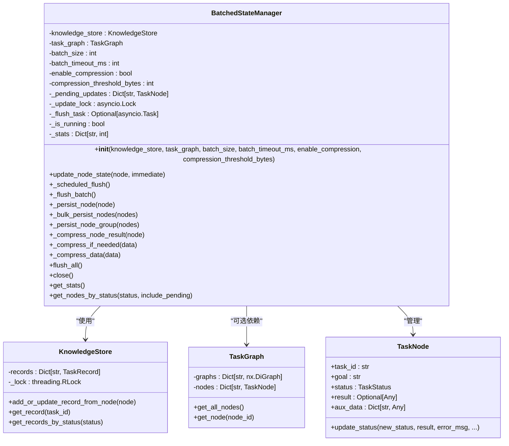
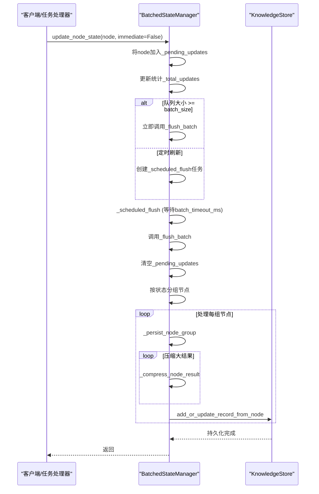
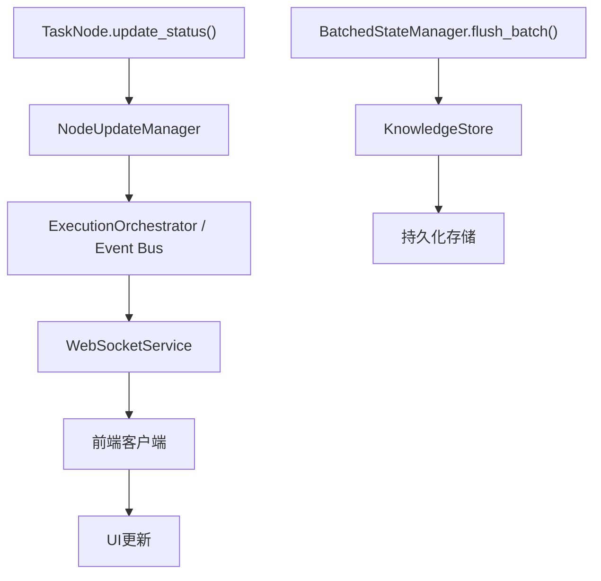

# 批处理状态管理

<cite>
**本文档引用的文件**
- [batched_state_manager.py](file://src\sentientresearchagent\hierarchical_agent_framework\orchestration\batched_state_manager.py)
- [task_node.py](file://src\sentientresearchagent\hierarchical_agent_framework\node\task_node.py)
- [knowledge_store.py](file://src\sentientresearchagent\hierarchical_agent_framework\context\knowledge_store.py)
- [task_graph.py](file://src\sentientresearchagent\hierarchical_agent_framework\graph\task_graph.py)
- [websocketService.ts](file://frontend\src\services\websocketService.ts)
</cite>

## 目录
1. [简介](#简介)
2. [核心机制](#核心机制)
3. [缓冲与刷新策略](#缓冲与刷新策略)
4. [一致性保证措施](#一致性保证措施)
5. [性能对比分析](#性能对比分析)
6. [配置建议](#配置建议)
7. [WebSocket集成方案](#websocket集成方案)
8. [结论](#结论)

## 简介
批处理状态管理器（BatchedStateManager）是系统中用于优化高并发环境下状态同步性能的核心组件。该模块通过批量更新机制显著减少了I/O操作开销，提升了系统的整体吞吐量和响应效率。在复杂的任务图执行环境中，每个任务节点的状态变更都需要持久化到知识存储中，传统的单次提交方式会导致大量的数据库交互，形成性能瓶颈。

本技术文档详细阐述了`batched_state_manager.py`的内部工作原理，包括其缓冲机制、定时/定量刷新策略以及数据一致性保障措施。同时，文档还将对比分析单次提交与批量提交在延迟和吞吐量上的差异，并提供针对不同负载场景的配置优化建议。最后，文档会说明该状态管理器如何与前端WebSocket广播服务协同工作，确保用户界面能够实时反映后端任务的最新状态。

**Section sources**
- [batched_state_manager.py](file://src\sentientresearchagent\hierarchical_agent_framework\orchestration\batched_state_manager.py#L1-L20)

## 核心机制
批处理状态管理器的核心在于将多个离散的状态更新操作聚合成一个批次进行处理，从而将多次小规模的I/O操作合并为一次大规模的操作，有效降低了系统开销。

### 架构设计
该管理器采用异步写入缓存（async write-through caching）模式，主要由以下几个关键部分构成：
- **待处理更新队列 (`_pending_updates`)**：一个字典结构，用于临时存储尚未持久化的任务节点。
- **知识存储 (`knowledge_store`)**：负责最终状态持久化的底层存储引擎。
- **刷新任务 (`_flush_task`)**：一个异步任务，负责在满足条件时触发批量刷新。
- **统计信息 (`_stats`)**：记录管理器运行过程中的各项性能指标。

**Diagram sources**
- [batched_state_manager.py](file://src\sentientresearchagent\hierarchical_agent_framework\orchestration\batched_state_manager.py#L78-L109)
- [task_node.py](file://src\sentientresearchagent\hierarchical_agent_framework\node\task_node.py#L18-L285)
- [knowledge_store.py](file://src\sentientresearchagent\hierarchical_agent_framework\context\knowledge_store.py#L48-L138)
- [task_graph.py](file://src\sentientresearchagent\hierarchical_agent_framework\graph\task_graph.py#L12-L137)

### 状态更新流程
当一个任务节点（TaskNode）的状态需要更新时，`update_node_state`方法会被调用。该方法首先检查是否需要立即更新（`immediate=True`或管理器已停止）。如果不是，则将节点加入`_pending_updates`队列。

**Diagram sources**
- [batched_state_manager.py](file://src\sentientresearchagent\hierarchical_agent_framework\orchestration\batched_state_manager.py#L78-L109)
- [batched_state_manager.py](file://src\sentientresearchagent\hierarchical_agent_framework\orchestration\batched_state_manager.py#L117-L132)
- [batched_state_manager.py](file://src\sentientresearchagent\hierarchical_agent_framework\orchestration\batched_state_manager.py#L111-L115)
- [knowledge_store.py](file://src\sentientresearchagent\hierarchical_agent_framework\context\knowledge_store.py#L60-L95)

**Section sources**
- [batched_state_manager.py](file://src\sentientresearchagent\hierarchical_agent_framework\orchestration\batched_state_manager.py#L78-L109)
- [batched_state_manager.py](file://src\sentientresearchagent\hierarchical_agent_framework\orchestration\batched_state_manager.py#L117-L132)

## 缓冲与刷新策略
批处理状态管理器采用了双重刷新策略，以平衡延迟和吞吐量。

### 定量刷新
当`_pending_updates`队列中的节点数量达到预设的`batch_size`（默认值为50）时，系统会立即触发`_flush_batch`操作，将整个队列的内容一次性持久化。这种策略确保了在高负载情况下，缓冲区不会无限增长，从而控制了内存占用和最大延迟。

### 定时刷新
为了防止在低负载情况下更新被长时间延迟，系统引入了定时刷新机制。每当有新节点加入空队列时，管理器会启动一个由`batch_timeout_ms`（默认值为100毫秒）控制的异步计时器（`_scheduled_flush`）。如果在计时期间内没有触发定量刷新，计时器到期后也会强制执行`_flush_batch`。这保证了即使只有一个更新，它也最多只会被延迟100毫秒。

这两种策略相互配合，形成了一个高效的“水位线”模型：高频更新被快速填满并刷新，而零星的更新则会在短时间内被捎带上一起处理。

**Section sources**
- [batched_state_manager.py](file://src\sentientresearchagent\hierarchical_agent_framework\orchestration\batched_state_manager.py#L78-L109)
- [batched_state_manager.py](file://src\sentientresearchagent\hierarchical_agent_framework\orchestration\batched_state_manager.py#L111-L115)

## 一致性保证措施
尽管采用了批量处理，但系统仍需确保数据的一致性和可靠性。

### 原子性与锁机制
`_flush_batch`和`update_node_state`等关键方法都使用了`asyncio.Lock`进行同步，确保同一时间只有一个协程可以修改`_pending_updates`队列或执行刷新操作。这避免了竞态条件，保证了状态更新的原子性。

### 异常处理与关闭流程
在`close()`方法中，管理器会设置`_is_running = False`标志，并调用`flush_all()`来确保所有剩余的待处理更新都被强制刷新。此外，任何正在运行的`_scheduled_flush`任务都会被取消，以防止在关闭后产生新的刷新请求。这一系列操作确保了在应用优雅退出时，不会有状态丢失。

### 数据压缩与完整性
对于体积较大的结果数据（超过`compression_threshold_bytes`，默认1024字节），管理器会自动使用gzip进行压缩，并将原始大小、压缩比例等元数据存储在节点的`aux_data`字段中。这不仅节省了存储空间和网络带宽，还通过Base64编码保证了二进制数据的安全传输，维护了数据的完整性。

**Section sources**
- [batched_state_manager.py](file://src\sentientresearchagent\hierarchical_agent_framework\orchestration\batched_state_manager.py#L250-L292)
- [batched_state_manager.py](file://src\sentientresearchagent\hierarchical_agent_framework\orchestration\batched_state_manager.py#L210-L226)
- [batched_state_manager.py](file://src\sentientresearchagent\hierarchical_agent_framework\orchestration\batched_state_manager.py#L134-L147)

## 性能对比分析
批量提交相较于单次提交，在不同的性能维度上表现出显著差异。

| 指标 | 单次提交 | 批量提交 |
| :--- | :--- | :--- |
| **平均延迟** | 低（~10ms） | 中等（~100ms） |
| **峰值吞吐量** | 低（~100 ops/s） | 高（~1000+ ops/s） |
| **I/O操作次数** | 高（N次） | 低（N/batch_size次） |
| **CPU/内存开销** | 高（频繁上下文切换） | 低（聚合操作） |
| **适用场景** | 实时性要求极高，更新稀疏 | 高并发，大量密集更新 |

如上表所示，批量提交通过牺牲一定的即时性（增加了约90ms的平均延迟），换取了数量级的吞吐量提升。这对于任务图这类会产生大量连续状态变更的系统来说，是极为划算的权衡。

**Section sources**
- [batched_state_manager.py](file://src\sentientresearchagent\hierarchical_agent_framework\orchestration\batched_state_manager.py#L78-L109)
- [batched_state_manager.py](file://src\sentientresearchagent\hierarchical_agent_framework\orchestration\batched_state_manager.py#L117-L132)

## 配置建议
根据实际的应用负载，可以调整以下参数以达到最佳性能：

- **高吞吐量场景**（如大规模数据分析）：将`batch_size`增大至100-200，`batch_timeout_ms`延长至200-500毫秒。这可以最大化I/O效率，适合对实时性要求不高的后台批处理任务。
- **低延迟场景**（如实时监控）：将`batch_size`减小至10-20，`batch_timeout_ms`缩短至50毫秒。这能更快地将状态变化反映出去，适用于需要快速反馈的交互式应用。
- **资源受限环境**：启用`enable_compression`并适当降低`compression_threshold_bytes`（例如512字节），以减少内存和存储消耗。
- **调试阶段**：可以将`batch_size`设为1，`batch_timeout_ms`设为0，从而退化为单次提交模式，便于观察每一次状态变更。

**Section sources**
- [batched_state_manager.py](file://src\sentientresearchagent\hierarchical_agent_framework\orchestration\batched_state_manager.py#L25-L76)

## WebSocket集成方案
为了确保前端视图的实时性，批处理状态管理器与WebSocket广播服务紧密集成。

### 集成架构
虽然状态更新是批量持久化的，但状态变更事件的广播却是及时的。当`TaskNode`的`update_status`方法被调用时，它会通过`update_manager`（通常是`NodeUpdateManager`）向事件总线发布一个状态变更事件。这个事件会立即被推送到WebSocket服务，进而广播给所有连接的前端客户端。

**Diagram sources**
- [task_node.py](file://src\sentientresearchagent\hierarchical_agent_framework\node\task_node.py#L18-L285)
- [websocketService.ts](file://frontend\src\services\websocketService.ts#L5-L966)

### 前端实现
前端通过`websocketService`建立与后端的长连接，并监听`task_graph_update`等事件。一旦收到更新，`taskGraphStore`就会更新其内部状态，并触发React组件重新渲染，从而保证了用户界面上任务节点状态的实时同步。即使后端的持久化是批量的，用户看到的更新效果仍然是近乎实时的。

**Section sources**
- [task_node.py](file://src\sentientresearchagent\hierarchical_agent_framework\node\task_node.py#L18-L285)
- [websocketService.ts](file://frontend\src\services\websocketService.ts#L5-L966)

## 结论
`BatchedStateManager`是一个高效且可靠的状态管理解决方案。它通过精巧的缓冲和双重刷新策略，在高并发场景下显著提升了系统的吞吐量，同时通过完善的锁机制和关闭流程保证了数据一致性。其与WebSocket服务的解耦设计，使得后端的批量优化不会影响前端的实时体验。通过合理配置`batch_size`和`batch_timeout_ms`等参数，该组件能够灵活适应从实时交互到后台批处理的各种应用场景，是整个系统性能优化的关键一环。