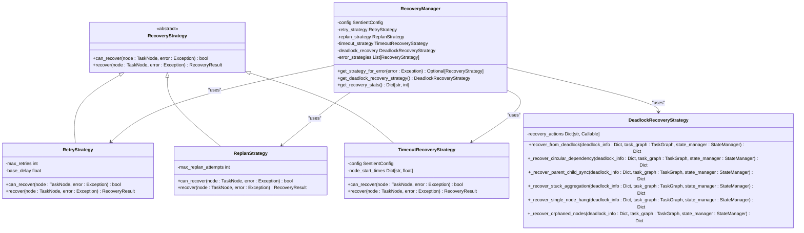
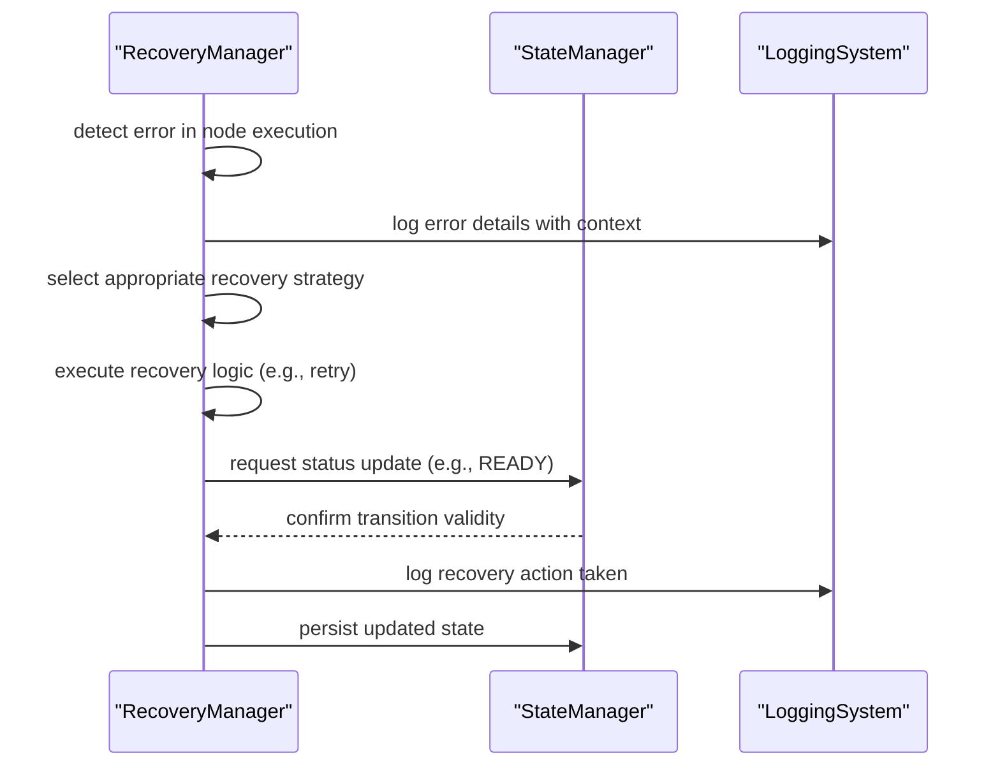

# 故障恢复管理器

<cite>
**本文档引用的文件**
- [recovery_manager.py](file://src\sentientresearchagent\hierarchical_agent_framework\orchestration\recovery_manager.py)
- [task_node.py](file://src\sentientresearchagent\hierarchical_agent_framework\node\task_node.py)
- [task_graph.py](file://src\sentientresearchagent\hierarchical_agent_framework\graph\task_graph.py)
- [state_manager.py](file://src\sentientresearchagent\hierarchical_agent_framework\graph\state_manager.py)
- [SentientConfig.py](file://src\sentientresearchagent\config\config.py)
- [execution_orchestrator.py](file://src\sentientresearchagent\hierarchical_agent_framework\orchestration\execution_orchestrator.py)
</cite>

## 目录
1. [引言](#引言)
2. [核心恢复策略](#核心恢复策略)
3. [故障恢复管理器架构](#故障恢复管理器架构)
4. [详细组件分析](#详细组件分析)
5. [与状态管理器和日志系统的协同工作](#与状态管理器和日志系统的协同工作)
6. [自定义恢复行为扩展接口](#自定义恢复行为扩展接口)
7. [常见失败模式及恢复方案推荐表](#常见失败模式及恢复方案推荐表)
8. [结论](#结论)

## 引言

故障恢复管理器（RecoveryManager）是系统中负责处理各种错误和异常情况的核心组件。它通过多种恢复策略确保任务执行的鲁棒性和可靠性，包括任务重试、状态回滚和降级执行路径选择等机制。该管理器不仅能够应对常见的网络超时和速率限制问题，还能检测并解决复杂的死锁状况。

在分布式任务执行环境中，节点可能会因为各种原因失败或陷入停滞状态。为了保证整个任务图的顺利推进，故障恢复管理器提供了灵活且可配置的恢复手段。这些策略基于具体的错误类型进行触发，并结合系统当前的状态做出最优决策。

本文档将深入解析 `recovery_manager.py` 中实现的各种恢复策略，说明每种策略的触发条件、执行流程以及副作用控制机制。同时，还将描述恢复过程中与状态管理器和日志系统的协同工作模式，并提供自定义恢复行为的扩展接口说明。

**Section sources**
- [recovery_manager.py](file://src\sentientresearchagent\hierarchical_agent_framework\orchestration\recovery_manager.py#L1-L50)

## 核心恢复策略

故障恢复管理器实现了三种主要的恢复策略：重试策略（RetryStrategy）、重新规划策略（ReplanStrategy）和超时恢复策略（TimeoutRecoveryStrategy）。此外，还包含一个专门用于处理死锁情况的死锁恢复策略（DeadlockRecoveryStrategy）。

### 重试策略

重试策略适用于那些由于临时性问题导致失败的任务，如网络连接中断或API调用超时。此策略采用指数退避算法来避免对服务造成过大压力。每次重试之间的延迟时间会成倍增长，从而给系统留出足够的时间来自我修复。

当某个任务发生可重试的错误时，重试策略首先检查该任务已经尝试过的次数是否超过了预设的最大值。如果未超过，则计算下一次重试所需的等待时间，并在此期间暂停任务执行。一旦等待期结束，任务状态会被重置为就绪（READY），以便重新加入调度队列。

[SPEC SYMBOL](file://src\sentientresearchagent\hierarchical_agent_framework\orchestration\recovery_manager.py#L90-L148)

### 重新规划策略

重新规划策略针对的是那些因执行逻辑错误而无法继续的任务。这类错误通常表明原有的计划存在缺陷，需要重新生成新的行动计划。例如，当代理报告“无效计划”或“缺少依赖项”时，就会触发此策略。

该策略允许每个任务最多进行两次重新规划尝试。每次尝试都会记录失败的原因，并更新任务的状态以指示需要重新规划。随后，任务将被标记为需要重新规划（NEEDS_REPLAN），等待更高层次的控制器对其进行干预。

[SPEC SYMBOL](file://src\sentientresearchagent\hierarchical_agent_framework\orchestration\recovery_manager.py#L150-L181)

### 超时恢复策略

超时恢复策略专门用来处理长时间无响应的任务。对于运行时间过长的任务，系统会根据其持续时间决定采取何种措施。若任务仅轻微超出预期时限，则可能只需强制重新规划；但如果已严重超时，则直接将其标记为失败更为合适。

这种分级处理方式有助于平衡资源利用率与任务成功率之间的关系。短暂的延迟可能是正常的波动，但长期挂起往往意味着更深层次的问题，不宜盲目重试。

[SPEC SYMBOL](file://src\sentientresearchagent\hierarchical_agent_framework\orchestration\recovery_manager.py#L183-L213)

### 死锁恢复策略

死锁恢复策略是一组复合型解决方案，旨在识别并解除不同类型的任务间相互阻塞的情况。目前支持五种典型的死锁模式：循环依赖、父子同步问题、聚合卡顿、单节点悬挂及孤立节点。

每种模式都有对应的恢复函数，能够在发现相应情形时自动激活。比如，在遇到循环依赖时，会选择层级较高的节点作为突破口，通过使其失败来打破闭环；而对于聚合卡顿，则可以直接推动相关父节点进入聚合阶段。

[SPEC SYMBOL](file://src\sentientresearchagent\hierarchical_agent_framework\orchestration\recovery_manager.py#L215-L398)

**Section sources**
- [recovery_manager.py](file://src\sentientresearchagent\hierarchical_agent_framework\orchestration\recovery_manager.py#L90-L398)

## 故障恢复管理器架构

故障恢复管理器的设计遵循了面向对象的原则，利用继承和多态特性构建了一个易于扩展的框架结构。其顶层是一个抽象基类 `RecoveryStrategy`，定义了所有具体策略必须实现的方法——`can_recover` 和 `recover`。

实际使用的策略实例由 `RecoveryManager` 统一管理和调度。初始化时，它会依据全局配置创建各个策略对象，并按照优先级顺序排列。每当有错误发生时，管理器便依次询问每个策略能否处理当前异常，直至找到合适的候选者为止。

整个体系呈现出明显的分层特征：底层是通用接口规范，中间层为特定场景下的具体实现，最上层则是协调各方行动的指挥中心。这样的设计既保证了代码的整洁性，又便于未来添加新的恢复手段。

**Diagram sources**
- [recovery_manager.py](file://src\sentientresearchagent\hierarchical_agent_framework\orchestration\recovery_manager.py#L52-L398)

**Section sources**
- [recovery_manager.py](file://src\sentientresearchagent\hierarchical_agent_framework\orchestration\recovery_manager.py#L52-L398)

## 详细组件分析

### 恢复结果数据结构

为了统一表示各种恢复操作的结果，系统引入了 `RecoveryResult` 数据类。该类包含三个字段：`recovered` 表示恢复是否成功；`action` 描述所采取的具体动作；`details` 则携带额外的信息，如重试次数或延迟时间等。

这一设计使得调用方可以轻松判断后续步骤该如何进行，同时也方便了日志记录和监控系统的集成。

[SPEC SYMBOL](file://src\sentientresearchagent\hierarchical_agent_framework\orchestration\recovery_manager.py#L50-L58)

### 错误类型枚举

除了上述几种主动式的恢复策略外，系统还定义了一套标准的动作类型集合 `RecoveryAction`。这其中包括了诸如重试（RETRY）、重新规划（REPLAN）、失败（FAIL）等基本选项，供其他模块参考使用。

尽管当前版本尚未完全利用到所有枚举值，但预留这些常量有助于保持API的一致性和前瞻性。

[SPEC SYMBOL](file://src\sentientresearchagent\hierarchical_agent_framework\orchestration\recovery_manager.py#L30-L48)

### 策略选择逻辑

`RecoveryManager` 类中的 `get_strategy_for_error` 方法负责根据传入的异常对象挑选出最适合的恢复策略。它遍历预先注册的所有策略实例，逐一询问它们是否能处理指定类型的错误。

值得注意的是，这里的匹配过程采用了硬编码的方式，即直接比较异常类型与策略类别的对应关系。虽然这种方法简单高效，但在面对复杂条件判断时显得不够灵活。未来可通过引入规则引擎加以改进。

[SPEC SYMBOL](file://src\sentientresearchagent\hierarchical_agent_framework\orchestration\recovery_manager.py#L439-L467)

**Section sources**
- [recovery_manager.py](file://src\sentientresearchagent\hierarchical_agent_framework\orchestration\recovery_manager.py#L50-L58)
- [recovery_manager.py](file://src\sentientresearchagent\hierarchical_agent_framework\orchestration\recovery_manager.py#L30-L48)
- [recovery_manager.py](file://src\sentientresearchagent\hierarchical_agent_framework\orchestration\recovery_manager.py#L439-L467)

## 与状态管理器和日志系统的协同工作

故障恢复管理器与状态管理器紧密协作，共同维护任务图的整体一致性。每当执行某项恢复操作时，前者都会调用后者提供的接口来更新受影响节点的状态。例如，在重试策略中，任务状态需从失败（FAILED）变更为就绪（READY），这一变更请求最终由状态管理器验证并落实。

与此同时，所有关键事件均会被记录至日志系统，以便事后追溯和分析。借助 `loguru` 库的强大功能，日志条目不仅包含了丰富的上下文信息，还支持多种输出格式和级别过滤。特别是针对不同组件设置了专属的表情符号标识，极大地提升了可读性。

此外，考虑到高并发环境下的性能影响，日志写入采用了异步批量处理机制。这意味着即使在极端负载条件下，也不会因为频繁的日志记录而导致主线程阻塞。

**Diagram sources**
- [recovery_manager.py](file://src\sentientresearchagent\hierarchical_agent_framework\orchestration\recovery_manager.py#L90-L398)
- [state_manager.py](file://src\sentientresearchagent\hierarchical_agent_framework\graph\state_manager.py#L13-L160)
- [logging_config.py](file://src\sentientresearchagent\core\logging_config.py#L0-L290)

**Section sources**
- [recovery_manager.py](file://src\sentientresearchagent\hierarchical_agent_framework\orchestration\recovery_manager.py#L90-L398)
- [state_manager.py](file://src\sentientresearchagent\hierarchical_agent_framework\graph\state_manager.py#L13-L160)
- [logging_config.py](file://src\sentientresearchagent\core\logging_config.py#L0-L290)

## 自定义恢复行为扩展接口

为了满足特定应用场景的需求，故障恢复管理器提供了良好的扩展性支持。开发者可以通过继承 `RecoveryStrategy` 抽象基类来创建自己的恢复策略，并将其注入到 `RecoveryManager` 实例中。

具体做法如下：
1. 定义一个新的类，实现 `can_recover` 和 `recover` 两个抽象方法；
2. 在应用程序启动阶段，手动构造 `RecoveryManager` 对象，并替换默认的策略列表；
3. 如有必要，还可以覆盖 `get_strategy_for_error` 方法以改变默认的选择逻辑。

需要注意的是，新增的策略应当尽量保持轻量级，避免引入过多外部依赖。同时，建议充分利用现有的工具函数和辅助类，以减少重复编码的工作量。

[SPEC SYMBOL](file://src\sentientresearchagent\hierarchical_agent_framework\orchestration\recovery_manager.py#L52-L58)

**Section sources**
- [recovery_manager.py](file://src\sentientresearchagent\hierarchical_agent_framework\orchestration\recovery_manager.py#L52-L58)

## 常见失败模式及恢复方案推荐表

| 失败模式 | 触发条件 | 推荐恢复策略 | 执行流程 | 副作用控制 |
|--------|---------|------------|---------|----------|
| 网络超时 | AgentTimeoutError, ConnectionError | 重试策略 | 指数退避后重置为READY状态 | 限制最大重试次数防止无限循环 |
| 速率限制 | AgentRateLimitError | 重试策略 | 延迟后重试，考虑调整并发度 | 避免短时间内密集请求加剧限流 |
| 执行错误 | AgentExecutionError | 重新规划策略 | 标记为NEEDS_REPLAN并记录原因 | 限制重新规划次数防止反复失败 |
| 任务超时 | TaskTimeoutError | 超时恢复策略 | 根据持续时间决定重规划或失败 | 防止长时间占用资源 |
| 循环依赖 | 死锁检测器识别 | 死锁恢复策略 | 断开循环，使高层级节点失败 | 最小化对整体进度的影响 |
| 孤立节点 | 父节点状态异常 | 死锁恢复策略 | 若父节点已完成则强制转为READY | 确保不会破坏原有依赖关系 |

**Section sources**
- [recovery_manager.py](file://src\sentientresearchagent\hierarchical_agent_framework\orchestration\recovery_manager.py#L90-L398)

## 结论

综上所述，故障恢复管理器通过精心设计的多层次策略组合，有效提升了系统的容错能力和稳定性。无论是面对瞬时故障还是复杂死锁，都能够迅速作出反应并恢复正常运作。

然而，现有实现仍存在一些潜在的优化空间。例如，策略选择逻辑较为僵化，难以适应动态变化的运行环境；另外，部分恢复动作缺乏细粒度的控制参数，可能导致次优解的产生。未来可通过引入机器学习模型预测最佳恢复路径，进一步增强智能化水平。