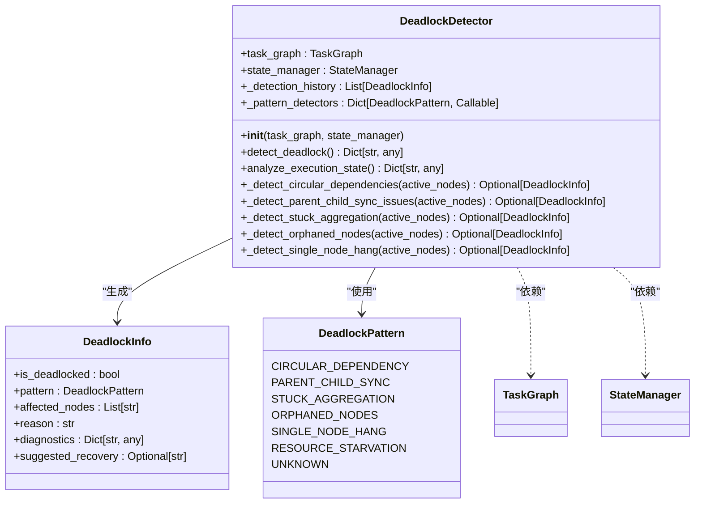
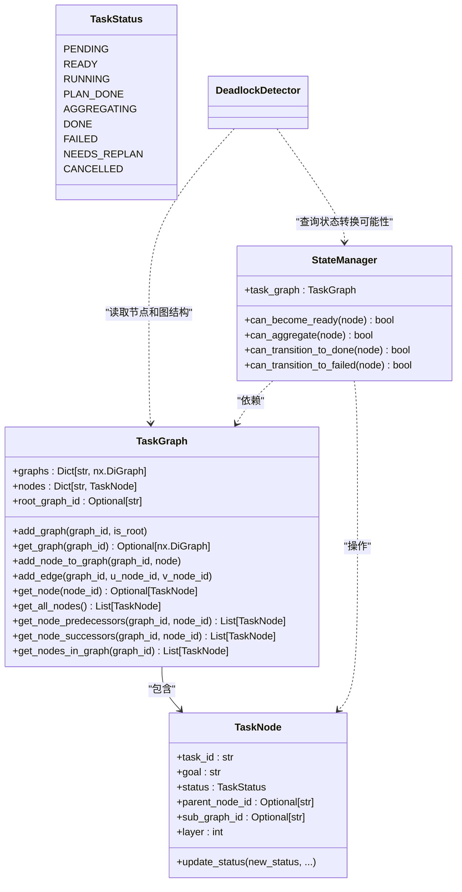
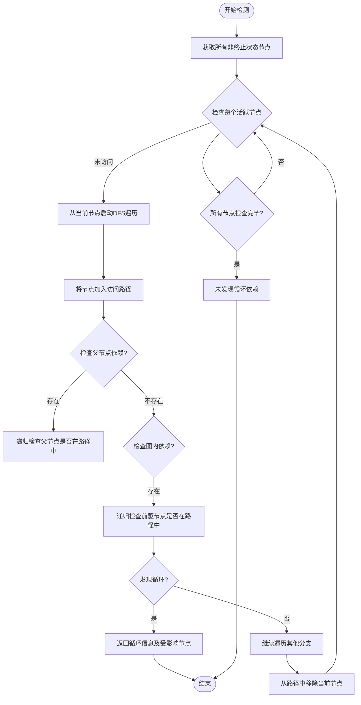
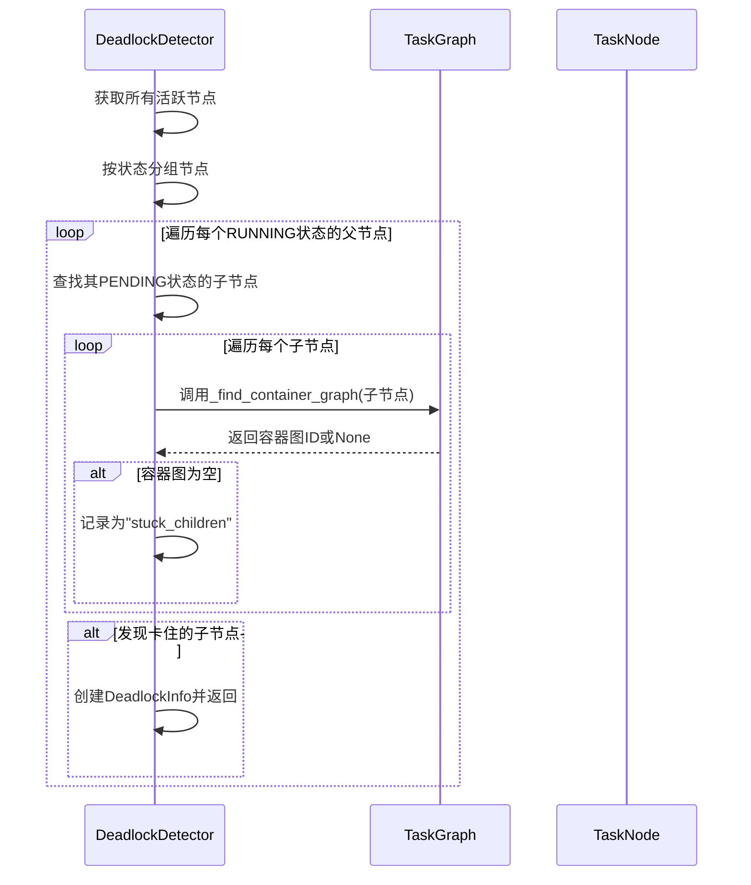
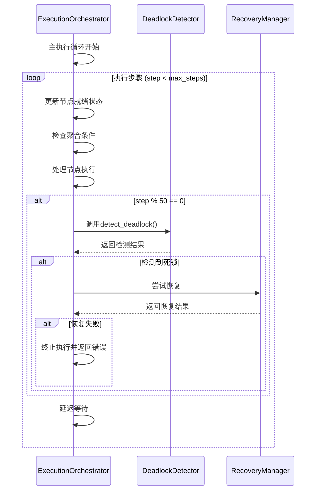
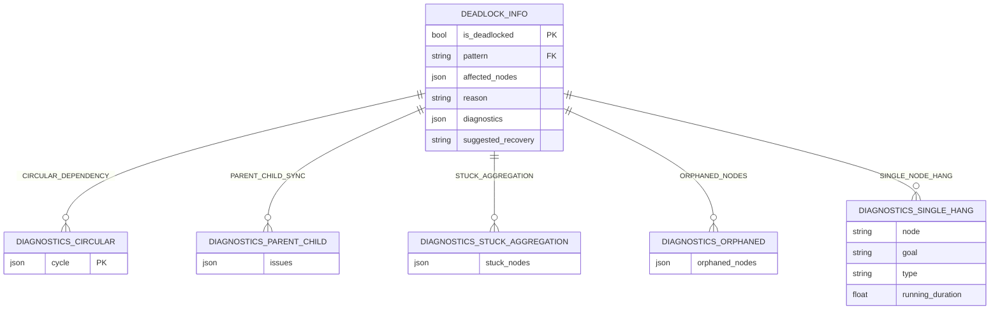
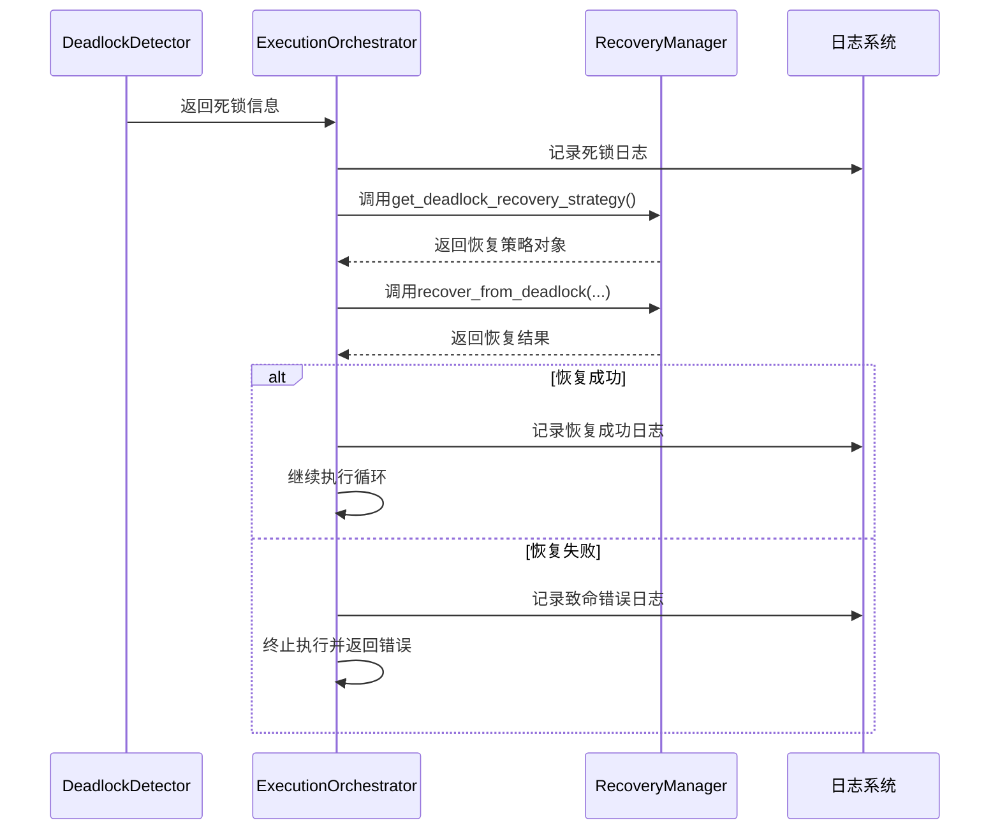

# 死锁检测机制

<cite>
**本文档引用的文件**   
- [deadlock_detector.py](file://src\sentientresearchagent\hierarchical_agent_framework\orchestration\deadlock_detector.py)
- [task_graph.py](file://src\sentientresearchagent\hierarchical_agent_framework\graph\task_graph.py)
- [state_manager.py](file://src\sentientresearchagent\hierarchical_agent_framework\graph\state_manager.py)
- [execution_orchestrator.py](file://src\sentientresearchagent\hierarchical_agent_framework\orchestration\execution_orchestrator.py)
- [recovery_manager.py](file://src\sentientresearchagent\hierarchical_agent_framework\orchestration\recovery_manager.py)
- [task_node.py](file://src\sentientresearchagent\hierarchical_agent_framework\node\task_node.py)
</cite>

## 目录
1. [引言](#引言)
2. [核心组件分析](#核心组件分析)
3. [死锁检测算法详解](#死锁检测算法详解)
4. [检测周期与性能控制](#检测周期与性能控制)
5. [误报处理与诊断机制](#误报处理与诊断机制)
6. [预警流程与恢复联动](#预警流程与恢复联动)
7. [配置方法与系统影响](#配置方法与系统影响)

## 引言
死锁检测机制是确保任务图执行系统稳定运行的关键组件。该机制通过实时监控任务图中的潜在循环依赖和阻塞状态，防止系统陷入无法继续执行的僵局。本技术文档深入分析`deadlock_detector.py`的实现原理，详细说明其如何利用图遍历算法检测多种死锁模式，并阐述其与恢复管理器的协同工作机制。

**Section sources**
- [deadlock_detector.py](file://src\sentientresearchagent\hierarchical_agent_framework\orchestration\deadlock_detector.py#L1-L50)

## 核心组件分析

### DeadlockDetector 类
`DeadlockDetector`类是死锁检测的核心，负责封装所有检测逻辑。它接收任务图（TaskGraph）和状态管理器（StateManager）作为依赖，实现了对系统执行状态的全面分析。



**Diagram sources **
- [deadlock_detector.py](file://src\sentientresearchagent\hierarchical_agent_framework\orchestration\deadlock_detector.py#L45-L559)

**Section sources**
- [deadlock_detector.py](file://src\sentientresearchagent\hierarchical_agent_framework\orchestration\deadlock_detector.py#L45-L559)

### 依赖组件
死锁检测器严重依赖于`TaskGraph`和`StateManager`来获取系统状态。



**Diagram sources **
- [task_graph.py](file://src\sentientresearchagent\hierarchical_agent_framework\graph\task_graph.py#L12-L137)
- [state_manager.py](file://src\sentientresearchagent\hierarchical_agent_framework\graph\state_manager.py#L13-L160)
- [task_node.py](file://src\sentientresearchagent\hierarchical_agent_framework\node\task_node.py#L18-L285)

**Section sources**
- [task_graph.py](file://src\sentientresearchagent\hierarchical_agent_framework\graph\task_graph.py#L12-L137)
- [state_manager.py](file://src\sentientresearchagent\hierarchical_agent_framework\graph\state_manager.py#L13-L160)

## 死锁检测算法详解

### 循环依赖检测
循环依赖是典型的死锁模式。检测器使用深度优先搜索（DFS）算法遍历任务图，寻找闭环。



**Diagram sources **
- [deadlock_detector.py](file://src\sentientresearchagent\hierarchical_agent_framework\orchestration\deadlock_detector.py#L159-L213)

**Section sources**
- [deadlock_detector.py](file://src\sentientresearchagent\hierarchical_agent_framework\orchestration\deadlock_detector.py#L159-L213)

### 父子同步问题检测
当父节点处于RUNNING状态而子节点因找不到所属图而卡在PENDING状态时，会发生父子同步问题。



**Diagram sources **
- [deadlock_detector.py](file://src\sentientresearchagent\hierarchical_agent_framework\orchestration\deadlock_detector.py#L215-L276)

**Section sources**
- [deadlock_detector.py](file://src\sentientresearchagent\hierarchical_agent_framework\orchestration\deadlock_detector.py#L215-L276)

### 聚合阻塞检测
当一个节点已完成所有子任务但自身未能进入AGGREGATING状态时，即发生聚合阻塞。

```mermaid
flowchart TD
A[开始] --> B{遍历所有活跃节点}
B --> C{节点状态为PLAN_DONE且有子图?}
C --> |是| D["获取子图内的所有节点"]
D --> E{所有子节点都已完成(DONE/FAILED)?}
E --> |是| F["标记为'All children complete but not aggregating'"]
E --> |否| G["筛选出未完成的子节点"]
G --> H{所有未完成子节点都是PENDING状态?}
H --> |是| I["检查这些子节点能否变为READY"]
I --> J{children_can_progress为False?}
J --> |是| K["标记为'True deadlock'"]
J --> |否| L["可能只是暂时等待"]
F --> M["记录到stuck_nodes列表"]
K --> M
M --> N{stuck_nodes不为空?}
N --> |是| O["创建DeadlockInfo并返回"]
N --> |否| P["继续下一个节点"]
P --> B
O --> Q[结束]
```

**Diagram sources **
- [deadlock_detector.py](file://src\sentientresearchagent\hierarchical_agent_framework\orchestration\deadlock_detector.py#L278-L339)

**Section sources**
- [deadlock_detector.py](file://src\sentientresearchagent\hierarchical_agent_framework\orchestration\deadlock_detector.py#L278-L339)

## 检测周期与性能控制

### 检测触发机制
死锁检测并非持续运行，而是由执行协调器（ExecutionOrchestrator）在主循环中定期调用。



**Diagram sources **
- [execution_orchestrator.py](file://src\sentientresearchagent\hierarchical_agent_framework\orchestration\execution_orchestrator.py#L31-L927)

**Section sources**
- [execution_orchestrator.py](file://src\sentientresearchagent\hierarchical_agent_framework\orchestration\execution_orchestrator.py#L31-L927)

### 性能开销控制策略
为了最小化检测过程对系统性能的影响，采用了多项优化策略：
1.  **惰性计算**：仅在需要时才进行复杂的图遍历。
2.  **结果缓存**：`_detection_history`存储历史检测结果，避免重复分析。
3.  **有限采样**：`analyze_execution_state`等诊断方法会限制输出长度（如`chains[:10]`, `lines[:20]`）。
4.  **低频检测**：默认每50个执行步骤才进行一次完整的死锁检测，避免过度消耗CPU资源。

## 误报处理与诊断机制

### 多模式综合判断
检测器通过组合多种检测模式来降低误报率。只有当至少一种模式确认死锁时，才会最终判定系统处于死锁状态。

```python
# 伪代码：多模式检测逻辑
for pattern, detector in self._pattern_detectors.items():
    result = await detector(active_nodes)
    if result and result.is_deadlocked:
        # 只要有一个模式确认死锁，立即返回
        return formatted_result
```

### 详细的诊断信息
每次检测都会生成丰富的诊断数据，帮助开发者理解问题根源。



**Section sources**
- [deadlock_detector.py](file://src\sentientresearchagent\hierarchical_agent_framework\orchestration\deadlock_detector.py#L35-L42)

## 预警流程与恢复联动

### 预警流程
当`detect_deadlock()`返回`is_deadlocked=True`时，预警流程被触发。



**Diagram sources **
- [recovery_manager.py](file://src\sentientresearchagent\hierarchical_agent_framework\orchestration\recovery_manager.py#L413-L487)

**Section sources**
- [execution_orchestrator.py](file://src\sentientresearchagent\hierarchical_agent_framework\orchestration\execution_orchestrator.py#L31-L927)
- [recovery_manager.py](file://src\sentientresearchagent\hierarchical_agent_framework\orchestration\recovery_manager.py#L413-L487)

### 与恢复管理器的联动方式
`DeadlockDetector`本身不执行恢复操作，而是将检测结果传递给`RecoveryManager`。`RecoveryManager`根据死锁模式选择合适的恢复策略。

```python
# recovery_manager.py 中的相关代码
def get_deadlock_recovery_strategy(self) -> DeadlockRecoveryStrategy:
    """获取死锁恢复策略。"""
    return self.deadlock_recovery
```
`DeadlockRecoveryStrategy`会根据`DeadlockInfo`中的`suggested_recovery`建议采取行动，例如强制失败某个节点或重新规划。

## 配置方法与系统影响

### 启用/禁用检测功能
死锁检测功能通常由`ExecutionOrchestrator`自动创建和管理。可以通过配置`ExecutionOrchestrator`的参数来间接控制：

```python
# 在 orchestrator 初始化时，可以传入自定义的detector
orchestrator = ExecutionOrchestrator(
    task_graph=task_graph,
    state_manager=state_manager,
    knowledge_store=knowledge_store,
    node_processor=node_processor,
    config=config,
    deadlock_detector=None # 传入None则使用默认创建的detector
    # 或者传入一个自定义的、始终返回False的detector来完全禁用
)
```
直接禁用检测功能的方法是提供一个空实现的`DeadlockDetector`，但这不推荐，因为它会使系统失去重要的安全保障。

### 对系统整体稳定性的影响评估
*   **正面影响**：
    *   **提高鲁棒性**：能够及时发现并尝试从死锁中恢复，防止系统永久挂起。
    *   **增强可观测性**：提供详细的诊断信息，便于调试复杂的状态问题。
*   **负面影响**：
    *   **性能开销**：图遍历算法的时间复杂度为O(V+E)，在大型任务图上可能引入可感知的延迟。但通过低频检测和优化，此开销被控制在合理范围内。
    *   **复杂性增加**：引入了额外的组件和交互逻辑，增加了系统的整体复杂度。

总体而言，死锁检测机制带来的稳定性提升远大于其引入的微小性能开销，是保障系统可靠运行的必要设计。

**Section sources**
- [execution_orchestrator.py](file://src\sentientresearchagent\hierarchical_agent_framework\orchestration\execution_orchestrator.py#L31-L927)
- [deadlock_detector.py](file://src\sentientresearchagent\hierarchical_agent_framework\orchestration\deadlock_detector.py#L45-L559)