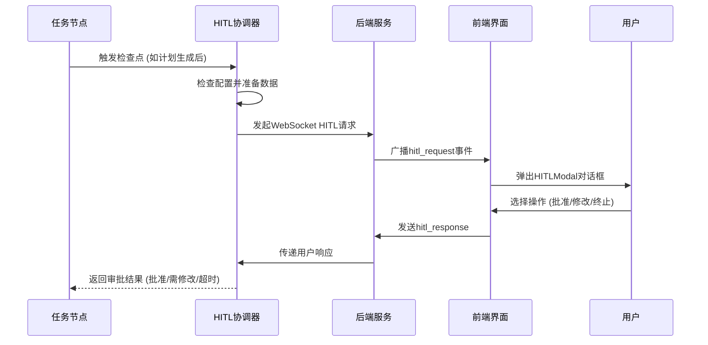

# 人机协作协调机制

<cite>
**本文档引用文件**  
- [hitl_coordinator.py](file://src\sentientresearchagent\hierarchical_agent_framework\node\hitl_coordinator.py)
- [HITLModal.tsx](file://frontend\src\components\hitl\HITLModal.tsx)
- [websocket_hitl_utils.py](file://src\sentientresearchagent\hierarchical_agent_framework\utils\websocket_hitl_utils.py)
- [websocketService.ts](file://frontend\src\services\websocketService.ts)
- [node_configs.py](file://src\sentientresearchagent\hierarchical_agent_framework\node\node_configs.py)
- [task_node.py](file://src\sentientresearchagent\hierarchical_agent_framework\node\task_node.py)
</cite>

## 目录
1. [简介](#简介)
2. [核心架构与流程](#核心架构与流程)
3. [HITL协调器实现细节](#hitl协调器实现细节)
4. [前端交互协议](#前端交互协议)
5. [可信度阈值触发示例](#可信度阈值触发示例)
6. [配置项说明](#配置项说明)
7. [故障场景应对策略](#故障场景应对策略)

## 简介
本文档详细阐述了系统中人机协作（Human-in-the-Loop, HITL）协调机制的设计与实现。该机制通过`hitl_coordinator.py`组件，在关键决策节点暂停自动化流程，发起人工审核请求，并与前端`HITLModal`组件进行实时交互。文档涵盖拦截逻辑、消息格式、超时处理、干预结果回传等核心功能，并提供配置规则和故障恢复策略。

## 核心架构与流程


**图示来源**
- [hitl_coordinator.py](file://src\sentientresearchagent\hierarchical_agent_framework\node\hitl_coordinator.py#L1-L287)
- [websocket_hitl_utils.py](file://src\sentientresearchagent\hierarchical_agent_framework\utils\websocket_hitl_utils.py#L1-L352)
- [websocketService.ts](file://frontend\src\services\websocketService.ts#L1-L799)
- [HITLModal.tsx](file://frontend\src\components\hitl\HITLModal.tsx#L372-L738)

## HITL协调器实现细节
`HITLCoordinator`类是整个机制的核心，负责在不同执行阶段根据配置决定是否暂停并请求人工干预。

### 初始化与配置检查
协调器在初始化时接收`NodeProcessorConfig`配置对象，记录各HITL开关的状态。所有检查点方法均首先验证主开关`enable_hitl`，若关闭则直接跳过。

**代码路径**
- `HITLCoordinator.__init__` ([hitl_coordinator.py](file://src\sentientresearchagent\hierarchical_agent_framework\node\hitl_coordinator.py#L20-L25))
- `NodeProcessorConfig`定义 ([node_configs.py](file://src\sentientresearchagent\hierarchical_agent_framework\node\node_configs.py#L2-L23))

### 关键检查点方法
协调器提供了多个专用方法来处理不同阶段的HITL请求：

#### 计划生成后审核
```python
async def review_plan_generation(...)
```
此方法在计划生成或重新规划后被调用。它会检查`enable_hitl_after_plan_generation`配置，并可选地通过`hitl_root_plan_only`限制仅根节点（layer 0）触发。方法会收集任务目标、生成的计划及上下文摘要，然后发起HITL请求。

**代码路径**
- `HITLCoordinator.review_plan_generation` ([hitl_coordinator.py](file://src\sentientresearchagent\hierarchical_agent_framework\node\hitl_coordinator.py#L70-L150))

#### 原子化决策审核
```python
async def review_atomizer_output(...)
```
此方法在原子化处理器决定将一个任务分解为子任务或保持原子性后调用。其行为受`enable_hitl_after_atomizer`控制。

**代码路径**
- `HITLCoordinator.review_atomizer_output` ([hitl_coordinator.py](file://src\sentientresearchagent\hierarchical_agent_framework\node\hitl_coordinator.py#L152-L180))

#### 执行前审核
```python
async def review_before_execution(...)
```
此方法在任务即将执行前调用，允许用户在最终行动前进行最后一次审查。由`enable_hitl_before_execute`配置驱动。

**代码路径**
- `HITLCoordinator.review_before_execution` ([hitl_coordinator.py](file://src\sentientresearchagent\hierarchical_agent_framework\node\hitl_coordinator.py#L182-L210))

#### 修改后计划审核
```python
async def review_modified_plan(...)
```
当系统根据用户反馈修改计划后，此方法会被调用，允许用户审查修订后的方案。由`enable_hitl_after_modified_plan`控制。

**代码路径**
- `HITLCoordinator.review_modified_plan` ([hitl_coordinator.py](file://src\sentientresearchagent\hierarchical_agent_framework\node\hitl_coordinator.py#L212-L287))

### 内部调用接口
所有检查点方法最终都调用私有方法`_call_hitl_interface`，该方法统一处理与底层HITL机制的交互，并解析返回结果。

**代码路径**
- `HITLCoordinator._call_hitl_interface` ([hitl_coordinator.py](file://src\sentientresearchagent\hierarchical_agent_framework\node\hitl_coordinator.py#L30-L68))

## 前端交互协议
HITL机制通过WebSocket与前端建立实时双向通信，确保用户能及时收到审核请求并快速响应。

### 消息格式
#### 请求消息 (后端 → 前端)
后端通过`socketio.emit('hitl_request', ...)`发送以下结构的消息：
```json
{
  "request_id": "唯一UUID",
  "checkpoint_name": "检查点名称",
  "context_message": "上下文描述文本",
  "data_for_review": { /* 待审核的数据对象 */ },
  "node_id": "关联的任务节点ID",
  "current_attempt": "当前尝试次数",
  "timestamp": "ISO时间戳"
}
```

#### 响应消息 (前端 → 后端)
前端通过`socket.emit('hitl_response', ...)`发送响应：
```json
{
  "request_id": "对应请求的ID",
  "action": "approve|modify|abort",
  "modification_instructions": "修改指令文本(可选)",
  "timestamp": "ISO时间戳"
}
```

**代码路径**
- 请求定义：`websocket_human_review` ([websocket_hitl_utils.py](file://src\sentientresearchagent\hierarchical_agent_framework\utils\websocket_hitl_utils.py#L130-L352))
- 响应定义：`HITLResponse` ([websocket.ts](file://frontend\src\types\websocket.ts#L1-L8))

### 超时处理
系统内置超时机制，由`_hitl_timeout_seconds`全局变量控制（默认1800秒）。如果在规定时间内未收到用户响应，`websocket_human_review`函数将抛出`asyncio.TimeoutError`，协调器会自动将状态标记为"approved"并附上超时信息。

**代码路径**
- `websocket_human_review`中的`asyncio.wait_for` ([websocket_hitl_utils.py](file://src\sentientresearchagent\hierarchical_agent_framework\utils\websocket_hitl_utils.py#L250-L255))

### 干预结果回传
前端`HITLModal`组件监听`hitl_request`事件，收到请求后弹出模态框。用户做出选择后，组件调用`webSocketService.sendHITLResponse()`将结果发送回后端。后端的`handle_hitl_response`函数接收到响应后，会解析`action`字段并设置相应的`user_choice`，最终通过`Future`对象将结果返回给协调器。

**代码路径**
- 前端响应：`HITLModal.handleResponse` ([HITLModal.tsx](file://frontend\src\components\hitl\HITLModal.tsx#L200-L240))
- 服务发送：`WebSocketService.sendHITLResponse` ([websocketService.ts](file://frontend\src\services\websocketService.ts#L580-L588))
- 后端处理：`handle_hitl_response` ([websocket_hitl_utils.py](file://src\sentientresearchagent\hierarchical_agent_framework\utils\websocket_hitl_utils.py#L300-L340))

## 可信度阈值触发示例
虽然当前代码未直接体现“信息可信度”计算，但可通过配置模拟此场景。例如，当一个搜索任务的结果置信度低于预设阈值时，可在其执行前强制触发HITL。

**实现方式**:
1.  在`execute_handler.py`中评估结果可信度。
2.  若可信度低于阈值，则调用`HITLCoordinator.review_before_execution()`，无论`enable_hitl_before_execute`配置如何。
3.  将可信度分数和原始数据作为`data_for_review`的一部分发送。

这利用了HITL协调器的灵活性，可以在任何需要的地方主动发起审核请求。

## 配置项说明
HITL行为由`NodeProcessorConfig`类中的多个布尔标志和参数精确控制。

| 配置项 | 类型 | 默认值 | 说明 |
| :--- | :--- | :--- | :--- |
| `enable_hitl` | bool | `True` | **主开关**。若为`False`，所有HITL功能禁用。 |
| `enable_hitl_after_plan_generation` | bool | `True` | 是否在计划生成后请求人工审核。 |
| `enable_hitl_after_atomizer` | bool | `False` | 是否在原子化决策后请求人工审核。 |
| `enable_hitl_before_execute` | bool | `False` | 是否在任务执行前请求人工审核。 |
| `enable_hitl_after_modified_plan` | bool | `True` | 是否在计划被修改后请求人工审核。 |
| `hitl_root_plan_only` | bool | `True` | **根节点模式**。若为`True`，仅允许根节点（layer 0）触发计划相关的HITL。 |
| `max_replan_attempts` | int | `5` | 单个任务的最大重新规划尝试次数。 |

**代码路径**
- `NodeProcessorConfig` ([node_configs.py](file://src\sentientresearchagent\hierarchical_agent_framework\node\node_configs.py#L2-L23))

## 故障场景应对策略
系统设计了多层次的容错机制，以应对网络中断、用户无响应等异常情况。

### 超时降级策略
这是最主要的故障应对措施。当用户在`_hitl_timeout_seconds`内未响应时，系统不会无限期等待，而是自动采取降级行动：
*   **结果**: 返回`{"status": "approved", "message": "Auto-approved after timeout..."}`。
*   **影响**: 流程将继续执行，避免阻塞整个任务流。
*   **目的**: 保证系统的可用性和鲁棒性，防止因单点卡顿导致整体停滞。

**代码路径**
- `websocket_human_review`中的`except asyncio.TimeoutError` ([websocket_hitl_utils.py](file://src\sentientresearchagent\hierarchical_agent_framework\utils\websocket_hitl_utils.py#L256-L261))

### 重试机制设计
HITL机制本身不包含传统意义上的“重试”，因为每次`review_*`调用都是独立的。然而，系统通过以下方式实现了类似效果：
1.  **重新规划循环**: 如果用户选择"request_modification"，系统会进入重新规划流程。`max_replan_attempts`限制了此循环的次数，防止无限循环。
2.  **周期性重发**: 在等待用户响应期间，`periodic_reemit`协程会每30秒重新广播一次`hitl_request`，以防初始消息丢失或客户端短暂断开连接。

**代码路径**
- 重发机制：`periodic_reemit` ([websocket_hitl_utils.py](file://src\sentientresearchagent\hierarchical_agent_framework\utils\websocket_hitl_utils.py#L220-L240))
- 重新规划限制：`NodeProcessorConfig.max_replan_attempts` ([node_configs.py](file://src\sentientresearchagent\hierarchical_agent_framework\node\node_configs.py#L2-L23))

### 兜底错误处理
对于其他意外错误（如网络错误、序列化失败），系统同样会捕获异常，并返回`{"status": "error", "message": "..."}`，同时自动批准流程，确保系统不会崩溃。

**代码路径**
- `_call_hitl_interface`中的`except Exception` ([hitl_coordinator.py](file://src\sentientresearchagent\hierarchical_agent_framework\node\hitl_coordinator.py#L60-L68))