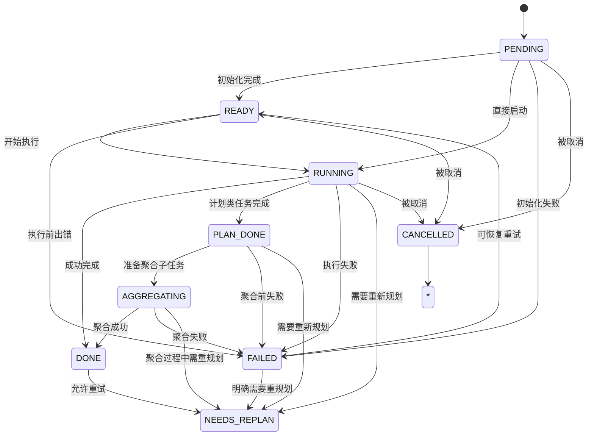

# 任务节点数据模型

<cite>
**本文档中引用的文件**
- [task_node.py](file://src\sentientresearchagent\hierarchical_agent_framework\node\task_node.py)
- [types.py](file://src\sentientresearchagent\hierarchical_agent_framework\types.py)
- [dependency_utils.py](file://src\sentientresearchagent\hierarchical_agent_framework\node\dependency_utils.py)
</cite>

## 目录
1. [简介](#简介)
2. [核心字段定义](#核心字段定义)
3. [状态机与状态迁移](#状态机与状态迁移)
4. [层级结构与子图关联](#层级结构与子图关联)
5. [节点初始化与序列化](#节点初始化与序列化)
6. [状态转换机制](#状态转换机制)
7. [常见问题排查](#常见问题排查)

## 简介
`TaskNode` 是本系统中任务执行图的基本单元，代表一个可执行或可规划的任务节点。该类在 `task_node.py` 中实现，基于 Pydantic 模型构建，支持线程安全的状态更新、灵活的状态迁移以及丰富的元数据追踪。它不仅承载任务目标和类型信息，还管理复杂的父子关系、结果存储和重规划逻辑。

**Section sources**
- [task_node.py](file://src\sentientresearchagent\hierarchical_agent_framework\node\task_node.py#L1-L50)

## 核心字段定义
以下是 `TaskNode` 类的关键字段及其用途说明：

| 字段名 | 类型 | 是否必填 | 描述 |
|-------|------|--------|------|
| task_id | str | 否（自动生成） | 唯一标识符，使用 UUID 自动生成 |
| goal | str | 是 | 任务的具体目标描述 |
| task_type | TaskType | 是 | 任务类别：SEARCH/EXECUTE/THINK/CODE_INTERPRET 等 |
| node_type | NodeType | 是 | 节点处理类型：PLAN（计划）或 EXECUTE（执行） |
| layer | int | 否（默认为0） | 层级深度，用于表示任务分解的层次 |
| parent_node_id | str | 否 | 父节点 ID，用于构建树状结构 |
| status | TaskStatus | 否（默认PENDING） | 当前状态：PENDING → READY → RUNNING → DONE/FAILED |
| result | Any | 否 | 存储任务执行结果，支持任意类型（文本、模型、引用等） |
| output_summary | str | 否 | 结果摘要，便于上下文构建 |
| error | str | 否 | 错误信息字符串 |
| agent_name | str | 否 | 处理该任务的代理名称 |
| sub_graph_id | str | 否 | PLAN 类型节点对应的子图 ID |
| planned_sub_task_ids | List[str] | 否 | 记录当前 PLAN 节点生成的所有子任务 ID |
| aux_data | Dict[str, Any] | 否（自动初始化） | 辅助数据字典，用于存储 replan 上下文、依赖索引等 |

**Section sources**
- [task_node.py](file://src\sentientresearchagent\hierarchical_agent_framework\node\task_node.py#L30-L60)

## 状态机与状态迁移
`TaskNode` 实现了一个完整的有限状态机，其状态由 `TaskStatus` 枚举定义，位于 `types.py` 文件中。



**Diagram sources**
- [types.py](file://src\sentientresearchagent\hierarchical_agent_framework\types.py#L12-L25)
- [task_node.py](file://src\sentientresearchagent\hierarchical_agent_framework\node\task_node.py#L231-L256)

### 状态迁移条件与触发事件
- **PENDING → READY**: 任务已创建并配置完毕，等待调度器分配资源。
- **READY → RUNNING**: 调度器选中该任务并开始执行。
- **RUNNING → PLAN_DONE**: 仅适用于 `node_type=PLAN` 的节点，表示子任务已全部生成但尚未聚合。
- **PLAN_DONE → AGGREGATING**: 所有子任务完成且父节点准备汇总结果。
- **AGGREGATING → DONE**: 聚合成功，输出最终结果。
- **任何状态 → FAILED**: 发生不可恢复错误，通过 `fail_with_error()` 触发。
- **FAILED → READY / NEEDS_REPLAN**: 支持失败后重试或请求重规划。

特别说明：**为何 PLAN 节点会经历 AGGREGATING 阶段？**  
因为 PLAN 节点本身不直接产生最终答案，而是负责将复杂任务拆分为多个子任务。只有当所有子任务都处于 `DONE` 状态时，系统才会进入 `AGGREGATING` 阶段，调用聚合逻辑（如总结、整合）生成高层次结论。

**Section sources**
- [task_node.py](file://src\sentientresearchagent\hierarchical_agent_framework\node\task_node.py#L231-L256)
- [task_node.py](file://src\sentientresearchagent\hierarchical_agent_framework\node\task_node.py#L75-L184)

## 层级结构与子图关联
`TaskNode` 支持多层递归的任务分解架构，通过以下字段实现：

- `layer`: 表示当前节点在任务树中的深度。根节点为 0 层，每向下分解一层，`layer` 值加 1。
- `parent_node_id`: 指向父节点的 ID，形成父子链路。
- `planned_sub_task_ids`: PLAN 节点使用此列表记录其直接生成的所有子任务 ID。
- `sub_graph_id`: PLAN 节点特有的字段，指向其专属的子任务图（`TaskGraph`），实现逻辑隔离与独立管理。

> **设计用途**：`sub_graph_id` 的引入使得每个 PLAN 节点可以拥有一个完全独立的任务子图，便于模块化执行、调试和缓存。例如，在金融分析场景中，一个顶层“撰写报告”任务可能包含“市场趋势分析”、“竞争对手比较”等多个子图，各自独立运行互不干扰。

**Section sources**
- [task_node.py](file://src\sentientresearchagent\hierarchical_agent_framework\node\task_node.py#L37-L48)
- [dependency_utils.py](file://src\sentientresearchagent\hierarchical_agent_framework\node\dependency_utils.py#L9-L111)

## 节点初始化与序列化
`TaskNode` 在初始化时确保关键字段的健壮性，并支持跨进程序列化传输。

```python
def __init__(self, **data):
    # 确保 aux_data 永远不会为 None
    if 'aux_data' not in data or data['aux_data'] is None:
        data['aux_data'] = {}
    
    super().__init__(**data)
    # 初始化线程锁以保证状态更新安全
    object.__setattr__(self, '_status_lock', threading.RLock())
```

- **初始化保障**：即使反序列化时 `aux_data` 缺失或为空，也会自动初始化为空字典，防止后续操作报错。
- **线程安全**：内部使用 `threading.RLock` 实现多线程环境下的状态更新保护。
- **序列化兼容**：继承自 `BaseModel`，天然支持 JSON 序列化/反序列化，适用于网络传输和持久化存储。

**Section sources**
- [task_node.py](file://src\sentientresearchagent\hierarchical_agent_framework\node\task_node.py#L66-L73)

## 状态转换机制
状态转换主要通过 `update_status()` 方法完成，具备高可靠性与可观测性。

### 主要特性：
- **线程安全**：使用 `_status_lock` 保证并发环境下状态一致性。
- **日志追踪**：每次状态变更均输出详细日志，包含时间戳、节点 ID、层级、目标摘要等。
- **即时聚合触发**：当 `DONE` 状态设置成功且存在父节点时，会在 `aux_data` 中添加 `trigger_parent_aggregation_check` 标记，通知执行引擎立即检查是否可触发父节点聚合。
- **异步通知**：若提供 `update_manager`，则通过 asyncio 异步广播状态变化，避免阻塞主线程。

```python
# 示例：成功完成任务并触发父节点聚合检查
self.update_status(
    TaskStatus.DONE,
    result=final_result,
    result_summary="Generated comprehensive market analysis report"
)
```

此外，系统还提供了 `update_status_fast()` 快速路径方法，专为“延迟更新”模式优化，跳过验证与日志记录，提升性能。

**Section sources**
- [task_node.py](file://src\sentientresearchagent\hierarchical_agent_framework\node\task_node.py#L75-L184)
- [task_node.py](file://src\sentientresearchagent\hierarchical_agent_framework\node\task_node.py#L186-L229)

## 常见问题排查
### 节点卡在 PENDING 状态如何排查？
1. **检查调度器是否运行**：确认 `execution_orchestrator` 或 `task_scheduler` 正常工作。
2. **查看日志中的 STATE TRANSITION 记录**：搜索 `"🔄 STATE TRANSITION"` 日志条目，确认是否有从 `PENDING` 到 `READY/RUNNING` 的尝试。
3. **验证依赖关系**：某些节点可能因 `aux_data.depends_on_indices` 存在未完成的前置依赖而无法就绪。
4. **检查系统负载**：高负载可能导致任务排队，长时间停留在 `PENDING`。
5. **确认配置文件**：检查 `sentient.yaml` 中是否启用了相关 agent 和 handler。
6. **前端调试面板**：使用 `NodeTracingModal` 查看节点全生命周期轨迹。

> 提示：可通过 `NodeUpdateManager` 监听状态变更事件，实时捕获异常停滞情况。

**Section sources**
- [task_node.py](file://src\sentientresearchagent\hierarchical_agent_framework\node\task_node.py#L75-L184)
- [websocketService.ts](file://frontend/src/services/websocketService.ts)
- [NodeTracingModal.tsx](file://frontend/src/components/debug/NodeTracingModal.tsx)