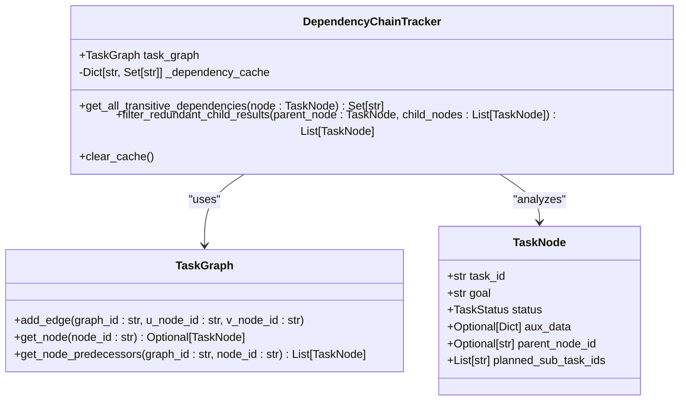
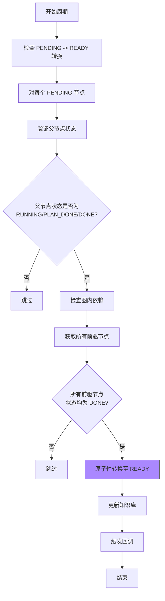
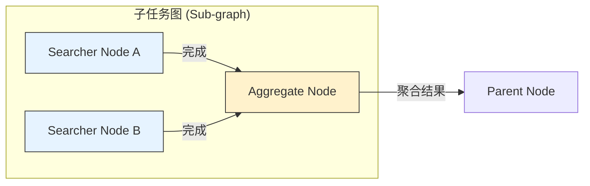
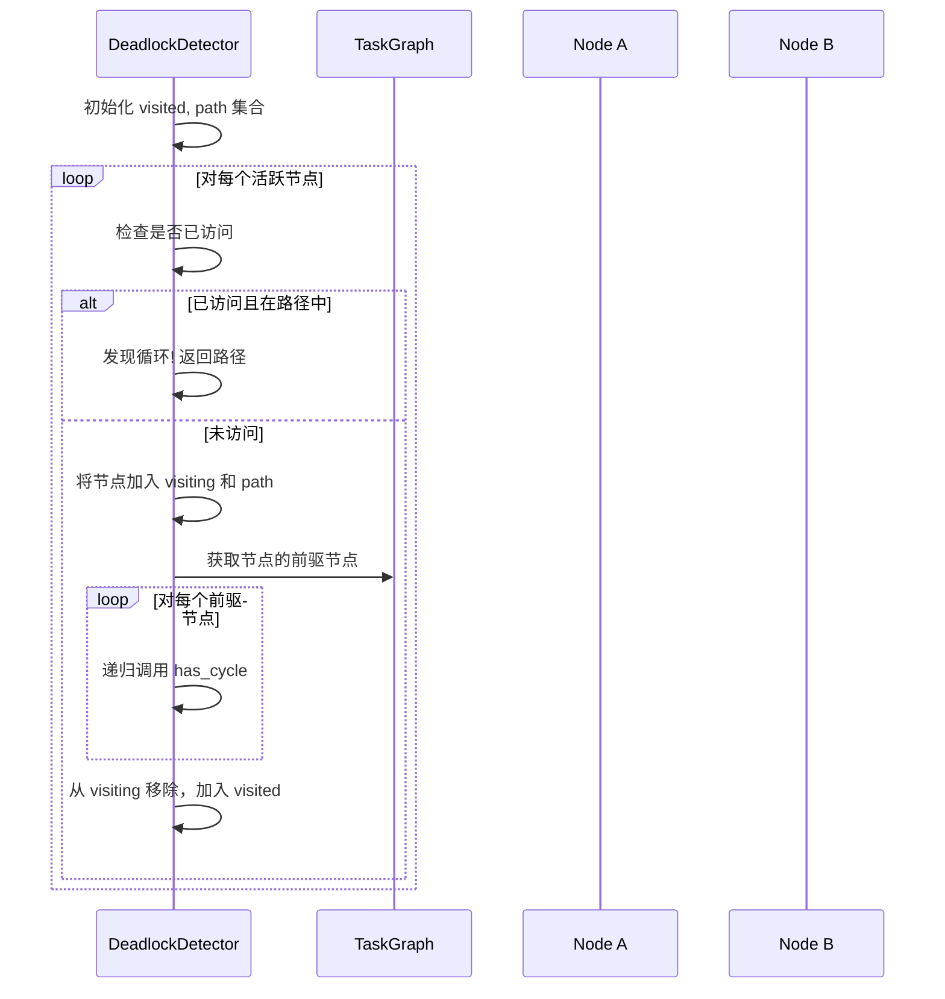

# 依赖解析机制

<cite>
**本文档引用的文件**
- [dependency_utils.py](file://src\sentientresearchagent\hierarchical_agent_framework\node\dependency_utils.py)
- [task_graph.py](file://src\sentientresearchagent\hierarchical_agent_framework\graph\task_graph.py)
- [task_node.py](file://src\sentientresearchagent\hierarchical_agent_framework\node\task_node.py)
- [state_transition_manager.py](file://src\sentientresearchagent\hierarchical_agent_framework\orchestration\state_transition_manager.py)
- [cycle_manager.py](file://src\sentientresearchagent\hierarchical_agent_framework\graph\cycle_manager.py)
- [aggregate_handler.py](file://src\sentientresearchagent\hierarchical_agent_framework\node_handlers\aggregate_handler.py)
</cite>

## 目录
1. [简介](#简介)
2. [核心组件](#核心组件)
3. [依赖计算算法](#依赖计算算法)
4. [依赖满足判定与就绪机制](#依赖满足判定与就绪机制)
5. [聚合节点激活示例](#聚合节点激活示例)
6. [循环依赖检测](#循环依赖检测)
7. [调试指南](#调试指南)
8. [结论](#结论)

## 简介
本技术文档详细阐述了基于`dependency_utils.py`实现的依赖解析机制。该机制是智能研究代理系统的核心，负责管理任务图中复杂的前置依赖关系，确保任务按正确的顺序执行。文档将深入解释动态计算依赖链的算法逻辑、依赖满足的判定条件、就绪节点的提升机制，并提供实用的调试指南。

## 核心组件

依赖解析机制由多个协同工作的核心组件构成，它们共同维护任务图的状态和执行流程。

**Section sources**
- [dependency_utils.py](file://src\sentientresearchagent\hierarchical_agent_framework\node\dependency_utils.py#L9-L111)
- [task_graph.py](file://src\sentientresearchagent\hierarchical_agent_framework\graph\task_graph.py#L12-L137)
- [task_node.py](file://src\sentientresearchagent\hierarchical_agent_framework\node\task_node.py#L18-L285)

## 依赖计算算法

依赖计算的核心在于`DependencyChainTracker`类，它通过递归遍历任务图来识别所有直接和间接（传递性）的依赖项。

**Diagram sources**
- [dependency_utils.py](file://src\sentientresearchagent\hierarchical_agent_framework\node\dependency_utils.py#L9-L111)
- [task_graph.py](file://src\sentientresearchagent\hierarchical_agent_framework\graph\task_graph.py#L12-L137)
- [task_node.py](file://src\sentientresearchagent\hierarchical_agent_framework\node\task_node.py#L18-L285)

### 传递性依赖获取
`get_all_transitive_dependencies`方法是依赖计算的基石。其工作流程如下：
1.  **缓存检查**：首先检查内存缓存`_dependency_cache`，避免重复计算。
2.  **获取直接依赖**：从节点的`aux_data`字典中读取`depends_on_indices`列表，这些索引指向父节点`planned_sub_task_ids`中的具体任务ID。
3.  **递归解析**：对于每个直接依赖的任务ID，查询其对应的`TaskNode`对象，并递归调用`get_all_transitive_dependencies`以获取其自身的所有依赖。
4.  **结果合并与缓存**：将直接依赖和所有递归得到的依赖合并成一个集合，并将其存入缓存以供后续使用。

此算法确保了即使在深度嵌套的依赖链中，也能准确地构建出完整的依赖图谱。

**Section sources**
- [dependency_utils.py](file://src\sentientresearchagent\hierarchical_agent_framework\node\dependency_utils.py#L16-L54)

## 依赖满足判定与就绪机制

一个节点要从`PENDING`状态转变为`READY`状态，必须满足其所有前置依赖。这一过程由`StateTransitionManager`和`CycleManager`协同完成。

**Diagram sources**
- [state_transition_manager.py](file://src\sentientresearchagent\hierarchical_agent_framework\orchestration\state_transition_manager.py#L282-L322)
- [cycle_manager.py](file://src\sentientresearchagent\hierarchical_agent_framework\graph\cycle_manager.py#L108-L138)

### 判定条件
一个`PENDING`节点被判定为可就绪（READY），需同时满足以下两个条件：
1.  **父节点状态有效**：如果该节点有父节点，则父节点的状态必须是`RUNNING`、`PLAN_DONE`或`DONE`。这保证了子任务在其父任务的生命周期内是有效的。
2.  **所有前驱节点完成**：在包含该节点的图（由`_find_container_graph`确定）中，所有作为其前驱（predecessor）的节点，其状态都必须是`DONE`。这是通过`TaskGraph.get_node_predecessors`方法实现的。

### 就绪节点提升机制
提升机制在`CycleManager.execute_step`的主循环中执行：
1.  **周期性检查**：在每个处理周期（cycle）的开始阶段，系统会遍历所有节点。
2.  **原子性转换**：对于每一个满足上述条件的`PENDING`节点，系统会尝试进行一次**原子性转换**。这通过`_atomic_transition_if_eligible`函数实现，该函数在节点的锁内操作，防止了多线程环境下的竞态条件。
3.  **状态变更**：一旦原子性检查通过，节点的状态将被安全地更新为`READY`，并记录到知识库中，从而使其进入可执行队列。

**Section sources**
- [state_transition_manager.py](file://src\sentientresearchagent\hierarchical_agent_framework\orchestration\state_transition_manager.py#L282-L322)
- [cycle_manager.py](file://src\sentientresearchagent\hierarchical_agent_framework\graph\cycle_manager.py#L108-L138)

## 聚合节点激活示例

考虑一个典型的场景：一个名为“综合分析报告”的聚合节点（Aggregator Node）需要等待两个搜索节点（Searcher Node A 和 Searcher Node B）完成后才能启动。

**Diagram sources**
- [aggregate_handler.py](file://src\sentientresearchagent\hierarchical_agent_framework\node_handlers\aggregate_handler.py#L140-L217)

1.  **初始状态**：聚合节点C创建后，其状态为`PENDING`，因为它有两个未完成的前驱节点A和B。
2.  **搜索节点完成**：当节点A和B都成功完成（状态变为`DONE`）后，它们会触发系统的状态更新。
3.  **聚合准备检查**：在下一个处理周期中，`CycleManager`会检查状态为`PLAN_DONE`的节点（即聚合节点C）。`StateTransitionManager._can_aggregate`方法会被调用。
4.  **条件判定**：该方法会查询聚合节点C的子图（sub_graph），并检查其中所有子节点的状态。由于A和B均已为`DONE`，判定条件成立。
5.  **状态提升**：聚合节点C的状态从`PLAN_DONE`被提升为`AGGREGATING`，随后由`AggregateHandler`接管，开始收集和整合来自A和B的结果。

**Section sources**
- [aggregate_handler.py](file://src\sentientresearchagent\hierarchical_agent_framework\node_handlers\aggregate_handler.py#L140-L217)

## 循环依赖检测

为了防止死锁，系统内置了循环依赖检测机制，主要在`DeadlockDetector._detect_circular_dependencies`中实现。

**Diagram sources**
- [deadlock_detector.py](file://src\sentientresearchagent\hierarchical_agent_framework\orchestration\deadlock_detector.py#L144-L179)

该机制采用深度优先搜索（DFS）算法：
- 它维护一个`visiting`集合来跟踪当前DFS路径上的节点。
- 当遍历过程中遇到一个已在`visiting`集合中的节点时，即发现了一个循环依赖。
- 该检测通常在系统出现停滞迹象时被触发，以诊断潜在的死锁问题。

## 调试指南

开发者在排查依赖相关问题时，可以参考以下指南：

### 常见问题及排查方法
-   **依赖死锁 (Dependency Deadlock)**:
    1.  检查日志中是否有`"Circular dependency detected"`等错误信息。
    2.  使用`DeadlockDetector.analyze_execution_state()`获取系统状态快照，重点关注`blocked_nodes`和`dependency_chains`。
    3.  在前端可视化界面中，观察是否存在相互等待的节点环路。

-   **遗漏依赖声明 (Missing Dependency Declaration)**:
    1.  如果某个节点在不应执行时就开始运行，检查其`aux_data['depends_on_indices']`是否正确设置。
    2.  确认父节点的`planned_sub_task_ids`列表完整且有序，因为依赖索引是基于此列表的。

### 可视化验证建议
强烈建议使用图遍历工具进行验证：
1.  **利用前端可视化**：`frontend/src/components/graph/GraphVisualization.tsx`提供了实时的任务图渲染，可以直接观察节点间的连接和状态。
2.  **序列化数据**：调用`TaskGraph.to_visualization_dict()`方法，可以获取用于前端可视化的JSON数据结构，便于离线分析。
3.  **打印依赖链**：在关键节点的日志中打印其`get_all_transitive_dependencies`的结果，以验证依赖计算的准确性。

**Section sources**
- [deadlock_detector.py](file://src\sentientresearchagent\hierarchical_agent_framework\orchestration\deadlock_detector.py#L144-L179)
- [task_graph.py](file://src\sentientresearchagent\hierarchical_agent_framework\graph\task_graph.py#L130-L137)

## 结论
本文档详尽地解析了基于`dependency_utils.py`的依赖解析机制。该机制通过`DependencyChainTracker`精确计算传递性依赖，结合`StateTransitionManager`和`CycleManager`的原子性状态转换，实现了高效可靠的依赖管理和节点调度。通过理解其内部算法和调试方法，开发者能够更好地构建和维护复杂任务流，确保系统的稳定性和健壮性。