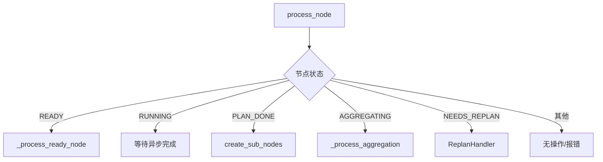
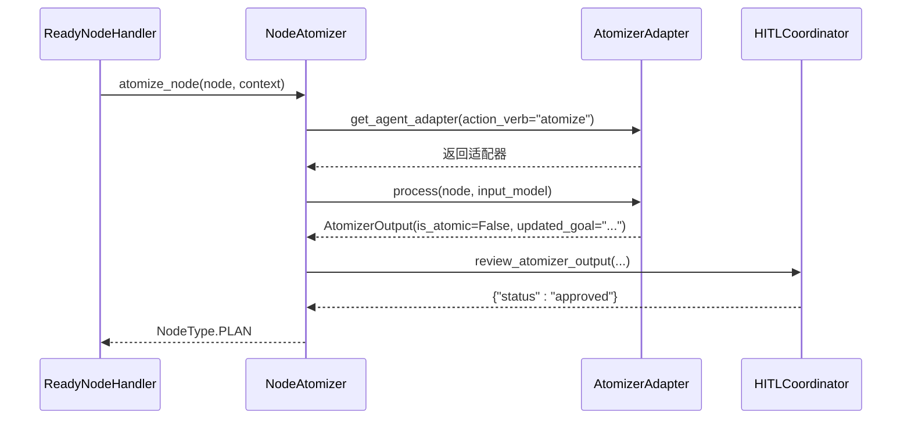
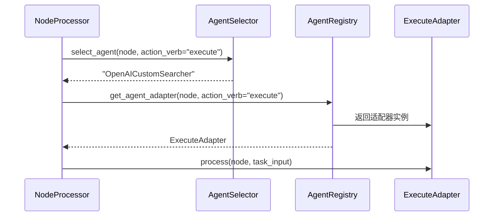

# 节点处理器执行流程

<cite>
**本文档引用的文件**
- [node_processor.py](file://src\sentientresearchagent\hierarchical_agent_framework\node\node_processor.py)
- [node_atomizer_utils.py](file://src\sentientresearchagent\hierarchical_agent_framework\node\node_atomizer_utils.py)
- [context_builder.py](file://src\sentientresearchagent\hierarchical_agent_framework\context\context_builder.py)
- [registry.py](file://src\sentientresearchagent\hierarchical_agent_framework\agents\registry.py)
- [task_node.py](file://src\sentientresearchagent\hierarchical_agent_framework\node\task_node.py)
- [hitl_coordinator.py](file://src\sentientresearchagent\hierarchical_agent_framework\node\hitl_coordinator.py)
</cite>

## 目录
1. [核心处理逻辑概述](#核心处理逻辑概述)
2. [主入口与分发机制](#主入口与分发机制)
3. [原子化检查机制](#原子化检查机制)
4. [上下文构建与数据注入](#上下文构建与数据注入)
5. [代理选择策略与调用链路](#代理选择策略与调用链路)
6. [结果回写与传播路径](#结果回写与传播路径)
7. [执行流程示例：搜索任务](#执行流程示例搜索任务)
8. [性能优化建议](#性能优化建议)
9. [典型错误与应对措施](#典型错误与应对措施)

## 核心处理逻辑概述

`NodeProcessor` 是整个任务图（Task Graph）执行的核心协调器，负责驱动单个 `TaskNode` 的生命周期。其核心职责是根据节点的当前状态（Status）和类型（Type），通过策略模式（Strategy Pattern）将处理逻辑分发给相应的处理器（Handler）。该组件不仅管理着从规划、执行到聚合的完整工作流，还集成了人类干预（HITL）、上下文构建、依赖管理和知识存储等关键服务。

`NodeProcessor` 在初始化时会创建一个包含所有必要服务的上下文环境，包括任务图、知识库、代理注册表、HITL协调器以及用于子节点创建和原子化判断的工具。它通过 `process_node()` 方法作为统一的入口点，接收待处理的节点，并依据其状态决定下一步操作。对于处于 `READY` 状态的节点，系统会进行原子化检查以决定是进入规划（PLAN）还是直接执行（EXECUTE）；对于已完成规划的节点（`PLAN_DONE`），则会触发子节点的创建；对于需要聚合结果的节点（`AGGREGATING`），则会调用聚合处理器。整个过程确保了任务能够高效、有序地推进。

**Section sources**
- [node_processor.py](file://src\sentientresearchagent\hierarchical_agent_framework\node\node_processor.py#L74-L175)

## 主入口与分发机制

`NodeProcessor` 的主入口方法是 `process_node()`。此方法是所有节点处理的起点，它接收一个 `TaskNode` 对象，并根据该节点的 `status` 属性来决定由哪个具体的处理器来处理。



**Diagram sources**
- [node_processor.py](file://src\sentientresearchagent\hierarchical_agent_framework\node\node_processor.py#L178-L254)

如上图所示，`process_node()` 方法首先记录日志并创建追踪信息。然后，它会查询一个名为 `handler_strategies` 的字典，该字典在 `NodeProcessor` 初始化时被构建，将特定的状态（如 `TaskStatus.READY`, `TaskStatus.AGGREGATING`）映射到对应的处理器实例（如 `ReadyNodeHandler`, `AggregatingNodeHandler`）。如果找到了匹配的处理器，就会调用其 `handle()` 方法。例如，当一个节点的状态为 `READY` 时，`ReadyNodeHandler` 将被调用，进而启动原子化检查或直接进入执行阶段。这种设计实现了关注点分离，使得每个处理器只专注于一种状态的处理逻辑，极大地提高了代码的可维护性和可扩展性。

**Section sources**
- [node_processor.py](file://src\sentientresearchagent\hierarchical_agent_framework\node\node_processor.py#L178-L254)

## 原子化检查机制

原子化检查（Atomization Check）是决定一个任务是否足够简单、可以直接执行的关键决策点。这一机制主要由 `NodeAtomizer` 类实现，并在 `ReadyNodeHandler` 处理 `READY` 状态节点时被调用。



**Diagram sources**
- [node_atomizer_utils.py](file://src\sentientresearchagent\hierarchical_agent_framework\node\node_atomizer_utils.py#L18-L277)
- [node_handlers.py](file://src\sentientresearchagent\hierarchical_agent_framework\node_handlers\ready_node_handler.py#L17-L220)

该机制的工作流程如下：
1.  **上下文准备**：`NodeAtomizer` 首先使用 `resolve_context_for_agent()` 函数为原子化代理（Atomizer Agent）构建输入上下文。这个上下文包含了当前任务的目标、项目总体目标以及相关的前置任务结果。
2.  **代理调用**：`NodeProcessor` 通过 `AgentRegistry` 获取一个专门用于原子化任务的代理适配器（`AtomizerAdapter`）。
3.  **决策生成**：该代理分析上下文和任务目标，返回一个 `AtomizerOutput` 对象，其中 `is_atomic` 字段明确指示任务是否可以原子化执行。
4.  **HITL 审核**：在某些配置下，系统的 `HITLCoordinator` 会介入，将代理的决策呈现给人类用户进行审核。只有在获得批准后，决策才会生效。
5.  **最终决策**：基于代理的输出和可能的HITL反馈，`NodeAtomizer` 返回一个 `NodeType` 枚举值（`PLAN` 或 `EXECUTE`），指导后续的处理流程。

此外，系统还包含深度限制（`max_planning_layer`）等后备规则，以防代理无法做出决策。

**Section sources**
- [node_atomizer_utils.py](file://src\sentientresearchagent\hierarchical_agent_framework\node\node_atomizer_utils.py#L18-L277)

## 上下文构建与数据注入

上下文构建是为代理提供执行任务所需背景信息的过程。`NodeProcessor` 利用 `ContextBuilderService` 来动态组装这些信息，确保代理拥有足够的“记忆”来做出明智的决策。

```mermaid
flowchart LR
subgraph ContextBuilderService
direction TB
A[当前任务ID/目标] --> B[父级层次结构]
B --> C[水平依赖项]
C --> D[相似任务]
D --> E[格式化上下文]
end
F[AgentTaskInput] < --> E
G[TaskNode] --> A
```

**Diagram sources**
- [context_builder_service.py](file://src\sentientresearchagent\hierarchical_agent_framework\services\context_builder_service.py#L45-L598)

数据注入的具体方式如下：
1.  **策略驱动**：`ContextBuilderService` 使用一系列策略（Strategies）来收集相关信息。这些策略包括：
    *   **父级层次结构**：获取从根节点到当前节点的完整任务链，理解任务在整个项目中的位置。
    *   **水平依赖项**：查找当前任务所依赖的兄弟节点（sibling nodes）的结果，确保任务按正确的顺序执行。
    *   **相似任务**：检索过去完成的类似任务的结果，以避免重复工作。
2.  **类型优化**：构建的上下文会根据用途进行优化。例如，为“规划”任务构建的上下文会优先包含成功的计划案例，而为“执行”任务构建的上下文则会优先考虑最新的、最相关的结果。
3.  **模型注入**：构建好的上下文最终会被封装成一个 `AgentTaskInput` 模型，并作为参数传递给代理的 `process()` 方法。这个模型包含了所有必要的字段，如 `current_goal`、`relevant_context_items` 和 `formatted_full_context`。

**Section sources**
- [context_builder.py](file://src\sentientresearchagent\hierarchical_agent_framework\context\context_builder.py#L180-L292)

## 代理选择策略与调用链路

代理的选择是通过 `AgentSelector` 服务和 `AgentRegistry` 注册表协同完成的。`AgentSelector` 负责根据任务类型（`TaskType`）、节点角色（如规划、执行）和蓝图（Blueprint）来推荐合适的代理名称。随后，`AgentRegistry` 负责根据这个名称或动作动词（action verb）来查找并返回实际的代理适配器（`BaseAdapter`）实例。



**Diagram sources**
- [agent_selector.py](file://src\sentientresearchagent\hierarchical_agent_framework\services\agent_selector.py#L56-L348)
- [registry.py](file://src\sentientresearchagent\hierarchical_agent_framework\agents\registry.py#L7-L145)

完整的调用链路如下：
1.  当一个 `EXECUTE` 类型的节点需要被处理时，`ExecuteHandler` 会请求一个执行代理。
2.  `ExecuteHandler` 调用 `AgentSelector.select_agent()`，传入节点和 `"execute"` 动作动词。
3.  `AgentSelector` 根据配置和蓝图返回一个代理名称（如 `"OpenAICustomSearcher"`）。
4.  `ExecuteHandler` 使用此名称或直接使用 `"execute"` 动词，通过 `AgentRegistry.get_agent_adapter()` 获取代理适配器实例。
5.  最后，`ExecuteHandler` 调用该适配器的 `process()` 方法，正式开始任务执行。

**Section sources**
- [registry.py](file://src\sentientresearchagent\hierarchical_agent_framework\agents\registry.py#L7-L145)

## 结果回写与传播路径

当一个代理完成任务后，其结果会沿着一条清晰的路径被回写和传播，以确保系统的状态保持一致。

1.  **结果设置**：代理的 `process()` 方法返回结果后，`ExecuteHandler` 会将其赋值给 `TaskNode.result`。
2.  **状态更新**：`ExecuteHandler` 调用 `node.update_status(TaskStatus.DONE)`，这会触发节点状态的变更，并自动设置 `timestamp_completed`。
3.  **知识库存储**：`NodeProcessor` 在 `process_node()` 方法的末尾，会调用 `knowledge_store.add_or_update_record_from_node(node)`。这会将节点的最新状态、结果和元数据持久化到 `KnowledgeStore` 中。
4.  **传播触发**：如果该节点有父节点，其完成可能会触发父节点的聚合流程。这是通过在 `update_status()` 中设置 `aux_data['trigger_parent_aggregation_check']` 来实现的，通知调度器检查父节点是否可以进入 `AGGREGATING` 状态。

**Section sources**
- [node_processor.py](file://src\sentientresearchagent\hierarchical_agent_framework\node\node_processor.py#L178-L254)
- [task_node.py](file://src\sentientresearchagent\hierarchical_agent_framework\node\task_node.py#L18-L285)

## 执行流程示例：搜索任务

以下是一个搜索任务从 `EXECUTE` 状态到完成的实际调用栈示例：

1.  **`NodeProcessor.process_node()`**: 接收一个状态为 `READY` 且类型为 `EXECUTE` 的搜索节点。
2.  **`ReadyNodeHandler.handle()`**: 因为节点已是 `EXECUTE` 类型，跳过原子化检查，直接调用 `ready_execute_handler`。
3.  **`ExecuteHandler._process()`**: 
    *   调用 `context_builder.build_context()` 为执行构建上下文。
    *   （可选）调用 `HITLCoordinator.review_before_execution()` 进行执行前审核。
    *   通过 `AgentSelector` 和 `AgentRegistry` 获取 `OpenAICustomSearcher` 适配器。
    *   调用 `searcher_adapter.process(node, execution_context)`。
4.  **`OpenAICustomSearcher.process()`**: 执行实际的网络搜索，返回 `CustomSearcherOutput`。
5.  **`ExecuteHandler._post_process()`**: 处理搜索结果，更新节点的 `output_summary`，并调用 `node.update_status(DONE)`。
6.  **`NodeProcessor`**: 将更新后的节点存入 `KnowledgeStore`，完成整个流程。

**Section sources**
- [execute_handler.py](file://src\sentientresearchagent\hierarchical_agent_framework\node_handlers\execute_handler.py#L14-L167)

## 性能优化建议

为了提升系统性能，应重点关注以下方面：
*   **避免重复上下文加载**：`ContextBuilderService` 应缓存已构建的上下文片段。对于频繁访问的依赖项（如父级任务摘要），可以在 `KnowledgeStore` 中存储预计算的摘要，而不是每次都重新遍历整个历史记录。
*   **批量知识库更新**：在高并发场景下，可以配置 `NodeUpdateManager` 使用延迟（deferred）执行策略，将多个对 `KnowledgeStore` 的更新合并为一次批量操作，减少I/O开销。
*   **代理复用**：确保 `AgentRegistry` 中的代理适配器是单例的，并在它们的生命周期内复用底层资源（如HTTP连接池），避免为每个任务都创建新的连接。

**Section sources**
- [context_builder_service.py](file://src\sentientresearchagent\hierarchical_agent_framework\services\context_builder_service.py#L45-L598)

## 典型错误与应对措施

*   **空结果返回**：如果代理返回 `None` 或空结果，应在 `ExecuteHandler._process_result()` 中进行检测。应对措施包括：记录警告日志、尝试使用默认值填充，或根据配置将节点状态标记为 `FAILED` 并触发重试机制（`NEEDS_REPLAN`）。
*   **代理未找到**：当 `AgentRegistry.get_agent_adapter()` 返回 `None` 时，这是一个严重错误。系统应具备后备机制，例如使用一个通用的默认执行器，并发出警报通知开发者检查代理注册情况。
*   **HITL 超时**：`HITLCoordinator` 应实现超时机制。如果用户在规定时间内未响应，系统可以根据配置自动批准或拒绝，以防止整个任务流被阻塞。

**Section sources**
- [hitl_coordinator.py](file://src\sentientresearchagent\hierarchical_agent_framework\node\hitl_coordinator.py#L19-L286)