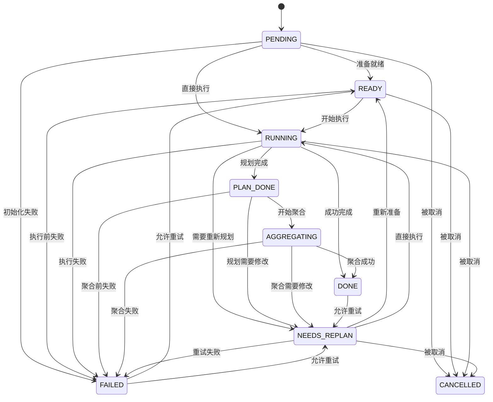
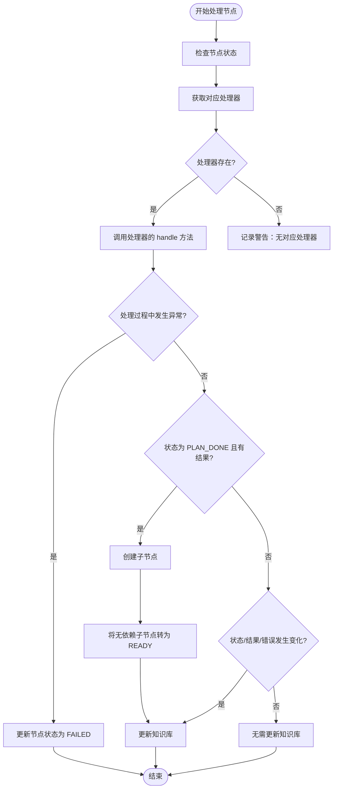
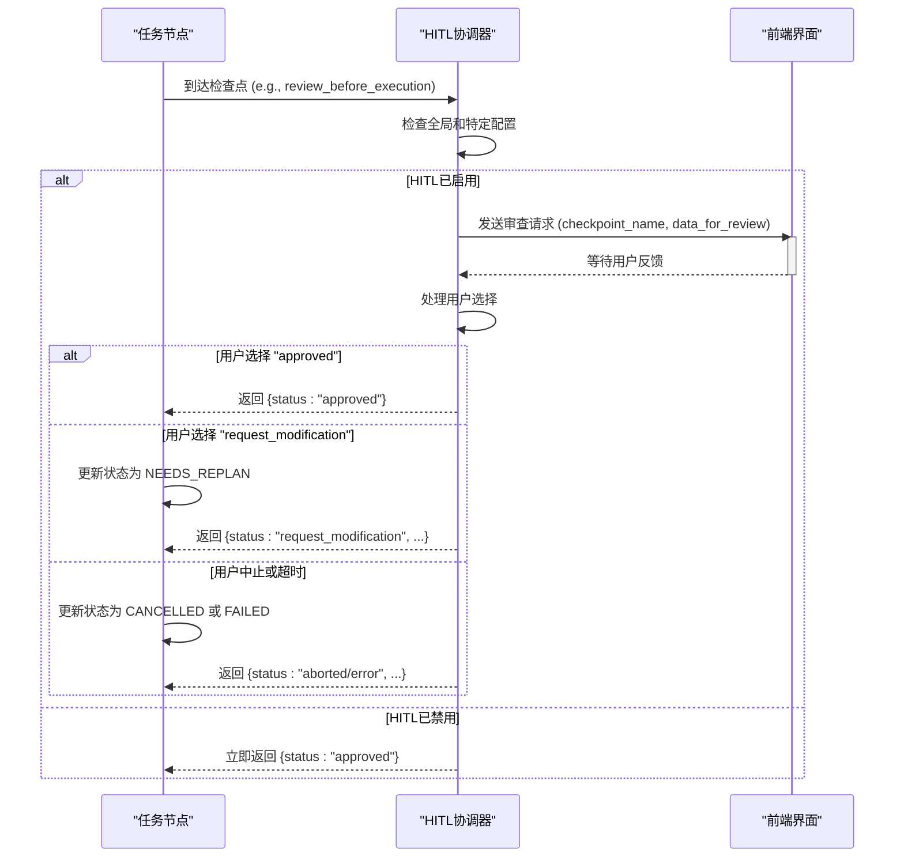

# 节点处理机制

<cite>
**本文档引用的文件**
- [task_node.py](file://src\sentientresearchagent\hierarchical_agent_framework\node\task_node.py)
- [node_processor.py](file://src\sentientresearchagent\hierarchical_agent_framework\node\node_processor.py)
- [dependency_utils.py](file://src\sentientresearchagent\hierarchical_agent_framework\node\dependency_utils.py)
- [hitl_coordinator.py](file://src\sentientresearchagent\hierarchical_agent_framework\node\hitl_coordinator.py)
</cite>

## 目录
1. [简介](#简介)
2. [任务节点数据模型与生命周期](#任务节点数据模型与生命周期)
3. [节点处理器协调机制](#节点处理器协调机制)
4. [前置依赖动态解析](#前置依赖动态解析)
5. [人机协作模式下的暂停机制](#人机协作模式下的暂停机制)
6. [搜索类节点完整处理流程](#搜索类节点完整处理流程)
7. [常见问题排查指南](#常见问题排查指南)
8. [结论](#结论)

## 简介
本技术文档深入解析了系统中任务节点的处理机制，重点阐述了`task_node.py`中的任务节点数据模型及其生命周期状态管理。详细描述了`node_processor.py`如何协调节点的准备、执行和结果聚合过程，并结合`dependency_utils.py`说明前置依赖的动态解析逻辑。同时，文档阐明了`hitl_coordinator.py`在人机协作模式下如何暂停节点执行并等待人工干预。通过实际代码路径展示了一个搜索类节点从触发到完成的完整处理流程，包括上下文注入、代理调用和输出解析。最后提供了常见问题排查指南，涵盖依赖死锁、超时处理和HITL响应延迟等场景。

## 任务节点数据模型与生命周期

任务节点（TaskNode）是系统中的基本工作单元，其核心数据模型定义了任务的目标、类型、状态和执行上下文。每个节点具有唯一的任务ID、目标描述、任务类型（如SEARCH、WRITE、THINK）、节点类型（PLAN或EXECUTE）以及当前状态。此外，节点还包含层级信息、父节点引用、执行结果、错误信息以及用于存储任意辅助数据的`aux_data`字段。

节点的生命周期由一系列预定义的状态组成，这些状态构成了一个有向图，确保了任务执行的有序性和可追踪性。状态转换受到严格验证，防止非法状态迁移。



**图表来源**
- [task_node.py](file://src\sentientresearchagent\hierarchical_agent_framework\node\task_node.py#L231-L256)

**本节来源**
- [task_node.py](file://src\sentientresearchagent\hierarchical_agent_framework\node\task_node.py#L18-L285)

## 节点处理器协调机制

`NodeProcessor`是协调单个任务节点处理的核心组件。它采用策略模式，根据节点的当前状态委托给相应的处理器进行处理。`NodeProcessor`在初始化时会创建一个`ProcessorContext`对象，该对象包含了处理节点所需的所有共享资源和配置，如任务图、知识库、代理注册表、HITL协调器、子节点创建器和节点原子化器等。

节点处理的主要入口是`process_node`方法。该方法首先设置项目上下文，然后根据节点的当前状态查找对应的处理器。如果找到处理器，则调用其`handle`方法来处理节点。处理完成后，`NodeProcessor`会检查是否需要为已完成规划的节点创建子节点，并将无依赖的子节点状态更新为READY。最后，它会更新知识库以反映节点的最新状态。



**图表来源**
- [node_processor.py](file://src\sentientresearchagent\hierarchical_agent_framework\node\node_processor.py#L178-L254)

**本节来源**
- [node_processor.py](file://src\sentientresearchagent\hierarchical_agent_framework\node\node_processor.py#L68-L254)

## 前置依赖动态解析

`DependencyChainTracker`类负责管理任务间的依赖关系，防止冗余的上下文传播。它通过递归查询的方式计算节点的所有传递性依赖。当一个节点被创建时，它可能通过`aux_data`中的`depends_on_indices`字段声明对父节点计划中其他子任务的直接依赖。`get_all_transitive_dependencies`方法会解析这些索引，将其转换为实际的任务ID，并递归地获取这些依赖节点自身的所有依赖，从而构建出完整的依赖链。

在结果聚合阶段，`filter_redundant_child_results`方法利用依赖链信息来过滤掉冗余的结果。例如，如果节点C依赖于节点B，而节点B又依赖于节点A，那么只有节点C的结果应该被传递给父节点进行聚合，因为节点A和B的结果已经隐含在节点C的结果中。该方法通过分析哪些节点的输出被其他兄弟节点消费，来决定哪些节点的结果是“非冗余”的，即其输出未被任何其他已完成的兄弟节点所使用。

```mermaid
graph TD
A[节点A] --> B[节点B]
B --> C[节点C]
D[节点D] --> C
E[节点E]
subgraph "聚合前"
A; B; C; D; E
end
subgraph "聚合后"
C; E
end
style C fill:#9f9,stroke:#333
style E fill:#9f9,stroke:#333
style A fill:#f99,stroke:#333
style B fill:#f99,stroke:#333
style D fill:#f99,stroke:#333
note right of C: "C的结果包含A,B,D的信息"
note right of E: "E的结果独立"
note left of A: "冗余"
note left of B: "冗余"
note left of D: "冗余"
```

**图表来源**
- [dependency_utils.py](file://src\sentientresearchagent\hierarchical_agent_framework\node\dependency_utils.py#L16-L54)
- [dependency_utils.py](file://src\sentientresearchagent\hierarchical_agent_framework\node\dependency_utils.py#L56-L107)

**本节来源**
- [dependency_utils.py](file://src\sentientresearchagent\hierarchical_agent_framework\node\dependency_utils.py#L9-L111)

## 人机协作模式下的暂停机制

`HITLCoordinator`（Human-in-the-Loop Coordinator）是实现人机协作的核心组件。它基于配置决定在哪些关键检查点暂停自动化流程并请求人工审查。主要的检查点包括：计划生成后、原子化决策后以及执行前。

当到达一个启用的检查点时，`HITLCoordinator`会调用内部的`_call_hitl_interface`方法，该方法最终会触发`request_human_review`工具。此过程会阻塞节点的进一步处理，直到收到用户的反馈。用户可以选择"批准"、"请求修改"或超时/出错时自动批准。如果用户选择"请求修改"，节点状态会被设置为`NEEDS_REPLAN`，从而触发重新规划流程。如果用户主动中止，则节点状态变为`CANCELLED`。



**图表来源**
- [hitl_coordinator.py](file://src\sentientresearchagent\hierarchical_agent_framework\node\hitl_coordinator.py#L29-L84)
- [hitl_coordinator.py](file://src\sentientresearchagent\hierarchical_agent_framework\node\hitl_coordinator.py#L190-L222)

**本节来源**
- [hitl_coordinator.py](file://src\sentientresearchagent\hierarchical_agent_framework\node\hitl_coordinator.py#L19-L286)

## 搜索类节点完整处理流程

以下是一个搜索类节点从触发到完成的完整处理流程示例：

1.  **节点创建与初始化**: 一个`SEARCH`类型的`EXECUTE`节点被创建，初始状态为`PENDING`。
2.  **状态转换至READY**: 节点处理器检测到节点可以执行，调用`update_status`方法将其状态从`PENDING`安全地转换为`READY`。
3.  **执行前检查与上下文注入**: `NodeProcessor`调用`review_before_execution`方法，可能触发HITL检查。同时，`resolve_context_for_agent`函数被用来构建执行所需的上下文，包括相关的祖先输出和兄弟任务输出。
4.  **代理调用**: 根据节点的`agent_name`，从`AgentRegistry`中获取相应的代理适配器（如`CustomSearcher`），并调用其执行方法。代理会使用注入的上下文和目标来调用具体的工具（如`web_search_tool`）。
5.  **结果处理与状态更新**: 代理返回结果后，`NodeProcessor`将结果存储在节点的`result`字段中，并调用`update_status`方法将状态从`RUNNING`更新为`DONE`。这会同时更新`timestamp_completed`并触发日志记录。
6.  **结果聚合提示**: 由于节点状态变为`DONE`且存在父节点，`update_status`方法会在`aux_data`中设置`trigger_parent_aggregation_check`标志，提示执行引擎可以立即检查父节点是否可以进行聚合。

**本节来源**
- [task_node.py](file://src\sentientresearchagent\hierarchical_agent_framework\node\task_node.py#L75-L184)
- [node_processor.py](file://src\sentientresearchagent\hierarchical_agent_framework\node\node_processor.py#L178-L254)
- [context_builder.py](file://src\sentientresearchagent\hierarchical_agent_framework\context\context_builder.py)
- [agents/registry.py](file://src\sentientresearchagent\hierarchical_agent_framework\agents\registry.py)

## 常见问题排查指南

### 依赖死锁
**现象**: 某些节点长时间停留在`READY`或`PENDING`状态，无法进入`RUNNING`。
**原因**: 可能存在循环依赖，例如节点A依赖节点B，而节点B又依赖节点A。
**排查步骤**:
1.  检查相关节点的`aux_data.depends_on_indices`和`planned_sub_task_ids`。
2.  使用`DependencyChainTracker.get_all_transitive_dependencies`手动验证是否存在循环引用。
3.  审查规划代理的输出，确保其生成的子任务依赖关系是合理的。

### 超时处理
**现象**: 节点在执行过程中卡住，最终因超时而失败。
**原因**: 代理执行时间过长，或外部API响应缓慢。
**排查步骤**:
1.  检查节点的`error`字段和日志，确认超时的具体环节（如网络请求、模型推理）。
2.  验证代理配置中的超时设置是否合理。
3.  检查外部服务的可用性和性能。

### HITL响应延迟
**现象**: 流程在HITL检查点长时间停滞。
**原因**: 用户未及时响应前端发出的审查请求。
**排查步骤**:
1.  确认前端`HITLModal`组件是否正常显示通知。
2.  检查WebSocket连接是否稳定，确保审查请求能成功送达前端。
3.  查看`HITLCoordinator._call_hitl_interface`的日志，确认请求是否已发出以及是否收到了响应。
4.  如果配置了超时自动批准，检查`config.enable_hitl_after_plan_generation`等相关配置项。

**本节来源**
- [task_node.py](file://src\sentientresearchagent\hierarchical_agent_framework\node\task_node.py#L75-L184)
- [hitl_coordinator.py](file://src\sentientresearchagent\hierarchical_agent_framework\node\hitl_coordinator.py#L29-L84)
- [frontend/src/components/hitl/HITLModal.tsx](file://frontend\src\components\hitl\HITLModal.tsx)
- [server/websocket/hitl.py](file://src\sentientresearchagent\server\websocket\hitl.py)

## 结论
本文档全面解析了系统的节点处理机制。`TaskNode`作为核心数据结构，通过严格的生命周期状态管理确保了任务执行的健壮性。`NodeProcessor`作为协调中枢，有效地组织了节点的处理流程。`DependencyChainTracker`巧妙地解决了依赖管理和结果去重的问题。`HITLCoordinator`则为关键决策点提供了灵活的人工干预能力。整个机制设计精巧，各组件职责清晰，共同支撑起一个复杂但可控的自动化研究代理系统。