# 前端架构

<cite>
**本文档引用的文件**
- [main.tsx](file://frontend/src/main.tsx)
- [App.tsx](file://frontend/src/App.tsx)
- [MainLayout.tsx](file://frontend/src/components/layout/MainLayout.tsx)
- [GraphVisualization.tsx](file://frontend/src/components/graph/GraphVisualization.tsx)
- [TaskNode.tsx](file://frontend/src/components/graph/nodes/TaskNode.tsx)
- [CustomEdge.tsx](file://frontend/src/components/graph/edges/CustomEdge.tsx)
- [projectStore.ts](file://frontend/src/stores/projectStore.ts)
- [taskGraphStore.ts](file://frontend/src/stores/taskGraphStore.ts)
- [profileStore.ts](file://frontend/src/stores/profileStore.ts)
- [websocketService.ts](file://frontend/src/services/websocketService.ts)
- [HITLModal.tsx](file://frontend/src/components/hitl/HITLModal.tsx)
- [NodeDetailsPanel.tsx](file://frontend/src/components/panels/NodeDetailsPanel.tsx)
- [ToolCallsDisplay.tsx](file://frontend/src/components/panels/ToolCallsDisplay.tsx)
- [DebugPanel.tsx](file://frontend/src/components/debug/DebugPanel.tsx)
- [package.json](file://frontend/package.json)
- [vite.config.ts](file://frontend/vite.config.ts)
- [tailwind.config.js](file://frontend/tailwind.config.js)
</cite>

## 目录
1. [简介](#简介)
2. [项目结构与技术栈](#项目结构与技术栈)
3. [核心状态管理](#核心状态管理)
4. [任务图可视化](#任务图可视化)
5. [组件体系结构](#组件体系结构)
6. [实时通信机制](#实时通信机制)
7. [开发与调试工具](#开发与调试工具)
8. [性能优化与最佳实践](#性能优化与最佳实践)

## 简介
本文档详细阐述了ROMA前端应用的架构设计，聚焦于其现代化的技术栈和核心设计模式。系统采用React + Vite + TypeScript作为基础技术组合，结合Tailwind CSS实现原子化样式方案。文档深入解析了Zustand状态管理库在全局状态驱动中的应用，以及React Flow库在任务图可视化中的集成方式。同时，涵盖了WebSocket实时通信、人机交互（HITL）流程和丰富的调试工具，为前端开发者提供全面的开发指导。

## 项目结构与技术栈

### 技术栈概览
ROMA前端应用构建于现代化的JavaScript技术栈之上，确保了高性能、可维护性和开发效率。

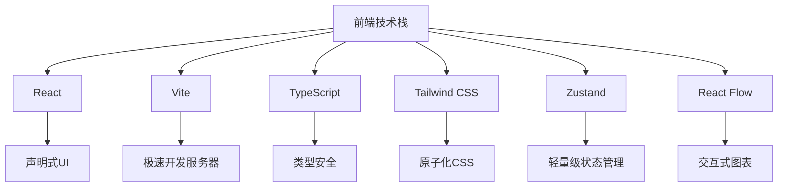

**技术栈来源**
- [package.json](file://frontend/package.json)
- [vite.config.ts](file://frontend/vite.config.ts)
- [tailwind.config.js](file://frontend/tailwind.config.js)

### 核心依赖分析
根据`package.json`文件，前端应用的核心依赖包括：
- **框架**: React 18
- **构建工具**: Vite 5
- **状态管理**: Zustand
- **UI组件**: Radix UI, Lucide React
- **图表库**: Reactflow
- **样式处理**: Tailwind CSS, Class Variance Authority
- **网络通信**: socket.io-client

这些依赖共同构成了一个高效、响应式的现代Web应用。

**Section sources**
- [package.json](file://frontend/package.json)

## 核心状态管理

### Zustand状态存储设计
前端应用使用Zustand库创建了三个核心状态存储，分别管理项目、任务图和用户配置文件的状态。

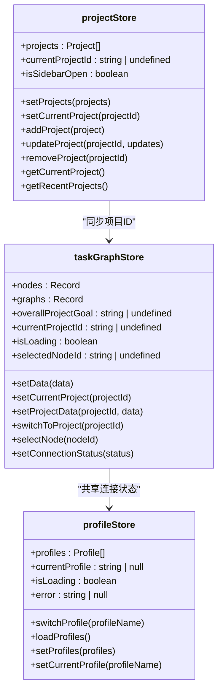

**Diagram sources**
- [projectStore.ts](file://frontend/src/stores/projectStore.ts)
- [taskGraphStore.ts](file://frontend/src/stores/taskGraphStore.ts)
- [profileStore.ts](file://frontend/src/stores/profileStore.ts)

### 全局状态驱动机制
全局状态通过Zustand的`useStore` Hook在组件中订阅，当状态发生变化时，相关组件会自动重新渲染。

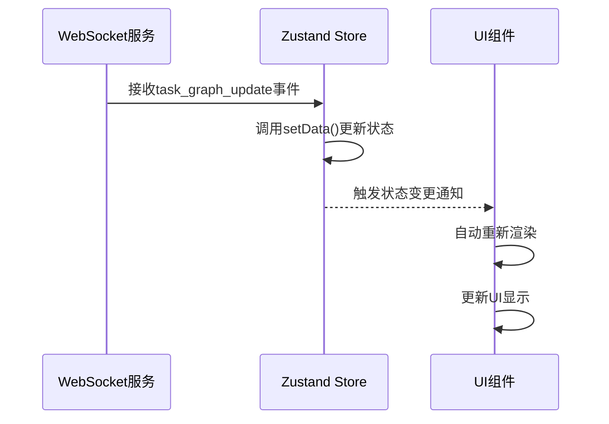

这种机制确保了UI与后端数据的实时同步。

**Section sources**
- [taskGraphStore.ts](file://frontend/src/stores/taskGraphStore.ts)
- [websocketService.ts](file://frontend/src/services/websocketService.ts)

## 任务图可视化

### React Flow集成
任务图可视化功能由`GraphVisualization.tsx`组件实现，该组件封装了React Flow库，提供了流畅的交互体验。

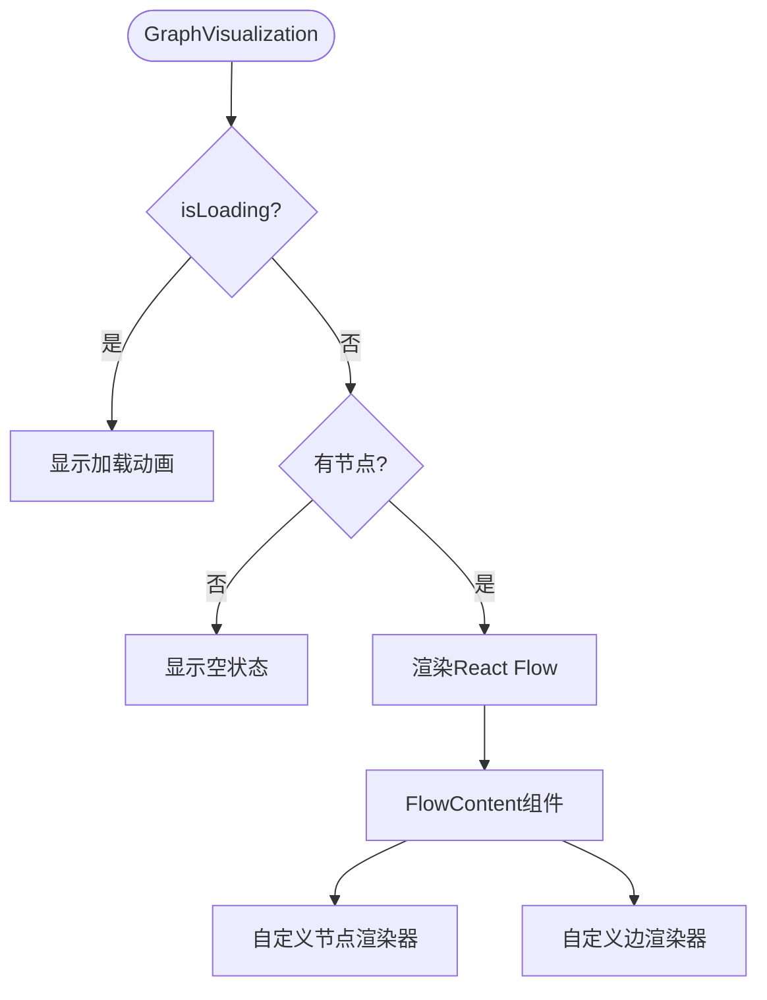

**Section sources**
- [GraphVisualization.tsx](file://frontend/src/components/graph/GraphVisualization.tsx)

### 自定义节点与边
系统实现了高度定制化的节点和边，以满足复杂的可视化需求。

#### 自定义节点 (TaskNode.tsx)
任务节点根据其类型（PLAN或EXECUTE）和状态动态渲染不同的视觉样式。

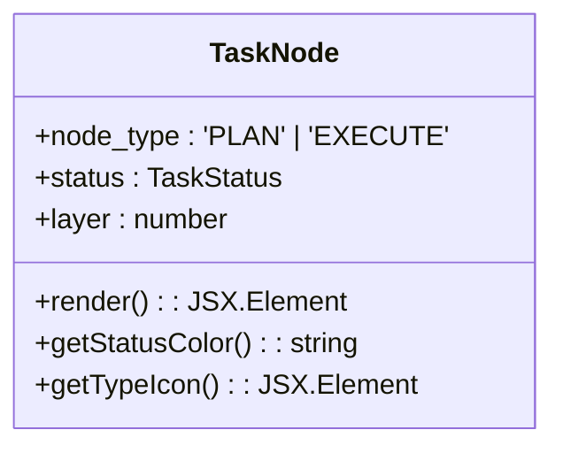

**Section sources**
- [TaskNode.tsx](file://frontend/src/components/graph/nodes/TaskNode.tsx)

#### 自定义边 (CustomEdge.tsx)
边的样式根据其类型（hierarchy, context, execution）进行区分，增强了图的可读性。

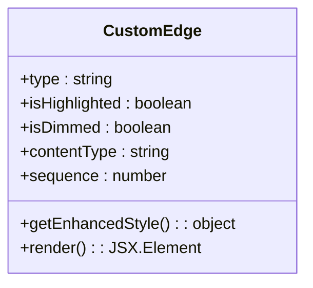

**Section sources**
- [CustomEdge.tsx](file://frontend/src/components/graph/edges/CustomEdge.tsx)

## 组件体系结构

### 布局系统 (MainLayout.tsx)
主布局组件`MainLayout`负责组织整个应用的UI结构，包含侧边栏、头部、主要内容区和状态组件。

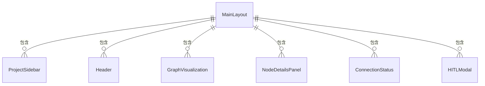

**Section sources**
- [MainLayout.tsx](file://frontend/src/components/layout/MainLayout.tsx)

### 面板系统
系统提供了一系列功能面板，用于展示详细信息和交互操作。

#### 节点详情面板 (NodeDetailsPanel.tsx)
当用户选择一个任务节点时，`NodeDetailsPanel`会显示该节点的详细信息。

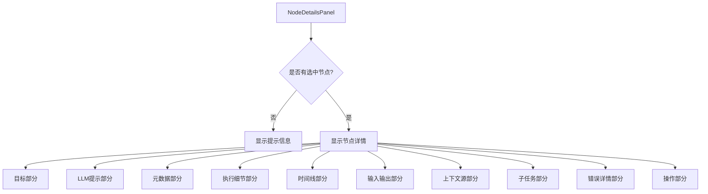

**Section sources**
- [NodeDetailsPanel.tsx](file://frontend/src/components/panels/NodeDetailsPanel.tsx)

#### 人机交互模态框 (HITLModal.tsx)
`HITLModal`组件处理人机交互请求，允许用户审查和修改AI生成的计划。

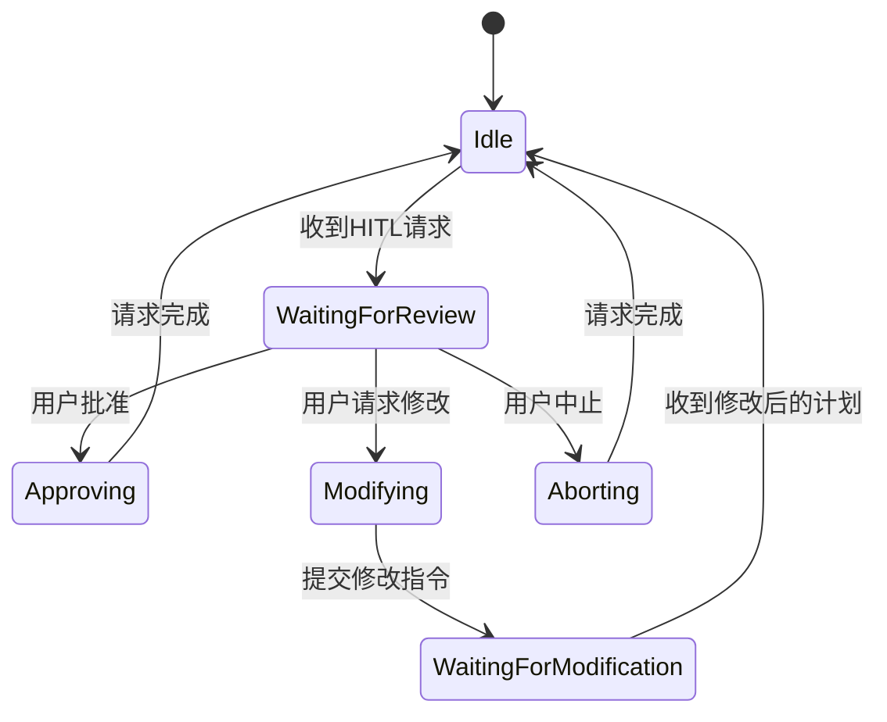

**Section sources**
- [HITLModal.tsx](file://frontend/src/components/hitl/HITLModal.tsx)

#### 工具调用显示 (ToolCallsDisplay.tsx)
该组件用于展示AI代理调用外部工具的详细信息。

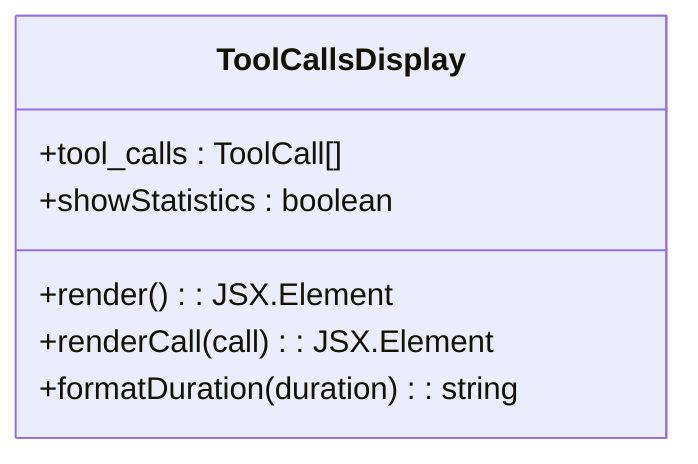

**Section sources**
- [ToolCallsDisplay.tsx](file://frontend/src/components/panels/ToolCallsDisplay.tsx)

## 实时通信机制

### WebSocket服务 (websocketService.ts)
前端通过`WebSocketService`类与后端建立实时双向通信，确保数据的即时同步。

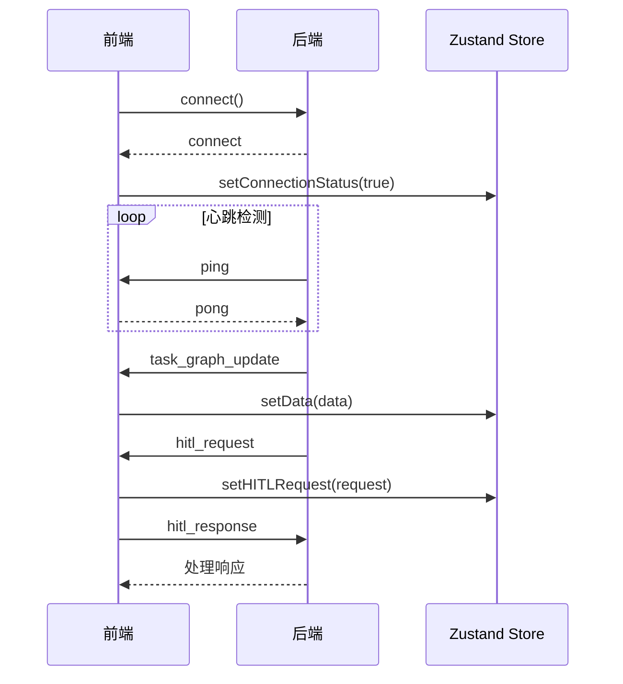

**Section sources**
- [websocketService.ts](file://frontend/src/services/websocketService.ts)

### 连接管理
`WebSocketManager`负责WebSocket连接的生命周期管理，确保连接的稳定性和持久性。

```mermaid
flowchart TD
A[WebSocketManager] --> B[单例模式]
A --> C[初始化连接]
A --> D[监听页面卸载]
A --> E[自动重连]
A --> F[连接状态监控]
B --> G[确保全局唯一实例]
C --> H[调用webSocketService.connect()]
D --> I[window.addEventListener('beforeunload')]
E --> J[指数退避重连策略]
F --> K[定期检查连接状态]
```

**Section sources**
- [websocketManager.ts](file://frontend/src/services/websocketManager.ts)

## 开发与调试工具

### 调试面板 (DebugPanel.tsx)
`DebugPanel`提供了一个浮动的调试界面，方便开发者监控应用状态。

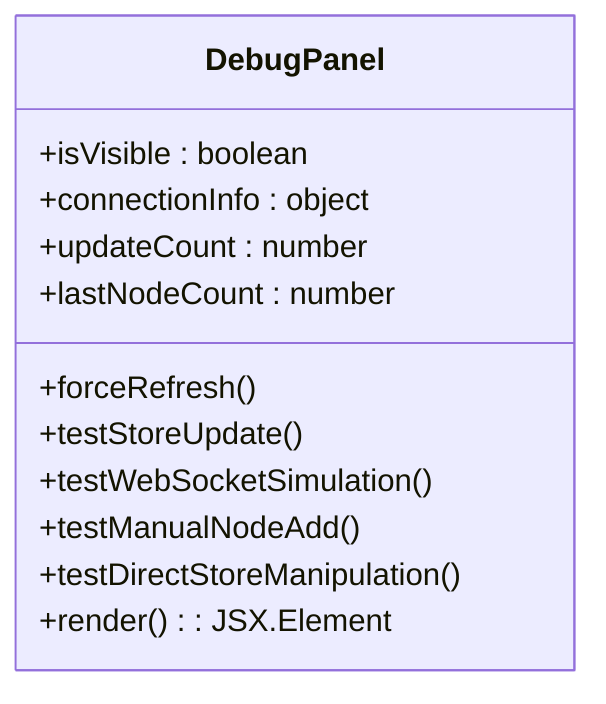

**Section sources**
- [DebugPanel.tsx](file://frontend/src/components/debug/DebugPanel.tsx)

### 状态监控器 (StoreMonitor.tsx)
`StoreMonitor`是一个实时监控Zustand状态变化的组件，用于诊断性能问题。

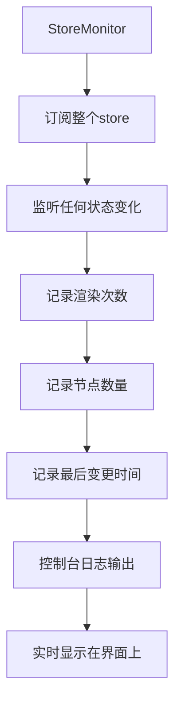

**Section sources**
- [StoreMonitor.tsx](file://frontend/src/components/debug/StoreMonitor.tsx)

## 性能优化与最佳实践

### 性能优化建议
1. **状态订阅最小化**: 使用Zustand的`shallow`比较或选择性订阅，避免不必要的重新渲染。
2. **虚拟滚动**: 对于大型列表，使用虚拟滚动技术提高性能。
3. **懒加载**: 对非关键组件使用React.lazy进行代码分割。
4. **防抖与节流**: 对频繁触发的事件（如搜索）应用防抖或节流。
5. **Memoization**: 使用`React.memo`、`useMemo`和`useCallback`缓存计算结果。

### 调试技巧
1. **利用DevTools**: Zustand提供了devtools中间件，可以记录所有状态变化。
2. **WebSocket测试**: 使用`websocketService.triggerTestHITL()`等方法模拟后端事件。
3. **直接状态操作**: 在`DebugPanel`中直接操作状态，快速验证UI行为。
4. **性能分析**: 使用React DevTools的Profiler分析组件渲染性能。

### 主题定制
应用支持深色和浅色主题切换，通过`ThemeProvider`和`useTheme` Hook实现。

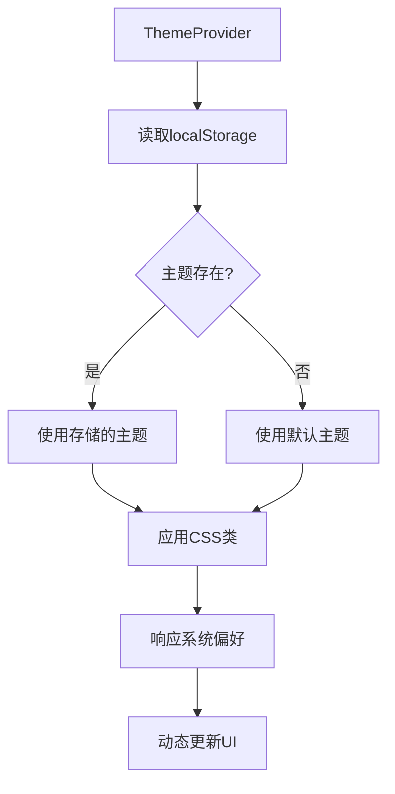

**Section sources**
- [ThemeContext.tsx](file://frontend/src/contexts/ThemeContext.tsx)