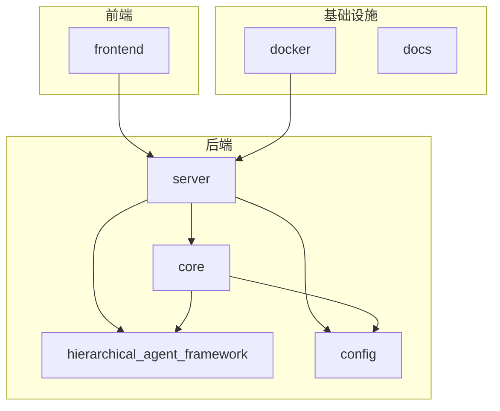
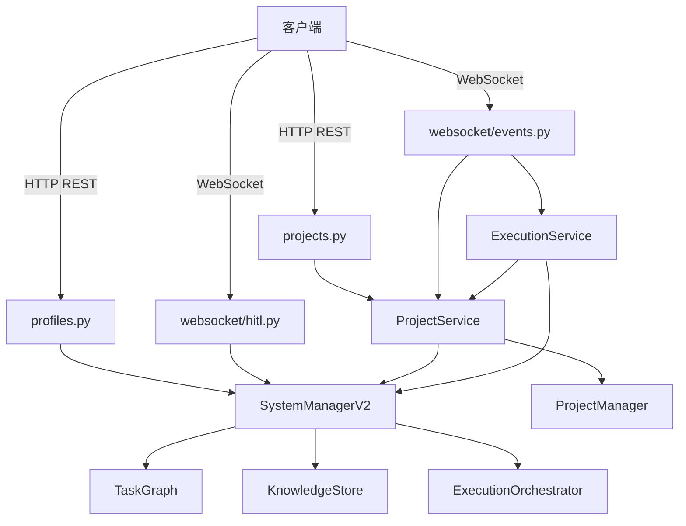
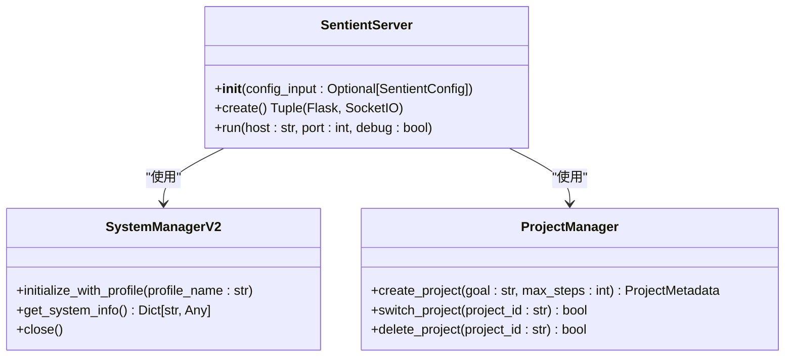
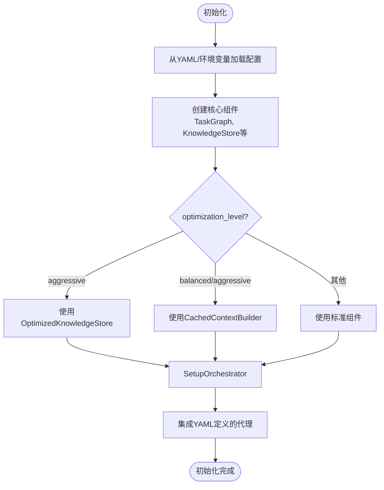
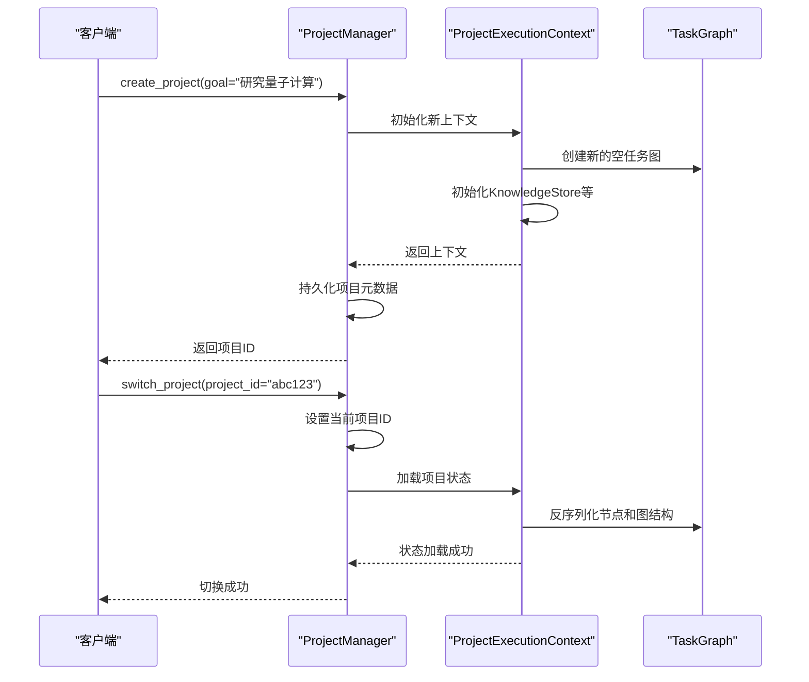
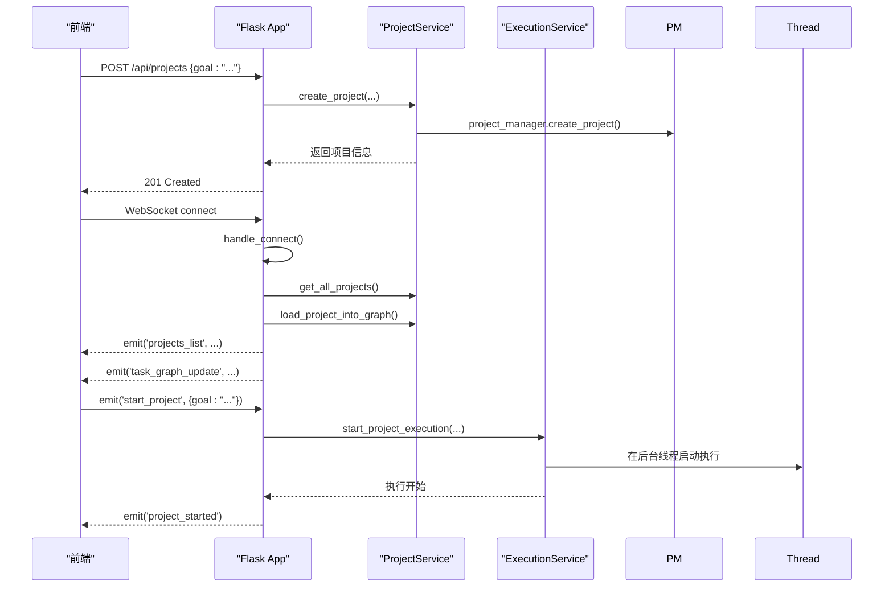
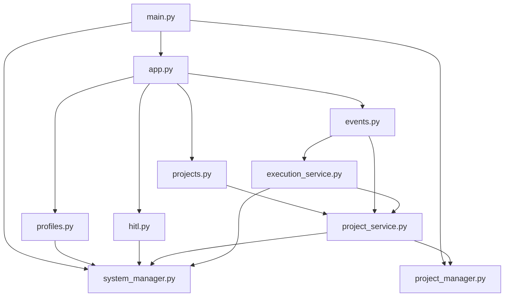

# 后端架构

<cite>
**本文档引用的文件**
- [main.py](file://src\sentientresearchagent\server\main.py)
- [app.py](file://src\sentientresearchagent\server\app.py)
- [system_manager.py](file://src\sentientresearchagent\core\system_manager.py)
- [project_manager.py](file://src\sentientresearchagent\core\project_manager.py)
- [projects.py](file://src\sentientresearchagent\server\api\projects.py)
- [profiles.py](file://src\sentientresearchagent\server\api\profiles.py)
- [websocket.py](file://src\sentientresearchagent\server\websocket\events.py)
- [docker-compose.yml](file://docker\docker-compose.yml)
- [config.py](file://src\sentientresearchagent\config\config.py)
</cite>

## 目录
1. [简介](#简介)
2. [项目结构](#项目结构)
3. [核心组件](#核心组件)
4. [架构概览](#架构概览)
5. [详细组件分析](#详细组件分析)
6. [依赖关系分析](#依赖关系分析)
7. [性能考量](#性能考量)
8. [故障排除指南](#故障排除指南)
9. [结论](#结论)

## 简介
本文档深入剖析ROMA服务端的模块化设计与运行机制。重点阐述基于FastAPI/Flask的服务器入口（main.py, app.py）及其与核心系统管理器（system_manager.py）的集成方式。详细说明项目生命周期管理（project_manager.py）如何协调配置加载、环境初始化和资源释放。解释微服务风格的API组织结构，包括REST端点（projects.py, profiles.py）与WebSocket事件处理（websocket.py）的分离设计。阐述Docker容器化部署策略（docker-compose.yml），包括服务编排、网络配置和持久化卷设置。分析后端中间件选择（如Pydantic模型验证、Flask-SocketIO实时通信）对系统稳定性的影响。为后端工程师提供服务扩展、日志监控和异常处理的最佳实践指南。

## 项目结构
ROMA项目的后端代码主要位于`src\sentientresearchagent`目录下，采用清晰的分层模块化设计。核心功能被划分为`core`、`hierarchical_agent_framework`和`server`三大模块。`core`模块包含系统级管理器和项目管理逻辑；`hierarchical_agent_framework`是智能体框架的核心，实现了任务图、知识库和执行引擎等复杂功能；`server`模块则负责对外提供Web API和WebSocket服务。配置文件集中存放在`config`目录，而Docker相关的部署脚本和配置则位于根目录的`docker`文件夹中。

**Diagram sources**
- [src\sentientresearchagent](file://src\sentientresearchagent)
- [docker](file://docker)

**Section sources**
- [src\sentientresearchagent](file://src\sentientresearchagent)
- [docker](file://docker)

## 核心组件
后端的核心由`SentientServer`、`SystemManagerV2`和`ProjectManager`构成。`SentientServer`作为应用工厂，负责创建和配置整个服务器实例。`SystemManagerV2`是系统的中央协调者，初始化并管理所有核心组件，如任务图、知识库和执行调度器。`ProjectManager`则专注于项目生命周期的管理，处理项目的创建、切换、保存和删除，并确保每个项目拥有独立的执行上下文以实现隔离。

**Section sources**
- [main.py](file://src\sentientresearchagent\server\main.py#L1-L240)
- [system_manager.py](file://src\sentientresearchagent\core\system_manager.py#L1-L487)
- [project_manager.py](file://src\sentientresearchagent\core\project_manager.py#L1-L494)

## 架构概览
ROMA后端采用微服务风格的架构，围绕一个中心化的`SystemManager`构建。该管理器在启动时根据配置文件初始化所有子系统。服务器入口`main.py`通过应用工厂模式创建Flask应用和SocketIO实例，并将`SystemManager`注入到各个服务中。API路由被清晰地分离到不同的模块中，RESTful接口由`projects.py`和`profiles.py`处理，而实时通信则由`websocket\events.py`和`websocket\hitl.py`负责。这种设计保证了高内聚低耦合，便于维护和扩展。

**Diagram sources**
- [main.py](file://src\sentientresearchagent\server\main.py#L1-L240)
- [app.py](file://src\sentientresearchagent\server\app.py#L1-L125)
- [system_manager.py](file://src\sentientresearchagent\core\system_manager.py#L1-L487)
- [projects.py](file://src\sentientresearchagent\server\api\projects.py#L1-L589)
- [profiles.py](file://src\sentientresearchagent\server\api\profiles.py#L1-L110)
- [events.py](file://src\sentientresearchagent\server\websocket\events.py#L1-L747)

## 详细组件分析

### 服务器入口分析
`main.py`中的`SentientServer`类是整个应用的起点。它遵循应用工厂模式，在`create()`方法中完成所有组件的初始化和配置。首先创建Flask应用和SocketIO实例，然后初始化`SystemManager`，并根据配置文件中的`default_profile`进行初始化。最后，注册所有API路由和WebSocket事件处理器。`run()`方法用于启动服务器，监听指定的主机和端口。

#### 对象导向组件：

**Diagram sources**
- [main.py](file://src\sentientresearchagent\server\main.py#L1-L240)
- [system_manager.py](file://src\sentientresearchagent\core\system_manager.py#L1-L487)
- [project_manager.py](file://src\sentientresearchagent\core\project_manager.py#L1-L494)

### 系统管理器分析
`SystemManagerV2`是系统的大脑，负责协调所有核心组件。其构造函数会根据配置创建优化的知识库（`OptimizedKnowledgeStore`）、批处理追踪管理器（`BatchedTraceManager`）和缓存管理器。`initialize_with_profile()`方法是关键，它根据指定的代理配置文件（profile）来加载相应的蓝图（blueprint），并据此创建`NodeProcessor`和`ExecutionOrchestrator`，从而动态调整整个系统的运行行为。

#### 复杂逻辑组件：

**Diagram sources**
- [system_manager.py](file://src\sentientresearchagent\core\system_manager.py#L1-L487)

### 项目管理分析
`ProjectManager`负责管理多个项目会话。它利用`ProjectExecutionContext`为每个项目提供完全隔离的执行环境，包括独立的`TaskGraph`、`KnowledgeStore`和`ExecutionEngine`。这解决了多项目并发执行时的状态污染问题。`ProjectStructure`类是项目目录结构的单一事实来源，确保所有组件都使用一致的路径规则。`ProjectContextManager`则通过线程局部存储（thread-local storage）来隔离不同项目线程的上下文。

#### API/服务组件：

**Diagram sources**
- [project_manager.py](file://src\sentientresearchagent\core\project_manager.py#L1-L494)
- [project_structure.py](file://src\sentientresearchagent\core\project_structure.py#L1-L90)
- [project_context.py](file://src\sentientresearchagent\core\project_context.py#L1-L146)

### API与WebSocket分析
API路由被清晰地分离。`projects.py`处理项目相关的CRUD操作，如创建、获取和删除项目。`profiles.py`则提供代理配置文件的管理和切换功能。WebSocket事件处理器在`websocket\events.py`中注册，处理连接、断开以及自定义事件（如`start_project`, `request_initial_state`）。HITL（人在回路）响应由`websocket\hitl.py`专门处理，它将前端的响应转发给后端的HITL协调器。

#### API/服务组件：

**Diagram sources**
- [projects.py](file://src\sentientresearchagent\server\api\projects.py#L1-L589)
- [profiles.py](file://src\sentientresearchagent\server\api\profiles.py#L1-L110)
- [events.py](file://src\sentientresearchagent\server\websocket\events.py#L1-L747)
- [hitl.py](file://src\sentientresearchagent\server\websocket\hitl.py#L1-L56)

## 依赖关系分析
后端各组件之间存在明确的依赖关系。`SentientServer`直接依赖于`SystemManagerV2`和`ProjectManager`。`SystemManagerV2`作为核心，被`ProjectService`和`ExecutionService`所依赖。`ProjectService`又依赖于`ProjectManager`来管理项目元数据。API模块（`projects.py`, `profiles.py`）和WebSocket模块（`events.py`, `hitl.py`）都依赖于`ProjectService`和`ExecutionService`来执行业务逻辑。这种分层依赖确保了系统的稳定性和可测试性。

**Diagram sources**
- [main.py](file://src\sentientresearchagent\server\main.py#L1-L240)
- [app.py](file://src\sentientresearchagent\server\app.py#L1-L125)
- [projects.py](file://src\sentientresearchagent\server\api\projects.py#L1-L589)
- [profiles.py](file://src\sentientresearchagent\server\api\profiles.py#L1-L110)
- [events.py](file://src\sentientresearchagent\server\websocket\events.py#L1-L747)
- [hitl.py](file://src\sentientresearchagent\server\websocket\hitl.py#L1-L56)
- [project_service.py](file://src\sentientresearchagent\server\services\project_service.py#L1-L799)
- [execution_service.py](file://src\sentientresearchagent\server\services\execution_service.py#L1-L719)
- [project_manager.py](file://src\sentientresearchagent\core\project_manager.py#L1-L494)
- [system_manager.py](file://src\sentientresearchagent\core\system_manager.py#L1-L487)

## 性能考量
系统在设计上考虑了多项性能优化。`ExecutionConfig`中的`optimization_level`参数允许在“保守”、“平衡”和“激进”三种模式间切换，分别对应不同的组件选择。例如，“激进”模式会启用`OptimizedKnowledgeStore`和`BatchedTraceManager`以提升性能。WebSocket通信支持批量发送（`ws_batch_size`）和压缩（`enable_ws_compression`），减少了网络开销。此外，`RealtimeExecutionWrapper`通过周期性更新而非每次状态变更都广播，有效降低了前端的负载。

## 故障排除指南
当遇到问题时，应首先检查日志输出。`SentientServer`在启动时会打印详细的初始化信息。如果项目无法启动，请确认`sentient.yaml`配置文件中的API密钥是否正确。对于WebSocket连接问题，检查`docker-compose.yml`中端口映射是否正确（5000端口）。若发现项目状态丢失，检查`project_results`目录的写入权限。调试时，可以启用`LOG_LEVEL=DEBUG`来获取更详细的日志信息。

**Section sources**
- [main.py](file://src\sentientresearchagent\server\main.py#L1-L240)
- [config.py](file://src\sentientresearchagent\config\config.py#L1-L675)
- [docker-compose.yml](file://docker\docker-compose.yml#L1-L52)

## 结论
ROMA后端架构设计精良，模块化程度高，具备良好的可扩展性和可维护性。通过`SystemManager`的中心化管理、`ProjectManager`的项目隔离以及清晰的API与WebSocket分离，系统能够高效、稳定地处理复杂的智能体任务。Docker化的部署方案简化了环境配置，使得开发和生产环境保持一致。未来可通过引入更高级的缓存策略和分布式执行引擎来进一步提升系统性能。