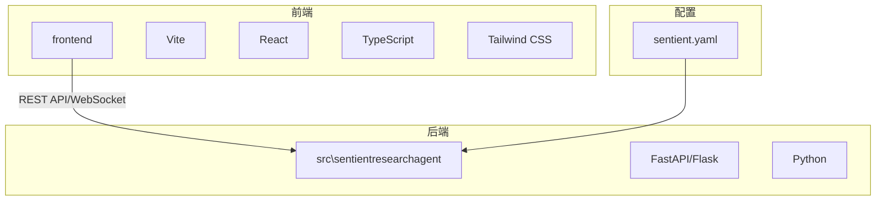
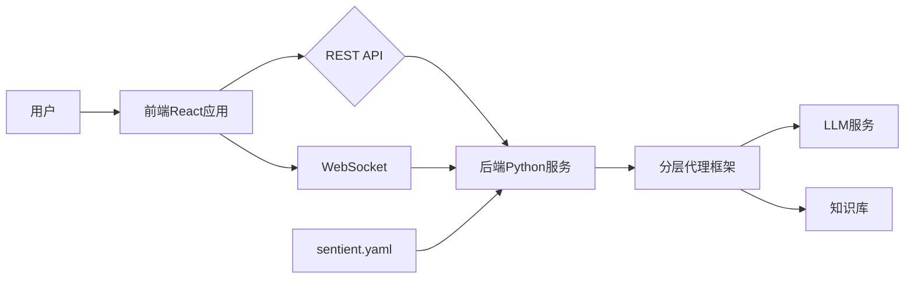
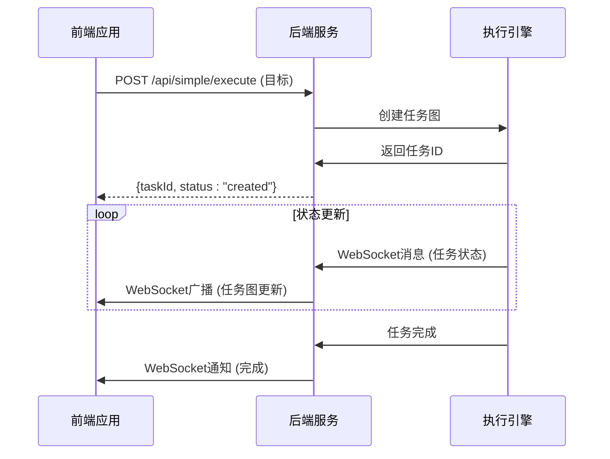
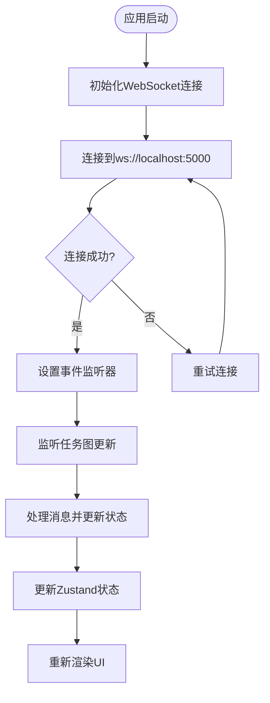
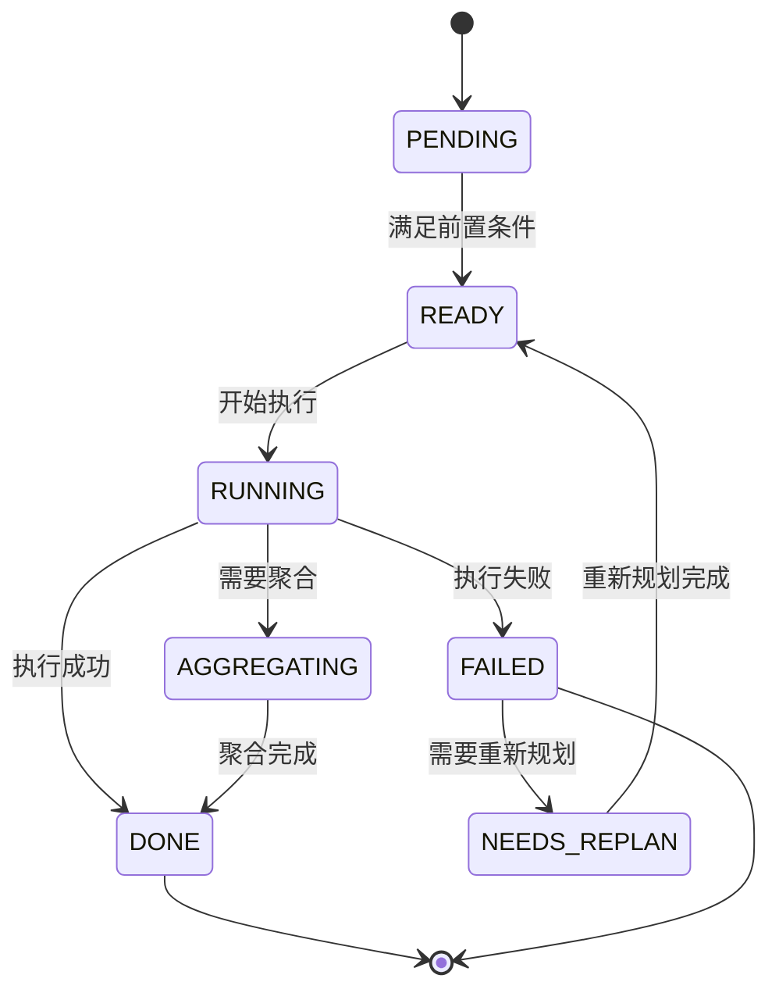
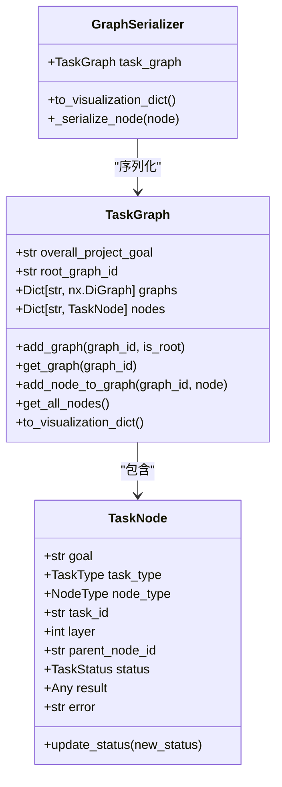
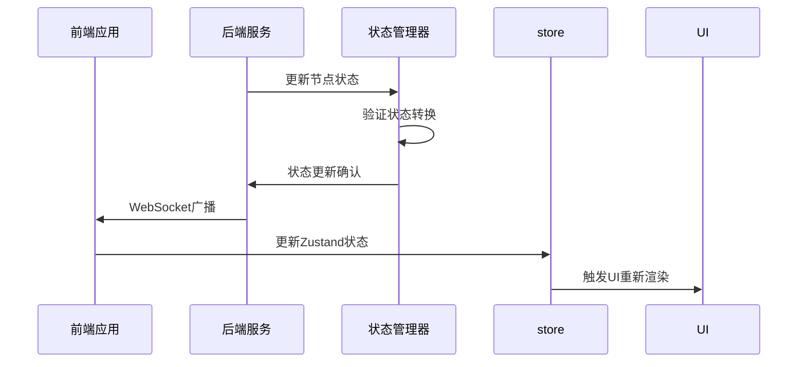
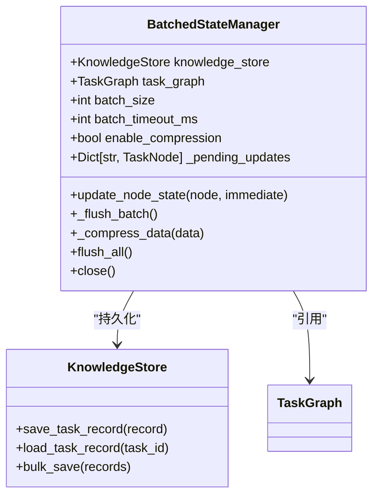
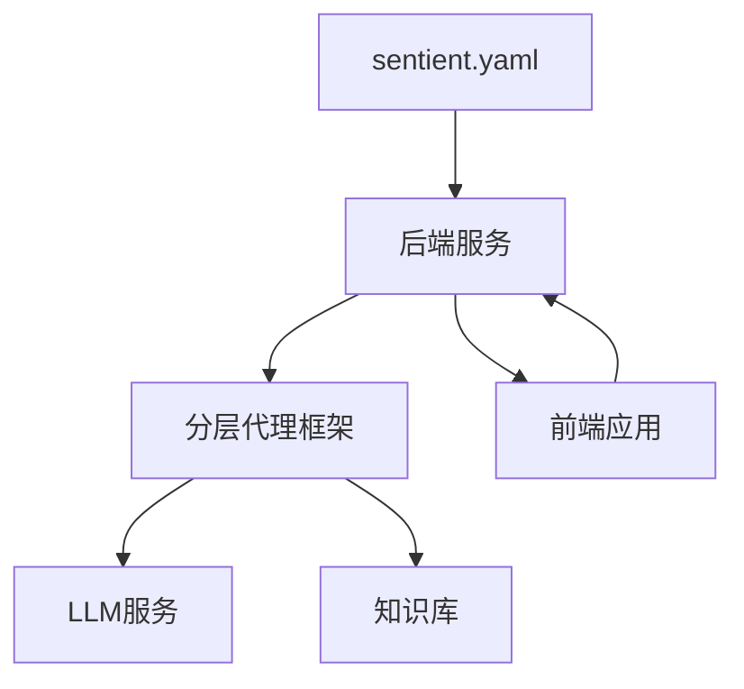

# 系统架构

<cite>
**本文档引用的文件**
- [sentient.yaml](file://sentient.yaml)
- [vite.config.ts](file://frontend/vite.config.ts)
- [main.py](file://src/sentientresearchagent/server/main.py)
- [app.py](file://src/sentientresearchagent/server/app.py)
- [websocketService.ts](file://frontend/src/services/websocketService.ts)
- [main.tsx](file://frontend/src/main.tsx)
- [taskGraphStore.ts](file://frontend/src/stores/taskGraphStore.ts)
- [state_manager.py](file://src/sentientresearchagent/hierarchical_agent_framework/graph/state_manager.py)
- [batched_state_manager.py](file://src/sentientresearchagent/hierarchical_agent_framework/orchestration/batched_state_manager.py)
- [task_graph.py](file://src/sentientresearchagent/hierarchical_agent_framework/graph/task_graph.py)
- [graph_serializer.py](file://src/sentientresearchagent/hierarchical_agent_framework/graph/graph_serializer.py)
- [TaskNode.tsx](file://frontend/src/components/graph/TaskNode.tsx)
- [GraphVisualization.tsx](file://frontend/src/components/graph/GraphVisualization.tsx)
</cite>

## 目录
1. [简介](#简介)
2. [项目结构](#项目结构)
3. [核心组件](#核心组件)
4. [架构概述](#架构概述)
5. [详细组件分析](#详细组件分析)
6. [依赖分析](#依赖分析)
7. [性能考量](#性能考量)
8. [故障排除指南](#故障排除指南)
9. [结论](#结论)

## 简介
ROMA系统采用全栈分层设计，以前端React应用与后端Python服务分离的架构为核心。前端基于Vite + TypeScript + Tailwind CSS构建，后端采用FastAPI/Flask框架，两者通过REST API和WebSocket进行实时通信。系统的核心是分层代理框架（hierarchical_agent_framework），支持递归任务分解、并行执行调度与结果聚合。配置文件（sentient.yaml）控制LLM提供商、缓存策略和执行并发度等全局行为。前端状态管理（Zustand）与后端状态机（state_manager.py）协同工作，实现从用户输入到任务图生成再到结果返回的完整数据流。

## 项目结构
项目结构清晰地分为前端、后端和配置文件三个主要部分。前端位于`frontend`目录，使用现代Web技术栈构建。后端位于`src\sentientresearchagent`目录，采用Python编写。配置文件如`sentient.yaml`位于根目录，用于控制系统行为。

**图表来源**
- [sentient.yaml](file://sentient.yaml)
- [vite.config.ts](file://frontend/vite.config.ts)

**本节来源**
- [sentient.yaml](file://sentient.yaml)
- [frontend](file://frontend)
- [src\sentientresearchagent](file://src/sentientresearchagent)

## 核心组件
系统的核心组件包括前端应用、后端服务器、分层代理框架和配置管理系统。前端负责用户交互和可视化，后端处理业务逻辑和API服务，分层代理框架实现智能任务处理，配置文件控制系统行为。

**本节来源**
- [sentient.yaml](file://sentient.yaml)
- [main.py](file://src/sentientresearchagent/server/main.py)
- [app.py](file://src/sentientresearchagent/server/app.py)

## 架构概述
ROMA系统采用前后端分离的微服务架构。前端通过Vite构建，使用React进行UI渲染，TypeScript提供类型安全，Tailwind CSS实现现代化样式。后端使用Flask框架创建RESTful API和WebSocket服务，处理来自前端的请求。系统通过`sentient.yaml`配置文件集中管理LLM提供商、缓存策略、执行并发度等关键参数。

**图表来源**
- [sentient.yaml](file://sentient.yaml)
- [main.py](file://src/sentientresearchagent/server/main.py)
- [app.py](file://src/sentientresearchagent/server/app.py)

## 详细组件分析

### 前后端通信机制分析
系统通过REST API和WebSocket两种方式实现前后端通信。REST API用于常规的HTTP请求，而WebSocket提供实时双向通信能力，确保任务状态的即时更新。

#### API通信流程

**图表来源**
- [main.py](file://src/sentientresearchagent/server/main.py)
- [websocketService.ts](file://frontend/src/services/websocketService.ts)

#### WebSocket连接管理

**图表来源**
- [main.tsx](file://frontend/src/main.tsx)
- [websocketService.ts](file://frontend/src/services/websocketService.ts)
- [taskGraphStore.ts](file://frontend/src/stores/taskGraphStore.ts)

**本节来源**
- [main.py](file://src/sentientresearchagent/server/main.py)
- [app.py](file://src/sentientresearchagent/server/app.py)
- [websocketService.ts](file://frontend/src/services/websocketService.ts)
- [main.tsx](file://frontend/src/main.tsx)

### 分层代理框架分析
分层代理框架是系统的核心智能引擎，负责任务的递归分解、并行执行和结果聚合。

#### 任务状态机

**图表来源**
- [state_manager.py](file://src/sentientresearchagent/hierarchical_agent_framework/graph/state_manager.py)
- [task_node.py](file://src/sentientresearchagent/hierarchical_agent_framework/node/task_node.py)

#### 任务图序列化

**图表来源**
- [task_graph.py](file://src/sentientresearchagent/hierarchical_agent_framework/graph/task_graph.py)
- [graph_serializer.py](file://src/sentientresearchagent/hierarchical_agent_framework/graph/graph_serializer.py)
- [task_node.py](file://src/sentientresearchagent/hierarchical_agent_framework/node/task_node.py)

**本节来源**
- [state_manager.py](file://src/sentientresearchagent/hierarchical_agent_framework/graph/state_manager.py)
- [task_graph.py](file://src/sentientresearchagent/hierarchical_agent_framework/graph/task_graph.py)
- [graph_serializer.py](file://src/sentientresearchagent/hierarchical_agent_framework/graph/graph_serializer.py)

### 状态管理协同分析
前端Zustand状态管理与后端状态机协同工作，确保系统状态的一致性。

#### 状态同步流程

**图表来源**
- [state_manager.py](file://src/sentientresearchagent/hierarchical_agent_framework/graph/state_manager.py)
- [taskGraphStore.ts](file://frontend/src/stores/taskGraphStore.ts)
- [websocketService.ts](file://frontend/src/services/websocketService.ts)

#### 批量状态管理

**图表来源**
- [batched_state_manager.py](file://src/sentientresearchagent/hierarchical_agent_framework/orchestration/batched_state_manager.py)
- [knowledge_store.py](file://src/sentientresearchagent/hierarchical_agent_framework/context/knowledge_store.py)

**本节来源**
- [state_manager.py](file://src/sentientresearchagent/hierarchical_agent_framework/graph/state_manager.py)
- [batched_state_manager.py](file://src/sentientresearchagent/hierarchical_agent_framework/orchestration/batched_state_manager.py)
- [taskGraphStore.ts](file://frontend/src/stores/taskGraphStore.ts)

### 配置系统分析
`sentient.yaml`配置文件控制系统的关键行为，包括LLM提供商、缓存策略和执行参数。

#### 配置项说明
| 配置项 | 描述 | 默认值 |
|-------|------|-------|
| llm.provider | LLM提供商 | openrouter |
| llm.api_key | API密钥 | your-openrouter-key |
| cache.enabled | 缓存是否启用 | true |
| execution.max_concurrent_nodes | 最大并发节点数 | 10 |
| execution.max_parallel_nodes | 最大并行节点数 | 8 |
| logging.level | 日志级别 | INFO |

**图表来源**
- [sentient.yaml](file://sentient.yaml)

**本节来源**
- [sentient.yaml](file://sentient.yaml)

## 依赖分析
系统各组件之间的依赖关系清晰，前端依赖后端API，后端依赖配置文件和外部服务。

**图表来源**
- [sentient.yaml](file://sentient.yaml)
- [package.json](file://frontend/package.json)
- [pyproject.toml](file://pyproject.toml)

**本节来源**
- [sentient.yaml](file://sentient.yaml)
- [package.json](file://frontend/package.json)
- [pyproject.toml](file://pyproject.toml)

## 性能考量
系统在设计时考虑了多项性能优化措施。配置文件中的`execution.state_batch_size`和`execution.ws_batch_timeout_ms`参数优化了状态更新和WebSocket消息的批量处理。前端使用Zustand进行高效的状态管理，避免不必要的重新渲染。后端的批处理状态管理器减少了I/O操作次数，提高了整体性能。

## 故障排除指南
当系统出现问题时，可以按照以下步骤进行排查：
1. 检查`sentient.yaml`配置文件是否正确
2. 确认前端与后端的连接状态
3. 查看日志文件中的错误信息
4. 验证LLM API密钥的有效性
5. 检查网络连接和防火墙设置

**本节来源**
- [logging](file://sentient.yaml#L100-L116)
- [websocketService.ts](file://frontend/src/services/websocketService.ts)

## 结论
ROMA系统采用先进的全栈分层架构，通过前后端分离、分层代理框架和集中式配置管理，实现了高度智能化的任务处理能力。系统的模块化设计使得各个组件可以独立开发和维护，同时通过标准化的接口进行通信。这种架构不仅提高了系统的可扩展性和可维护性，还为未来的功能扩展提供了坚实的基础。