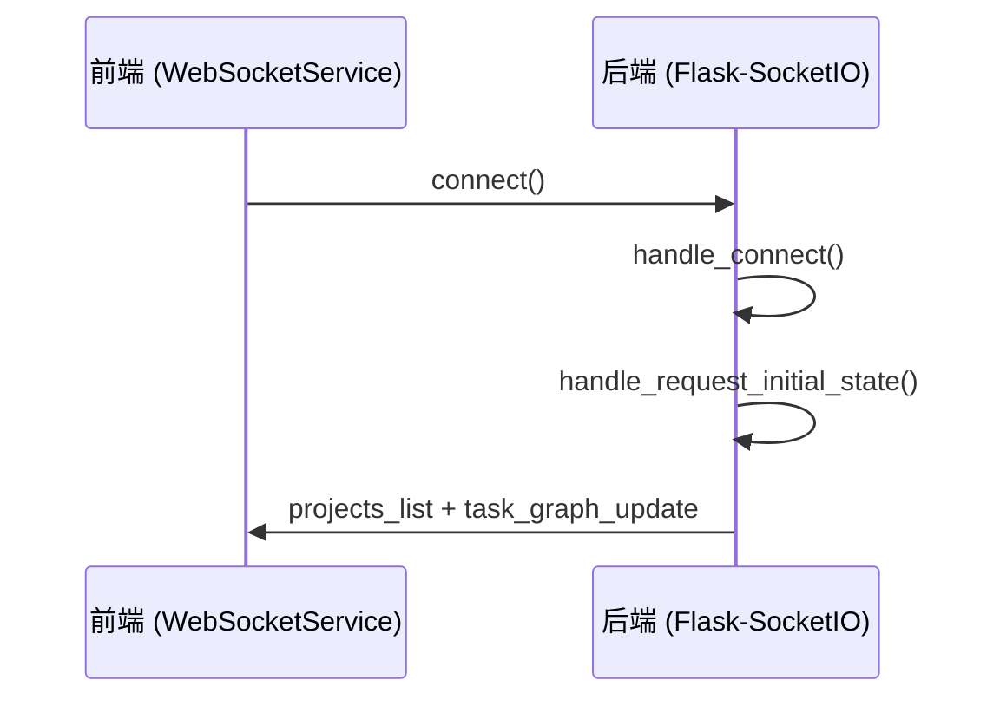
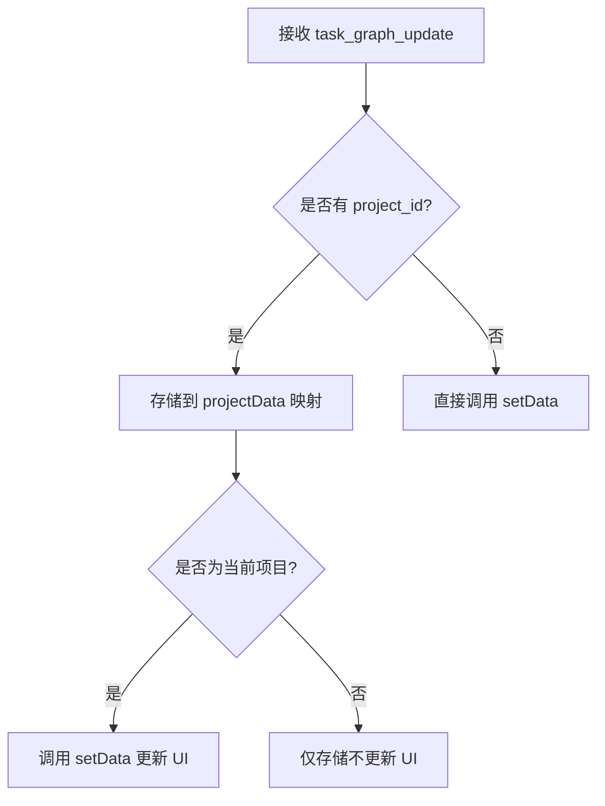
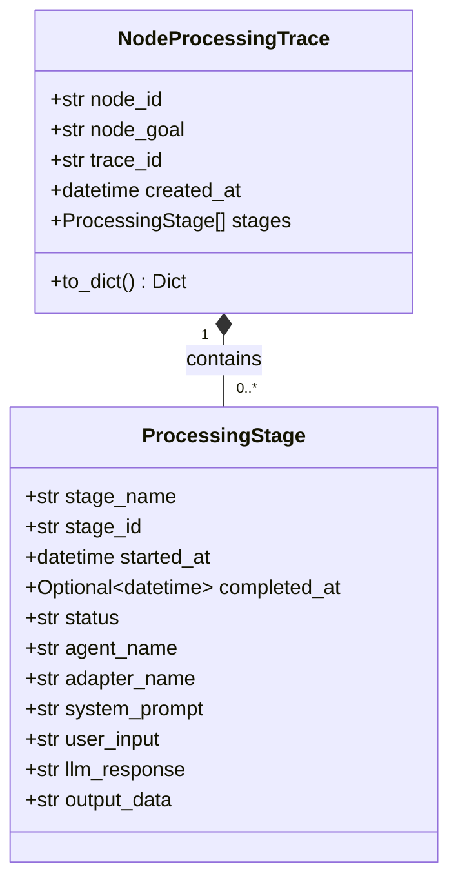

# 通信机制

<cite>
**本文档引用的文件**  
- [events.py](file://src\sentientresearchagent\server\websocket\events.py)
- [websocketService.ts](file://frontend\src\services\websocketService.ts)
- [TaskGraphContext.tsx](file://frontend\src\contexts\TaskGraphContext.tsx)
- [manager.py](file://src\sentientresearchagent\hierarchical_agent_framework\tracing\manager.py)
- [project_service.py](file://src\sentientresearchagent\server\services\project_service.py)
- [execution_service.py](file://src\sentientresearchagent\server\services\execution_service.py)
</cite>

## 目录
1. [引言](#引言)
2. [WebSocket连接建立过程](#websocket连接建立过程)
3. [消息格式与事件类型](#消息格式与事件类型)
4. [前端订阅与状态同步机制](#前端订阅与状态同步机制)
5. [API轮询与WebSocket推送协同机制](#api轮询与websocket推送协同机制)
6. [跟踪管理器与决策追溯](#跟踪管理器与决策追溯)
7. [连接稳定性优化建议](#连接稳定性优化建议)
8. [错误重连策略](#错误重连策略)
9. [消息压缩技术](#消息压缩技术)

## 引言
ROMA系统采用WebSocket协议实现前后端之间的实时数据交换，确保用户界面能够即时反映代理系统的执行状态。该通信机制支持任务更新、节点执行、人工干预请求（HITL）等多种事件类型的实时推送，并通过与API轮询机制的协同工作，构建了高可靠性的状态同步体系。本文档详细阐述了WebSocket连接的建立、消息格式定义、前端状态同步逻辑以及跟踪管理器如何利用通信通道记录代理决策链路。

## WebSocket连接建立过程
当客户端启动时，`WebSocketManager`会初始化连接流程。前端通过`webSocketService.connect()`方法发起连接请求，使用`socket.io-client`库建立与后端的WebSocket连接。连接配置包括传输方式为`polling`、超时时间为20秒，并禁用自动重连以实现自定义重连策略。

后端在`events.py`中通过`register_websocket_events`函数注册事件处理器。当收到`connect`事件时，服务器记录连接日志并调用`handle_request_initial_state`发送初始状态，包括项目列表和当前项目的图结构数据。若无当前项目，则触发广播空图结构。



**Diagram sources**
- [websocketService.ts](file://frontend\src\services\websocketService.ts#L10-L50)
- [events.py](file://src\sentientresearchagent\server\websocket\events.py#L20-L40)

**Section sources**
- [websocketService.ts](file://frontend\src\services\websocketService.ts#L1-L100)
- [events.py](file://src\sentientresearchagent\server\websocket\events.py#L1-L50)

## 消息格式与事件类型
系统定义了多种标准化的消息事件类型，用于传递不同类型的实时更新：

| 事件类型 | 描述 | 数据结构 |
|---------|------|--------|
| `task_graph_update` | 任务图更新 | 包含all_nodes, graphs, overall_project_goal等字段 |
| `hitl_request` | 人工干预请求 | 包含request_id, checkpoint_name, node_id, context_message等 |
| `project_started` | 项目启动确认 | 包含project信息和message |
| `node_trace_data` | 节点处理轨迹数据 | 包含trace对象和stages数组 |
| `error` | 错误通知 | 包含message字段 |

其中，`hitl_request`事件用于通知前端需要人工介入的关键决策点，携带检查点名称、上下文消息和节点ID等信息。`node_trace_data`则用于调试模式下展示单个节点的完整处理链路，包含原子化、规划、执行等阶段的详细信息。

**Section sources**
- [events.py](file://src\sentientresearchagent\server\websocket\events.py#L100-L300)
- [websocketService.ts](file://frontend\src\services\websocketService.ts#L200-L400)

## 前端订阅与状态同步机制
前端通过`websocketService.ts`中的事件监听器订阅后端流式响应。核心是`task_graph_update`事件的处理逻辑，该逻辑实现了项目感知的状态更新机制。

当接收到`task_graph_update`消息时，服务首先验证消息中的`project_id`，然后将其存储在`taskGraphStore`的`projectData`映射中。如果该`project_id`与当前显示的项目匹配，则调用`setData`方法更新UI状态。这种设计确保了多项目环境下的状态隔离。



**Diagram sources**
- [websocketService.ts](file://frontend\src\services\websocketService.ts#L150-L250)

**Section sources**
- [websocketService.ts](file://frontend\src\services\websocketService.ts#L100-L300)
- [TaskGraphContext.tsx](file://frontend\src\contexts\TaskGraphContext.tsx#L1-L15)

## API轮询与WebSocket推送协同机制
系统采用WebSocket推送为主、API轮询为辅的混合机制来保证状态同步的可靠性。正常情况下，所有状态变更都通过WebSocket实时推送给前端。

但在网络中断或连接不稳定的情况下，前端会启动API轮询作为降级方案。`checkSystemReadiness`方法定期向后端发送健康检查请求，验证服务可用性。一旦检测到WebSocket连接恢复，立即停止轮询并重新依赖实时推送。

此外，在页面加载或连接恢复时，前端会主动请求`request_initial_state`获取最新状态，确保与服务器状态一致。对于关键操作如项目切换，系统同时使用WebSocket事件和API调用来双重保障状态同步。

**Section sources**
- [websocketService.ts](file://frontend\src\services\websocketService.ts#L500-L600)
- [events.py](file://src\sentientresearchagent\server\websocket\events.py#L200-L250)

## 跟踪管理器与决策追溯
`tracing/manager.py`中的`TraceManager`类负责记录代理决策的完整链路。每当一个节点进入新的处理阶段（如原子化、规划、执行），跟踪管理器就会创建相应的`ProcessingStage`并记录时间戳、输入输出等元数据。

这些跟踪数据通过WebSocket通道实时推送给前端。当用户在UI中请求查看某个节点的处理轨迹时，前端发送`request_node_trace`事件，后端的`handle_request_node_trace`处理器会从内存或磁盘加载对应的`NodeProcessingTrace`对象，并通过`node_trace_data`事件返回给前端。



**Diagram sources**
- [manager.py](file://src\sentientresearchagent\hierarchical_agent_framework\tracing\manager.py#L10-L50)

**Section sources**
- [manager.py](file://src\sentientresearchagent\hierarchical_agent_framework\tracing\manager.py#L1-L100)
- [events.py](file://src\sentientresearchagent\server\websocket\events.py#L600-L700)

## 连接稳定性优化建议
为提高WebSocket连接的稳定性，建议实施以下优化措施：

1. **心跳机制**：配置合理的ping/pong间隔，防止连接被中间代理超时断开。
2. **连接池管理**：复用WebSocket连接，避免频繁创建销毁带来的开销。
3. **流量控制**：对高频事件进行节流或批量发送，防止消息洪泛。
4. **连接状态监控**：实时监测连接质量指标，如延迟、丢包率等。

后端已通过`RealtimeExecutionWrapper`实现周期性更新，将更新间隔缩短至500毫秒，提高了状态同步的响应速度。

**Section sources**
- [execution_service.py](file://src\sentientresearchagent\server\services\execution_service.py#L50-L100)
- [websocketService.ts](file://frontend\src\services\websocketService.ts#L300-L350)

## 错误重连策略
系统实现了智能的错误重连策略，包含指数退避和随机抖动机制：

```typescript
private handleReconnect() {
    if (this.reconnectAttempts >= this.maxReconnectAttempts) {
        return;
    }

    this.reconnectAttempts++;
    const baseDelay = Math.min(1000 * Math.pow(1.5, this.reconnectAttempts - 1), 30000);
    const jitter = Math.random() * 0.3 * baseDelay;
    const delay = Math.floor(baseDelay + jitter);
    
    this.reconnectTimer = setTimeout(() => {
        this.connect();
    }, delay);
}
```

此策略从1秒开始，每次重试间隔乘以1.5倍，最大不超过30秒，同时加入0-30%的随机抖动避免雪崩效应。最多尝试10次后停止自动重连。

**Section sources**
- [websocketService.ts](file://frontend\src\services\websocketService.ts#L400-L450)

## 消息压缩技术
虽然当前实现未启用消息压缩，但可考虑以下优化方案：

1. **JSON压缩**：使用更紧凑的数据格式如MessagePack替代JSON。
2. **增量更新**：只发送变化的部分而非完整状态。
3. **二进制传输**：对大数据量的执行结果采用二进制编码。
4. **Gzip压缩**：在传输层启用gzip压缩。

特别是对于`full_result`等大文本字段，建议实施按需加载策略，仅在用户查看具体节点时才请求完整结果，减少不必要的数据传输。

**Section sources**
- [websocketService.ts](file://frontend\src\services\websocketService.ts#L700-L750)
- [project_service.py](file://src\sentientresearchagent\server\services\project_service.py#L500-L550)