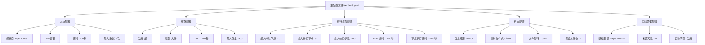
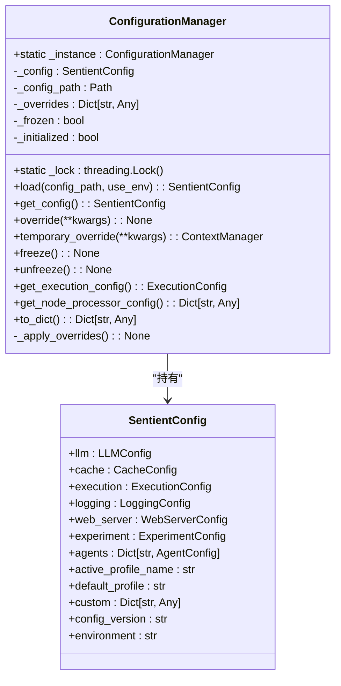
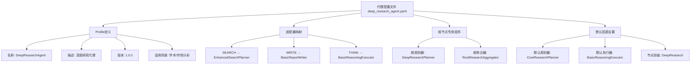
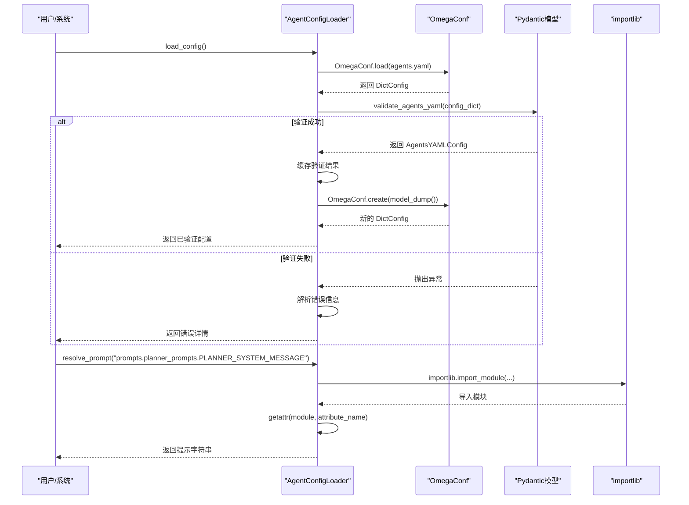

# 配置管理

<cite>
**本文档中引用的文件**  
- [sentient.yaml](file://sentient.yaml)
- [unified_config.py](file://src/sentientresearchagent/config/unified_config.py)
- [config_loader.py](file://src/sentientresearchagent/hierarchical_agent_framework/agent_configs/config_loader.py)
- [config.py](file://src/sentientresearchagent/config/config.py)
- [paths.py](file://src/sentientresearchagent/config/paths.py)
- [deep_research_agent.yaml](file://src/sentientresearchagent/hierarchical_agent_framework/agent_configs/profiles/deep_research_agent.yaml)
</cite>

## 目录
1. [引言](#引言)
2. [主配置文件结构](#主配置文件结构)
3. [统一配置管理器](#统一配置管理器)
4. [代理配置文件](#代理配置文件)
5. [配置加载机制](#配置加载机制)
6. [最佳实践](#最佳实践)

## 引言
ROMA系统采用多层次配置体系，通过集中化与模块化相结合的方式实现灵活而可靠的配置管理。该体系以`sentient.yaml`为主配置文件，定义全局参数；通过`unified_config.py`提供统一访问接口；利用YAML格式的代理配置文件定制特定行为；并由`config_loader.py`负责配置的加载、验证与合并。这种设计既保证了配置的一致性，又支持运行时动态调整和环境差异化部署。

**Section sources**
- [sentient.yaml](file://sentient.yaml#L1-L116)
- [unified_config.py](file://src/sentientresearchagent/config/unified_config.py#L1-L248)

## 主配置文件结构
`sentient.yaml`是系统的主配置文件，位于项目根目录，包含LLM提供商设置、缓存策略、执行框架参数、日志级别等全局配置项。其核心部分包括：

- **LLM基础设施**：指定使用OpenRouter作为提供商，配置API密钥、超时时间和重试次数。
- **缓存系统**：启用基于文件的缓存，TTL为7200秒（2小时），最大容量500条记录。
- **执行框架**：定义并发节点数、并行处理限制、最大执行步骤、速率限制及HITL（人机协作）相关超时阈值。
- **日志配置**：设定日志级别为INFO，启用控制台和文件输出，采用按大小轮转策略（每10MB轮转一次，保留3个文件）。
- **实验管理**：配置实验数据存储路径、结果保留天数（30天）及自动清理机制。

该文件还引入了增强型超时策略，包含警告阈值（60秒）、软超时（180秒）和硬超时（300秒），并支持激进恢复模式以应对死锁情况。

**Diagram sources**
- [sentient.yaml](file://sentient.yaml#L1-L116)

**Section sources**
- [sentient.yaml](file://sentient.yaml#L1-L116)

## 统一配置管理器
`unified_config.py`实现了单例模式的`ConfigurationManager`类，作为整个系统的唯一配置源。它确保所有组件看到一致的配置状态，并提供以下功能：

- **单一实例**：通过双重检查锁定实现线程安全的单例模式。
- **配置加载**：从文件或环境变量加载配置，支持覆盖机制。
- **运行时修改**：允许在运行时应用配置覆盖，影响所有依赖组件。
- **临时覆盖**：提供上下文管理器`temporary_override`，用于临时更改配置而不影响全局状态。
- **冻结机制**：可通过`freeze()`方法锁定配置，防止执行期间被意外修改。

该管理器还封装了便捷函数如`get_config()`和`override_config()`，简化了配置访问。其内部维护一个`_overrides`字典，支持点号分隔的嵌套路径（如"execution.skip_atomization"）进行精确覆盖。

**Diagram sources**
- [unified_config.py](file://src/sentientresearchagent/config/unified_config.py#L16-L215)
- [config.py](file://src/sentientresearchagent/config/config.py#L649-L675)

**Section sources**
- [unified_config.py](file://src/sentientresearchagent/config/unified_config.py#L1-L248)

## 代理配置文件
代理配置文件（如`deep_research_agent.yaml`）位于`src/sentientresearchagent/hierarchical_agent_framework/agent_configs/profiles/`目录下，用于定义特定研究场景的行为特征。这些文件通过YAML格式声明代理的角色分工、工具集和提示模板。

以`deep_research_agent.yaml`为例，其结构包括：
- **profile元数据**：名称、描述、版本和推荐用途（学术研究、市场分析等）。
- **适配器映射**：为不同任务类型（SEARCH, WRITE, THINK）指定专用的规划者、执行器和聚合器适配器。
- **根节点特殊处理**：定义独立的根节点规划器（`DeepResearchPlanner`）和聚合器（`RootResearchAggregator`），确保复杂查询得到充分分解与综合。
- **默认回退机制**：设置默认的规划器、执行器和节点代理前缀，保障未明确指定任务类型的兼容性。

此类配置文件支持细粒度的行为定制，使系统能根据不同研究需求动态选择最优策略组合。

**Diagram sources**
- [deep_research_agent.yaml](file://src/sentientresearchagent/hierarchical_agent_framework/agent_configs/profiles/deep_research_agent.yaml#L1-L51)

**Section sources**
- [deep_research_agent.yaml](file://src/sentientresearchagent/hierarchical_agent_framework/agent_configs/profiles/deep_research_agent.yaml#L1-L51)

## 配置加载机制
`config_loader.py`负责加载、验证和合并代理配置。其核心流程如下：

1. **初始化**：构造`AgentConfigLoader`实例时指定配置目录，默认为当前文件所在路径。
2. **加载YAML**：读取`agents.yaml`主配置文件，使用OmegaConf解析为`DictConfig`对象。
3. **Pydantic验证**：将配置转换为Python字典后，通过`validate_agents_yaml`函数进行结构化验证，确保字段类型正确且无重复代理名。
4. **提示解析**：支持从模块中动态导入提示字符串（如`prompts.planner_prompts.PLANNER_SYSTEM_MESSAGE`），并在验证阶段检查其有效性。
5. **缓存机制**：成功验证后的配置会被缓存，避免重复解析开销。
6. **错误报告**：收集并返回详细的验证错误列表，便于调试配置问题。

此机制确保了配置的类型安全性与一致性，同时提供了清晰的反馈机制。

**Diagram sources**
- [config_loader.py](file://src/sentientresearchagent/hierarchical_agent_framework/agent_configs/config_loader.py#L1-L259)

**Section sources**
- [config_loader.py](file://src/sentientresearchagent/hierarchical_agent_framework/agent_configs/config_loader.py#L1-L259)

## 最佳实践
为确保ROMA系统的稳定运行与高效维护，建议遵循以下配置管理最佳实践：

### 配置版本控制
- 将`sentient.yaml`纳入版本控制系统（如Git），但排除敏感信息（如API密钥）。
- 使用`.env`文件或环境变量存储机密数据，并在`docker-compose.yml`中引用。
- 对代理配置文件建立独立分支或标签，便于回溯历史变更。

### 环境差异化部署
- 利用环境变量覆盖机制实现多环境适配。例如，在生产环境中设置`SENTIENT_LOG_LEVEL=WARNING`降低日志量。
- 通过`config.merge_with()`方法合并基础配置与环境专属配置，保持配置逻辑清晰。
- 在CI/CD流水线中预生成环境特定的配置包，减少部署时的不确定性。

### 安全敏感信息保护
- **绝不**在YAML文件中明文存储API密钥，应通过`os.getenv()`从环境变量读取。
- 使用`validate_api_keys()`方法在启动时检查必要密钥是否存在，及时发现配置遗漏。
- 对于开发环境，可使用占位符并配合`logger.warning`提醒用户替换。
- 考虑集成密钥管理服务（如Hashicorp Vault）以实现更高级别的安全保障。

### 运行时动态调整
- 利用`ConfigurationManager`的`temporary_override`上下文管理器，在特定任务中临时启用调试模式或放宽超时限制。
- 结合前端界面暴露关键配置项（如`max_concurrent_nodes`），允许管理员实时调优。
- 冻结配置（`freeze()`）应在任务启动前完成，防止执行过程中发生意外变更。

**Section sources**
- [config.py](file://src/sentientresearchagent/config/config.py#L649-L675)
- [unified_config.py](file://src/sentientresearchagent/config/unified_config.py#L1-L248)
- [sentient.yaml](file://sentient.yaml#L1-L116)