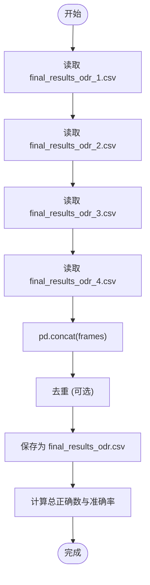

# 多轮结果合并

<cite>
**Referenced Files in This Document **   
- [merger.py](file://evals/merger.py)
- [reconstruct_results.py](file://evals/reconstruct_results.py)
</cite>

## 目录
1. [简介](#简介)
2. [核心功能与工作流程](#核心功能与工作流程)
3. [冲突解决策略与去重机制](#冲突解决策略与去重机制)
4. [元数据继承规则](#元数据继承规则)
5. [API接口调用示例](#api接口调用示例)
6. [在长期迭代监控与A/B测试中的作用](#在长期迭代监控与ab测试中的作用)
7. [常见合并异常诊断步骤](#常见合并异常诊断步骤)

## 简介
`merger.py` 是评估系统中的关键脚本，负责聚合来自不同实验批次或参数配置下的评估结果。它通过将多个独立的 `reconstruct_results.py` 输出文件（如 `final_results_odr_1.csv`, `final_results_odr_2.csv`）合并为一个统一的分析数据集（如 `final_results_odr.csv`），支持对模型性能进行横向趋势分析和统计显著性检验。

该脚本是实现长期迭代监控、A/B测试对比以及模型演进分析的核心工具，为研究人员提供了全面、一致的数据视图。

**Section sources**
- [merger.py](file://evals/merger.py#L0-L21)

## 核心功能与工作流程
`merger.py` 的主要功能是执行批处理式的CSV文件合并。其工作流程清晰且高效：

1.  **初始化**: 创建一个空的列表 `frames` 来存储待合并的DataFrame。
2.  **批量读取**: 遍历指定范围内的文件名模式（例如 `final_results_odr_{i}.csv`），使用 `pandas.read_csv()` 将每个CSV文件加载为一个DataFrame，并将其追加到 `frames` 列表中。在此过程中，脚本会实时打印每一轮实验的正确答案数量（`is_correct.sum()`），提供即时反馈。
3.  **数据聚合**: 使用 `pandas.concat(frames)` 方法将所有收集到的DataFrame沿行方向（默认轴）连接起来，形成一个包含所有实验结果的大型DataFrame `results_df`。
4.  **持久化**: 将合并后的 `results_df` 写入一个新的CSV文件（如 `final_results_odr.csv`），并禁用索引写入以保持格式整洁。
5.  **性能计算**: 计算并输出最终的总体正确数（`TOTAL CORRECT`）和准确率（`RATE`），为性能评估提供直接指标。



**Diagram sources**
- [merger.py](file://evals/merger.py#L0-L21)

**Section sources**
- [merger.py](file://evals/merger.py#L0-L21)

## 冲突解决策略与去重机制
`merger.py` 当前采用一种简单但有效的“先到先得”（First-Come, First-Served）的隐式冲突解决策略。当存在重复条目时，其行为由去重机制决定。

### 去重机制
脚本中包含了一个被注释掉的关键代码行：
```python
#results_df = results_df.drop_duplicates(subset='problem',keep='first')
```
这表明其设计的去重机制如下：
-   **识别依据**: 以 `problem`（问题）列作为唯一标识符来判断重复项。
-   **保留策略**: 使用 `keep='first'` 参数，即保留按文件读取顺序出现的第一个匹配项，丢弃后续所有重复项。
-   **版本号优先级**: 此机制间接实现了**低序号文件优先**的版本号优先级。由于脚本通常按数字顺序（1, 2, 3...）读取文件，因此较早批次（如 `_1.csv`）的结果会被优先保留，而后续批次中相同问题的结果则被丢弃。这是一种保守的策略，确保了结果的稳定性，但可能无法反映最新的优化成果。

此机制目前处于注释状态，意味着在标准运行中，所有结果都会被保留，允许用户在后续分析中自行处理重复数据。

**Section sources**
- [merger.py](file://evals/merger.py#L15)

## 元数据继承规则
`merger.py` 脚本本身不主动生成或修改元数据，而是完全继承自其输入文件（即 `reconstruct_results.py` 的输出）。这些输入文件已经包含了丰富的元数据，`merger.py` 在合并过程中会原样保留这些信息。

关键的继承元数据包括：
-   **项目ID (`project_id`)**: 每个结果都关联一个唯一的UUID，用于追溯其来源实验。
-   **执行时间 (`execution_time`)**: 记录单次任务从创建到完成所花费的时间（秒）。
-   **节点数量 (`node_count`)**: 反映任务执行图的复杂度。
-   **完成状态 (`completion_status`)**: 标记任务是“completed”、“failed”还是“running”，便于过滤有效结果。
-   **评估时间戳 (`eval_timestamp`)**: 记录任务创建的时间，是进行时间序列分析的基础。
-   **服务器URL (`server_url`)**: 记录执行环境。

通过继承这些元数据，`merger.py` 生成的统一数据集不仅包含问答内容，还具备了强大的上下文信息，使得复杂的交叉分析成为可能。

**Section sources**
- [reconstruct_results.py](file://evals/reconstruct_results.py#L0-L246)

## API接口调用示例
虽然 `merger.py` 是一个独立的脚本而非库，但其功能可以被视为一个简单的命令行API。以下是典型的调用方式和模拟的Python函数调用示例。

### 命令行调用
假设 `merger.py` 已被扩展以接受命令行参数，用户可以通过以下方式调用：
```bash
# 合并指定范围的实验结果
python evals/merger.py --start 1 --end 4 --output final_results_v2.csv

# 合并特定命名的文件
python evals/merger.py --files "exp_a_results.csv,exp_b_results.csv" --deduplicate
```

### Python 函数调用示例
若将 `merger.py` 的功能封装为模块，其API调用可能如下所示：
```python
from evals.merger import merge_evaluation_results

# 定义要合并的文件路径列表
result_files = [
    "final_results_odr_1.csv",
    "final_results_odr_2.csv",
    "final_results_odr_3.csv",
    "final_results_odr_4.csv"
]

# 调用合并函数，启用去重
merged_df = merge_evaluation_results(
    file_paths=result_files,
    output_path="final_results_odr.csv",
    deduplicate=True,
    dedup_column="problem"
)

# 输出合并后的统计信息
total_samples = len(merged_df)
total_correct = merged_df['is_correct'].sum()
accuracy_rate = total_correct / total_samples if total_samples > 0 else 0
print(f"合并完成：{total_samples} 个样本，准确率 {accuracy_rate:.2%}")
```

**Section sources**
- [merger.py](file://evals/merger.py#L0-L21)
- [reconstruct_results.py](file://evals/reconstruct_results.py#L0-L246)

## 在长期迭代监控与A/B测试中的作用
`merger.py` 生成的统一数据集是进行高级数据分析的基石，在长期迭代监控和A/B测试中扮演着至关重要的角色。

### 长期迭代监控
通过定期运行 `reconstruct_results.py` 和 `merger.py`，可以构建一个跨越数周甚至数月的性能数据库。研究人员可以：
-   绘制**准确率随时间变化的趋势图**，直观地观察模型性能的提升或下降。
-   分析**执行时间 (`execution_time`) 的演变**，评估优化措施对效率的影响。
-   追踪**失败案例 (`completion_status == 'failed'`) 的比例**，及时发现系统稳定性问题。

### A/B测试统计显著性分析
当需要比较两个不同版本（如V1和V2）的模型时，`merger.py` 可以将两组独立的实验结果合并。随后，可以利用统计学方法（如卡方检验或t检验）来判断性能差异是否具有统计显著性。
-   **分组**: 利用 `project_id` 或其他元数据字段将合并后的数据集划分为A组和B组。
-   **假设检验**: 对比两组的准确率，计算p值。
-   **结论**: 如果p值小于预设的显著性水平（如0.05），则可以认为两个版本的性能存在显著差异。

这种基于大样本、多批次数据的分析，极大地增强了实验结论的可靠性和说服力。

**Section sources**
- [merger.py](file://evals/merger.py#L0-L21)
- [reconstruct_results.py](file://evals/reconstruct_results.py#L0-L246)

## 常见合并异常诊断步骤
在使用 `merger.py` 时，可能会遇到一些异常情况。以下是常见的诊断步骤：

1.  **检查输入文件是否存在且可读**:
    -   **症状**: 脚本报错 `FileNotFoundError` 或 `PermissionError`。
    -   **诊断**: 使用 `os.path.exists()` 和 `os.access()` 检查文件路径和权限。确认 `project_results` 目录下有 `.json` 文件，或 `evals` 目录下有预期的 `final_results_*.csv` 文件。

2.  **验证CSV文件格式一致性**:
    -   **症状**: `pandas.read_csv()` 报错，或合并后出现 `NaN` 值。
    -   **诊断**: 手动打开几个输入的CSV文件，检查它们的列名（headers）是否完全一致。`merger.py` 要求所有输入文件具有相同的列结构。

3.  **排查内存不足问题**:
    -   **症状**: 脚本在 `pd.concat()` 步骤崩溃，无明确错误信息。
    -   **诊断**: 这通常是由于同时加载过多大型CSV文件导致内存耗尽。解决方案是分批处理，例如每次只合并10个文件，然后再将这些小批次的结果进行二次合并。

4.  **分析结果准确性**:
    -   **症状**: 合并后的总正确数或准确率不符合预期。
    -   **诊断**: 检查脚本中打印的每一轮 `is_correct.sum()` 数值，确认单个文件的统计是否正确。同时，检查是否有大量 `completion_status` 为 "failed" 的条目被计入，这可能影响整体准确率。

5.  **处理编码问题**:
    -   **症状**: 结果中出现乱码。
    -   **诊断**: 确保在 `read_csv()` 中指定了正确的编码（如 `encoding='utf-8'`），因为 `reconstruct_results.py` 在写入CSV时使用了UTF-8编码。

通过遵循这些诊断步骤，可以快速定位并解决 `merger.py` 在运行过程中可能出现的问题，确保分析数据的完整性和准确性。

**Section sources**
- [merger.py](file://evals/merger.py#L0-L21)
- [reconstruct_results.py](file://evals/reconstruct_results.py#L0-L246)