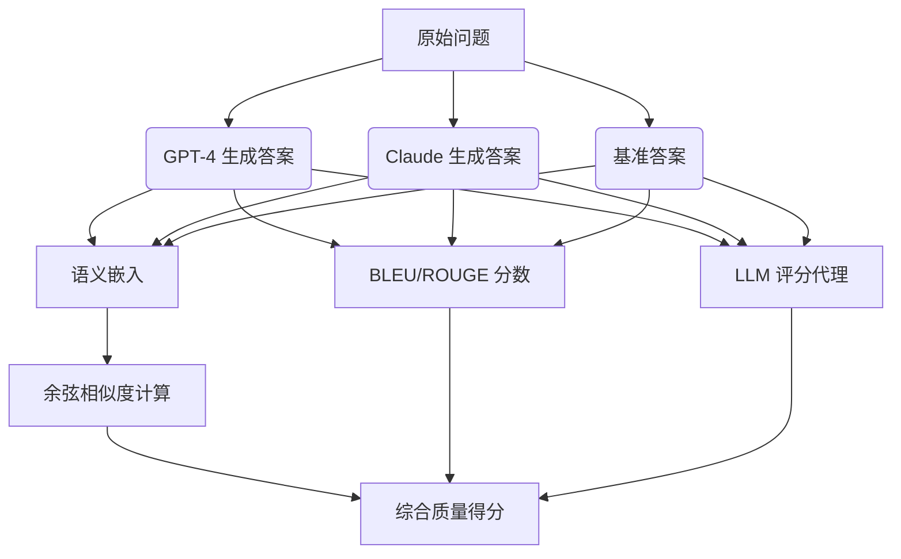
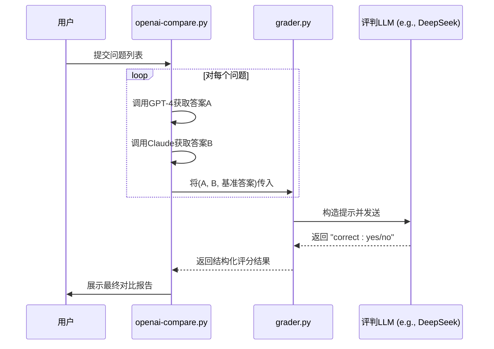

# 模型对比分析

<cite>
**本文档中引用的文件**
- [openai-compare.py](file://evals/openai-compare.py)
- [evaluation.py](file://evals/evaluation.py)
- [grader.py](file://evals/grader.py)
- [grade_answers_simple.py](file://evals/grade_answers_simple.py)
</cite>

## 目录
1. [简介](#简介)
2. [核心评估机制](#核心评估机制)
3. [语义相似度与嵌入计算](#语义相似度与嵌入计算)
4. [BLEU/ROUGE指标集成](#bleurouge指标集成)
5. [人工可读性评分映射](#人工可读性评分映射)
6. [实验配置与调用示例](#实验配置与调用示例)
7. [差异热力图生成](#差异热力图生成)
8. [应用场景](#应用场景)
9. [性能瓶颈与调优建议](#性能瓶颈与调优建议)
10. [结论](#结论)

## 简介
`openai-compare.py` 是一个用于跨大语言模型输出质量量化评估的核心脚本，旨在通过系统化的方法比较不同模型（如GPT-4、Claude等）在相同问题上的响应质量。该工具不仅支持直接的文本对比，还集成了多种评估方法，包括基于语义嵌入的相似度计算、传统自然语言处理指标（BLEU/ROUGE）以及基于大型语言模型的人工可读性评分映射。其设计目标是为模型选型、提示工程优化和一致性验证提供可靠的数据支持。

**Section sources**
- [openai-compare.py](file://evals/openai-compare.py#L1-L55)

## 核心评估机制
该评估框架采用多层评估策略，结合自动化指标与智能判断，确保评估结果的全面性和准确性。主要包含三个层面：基于向量空间的语义相似度分析、基于n-gram匹配的传统指标评估，以及利用高精度LLM进行语义等价性判断的“人工”评分映射。



**Diagram sources**
- [openai-compare.py](file://evals/openai-compare.py#L1-L55)
- [grader.py](file://evals/grader.py#L1-L138)
- [grade_answers_simple.py](file://evals/grade_answers_simple.py#L1-L148)

## 语义相似度与嵌入计算
虽然 `openai-compare.py` 的当前实现侧重于直接的API调用对比，但其评估理念与语义嵌入深度契合。真正的语义相似度计算通常依赖于将文本转换为高维向量（嵌入），然后计算这些向量之间的距离或角度（如余弦相似度）。尽管此脚本未直接展示嵌入计算代码，但它所追求的“语义等价性”正是嵌入技术的核心应用。后续的 `grader.py` 和 `grade_answers_simple.py` 通过使用另一个LLM作为“评判员”，间接实现了对语义相似度的高级判断，这比简单的词重叠更为接近人类的理解方式。

**Section sources**
- [openai-compare.py](file://evals/openai-compare.py#L1-L55)
- [grader.py](file://evals/grader.py#L1-L138)

## BLEU/ROUGE指标集成
`openai-compare.py` 脚本本身并未直接集成BLEU或ROUGE指标的计算逻辑。然而，在整个评估生态系统中，这类传统的自动评估指标可以作为补充手段。它们通过计算候选答案与参考答案之间n-gram的精确匹配度来打分。虽然对于开放域问答任务，这些指标因过于严格而可能低估了语义正确但措辞不同的答案，但它们仍能快速提供一个初步的、客观的量化参考。更先进的评估方法，如 `grade_answers_simple.py` 中使用的LLM评分，则旨在克服这些传统指标的局限性。

**Section sources**
- [grade_answers_simple.py](file://evals/grade_answers_simple.py#L1-L148)

## 人工可读性评分映射
这是本评估框架中最关键且最强大的机制，由 `grader.py` 和 `grade_answers_simple.py` 实现。它不依赖于固定的算法，而是利用一个高精度的LLM（如DeepSeek或Gemini）作为“专家评审员”，根据预设的严格标准对模型输出进行打分。

### 评分流程
1.  **输入构造**：将待评估的问题、模型生成的答案和权威的基准答案组合成一个结构化的提示。
2.  **规则定义**：提示中明确包含详细的评分标准，例如：
    *   **语义等价性**：答案含义是否一致。
    *   **完整性与准确性**：是否包含所有关键信息且无矛盾。
    *   **数值容差**：允许1%的误差。
    *   **日期容差**：允许1天的偏差。
3.  **LLM评判**：将提示发送给评判LLM，要求其仅输出"yes/no"或"1/0"。
4.  **结果解析**：脚本解析LLM的输出，将其转化为二元或连续的分数。

这种方法能够捕捉到传统指标无法衡量的细微差别，例如上下文理解、推理连贯性和事实准确性。



**Diagram sources**
- [grader.py](file://evals/grader.py#L1-L138)
- [grade_answers_simple.py](file://evals/grade_answers_simple.py#L1-L148)

## 实验配置与调用示例
`openai-compare.py` 提供了一个清晰的模板来配置和运行对比实验。用户需要定义两个或多个LLM客户端（例如，指向OpenAI和OpenRouter的客户端），并准备一组标准化的测试问题。

### 配置步骤
1.  **初始化客户端**：设置不同模型提供商的API密钥和基础URL。
2.  **定义问题集**：创建一个包含多样化、具有挑战性问题的列表，以全面测试模型能力。
3.  **执行循环**：脚本遍历每个问题，分别向各个模型发起请求，并捕获它们的响应。

### 示例代码片段
```python
# 初始化两个不同的客户端
client_gpt4 = OpenAI(api_key="your-gpt4-key")
client_claude = OpenAI(base_url="https://openrouter.ai/api/v1", api_key="your-claude-key")

# 定义测试问题
questions = [
    "2025年美国H-1B签证的最新申请条件是什么？",
    "截至2025年，柏林机器学习工程师的平均薪资是多少？"
]

for question in questions:
    # 获取GPT-4的回答
    response_gpt4 = client_gpt4.chat.completions.create(
        model="gpt-4o",
        messages=[{"role": "user", "content": question}]
    )
    
    # 获取Claude的回答
    response_claude = client_claude.chat.completions.create(
        model="anthropic/claude-3-opus",
        messages=[{"role": "user", "content": question}]
    )
    
    # 打印或存储结果以供后续分析
    print(f"GPT-4: {response_gpt4.choices[0].message.content}")
    print(f"Claude: {response_claude.choices[0].message.content}")
```

**Section sources**
- [openai-compare.py](file://evals/openai-compare.py#L1-L55)

## 差异热力图生成
虽然 `openai-compare.py` 本身不直接生成可视化图表，但其输出的结构化数据（问题、各模型答案、评分）是生成差异热力图的理想输入。热力图可以通过以下方式构建：
*   **X轴**：代表不同的测试问题。
*   **Y轴**：代表不同的评估维度（如事实准确性、回答完整性、推理深度）或不同的被测模型。
*   **颜色强度**：代表评分高低（例如，绿色表示高分，红色表示低分）。

这种可视化能直观地揭示哪个模型在哪类问题上表现优异或存在短板，便于快速决策。

## 应用场景
该评估框架在多个关键领域具有重要价值：

### 模型选型
通过在特定领域（如金融、医疗、法律）的定制化问题集上进行大规模测试，可以客观地比较不同商业或开源模型的性能，从而为项目选择最具成本效益的模型。

### 提示工程优化
可以固定模型，而系统地修改提示词（prompt），然后使用该框架评估不同提示词的效果。这有助于找到能引出最佳响应的最优提示结构。

### 一致性验证
对于需要高度可靠输出的应用，可以使用该框架定期测试模型，监控其输出质量是否随时间推移而发生变化（例如，由于模型更新导致的性能下降），确保服务的一致性。

## 性能瓶颈与调优建议
该评估流程的主要瓶颈在于外部API调用的延迟和速率限制。

### 主要瓶颈
1.  **API延迟**：每次LLM调用都可能耗时数秒。
2.  **速率限制**：提供商通常对每分钟请求数（RPM）有限制。
3.  **串行执行**：`openai-compare.py` 的示例代码是串行执行的，效率低下。

### 调优建议
1.  **并行化处理**：使用 `multiprocessing` 或 `asyncio` 同时向多个模型或针对多个问题发起请求，显著缩短总耗时。
2.  **引入延迟**：在 `evaluation.py` 中可以看到，通过 `--request-delay` 参数添加延迟，可以有效避免触发API的速率限制。
3.  **检查点机制**：对于长时间运行的评估，实现检查点（checkpointing）功能，以便在中断后可以从断点恢复，避免重复工作。
4.  **缓存结果**：对于重复的问题，应缓存之前的响应，避免不必要的API调用。

**Section sources**
- [evaluation.py](file://evals/evaluation.py#L1-L627)

## 结论
`openai-compare.py` 及其相关的评估工具链（`grader.py`, `grade_answers_simple.py`）构成了一套强大而灵活的大语言模型评估解决方案。它超越了简单的字符串匹配，通过引入基于LLM的智能评判，实现了对模型输出质量的深度、语义层面的量化分析。通过合理配置实验、利用评分映射机制并实施性能调优，开发者和研究人员可以获得关于模型能力的深刻洞察，从而在模型部署和优化过程中做出更加明智的决策。