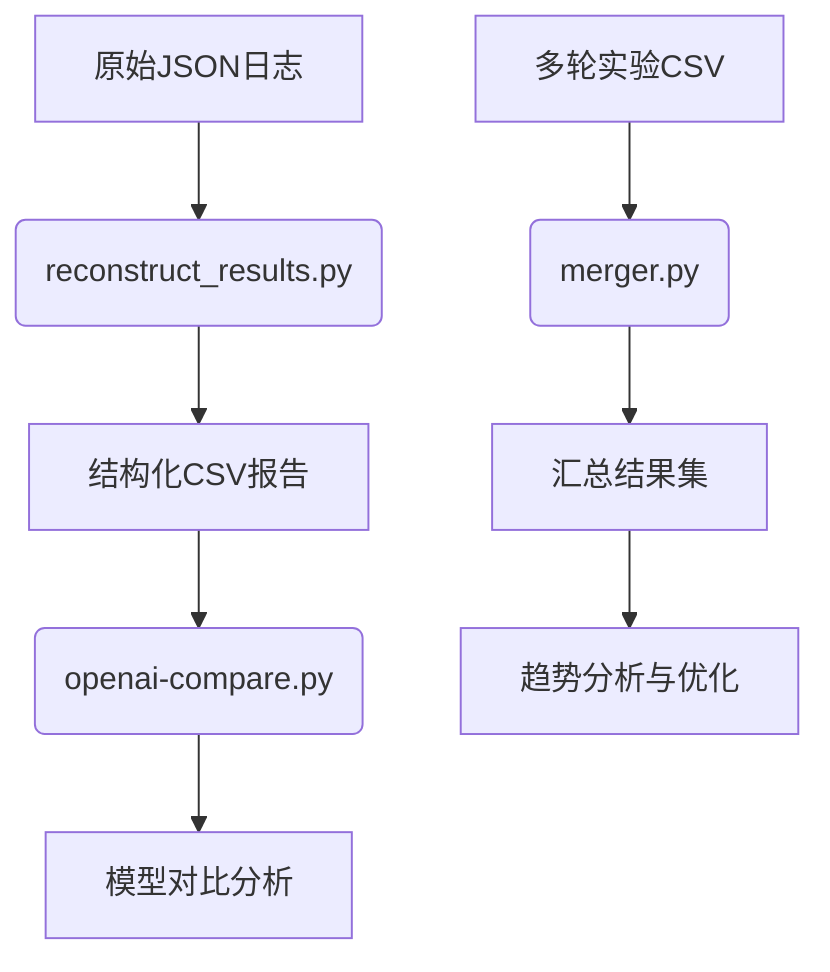
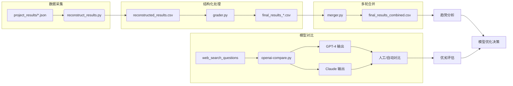
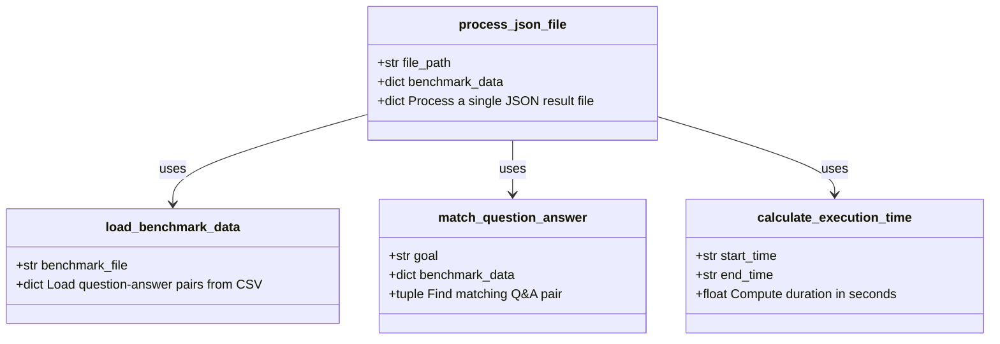
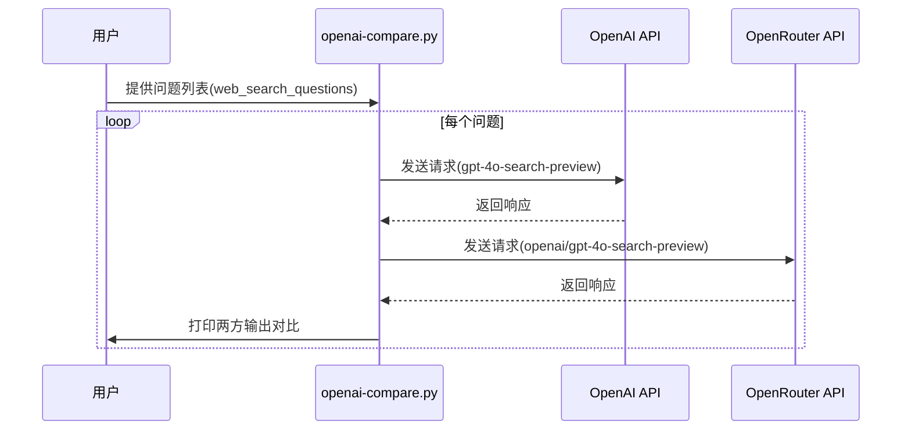
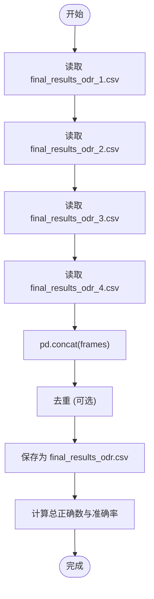

# 结果分析

<cite>
**本文档引用的文件**
- [reconstruct_results.py](file://evals/reconstruct_results.py)
- [openai-compare.py](file://evals/openai-compare.py)
- [merger.py](file://evals/merger.py)
</cite>

## 目录
1. [简介](#简介)
2. [项目结构](#项目结构)
3. [核心组件](#核心组件)
4. [架构概述](#架构概述)
5. [详细组件分析](#详细组件分析)
6. [依赖分析](#依赖分析)
7. [性能考量](#性能考量)
8. [故障排除指南](#故障排除指南)
9. [结论](#结论)

## 简介
本文件旨在详细介绍 `reconstruct_results.py`、`openai-compare.py` 和 `merger.py` 三个脚本在模型评估与结果分析中的作用。这些工具共同支持从原始日志中提取结构化数据、对比不同大语言模型（LLM）输出效果，并合并多轮实验结果，从而为性能趋势分析、瓶颈定位及模型迭代优化提供全面支持。

## 项目结构
评估相关脚本集中存放于 `evals/` 目录下，形成独立的评估模块：

```
evals/
├── reconstruct_results.py    # 重构运行结果为结构化CSV
├── openai-compare.py         # 对比不同LLM输出效果
├── merger.py                 # 合并多轮实验结果
├── grader.py                 # 自动评分器
├── evaluation.py             # 评估主流程
└── ...                       # 其他辅助工具
```

该结构将评估逻辑与主应用分离，确保评估过程可复用且不影响核心系统稳定性。



**Diagram sources**
- [reconstruct_results.py](file://evals/reconstruct_results.py#L0-L246)
- [openai-compare.py](file://evals/openai-compare.py#L0-L55)
- [merger.py](file://evals/merger.py#L0-L21)

**Section sources**
- [reconstruct_results.py](file://evals/reconstruct_results.py#L0-L246)
- [openai-compare.py](file://evals/openai-compare.py#L0-L55)
- [merger.py](file://evals/merger.py#L0-L21)

## 核心组件
本节介绍三大核心评估工具的功能与协作关系。

### reconstruct_results.py：日志重构与结构化报告生成
该脚本负责将分散的 `project_results/*.json` 日志文件整合为统一的 CSV 报告，便于后续可视化与统计分析。

其主要功能包括：
- 提取任务目标（question）、预期答案（answer）、实际输出（result）
- 计算执行时间（execution_time）和节点数量（node_count）
- 判断完成状态（completion_status）
- 匹配基准测试数据集以验证准确性

输出的 `reconstructed_results.csv` 文件包含完整的评估元数据，是所有后续分析的基础。

**Section sources**
- [reconstruct_results.py](file://evals/reconstruct_results.py#L0-L246)

### openai-compare.py：LLM 输出对比分析
此脚本用于比较不同 LLM（如 GPT-4 vs Claude 或 OpenAI vs OpenRouter）在相同问题上的输出差异。

通过调用多个 API 端点并打印响应内容，用户可进行：
- **语义相似度计算**：使用嵌入向量或文本匹配算法量化输出一致性
- **人工可读性评估**：直观判断回答质量、信息完整性和表达清晰度
- **行为模式分析**：识别各模型在特定领域（如金融、科技）的表现差异

典型应用场景包括模型选型、提示工程优化和可靠性测试。

**Section sources**
- [openai-compare.py](file://evals/openai-compare.py#L0-L55)

### merger.py：多轮实验结果合并
在多次迭代实验后，会产生多个独立的结果文件（如 `final_results_odr_1.csv`, `final_results_odr_2.csv`）。`merger.py` 脚本将这些文件合并为单一数据集。

关键操作包括：
- 使用 `pandas.concat()` 合并多个 DataFrame
- 统计每轮正确率（is_correct.sum()）
- 生成总体准确率指标（TOTAL CORRECT / RATE）

合并后的 `final_results_odr.csv` 支持跨版本性能趋势追踪，是模型演进分析的关键输入。

**Section sources**
- [merger.py](file://evals/merger.py#L0-L21)

## 架构概述
以下流程图展示了从原始日志到最终分析的完整数据流：



**Diagram sources**
- [reconstruct_results.py](file://evals/reconstruct_results.py#L0-L246)
- [openai-compare.py](file://evals/openai-compare.py#L0-L55)
- [merger.py](file://evals/merger.py#L0-L21)

## 详细组件分析

### reconstruct_results.py 分析
该脚本实现了从非结构化 JSON 到结构化 CSV 的转换管道。

#### 主要函数说明


**Diagram sources**
- [reconstruct_results.py](file://evals/reconstruct_results.py#L0-L246)

**Section sources**
- [reconstruct_results.py](file://evals/reconstruct_results.py#L0-L246)

### openai-compare.py 应用方法
该脚本通过并行调用不同 LLM 接口实现输出对比。

#### 执行流程


**Diagram sources**
- [openai-compare.py](file://evals/openai-compare.py#L0-L55)

**Section sources**
- [openai-compare.py](file://evals/openai-compare.py#L0-L55)

### merger.py 工作机制
该脚本采用批处理方式合并多个评估结果文件。

#### 数据合并逻辑


**Diagram sources**
- [merger.py](file://evals/merger.py#L0-L21)

**Section sources**
- [merger.py](file://evals/merger.py#L0-L21)

## 依赖分析
以下是各评估脚本之间的依赖关系：

```mermaid
dependency-graph
reconstruct_results.py --> pandas : optional output handling
reconstruct_results.py --> csv : writes reconstructed_results.csv
openai-compare.py --> openai : API client for GPT models
merger.py --> pandas : reads and concatenates CSV files
all --> Python[Python标准库]
```

值得注意的是，这三个脚本之间无直接代码依赖，而是通过文件系统进行松耦合通信，增强了模块独立性与可维护性。

**Diagram sources**
- [reconstruct_results.py](file://evals/reconstruct_results.py#L0-L246)
- [openai-compare.py](file://evals/openai-compare.py#L0-L55)
- [merger.py](file://evals/merger.py#L0-L21)

**Section sources**
- [reconstruct_results.py](file://evals/reconstruct_results.py#L0-L246)
- [openai-compare.py](file://evals/openai-compare.py#L0-L55)
- [merger.py](file://evals/merger.py#L0-L21)

## 性能考量
- `reconstruct_results.py` 在处理大量 JSON 文件时可能成为性能瓶颈，建议分批次处理。
- `openai-compare.py` 受限于 API 调用速率限制，可通过异步请求提升效率。
- `merger.py` 使用 `pandas` 加载整个 CSV 到内存，对于超大规模数据应考虑分块读取。

## 故障排除指南
常见问题及解决方案：

| 问题现象 | 可能原因 | 解决方案 |
|--------|--------|--------|
| `reconstruct_results.py` 报错找不到 JSON 文件 | `project_results/` 目录为空 | 确保已完成至少一次研究任务 |
| `openai-compare.py` 抛出认证错误 | API 密钥未配置 | 设置 `OPENAI_API_KEY` 或 `OPENROUTER_API_KEY` 环境变量 |
| `merger.py` 合并后准确率异常 | 输入文件格式不一致 | 检查各 `final_results_*.csv` 是否具有相同列结构 |

**Section sources**
- [reconstruct_results.py](file://evals/reconstruct_results.py#L0-L246)
- [openai-compare.py](file://evals/openai-compare.py#L0-L55)
- [merger.py](file://evals/merger.py#L0-L21)

## 结论
`reconstruct_results.py`、`openai-compare.py` 和 `merger.py` 构成了一个完整的评估工具链，分别承担日志结构化、模型对比和结果聚合的核心职责。通过这套工具，开发者可以高效地进行性能趋势分析、瓶颈定位和模型迭代优化，显著提升研发效率与模型质量。