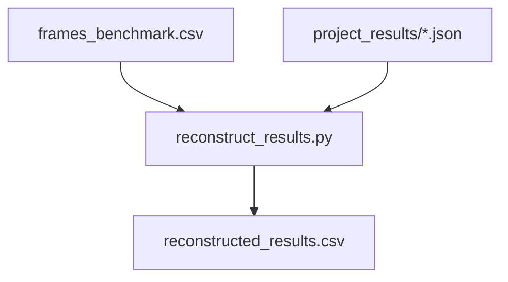
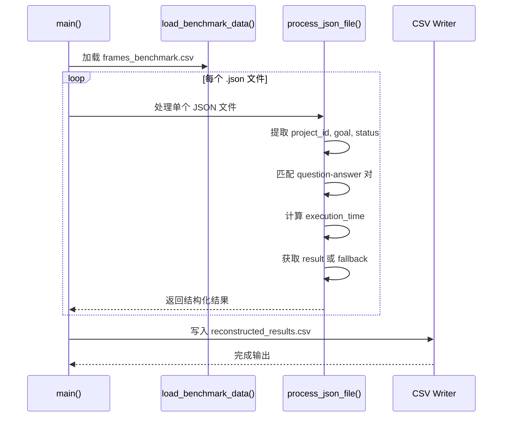
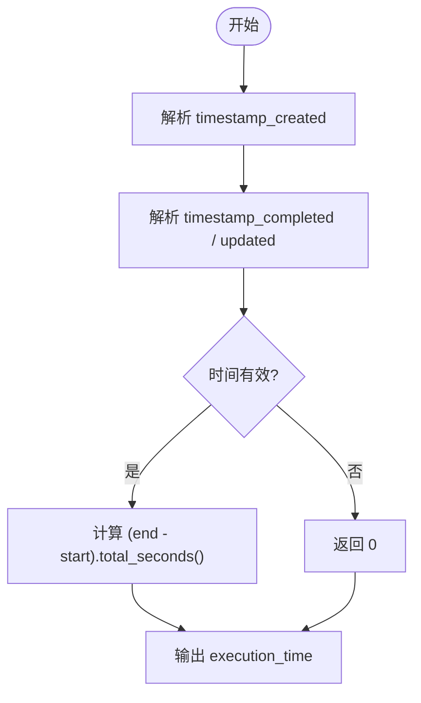
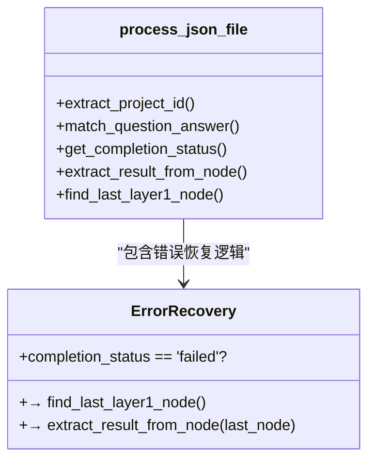
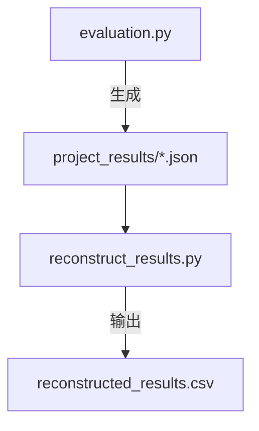

# 结果重构

<cite>
**本文档中引用的文件**  
- [reconstruct_results.py](file://evals/reconstruct_results.py)
- [evaluation.py](file://evals/evaluation.py)
</cite>

## 目录
1. [简介](#简介)
2. [项目结构](#项目结构)
3. [核心组件](#核心组件)
4. [架构概述](#架构概述)
5. [详细组件分析](#详细组件分析)
6. [依赖分析](#依赖分析)
7. [性能考虑](#性能考虑)
8. [故障排除指南](#故障排除指南)
9. [结论](#结论)

## 简介
`reconstruct_results.py` 是一个用于从分散的评估日志中提取并整合关键执行轨迹、节点状态和最终输出的核心脚本。该模块通过解析 `project_results` JSON 文件与基准数据集 `frames_benchmark.csv` 的匹配，生成结构化的 CSV 报告，支持对研究代理系统的全面追溯与审计。它在调试决策路径、验证任务完整性以及前端可视化展示方面发挥着重要作用。

## 项目结构
本模块位于 `evals/` 目录下，是整个评估流水线的重要组成部分。其输入为运行时生成的 JSON 格式结果文件（存储于 `project_results/`），输出为统一格式的 `reconstructed_results.csv`。该脚本独立于主服务运行，但依赖于标准的数据结构约定，如 `basic_state`、`all_nodes` 和时间戳字段。



**Diagram sources**  
- [reconstruct_results.py](file://evals/reconstruct_results.py#L1-L246)

**Section sources**  
- [reconstruct_results.py](file://evals/reconstruct_results.py#L1-L246)

## 核心组件
`reconstruct_results.py` 的主要功能包括：从 JSON 文件中提取项目 ID、目标问题、执行时间、节点数量、完成状态及最终结果；将实际问题与基准答案进行匹配；处理异常情况下的结果回退机制；并将所有信息汇总为标准化的 CSV 输出。

**Section sources**  
- [reconstruct_results.py](file://evals/reconstruct_results.py#L1-L246)

## 架构概述
该脚本采用批处理模式工作，整体流程如下：加载基准数据 → 遍历所有 JSON 结果文件 → 解析每个文件的关键字段 → 匹配问题与预期答案 → 计算执行耗时 → 汇总统计信息 → 写入结构化报告。



**Diagram sources**  
- [reconstruct_results.py](file://evals/reconstruct_results.py#L1-L246)

## 详细组件分析

### 数据清洗逻辑
该模块实现了稳健的数据清洗策略，能够容忍缺失或格式不一致的时间戳、空结果字段和非标准 JSON 结构。例如，在解析时间戳时会自动去除时区标识符，并尝试多种格式转换；对于无根节点的情况会发出警告而非中断流程。

#### 时间序列对齐机制
通过 `parse_timestamp()` 和 `calculate_execution_time()` 函数实现时间对齐。系统使用 `timestamp_created` 作为开始时间，以 `timestamp_completed` 或 `timestamp_updated` 作为结束时间，确保即使任务未完全完成也能估算执行周期。



**Diagram sources**  
- [reconstruct_results.py](file://evals/reconstruct_results.py#L15-L25)

**Section sources**  
- [reconstruct_results.py](file://evals/reconstruct_results.py#L15-L25)

### 错误恢复策略
当任务失败或仍在运行时，系统不会简单地返回空结果，而是尝试从最后一层（layer 1）已处理的节点中提取中间输出。这一机制由 `find_last_layer1_node()` 实现，按 `timestamp_updated` 排序选取最新节点，并从中提取 `full_result`、`output_summary` 或 `result` 字段。



**Diagram sources**  
- [reconstruct_results.py](file://evals/reconstruct_results.py#L100-L150)

**Section sources**  
- [reconstruct_results.py](file://evals/reconstruct_results.py#L100-L150)

### 调用示例
可通过命令行直接运行该脚本：
```bash
python evals/reconstruct_results.py --benchmark_file=evals/datasets/frames_benchmark.csv
```
此命令将自动扫描 `project_results/` 目录下的所有 `.json` 文件，生成 `reconstructed_results.csv`。

**Section sources**  
- [reconstruct_results.py](file://evals/reconstruct_results.py#L200-L246)

## 依赖分析
`reconstruct_results.py` 主要依赖 Python 内置库（`json`, `csv`, `os`, `argparse`, `datetime`, `pathlib`），无需外部包。其数据源来自 `evaluation.py` 所生成的 JSON 文件，二者共同构成完整的评估闭环。



**Diagram sources**  
- [reconstruct_results.py](file://evals/reconstruct_results.py#L1-L246)
- [evaluation.py](file://evals/evaluation.py#L1-L626)

**Section sources**  
- [reconstruct_results.py](file://evals/reconstruct_results.py#L1-L246)
- [evaluation.py](file://evals/evaluation.py#L1-L626)

## 性能考虑
该脚本为单线程设计，适用于中小规模结果集（数百至数千条记录）。对于大规模数据，建议分批次处理或引入并发读取优化。目前每处理 100 个文件会打印一次进度提示，便于监控执行状态。

## 故障排除指南
以下为常见解析失败场景及其排查方法：

| 问题现象 | 可能原因 | 解决方案 |
|--------|--------|--------|
| "No root node found" 警告 | JSON 文件缺少根节点定义 | 检查原始项目是否成功初始化 |
| Execution time 为 0 | 时间戳字段缺失或格式错误 | 验证 `timestamp_created` 和 `timestamp_completed` 是否存在 |
| Result 显示 "No output generated" | 根节点无输出且 layer 1 节点为空 | 检查代理是否进入执行阶段 |
| Question 匹配不到 Answer | 问题文本不完全一致 | 启用模糊匹配逻辑或检查 benchmark 文件拼写 |

**Section sources**  
- [reconstruct_results.py](file://evals/reconstruct_results.py#L1-L246)

## 结论
`reconstruct_results.py` 是连接原始日志与可分析报告的关键桥梁。它不仅提供了结构化输出能力，还具备容错性与可追溯性，极大提升了调试效率与系统透明度。结合前端可视化工具（如 `frontend/src/components/graph/GraphVisualization.tsx`），可实现完整的决策路径回溯，是保障研究型代理系统可靠性的核心组件之一。