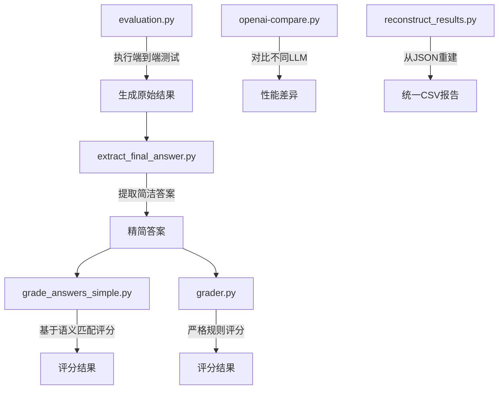
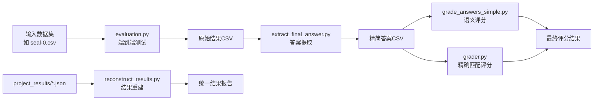
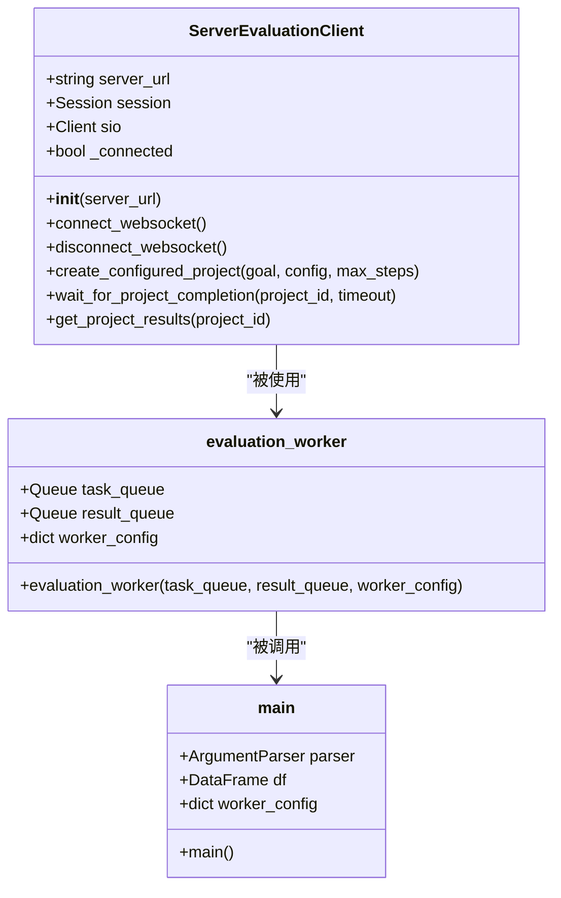
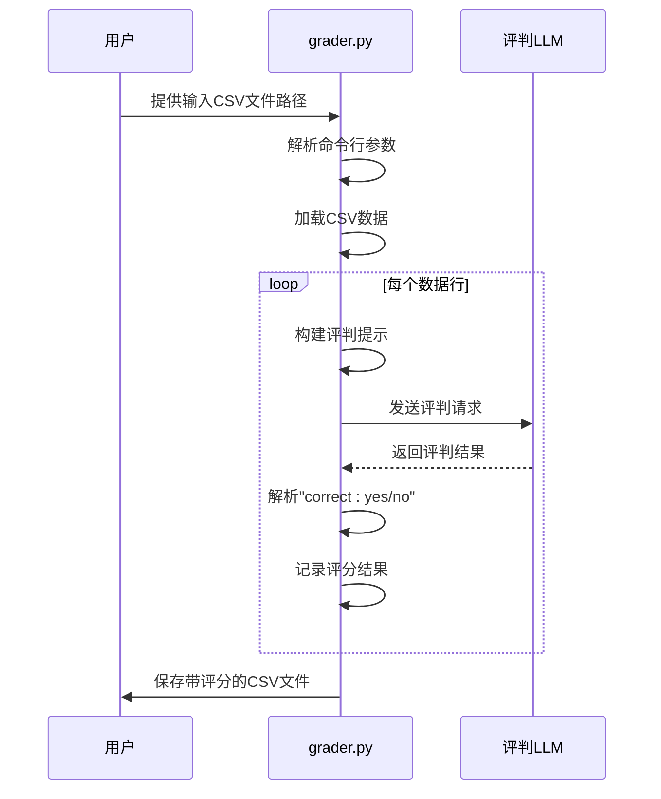
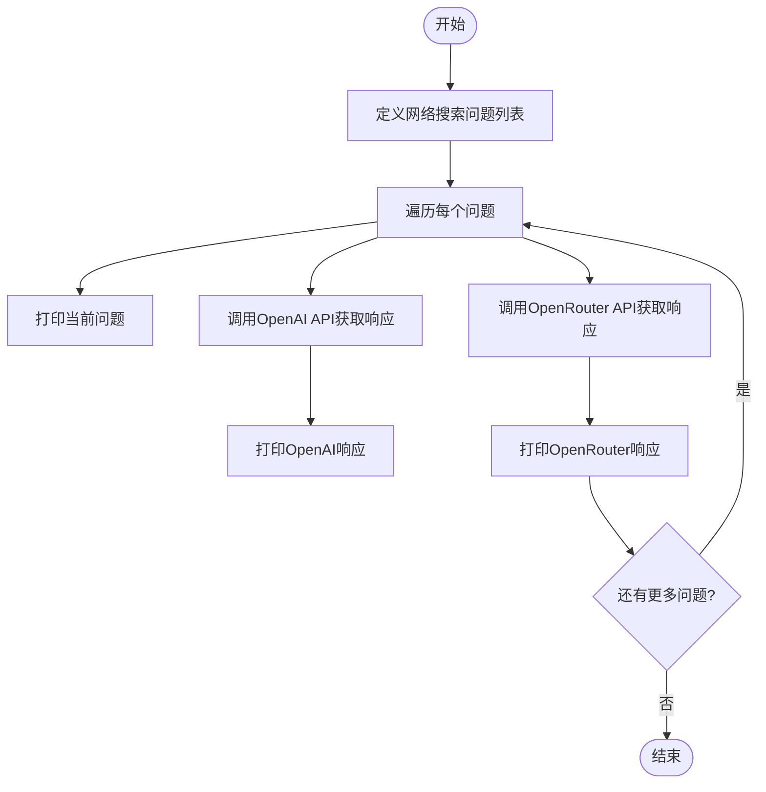
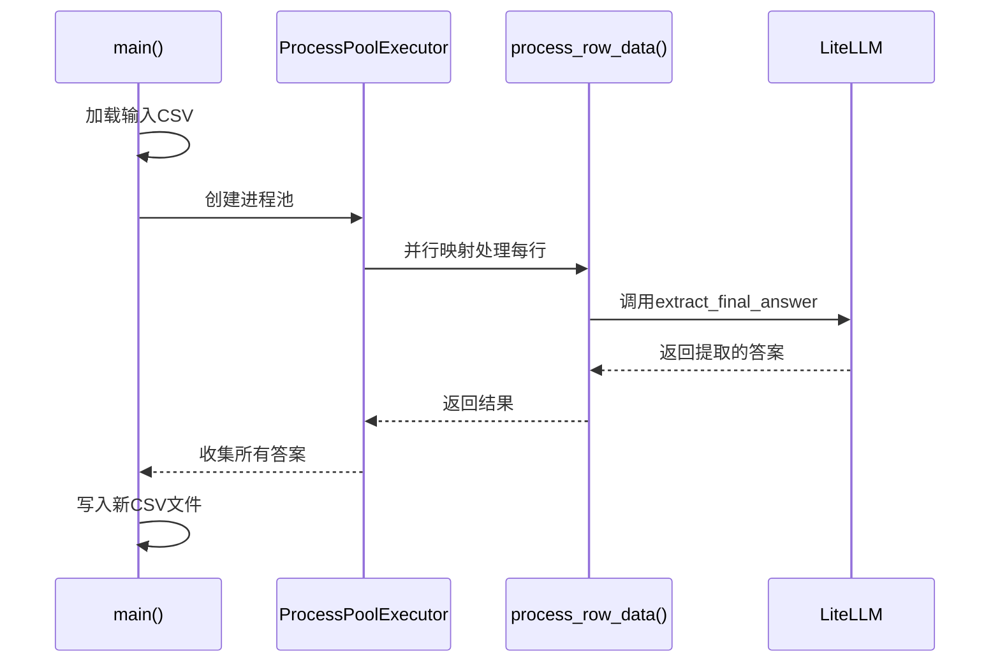
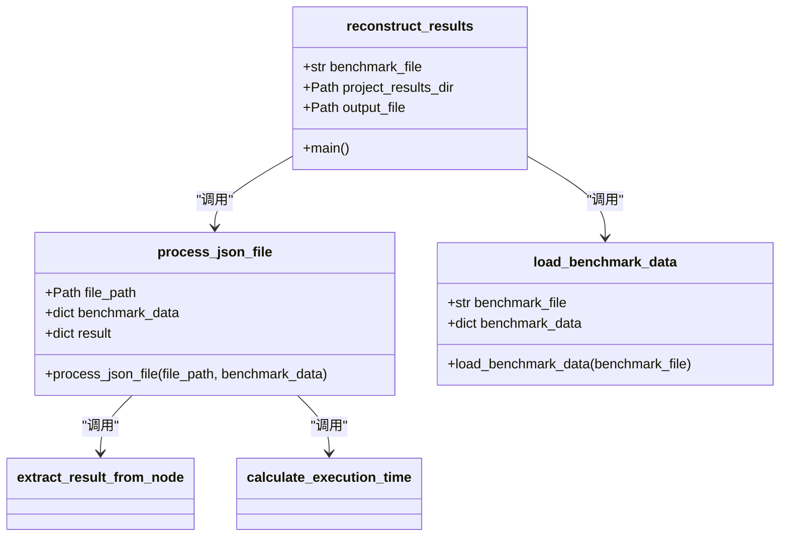
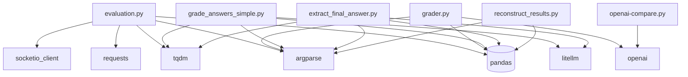

# 评估系统

<cite>
**本文档中引用的文件**
- [evaluation.py](file://evals/evaluation.py)
- [grader.py](file://evals/grader.py)
- [openai-compare.py](file://evals/openai-compare.py)
- [grade_answers_simple.py](file://evals/grade_answers_simple.py)
- [extract_final_answer.py](file://evals/extract_final_answer.py)
- [reconstruct_results.py](file://evals/reconstruct_results.py)
</cite>

## 目录
1. [简介](#简介)
2. [项目结构](#项目结构)
3. [核心组件](#核心组件)
4. [架构概述](#架构概述)
5. [详细组件分析](#详细组件分析)
6. [依赖关系分析](#依赖关系分析)
7. [性能考量](#性能考量)
8. [故障排除指南](#故障排除指南)
9. [结论](#结论)

## 简介
本项目提供了一套完整的代理性能评估系统，包含多个脚本用于自动化测试、结果评分、模型对比和报告生成。该系统支持在SEAL-0、FRAMES等标准数据集上进行基准测试，帮助研究人员验证和改进代理能力。通过`evaluation.py`运行端到端测试，`grader.py`和`grade_answers_simple.py`对答案质量进行评判，`openai-compare.py`比较不同LLM的输出效果，`extract_final_answer.py`提取最终答案，并由`reconstruct_results.py`解析生成可分析的结果报告。

## 项目结构
评估系统的脚本位于`evals/`目录下，每个脚本承担特定的评估任务，形成一个完整的评估流水线。用户可以通过组合使用这些脚本对自定义代理进行系统性基准测试。



**Diagram sources**
- [evaluation.py](file://evals/evaluation.py#L1-L627)
- [extract_final_answer.py](file://evals/extract_final_answer.py#L1-L92)
- [grade_answers_simple.py](file://evals/grade_answers_simple.py#L1-L149)
- [grader.py](file://evals/grader.py#L1-L139)
- [openai-compare.py](file://evals/openai-compare.py#L1-L56)
- [reconstruct_results.py](file://evals/reconstruct_results.py#L1-L247)

**Section sources**
- [evals](file://evals)

## 核心组件
评估套件的核心组件包括：`evaluation.py`负责与服务器通信并执行端到端测试；`grader.py`和`grade_answers_simple.py`实现两种不同的答案评判机制；`extract_final_answer.py`用于从冗长的响应中提取最终答案；`openai-compare.py`提供跨LLM平台的输出对比功能；`reconstruct_results.py`则能将分散的JSON结果文件重建为统一的CSV格式报告。

**Section sources**
- [evaluation.py](file://evals/evaluation.py#L1-L627)
- [grader.py](file://evals/grader.py#L1-L139)
- [grade_answers_simple.py](file://evals/grade_answers_simple.py#L1-L149)

## 架构概述
整个评估系统采用模块化设计，各脚本之间通过标准化的数据格式（主要是CSV）进行交互。工作流程始于`evaluation.py`向代理服务器发起批量查询请求，收集原始响应后，后续脚本依次进行答案提取、质量评分和结果整合，最终形成可用于统计分析的综合报告。



**Diagram sources**
- [evaluation.py](file://evals/evaluation.py#L1-L627)
- [extract_final_answer.py](file://evals/extract_final_answer.py#L1-L92)
- [grade_answers_simple.py](file://evals/grade_answers_simple.py#L1-L149)
- [grader.py](file://evals/grader.py#L1-L139)
- [reconstruct_results.py](file://evals/reconstruct_results.py#L1-L247)

## 详细组件分析

### evaluation.py 分析
`evaluation.py`是评估系统的入口点，它通过HTTP API与代理服务器通信，创建配置化的项目并监控其执行状态。该脚本支持多进程并行处理，能够高效地运行大规模基准测试。



**Diagram sources**
- [evaluation.py](file://evals/evaluation.py#L1-L627)

**Section sources**
- [evaluation.py](file://evals/evaluation.py#L1-L627)

### grader.py 分析
`grader.py`利用外部LLM作为评判员，根据预设的标准判断代理回答的正确性。它采用严格的提示词工程，要求评判模型只关注答案是否与标准答案匹配，避免主观解释或重新解题。



**Diagram sources**
- [grader.py](file://evals/grader.py#L1-L139)

**Section sources**
- [grader.py](file://evals/grader.py#L1-L139)

### openai-compare.py 分析
`openai-compare.py`专门用于比较同一问题在不同LLM平台上的响应差异。当前配置为对比OpenAI原生API与通过OpenRouter访问的GPT-4o-search-preview模型的输出效果。



**Diagram sources**
- [openai-compare.py](file://evals/openai-compare.py#L1-L56)

**Section sources**
- [openai-compare.py](file://evals/openai-compare.py#L1-L56)

### grade_answers_simple.py 分析
`grade_answers_simple.py`实现了更智能的答案评分逻辑，首先尝试数值比较（允许1%误差），若失败则回退到LLM进行语义等价性判断。这种方法兼顾了效率与准确性。

```mermaid
flowchart TD
A[process_grading_row] --> B{数值型?}
B --> |是| C[parse_number]
C --> D{数值匹配?<br>(1%容差)}
D --> |是| E[返回1]
D --> |否| F[grade_answer_with_llm]
B --> |否| F
F --> G[LLM语义评分]
G --> H[返回0或1]
```

**Diagram sources**
- [grade_answers_simple.py](file://evals/grade_answers_simple.py#L1-L149)

**Section sources**
- [grade_answers_simple.py](file://evals/grade_answers_simple.py#L1-L149)

### extract_final_answer.py 分析
`extract_final_answer.py`的作用是从代理生成的冗长且带有推理过程的响应中，提取出最简洁的最终答案。这对于后续的自动化评分至关重要，因为它消除了无关文本对评分准确性的干扰。



**Diagram sources**
- [extract_final_answer.py](file://evals/extract_final_answer.py#L1-L92)

**Section sources**
- [extract_final_answer.py](file://evals/extract_final_answer.py#L1-L92)

### reconstruct_results.py 分析
`reconstruct_results.py`从`project_results/`目录下的JSON文件中提取关键信息，并结合基准测试数据集重建完整的评估结果CSV。这在原始结果丢失或需要重新分析时非常有用。



**Diagram sources**
- [reconstruct_results.py](file://evals/reconstruct_results.py#L1-L247)

**Section sources**
- [reconstruct_results.py](file://evals/reconstruct_results.py#L1-L247)

## 依赖关系分析
评估套件中的脚本相互独立，但遵循一个逻辑上的执行顺序。它们共同依赖于`pandas`进行数据处理，`litellm`或`openai`库进行LLM调用，以及`argparse`处理命令行参数。`evaluation.py`还依赖`socketio_client`与服务器建立WebSocket连接以实时监控进度。



**Diagram sources**
- [evaluation.py](file://evals/evaluation.py#L1-L627)
- [grader.py](file://evals/grader.py#L1-L139)
- [grade_answers_simple.py](file://evals/grade_answers_simple.py#L1-L149)
- [extract_final_answer.py](file://evals/extract_final_answer.py#L1-L92)
- [reconstruct_results.py](file://evals/reconstruct_results.py#L1-L247)
- [openai-compare.py](file://evals/openai-compare.py#L1-L56)

**Section sources**
- [evaluation.py](file://evals/evaluation.py#L1-L627)
- [grader.py](file://evals/grader.py#L1-L139)
- [grade_answers_simple.py](file://evals/grade_answers_simple.py#L1-L149)
- [extract_final_answer.py](file://evals/extract_final_answer.py#L1-L92)
- [reconstruct_results.py](file://evals/reconstruct_results.py#L1-L247)
- [openai-compare.py](file://evals/openai-compare.py#L1-L56)

## 性能考量
`evaluation.py`和`grade_answers_simple.py`都采用了多进程并行处理来提高效率。`evaluation.py`通过限制并发任务数和添加请求延迟来避免服务器过载，而`grade_answers_simple.py`则充分利用CPU资源进行密集的LLM评分任务。对于大规模评估，建议合理设置批处理大小和检查点间隔，以防内存溢出或任务中断导致数据丢失。

## 故障排除指南
常见问题包括API密钥未设置、服务器连接失败、输入文件格式错误等。确保环境变量`FIREWORKS_AI_API_KEY`已正确配置，代理服务器正在运行且可通过指定URL访问，输入CSV文件包含必需的列（如`question`, `result`, `answer`）。当遇到评分不一致时，可检查评判LLM的响应内容以理解其决策依据。

**Section sources**
- [grader.py](file://evals/grader.py#L1-L139)
- [grade_answers_simple.py](file://evals/grade_answers_simple.py#L1-L149)
- [evaluation.py](file://evals/evaluation.py#L1-L627)

## 结论
该评估系统提供了一套强大而灵活的工具链，可用于全面衡量和比较代理系统的性能。通过组合使用这些脚本，研究人员可以在标准数据集上复现论文结果，或对自定义代理进行基准测试。建议的典型工作流是：先用`evaluation.py`运行测试，再用`extract_final_answer.py`提取答案，接着用`grade_answers_simple.py`或`grader.py`进行评分，最后用`reconstruct_results.py`整合历史结果。这种模块化设计使得每个环节都可以独立优化和替换。