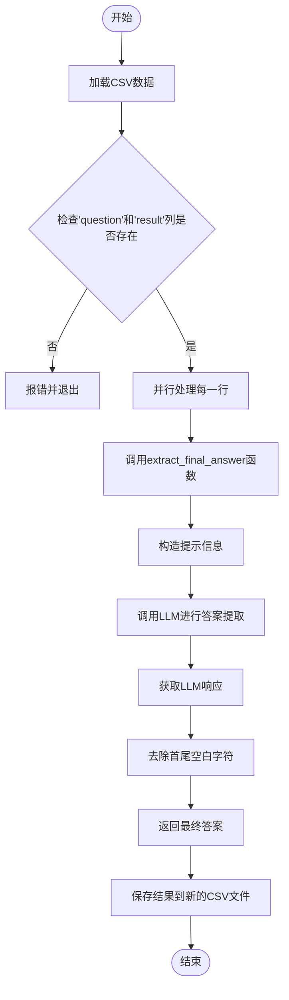
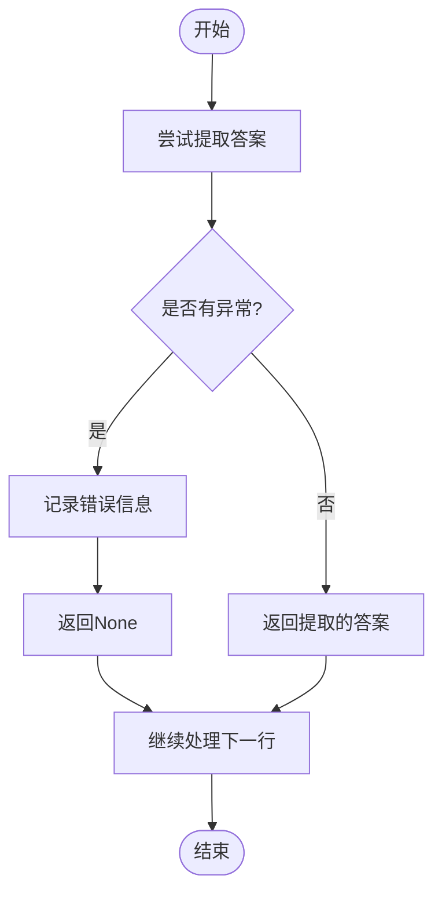

# 答案提取机制

<cite>
**本文档引用的文件**   
- [extract_final_answer.py](file://evals/extract_final_answer.py)
</cite>

## 目录
1. [简介](#简介)
2. [核心逻辑解析](#核心逻辑解析)
3. [提取流程与示例](#提取流程与示例)
4. [异常处理机制](#异常处理机制)
5. [输出格式适应性](#输出格式适应性)
6. [自定义提取规则](#自定义提取规则)

## 简介
`extract_final_answer.py` 是一个用于从代理系统复杂输出中精准提取最终答案片段的工具。该脚本通过调用大型语言模型（LLM）来实现这一目标，能够处理包含思考过程、工具调用日志和最终结论的文本，并从中识别并提取出最终的答案。

**Section sources**
- [extract_final_answer.py](file://evals/extract_final_answer.py#L1-L91)

## 核心逻辑解析
`extract_final_answer.py` 的核心功能由 `extract_final_answer` 函数实现。该函数接收查询（query）、结果（result）以及可选的模型参数，然后构造一个提示（prompt），要求 LLM 仅返回最终答案，不包含任何额外的解释或格式化内容。



**Diagram sources **
- [extract_final_answer.py](file://evals/extract_final_answer.py#L7-L25)

**Section sources**
- [extract_final_answer.py](file://evals/extract_final_answer.py#L7-L25)

## 提取流程与示例
提取流程主要包括以下几个步骤：
1. **加载数据**：读取包含问题和结果的 CSV 文件。
2. **验证列名**：确保 CSV 文件中包含 'question' 和 'result' 列。
3. **并行处理**：使用 `ProcessPoolExecutor` 并行处理每一行数据，以提高效率。
4. **构造提示**：为每个问题和结果对构造一个提示，指示 LLM 只返回最终答案。
5. **调用 LLM**：使用 `litellm.completion` 方法调用指定的 LLM 模型。
6. **提取答案**：从 LLM 的响应中提取最终答案，并去除首尾的空白字符。
7. **保存结果**：将提取的答案添加到原始 DataFrame 中，并保存到一个新的 CSV 文件。

例如，假设有一个 CSV 文件，其中一行为：
- question: "What is the capital of France?"
- result: "经过一系列推理和资料查找，我们确定法国的首都是巴黎。"

`extract_final_answer` 函数会构造如下提示：
```
Given the following query and verbose result, extract ONLY the final answer.
Return just the exact final answer with no additional text, explanations, or formatting.

Query: What is the capital of France?

Verbose Result: 经过一系列推理和资料查找，我们确定法国的首都是巴黎。

Final Answer:
```
LLM 将返回 "巴黎"，这个答案会被提取并保存。

**Section sources**
- [extract_final_answer.py](file://evals/extract_final_answer.py#L40-L75)

## 异常处理机制
在处理过程中，可能会遇到各种异常情况，如文件未找到、缺少必要列、LLM 调用失败等。`extract_final_answer.py` 通过以下方式处理这些异常：
- **文件未找到**：捕获 `FileNotFoundError` 异常，并打印错误信息后退出。
- **缺少列**：检查 DataFrame 是否包含必要的 'question' 和 'result' 列，如果缺失则打印错误信息并退出。
- **LLM 调用失败**：在 `process_row_data` 函数中捕获所有异常，记录错误信息，并返回 `None`。



**Diagram sources **
- [extract_final_answer.py](file://evals/extract_final_answer.py#L27-L38)

**Section sources**
- [extract_final_answer.py](file://evals/extract_final_answer.py#L27-L38)

## 输出格式适应性
`extract_final_answer.py` 主要针对纯文本输出进行了优化，但也可以适应其他格式的输出，如 JSON 或 Markdown。对于 JSON 格式，可以通过解析 JSON 数据来提取最终答案；对于 Markdown 格式，可以利用正则表达式或其他文本处理技术来定位和提取答案部分。

## 自定义提取规则
为了支持多样化的输出结构，用户可以根据需要自定义提取规则。例如，可以通过修改 `extract_final_answer` 函数中的提示模板，使其更具体地指导 LLM 如何提取答案。此外，还可以引入正则匹配模式或关键词定位策略，以增强提取的准确性和鲁棒性。