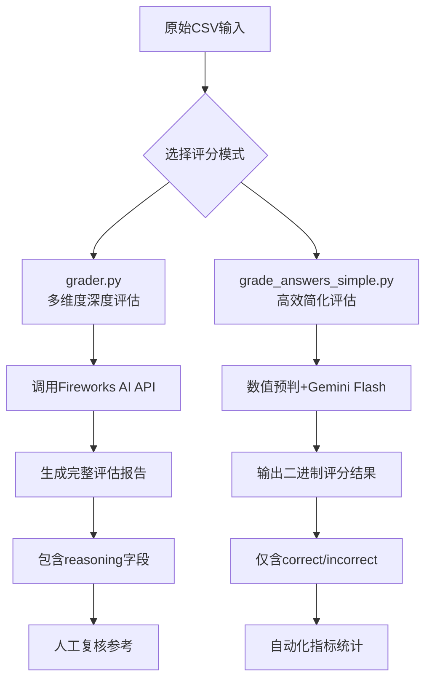

# 评分机制

<cite>
**本文档中引用的文件**
- [grader.py](file://evals/grader.py)
- [grade_answers_simple.py](file://evals/grade_answers_simple.py)
- [extract_final_answer.py](file://evals/extract_final_answer.py)
</cite>

## 目录
1. [引言](#引言)
2. [多维度评分逻辑解析](#多维度评分逻辑解析)
3. [简化评分算法分析](#简化评分算法分析)
4. [关键答案提取机制](#关键答案提取机制)
5. [评分流程示例与权重影响](#评分流程示例与权重影响)
6. [评分规则定制方法](#评分规则定制方法)
7. [结论](#结论)

## 引言
本系统提供了一套完整的自动化评估框架，用于对模型生成的答案进行精确评判。该框架由三个核心组件构成：`grader.py` 实现了基于大语言模型的多维度严格评估；`grade_answers_simple.py` 提供了高效简化的评分算法；`extract_final_answer.py` 负责从复杂输出中精准提取最终答案。这套工具链支持研究人员根据具体需求灵活选择评估策略，并可自定义评分标准以适应不同应用场景。

## 多维度评分逻辑解析

`grader.py` 模块实现了高精度、多维度的自动评分机制，其核心评判标准涵盖事实准确性、推理连贯性与格式合规性等多个方面。该模块通过构建结构化提示词（prompt），引导评估模型严格按照预设准则执行判断任务。

### 评判标准体系
系统采用严格的三重验证机制：
- **事实准确性**：要求生成答案与权威正确答案在语义上完全等价。
- **推理连贯性**：关注答案内部逻辑是否自洽，是否存在矛盾或跳跃。
- **格式合规性**：确保答案符合指定的输出格式要求。

这些标准体现在 `SYSTEM_PROMPT` 变量和 `create_prompt` 函数所生成的指令中，强制评估过程保持客观、字面化且不添加额外评论。

### 评分流程控制
模块支持多种运行参数配置，包括输入/输出文件路径、评估模型选择、批处理大小及API基础地址等。通过 `parse_args` 函数定义的命令行参数接口，用户可以灵活控制评分范围（使用 `--start-index` 和 `--end-index` 参数）并实现断点续评功能。

**Section sources**
- [grader.py](file://evals/grader.py#L0-L138)

## 简化评分算法分析

`grade_answers_simple.py` 模块提供了更为高效的评分解决方案，适用于大规模数据集的快速评估场景。该算法采用两级判断策略，在保证准确率的同时显著提升了处理速度。

### 双阶段评估机制
该模块的核心是 `process_grading_row` 函数实现的双阶段评估流程：
1. **数值优先比较**：首先调用 `parse_number` 函数尝试解析答案中的数字，对于数值型问题直接进行带容差的数学比较（允许1%误差）。
2. **语义回退评估**：当答案非明显数值或初步比较未通过时，自动回退至LLM进行语义层面的综合判断。

这种设计有效平衡了效率与精度，避免了对所有样本都调用昂贵的LLM推理资源。

### 并行化处理架构
利用 `ProcessPoolExecutor` 实现多进程并行处理，结合 `tqdm` 提供实时进度反馈。整个评分过程被分解为独立的工作单元，可在多核CPU上同时执行，极大缩短了整体处理时间。

**Section sources**
- [grade_answers_simple.py](file://evals/grade_answers_simple.py#L0-L148)

## 关键答案提取机制

`extract_final_answer.py` 模块专注于解决复杂输出中的信息提炼问题，能够从冗长的推理文本中准确剥离出最终答案片段。

### 提取策略
该模块通过精心设计的提示词模板，指示LLM仅返回“Final Answer:”之后的内容，去除所有解释性文字和格式标记。`extract_final_answer` 函数接受查询和详细结果作为输入，生成简洁明了的答案摘要。

### 鲁棒性保障
为应对异常情况，系统设置了完善的错误处理机制：
- 对空值或缺失数据返回 `None`
- 捕获并记录处理过程中的异常
- 继续处理后续条目而非中断整个流程

此外，同样采用多进程并行架构，确保大批量数据处理的高效性。

**Section sources**
- [extract_final_answer.py](file://evals/extract_final_answer.py#L0-L91)

## 评分流程示例与权重影响

以下展示一个典型的端到端评估工作流及其关键参数的影响：

**Diagram sources**
- [grader.py](file://evals/grader.py#L0-L138)
- [grade_answers_simple.py](file://evals/grade_answers_simple.py#L0-L148)

### 权重参数作用分析
- **batch-size**：影响内存占用与故障恢复粒度，较小值利于容错但增加I/O开销。
- **model**：决定评估质量与成本，更强大的模型通常提供更细致的推理分析。
- **numerical tolerance**：直接影响数值题的通过率，需根据领域知识合理设定。

## 评分规则定制方法

研究人员可根据特定需求调整评估准则，主要途径包括：

### 修改提示词模板
直接编辑 `grader.py` 中的 `SYSTEM_PROMPT` 和 `create_prompt` 函数内容，可改变评估模型的行为模式。例如增加对特定领域术语的理解要求或调整宽容度标准。

### 扩展评判维度
在现有基础上新增评判维度，如引入“创新性”、“实用性”等主观指标，可通过扩展输出格式并在后续进行人工校准来实现。

### 自定义数值容差
修改 `grade_answers_simple.py` 中的 `abs((pred_num - gt_num) / gt_num) <= 0.01` 判断条件，根据不同任务类型设置差异化的误差阈值。

### 集成外部验证工具
将专业领域的验证脚本（如数学求解器、代码编译器）集成到评估流程中，形成混合验证机制，提升特定类型问题的评判准确性。

## 结论
本评估系统提供了从精细分析到高效批量处理的完整解决方案。`grader.py` 适合需要深入洞察的场景，`grade_answers_simple.py` 满足大规模自动化测试需求，而 `extract_final_answer.py` 解决了答案标准化的关键前置步骤。通过合理配置参数和适度定制规则，研究人员可以构建适应各自研究目标的个性化评估体系，从而更有效地衡量和改进模型性能。